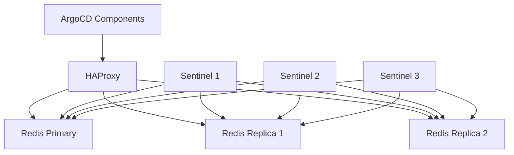

# How to Optimize Redis for Large ArgoCD Deployments

Author: [nawazdhandala](https://github.com/nawazdhandala)

Tags: ArgoCD, GitOps, Kubernetes, Redis, Performance

Description: Learn how to optimize Redis configuration for large-scale ArgoCD deployments including memory tuning, eviction policies, HA setup, and monitoring strategies.

---

Redis is the unsung hero of ArgoCD's architecture. It serves as the caching layer between the application controller, repo server, and API server. It stores manifest caches, application state, and session data. In small deployments, the default Redis configuration works fine. But when you scale to hundreds of applications across dozens of clusters, Redis becomes a critical component that needs careful tuning.

I have seen ArgoCD instances grind to a halt because Redis ran out of memory, causing the controller to regenerate all cached data from scratch. This guide covers everything you need to know about optimizing Redis for large ArgoCD deployments.

## What ArgoCD Stores in Redis

Understanding what goes into Redis helps you size it correctly:

- **Manifest cache**: The rendered Kubernetes manifests for every application. This is typically the largest consumer of Redis memory.
- **App state cache**: Current sync and health status of applications.
- **Repo state cache**: Repository metadata including revision hashes and directory listings.
- **RBAC cache**: Cached RBAC policy evaluations.
- **Session tokens**: User session data for the UI and CLI.

For a deployment with 500 applications, each averaging 50KB of rendered manifests, the manifest cache alone consumes 25MB. Add application state, repo metadata, and overhead, and you are looking at 100MB to 500MB depending on application complexity.

## Step 1: Configure Memory Limits

The default Redis deployment in ArgoCD does not set memory limits, which means Redis will use as much memory as the container allows and then crash:

```yaml
apiVersion: apps/v1
kind: Deployment
metadata:
  name: argocd-redis
  namespace: argocd
spec:
  template:
    spec:
      containers:
      - name: redis
        image: redis:7.2-alpine
        args:
        - redis-server
        # Set max memory to 2GB
        - --maxmemory
        - "2gb"
        # Use LRU eviction when memory limit is reached
        - --maxmemory-policy
        - "allkeys-lru"
        resources:
          requests:
            cpu: "500m"
            memory: "2Gi"
          limits:
            cpu: "2"
            memory: "3Gi"
```

The `allkeys-lru` eviction policy is ideal for ArgoCD because all cached data can be regenerated. When Redis hits the memory limit, it evicts the least recently used keys rather than rejecting new writes.

Set the container memory limit 50% higher than the Redis `maxmemory` to account for Redis overhead (fragmentation, connection buffers, and internal data structures).

## Step 2: Disable Persistence

ArgoCD uses Redis purely as a cache. Everything stored in Redis can be regenerated from the application controller and repo server. Persistence adds unnecessary I/O overhead:

```yaml
args:
- redis-server
- --maxmemory
- "2gb"
- --maxmemory-policy
- "allkeys-lru"
# Disable RDB snapshots
- --save
- ""
# Disable AOF persistence
- --appendonly
- "no"
```

This eliminates disk I/O entirely, which improves Redis throughput and reduces latency. If Redis restarts, it starts empty and ArgoCD rebuilds the cache within a few reconciliation cycles.

## Step 3: Connection Pool Optimization

The application controller and repo server maintain connection pools to Redis. With multiple controller shards and repo server replicas, the total connection count can be high:

```yaml
# Calculate total connections:
# Controller shards x connections per shard: 3 x 10 = 30
# Repo server replicas x connections: 3 x 10 = 30
# API server replicas x connections: 2 x 10 = 20
# Buffer: 20
# Total: ~100

args:
- redis-server
- --maxmemory
- "2gb"
- --maxmemory-policy
- "allkeys-lru"
- --save
- ""
- --appendonly
- "no"
# Set max clients
- --maxclients
- "200"
# TCP backlog for burst connections
- --tcp-backlog
- "128"
# Timeout idle connections after 5 minutes
- --timeout
- "300"
```

## Step 4: Redis HA for Production

For production deployments managing critical clusters, a single Redis instance is a single point of failure. Deploy Redis in HA mode using the ArgoCD Redis HA Helm chart or a Redis Sentinel setup:

```yaml
# Using the ArgoCD Helm chart with Redis HA
redis-ha:
  enabled: true
  replicas: 3
  haproxy:
    enabled: true
    replicas: 3
  redis:
    config:
      maxmemory: "2gb"
      maxmemory-policy: "allkeys-lru"
      save: '""'
  sentinel:
    config:
      down-after-milliseconds: 5000
      failover-timeout: 10000
```

The Sentinel-based HA setup provides automatic failover. If the Redis primary goes down, Sentinel promotes a replica within seconds. The HAProxy layer provides a stable endpoint for ArgoCD components to connect to.



## Step 5: Network Optimization

Redis performance is heavily influenced by network latency. Ensure Redis runs on the same node or in the same availability zone as the ArgoCD controller:

```yaml
spec:
  template:
    spec:
      affinity:
        podAffinity:
          preferredDuringSchedulingIgnoredDuringExecution:
          - weight: 100
            podAffinityTerm:
              labelSelector:
                matchExpressions:
                - key: app.kubernetes.io/name
                  operator: In
                  values:
                  - argocd-application-controller
              topologyKey: topology.kubernetes.io/zone
```

This ensures Redis and the controller are co-located, reducing round-trip latency for cache operations.

## Step 6: Cache Expiration Tuning

ArgoCD sets TTLs on cached entries. You can adjust these to balance memory usage against cache effectiveness:

```yaml
apiVersion: v1
kind: ConfigMap
metadata:
  name: argocd-cmd-params-cm
  namespace: argocd
data:
  # Default cache expiration for repo server responses
  reposerver.default.cache.expiration: "24h"

  # OIDCconfig cache
  server.oidc.cache.expiration: "3m"
```

For stable environments where Git commits are infrequent, increasing the cache expiration reduces repo server load. For active development environments with frequent commits, shorter expiration ensures fresh manifests.

## Step 7: Monitor Redis Performance

Track these key Redis metrics for ArgoCD:

```bash
# Connect to Redis and check memory usage
kubectl exec -it deploy/argocd-redis -n argocd -- redis-cli info memory

# Key metrics to watch:
# used_memory_human - Current memory usage
# used_memory_peak_human - Peak memory usage
# mem_fragmentation_ratio - Should be between 1.0 and 1.5
# evicted_keys - Non-zero means cache is full
# keyspace_hits / keyspace_misses - Cache hit ratio
```

Create Prometheus alerts for critical conditions:

```yaml
apiVersion: monitoring.coreos.com/v1
kind: PrometheusRule
metadata:
  name: argocd-redis-alerts
spec:
  groups:
  - name: argocd-redis
    rules:
    - alert: ArgocdRedisHighMemory
      expr: |
        redis_memory_used_bytes{service="argocd-redis"} /
        redis_memory_max_bytes{service="argocd-redis"} > 0.85
      for: 5m
      labels:
        severity: warning
      annotations:
        summary: "ArgoCD Redis memory usage above 85%"

    - alert: ArgocdRedisHighEviction
      expr: |
        rate(redis_evicted_keys_total{service="argocd-redis"}[5m]) > 10
      for: 5m
      labels:
        severity: warning
      annotations:
        summary: "ArgoCD Redis evicting keys frequently"

    - alert: ArgocdRedisLowHitRate
      expr: |
        rate(redis_keyspace_hits_total{service="argocd-redis"}[5m]) /
        (rate(redis_keyspace_hits_total{service="argocd-redis"}[5m]) +
         rate(redis_keyspace_misses_total{service="argocd-redis"}[5m])) < 0.5
      for: 10m
      labels:
        severity: warning
      annotations:
        summary: "ArgoCD Redis cache hit rate below 50%"
```

## Step 8: Sizing Guide

Here is a sizing guide based on deployment scale:

| Applications | Clusters | Redis Memory | Redis CPU | HA Required |
|-------------|----------|-------------|-----------|-------------|
| 1-50        | 1-5      | 256MB       | 0.25 cores| No          |
| 50-200      | 5-20     | 1GB         | 0.5 cores | Recommended |
| 200-500     | 20-50    | 2GB         | 1 core    | Yes         |
| 500-1000    | 50-100   | 4GB         | 2 cores   | Yes         |
| 1000+       | 100+     | 8GB+        | 4 cores   | Yes         |

These are starting points. Monitor actual usage and adjust based on your workload characteristics.

For comprehensive monitoring of Redis health alongside your ArgoCD deployment, you can set up alerts through [OneUptime](https://oneuptime.com/blog/post/2026-02-26-argocd-alerts-degraded-applications/view) to catch memory issues before they impact your GitOps pipeline.

## Summary

Optimizing Redis for large ArgoCD deployments involves setting appropriate memory limits with LRU eviction, disabling persistence since all data is regenerable, configuring connection pools to handle multiple ArgoCD components, deploying Redis HA for production reliability, co-locating Redis with the controller for low latency, and monitoring cache effectiveness continuously. The key insight is that Redis in ArgoCD is a pure cache. Size it generously, evict aggressively, and never rely on it for durable storage.
