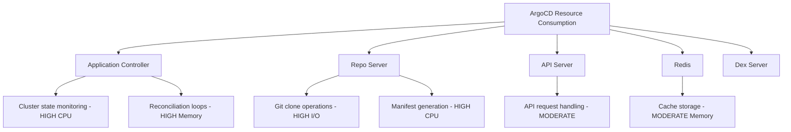

# How to Optimize ArgoCD Resource Consumption

Author: [nawazdhandala](https://github.com/nawazdhandala)

Tags: ArgoCD, GitOps, Kubernetes, Performance Optimization, Resource Management

Description: Learn how to reduce ArgoCD's CPU, memory, and network resource consumption while maintaining sync performance across large-scale deployments.

---

ArgoCD is a powerful tool, but it can become a resource hog if left unconfigured. I have seen ArgoCD installations consuming 8GB of memory and multiple CPU cores when managing just a few hundred applications. The culprit is usually a combination of aggressive reconciliation intervals, unoptimized caching, and oversized component deployments.

In this guide, I will walk through practical optimizations that can cut ArgoCD's resource footprint by 50% or more without sacrificing functionality.

## Understanding ArgoCD's Resource Profile

Before optimizing, you need to understand where ArgoCD spends its resources.



The application controller is typically the biggest consumer because it continuously watches all managed resources across all clusters.

## Tuning the Application Controller

The controller is where most optimization opportunities exist.

### Reduce Reconciliation Frequency

By default, ArgoCD reconciles every 3 minutes. For stable production environments, you can safely increase this.

```yaml
# argocd-cmd-params-cm.yaml
apiVersion: v1
kind: ConfigMap
metadata:
  name: argocd-cmd-params-cm
  namespace: argocd
data:
  # Increase reconciliation timeout from 3m to 5m
  controller.repo.server.timeout.seconds: "300"
  # Reduce self-heal timeout
  controller.self.heal.timeout.seconds: "30"
```

```yaml
# argocd-cm.yaml
apiVersion: v1
kind: ConfigMap
metadata:
  name: argocd-cm
  namespace: argocd
data:
  # Increase reconciliation interval to 5 minutes
  timeout.reconciliation: "300s"
```

### Limit Status Processors and Operation Processors

These control how many applications are processed in parallel.

```yaml
# argocd-cmd-params-cm.yaml
data:
  # Default is 20, reduce for smaller clusters
  controller.status.processors: "10"
  # Default is 10, reduce if you have fewer concurrent syncs
  controller.operation.processors: "5"
```

### Enable Resource Exclusions

Exclude resources that ArgoCD does not need to track. Events, endpoints, and endpointslices change frequently and generate unnecessary reconciliation load.

```yaml
# argocd-cm.yaml
data:
  resource.exclusions: |
    - apiGroups:
        - ""
      kinds:
        - "Event"
      clusters:
        - "*"
    - apiGroups:
        - ""
      kinds:
        - "Endpoints"
      clusters:
        - "*"
    - apiGroups:
        - "discovery.k8s.io"
      kinds:
        - "EndpointSlice"
      clusters:
        - "*"
    - apiGroups:
        - "metrics.k8s.io"
      kinds:
        - "*"
      clusters:
        - "*"
    - apiGroups:
        - "coordination.k8s.io"
      kinds:
        - "Lease"
      clusters:
        - "*"
```

This alone can reduce controller CPU usage by 20-30% because these resources change constantly and trigger unnecessary diffs.

## Optimizing the Repo Server

The repo server clones Git repositories and generates manifests. This is I/O and CPU intensive.

### Enable Manifest Caching

```yaml
# argocd-cmd-params-cm.yaml
data:
  # Enable manifest caching
  reposerver.enable.git.submodule: "false"
  # Set repo cache expiration
  reposerver.repo.cache.expiration: "24h"
```

### Limit Concurrent Manifest Generations

```yaml
data:
  # Limit parallel manifest generations (default is unlimited)
  reposerver.parallelism.limit: "5"
```

### Use Shallow Clones

For large repositories, shallow clones save significant time and disk space.

```yaml
# In ArgoCD Application spec
spec:
  source:
    repoURL: https://github.com/myorg/gitops.git
    targetRevision: main
    # ArgoCD uses shallow clones by default for non-annotated tags
```

### Shared Repository Credentials

If multiple applications use the same repository, use credential templates to avoid redundant authentication.

```yaml
# argocd-cm.yaml
data:
  repository.credentials: |
    - url: https://github.com/myorg
      passwordSecret:
        name: github-creds
        key: password
      usernameSecret:
        name: github-creds
        key: username
```

## Optimizing Redis

Redis stores ArgoCD's cache. Misconfigured Redis can consume excessive memory.

```yaml
# redis deployment optimization
apiVersion: apps/v1
kind: Deployment
metadata:
  name: argocd-redis
  namespace: argocd
spec:
  template:
    spec:
      containers:
        - name: redis
          resources:
            requests:
              cpu: "100m"
              memory: "128Mi"
            limits:
              cpu: "500m"
              memory: "256Mi"
          args:
            - --save ""  # Disable RDB persistence
            - --appendonly no  # Disable AOF persistence
            - --maxmemory 200mb
            - --maxmemory-policy allkeys-lru
```

Disabling persistence is safe because Redis is only used as a cache. If Redis restarts, ArgoCD simply regenerates the cache.

## Using ArgoCD Application Controller Sharding

For large installations with hundreds of applications, shard the controller across multiple replicas.

```yaml
# controller-deployment.yaml
apiVersion: apps/v1
kind: Deployment
metadata:
  name: argocd-application-controller
  namespace: argocd
spec:
  replicas: 3
  template:
    spec:
      containers:
        - name: controller
          env:
            - name: ARGOCD_CONTROLLER_REPLICAS
              value: "3"
          resources:
            requests:
              cpu: "500m"
              memory: "512Mi"
            limits:
              cpu: "2"
              memory: "2Gi"
```

Sharding distributes applications across controller replicas based on a hash of the application name. Each controller only watches the resources for its assigned applications.

## Optimizing Cluster Monitoring

If ArgoCD manages multiple clusters, each cluster connection adds resource overhead. Optimize by using cluster filters.

```yaml
# argocd-cm.yaml
data:
  # Only watch specific namespaces instead of entire clusters
  resource.inclusions: |
    - apiGroups:
        - "apps"
        - ""
        - "networking.k8s.io"
      kinds:
        - "Deployment"
        - "Service"
        - "ConfigMap"
        - "Secret"
        - "Ingress"
      clusters:
        - "*"
```

By including only the resource types you actually manage, you dramatically reduce the number of watches the controller maintains.

## Memory Optimization Techniques

### Use Server-Side Diff

Server-side diff offloads diff computation to the Kubernetes API server, reducing ArgoCD's memory usage.

```yaml
# argocd-cmd-params-cm.yaml
data:
  controller.diff.server.side: "true"
```

### Reduce Application History

Each history entry consumes memory. Limit history for applications that do not need extensive rollback capability.

```yaml
spec:
  revisionHistoryLimit: 5  # Default is 10
```

## Monitoring Resource Usage

Set up Prometheus alerts to catch resource issues before they cause problems.

```yaml
# prometheus-rules.yaml
apiVersion: monitoring.coreos.com/v1
kind: PrometheusRule
metadata:
  name: argocd-resource-alerts
spec:
  groups:
    - name: argocd-resources
      rules:
        - alert: ArgocdControllerHighMemory
          expr: |
            container_memory_working_set_bytes{
              namespace="argocd",
              container="argocd-application-controller"
            } > 3e+09
          for: 10m
          labels:
            severity: warning
          annotations:
            summary: "ArgoCD controller using more than 3GB memory"
        - alert: ArgocdRepoServerHighCPU
          expr: |
            rate(container_cpu_usage_seconds_total{
              namespace="argocd",
              container="argocd-repo-server"
            }[5m]) > 2
          for: 10m
          labels:
            severity: warning
```

## Before and After Comparison

Here is what a typical optimization looks like for an installation managing 200 applications.

Before optimization: Controller at 4GB memory and 2 CPU cores, repo server at 2GB memory and 1.5 CPU cores, Redis at 512MB memory.

After optimization: Controller at 1.5GB memory and 0.8 CPU cores, repo server at 768MB memory and 0.5 CPU cores, Redis at 200MB memory.

Total savings: roughly 4GB of memory and 2 CPU cores.

## Conclusion

Optimizing ArgoCD resource consumption is about reducing unnecessary work. Exclude volatile resources that do not need tracking, increase reconciliation intervals where safe, enable caching, shard the controller for large installations, and use server-side diffs. Monitor your resource usage continuously and adjust settings as your application count grows. The goal is finding the sweet spot where ArgoCD is responsive enough for your needs without consuming more cluster resources than the applications it manages.
