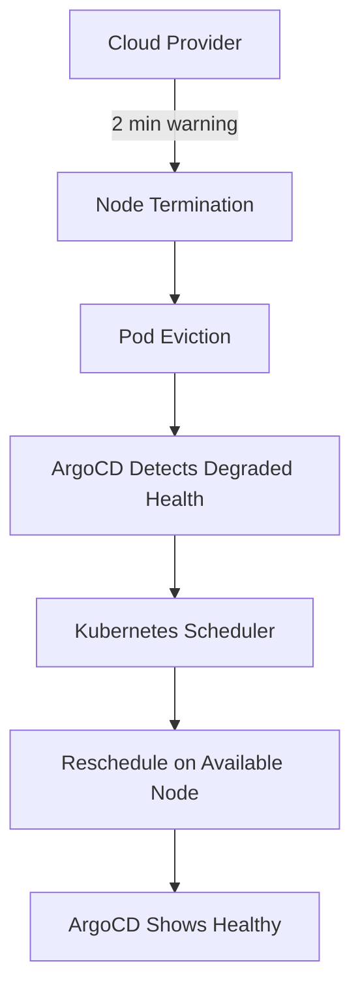

# How to Optimize ArgoCD for Spot Instance Nodes

Author: [nawazdhandala](https://github.com/nawazdhandala)

Tags: ArgoCD, GitOps, Kubernetes, Spot Instances, Cost Optimization

Description: Learn how to configure ArgoCD deployments to work reliably on Kubernetes spot instance nodes while saving up to 90% on compute costs.

---

Spot instances offer up to 90% savings compared to on-demand pricing, but they come with a catch: the cloud provider can reclaim them with little notice. When your ArgoCD-managed workloads run on spot nodes, you need careful configuration to handle interruptions gracefully. A poorly configured deployment on spot instances leads to downtime, failed syncs, and frustrated teams.

In this guide, I will show you how to configure ArgoCD deployments to run effectively on spot instances across AWS, GCP, and Azure.

## Understanding Spot Instance Behavior

Spot instances (called Preemptible VMs on GCP and Spot VMs on Azure) are spare cloud capacity offered at a steep discount. The trade-off is that the cloud provider can terminate them when demand increases.



The key is designing your deployments so that pod evictions are non-events rather than incidents.

## Configuring Pod Disruption Budgets

Every ArgoCD-managed application on spot instances needs a PodDisruptionBudget (PDB). This tells Kubernetes how many pods must remain available during disruptions.

```yaml
# pdb.yaml
apiVersion: policy/v1
kind: PodDisruptionBudget
metadata:
  name: my-app-pdb
  namespace: production
spec:
  minAvailable: 2  # Or use maxUnavailable: 1
  selector:
    matchLabels:
      app: my-app
```

Include PDBs in your ArgoCD application manifests. They should be synced as part of the application.

```yaml
# In your Helm chart values or Kustomize base
apiVersion: argoproj.io/v1alpha1
kind: Application
metadata:
  name: my-app
  namespace: argocd
spec:
  source:
    repoURL: https://github.com/myorg/gitops.git
    path: apps/my-app
    targetRevision: main
  destination:
    server: https://kubernetes.default.svc
    namespace: production
  syncPolicy:
    automated:
      selfHeal: true  # Critical for spot - restores pods after eviction
```

## Node Affinity and Tolerations

Configure which workloads run on spot nodes and which require on-demand nodes.

```yaml
# deployment-for-spot.yaml
apiVersion: apps/v1
kind: Deployment
metadata:
  name: stateless-worker
spec:
  replicas: 5
  template:
    spec:
      # Prefer spot instances but accept on-demand
      affinity:
        nodeAffinity:
          preferredDuringSchedulingIgnoredDuringExecution:
            - weight: 80
              preference:
                matchExpressions:
                  - key: node.kubernetes.io/capacity-type
                    operator: In
                    values:
                      - spot
          # Spread across availability zones
          podAntiAffinity:
            preferredDuringSchedulingIgnoredDuringExecution:
              - weight: 100
                podAffinityTerm:
                  topologyKey: topology.kubernetes.io/zone
                  labelSelector:
                    matchLabels:
                      app: stateless-worker
      # Tolerate spot instance taints
      tolerations:
        - key: "kubernetes.io/spot"
          operator: "Equal"
          value: "true"
          effect: "NoSchedule"
      # Graceful shutdown
      terminationGracePeriodSeconds: 30
      containers:
        - name: worker
          image: myorg/worker:v1.0.0
          resources:
            requests:
              cpu: "500m"
              memory: "512Mi"
            limits:
              cpu: "1"
              memory: "1Gi"
          lifecycle:
            preStop:
              exec:
                command: ["/bin/sh", "-c", "sleep 5 && kill -SIGTERM 1"]
```

## ArgoCD Self-Healing for Spot Interruptions

Enable self-healing on applications running on spot instances. When a spot node is terminated and pods are evicted, ArgoCD detects the drift and ensures the desired state is restored.

```yaml
spec:
  syncPolicy:
    automated:
      selfHeal: true
      prune: true
    retry:
      limit: 5
      backoff:
        duration: 5s
        factor: 2
        maxDuration: 3m
```

The retry configuration is important because during a spot interruption, the Kubernetes scheduler might need time to find available nodes. The exponential backoff prevents ArgoCD from hammering the API server.

## Workload Classification with ArgoCD Labels

Not all workloads are suitable for spot instances. Use labels to classify workloads.

```yaml
# Spot-friendly: stateless, replicated, tolerant of restarts
metadata:
  labels:
    spot-eligible: "true"
    spot-priority: "high"  # high = prefer spot, low = use if available

# Not spot-friendly: stateful, single-instance, long-running
metadata:
  labels:
    spot-eligible: "false"
```

Enforce this through policy.

```yaml
# kyverno-spot-policy.yaml
apiVersion: kyverno.io/v1
kind: ClusterPolicy
metadata:
  name: validate-spot-eligibility
spec:
  validationFailureAction: Audit
  rules:
    - name: warn-stateful-on-spot
      match:
        any:
          - resources:
              kinds:
                - StatefulSet
      validate:
        message: >-
          StatefulSets should not be scheduled on spot instances.
          Add nodeAffinity to prefer on-demand nodes.
        pattern:
          spec:
            template:
              spec:
                affinity:
                  nodeAffinity:
                    requiredDuringSchedulingIgnoredDuringExecution:
                      nodeSelectorTerms:
                        - matchExpressions:
                            - key: node.kubernetes.io/capacity-type
                              operator: NotIn
                              values:
                                - spot
```

## Handling ArgoCD Components on Spot

ArgoCD itself should NOT run on spot instances. If the ArgoCD controller gets evicted, it cannot manage other applications during the interruption.

```yaml
# argocd deployment with on-demand affinity
apiVersion: apps/v1
kind: Deployment
metadata:
  name: argocd-application-controller
  namespace: argocd
spec:
  template:
    spec:
      affinity:
        nodeAffinity:
          requiredDuringSchedulingIgnoredDuringExecution:
            nodeSelectorTerms:
              - matchExpressions:
                  - key: node.kubernetes.io/capacity-type
                    operator: In
                    values:
                      - on-demand
      tolerations: []  # Do NOT tolerate spot taints
```

Apply the same requirement to the ArgoCD API server, repo server, and Redis.

## Graceful Shutdown Configuration

Configure proper shutdown handling for applications on spot instances.

```yaml
# deployment with graceful shutdown
spec:
  template:
    spec:
      terminationGracePeriodSeconds: 120
      containers:
        - name: app
          lifecycle:
            preStop:
              exec:
                command:
                  - /bin/sh
                  - -c
                  - |
                    # Signal the application to stop accepting new work
                    curl -X POST http://localhost:8080/shutdown
                    # Wait for in-flight requests to complete
                    sleep 15
```

For AWS, you can also use the Node Termination Handler to get advance notice of spot interruptions.

```yaml
# aws-node-termination-handler (deployed via ArgoCD)
apiVersion: argoproj.io/v1alpha1
kind: Application
metadata:
  name: aws-node-termination-handler
  namespace: argocd
spec:
  source:
    repoURL: https://aws.github.io/eks-charts
    chart: aws-node-termination-handler
    targetRevision: 0.21.0
    helm:
      values: |
        enableSpotInterruptionDraining: true
        enableRebalanceMonitoring: true
        enableScheduledEventDraining: true
  destination:
    server: https://kubernetes.default.svc
    namespace: kube-system
```

## Cost Monitoring for Spot Savings

Track your actual savings from spot instances.

```yaml
# prometheus-rules for spot monitoring
apiVersion: monitoring.coreos.com/v1
kind: PrometheusRule
metadata:
  name: spot-instance-monitoring
spec:
  groups:
    - name: spot-instances
      rules:
        - record: spot_node_count
          expr: count(kube_node_labels{label_node_kubernetes_io_capacity_type="spot"})
        - record: ondemand_node_count
          expr: count(kube_node_labels{label_node_kubernetes_io_capacity_type="on-demand"})
        - alert: HighSpotInterruptionRate
          expr: |
            rate(kube_pod_container_status_terminated_reason{reason="Evicted"}[1h]) > 0.1
          for: 30m
          labels:
            severity: warning
          annotations:
            summary: "High spot interruption rate detected"
```

## Conclusion

Running ArgoCD-managed workloads on spot instances is one of the most impactful cost optimizations you can make. The keys are: keep ArgoCD itself on on-demand nodes, enable self-healing with retry backoff, use PodDisruptionBudgets to maintain availability during interruptions, spread pods across zones, and handle graceful shutdown properly. Start by moving stateless, replicated workloads to spot instances and expand from there as you gain confidence. With proper configuration, spot instances can handle production traffic reliably while cutting your compute costs dramatically.
