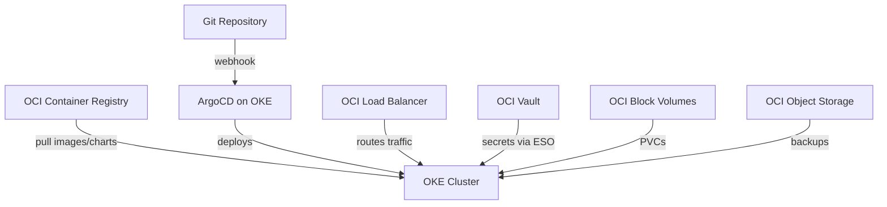

# How to Use ArgoCD with Oracle Cloud Kubernetes

Author: [nawazdhandala](https://github.com/nawazdhandala)

Tags: ArgoCD, GitOps, Kubernetes, Oracle Cloud, OKE

Description: Learn how to deploy and configure ArgoCD on Oracle Kubernetes Engine (OKE) with OCI load balancers, container registry, and vault integration.

---

Oracle Kubernetes Engine (OKE) is Oracle Cloud Infrastructure's managed Kubernetes service. While it might not get the same attention as EKS or GKE, OKE has some notable advantages: a generous free tier, no charges for the Kubernetes control plane, and tight integration with Oracle Cloud services. For teams already using Oracle Cloud or those looking for cost-effective Kubernetes, ArgoCD on OKE is a solid combination.

This guide covers deploying ArgoCD on OKE, integrating with Oracle Cloud Container Registry (OCIR), configuring load balancers, and leveraging OCI Vault for secrets management.

## Prerequisites

- An Oracle Cloud Infrastructure (OCI) account
- An OKE cluster created with at least 2 worker nodes
- The OCI CLI installed and configured
- kubectl configured with your OKE cluster's kubeconfig

## Step 1: Connect to Your OKE Cluster

```bash
# Generate kubeconfig for your OKE cluster
oci ce cluster create-kubeconfig \
  --cluster-id ocid1.cluster.oc1.iad.xxxx \
  --file ~/.kube/oke-config \
  --region us-ashburn-1 \
  --token-version 2.0.0

export KUBECONFIG=~/.kube/oke-config
kubectl get nodes
```

## Step 2: Install ArgoCD

The standard ArgoCD manifests work without modifications on OKE.

```bash
# Create namespace and install ArgoCD
kubectl create namespace argocd
kubectl apply -n argocd -f https://raw.githubusercontent.com/argoproj/argo-cd/stable/manifests/install.yaml

# Wait for pods to become ready
kubectl wait --for=condition=Ready pod --all -n argocd --timeout=300s

# Get initial admin password
kubectl -n argocd get secret argocd-initial-admin-secret \
  -o jsonpath="{.data.password}" | base64 -d && echo
```

## Step 3: Expose ArgoCD with OCI Load Balancer

OKE uses the OCI Cloud Controller Manager to provision load balancers. You can create a flexible load balancer or a network load balancer.

### Using an OCI Flexible Load Balancer

```yaml
# argocd-lb.yaml
apiVersion: v1
kind: Service
metadata:
  name: argocd-server-lb
  namespace: argocd
  annotations:
    # OCI Load Balancer annotations
    oci.oraclecloud.com/load-balancer-type: "lb"
    service.beta.kubernetes.io/oci-load-balancer-shape: "flexible"
    service.beta.kubernetes.io/oci-load-balancer-shape-flex-min: "10"
    service.beta.kubernetes.io/oci-load-balancer-shape-flex-max: "100"
    service.beta.kubernetes.io/oci-load-balancer-ssl-ports: "443"
    service.beta.kubernetes.io/oci-load-balancer-tls-secret: "argocd-tls"
spec:
  type: LoadBalancer
  ports:
    - name: https
      port: 443
      targetPort: 8080
      protocol: TCP
  selector:
    app.kubernetes.io/name: argocd-server
```

### Using an OCI Network Load Balancer

Network load balancers are free-tier eligible and work well for ArgoCD.

```yaml
# argocd-nlb.yaml
apiVersion: v1
kind: Service
metadata:
  name: argocd-server-nlb
  namespace: argocd
  annotations:
    oci.oraclecloud.com/load-balancer-type: "nlb"
    oci-network-load-balancer.oraclecloud.com/security-list-management-mode: "All"
spec:
  type: LoadBalancer
  ports:
    - name: https
      port: 443
      targetPort: 8080
      protocol: TCP
  selector:
    app.kubernetes.io/name: argocd-server
```

## Step 4: Integrate with Oracle Cloud Container Registry (OCIR)

OCIR is Oracle's managed container registry. Configure ArgoCD to pull images and Helm charts from it.

```bash
# Generate an auth token for OCIR
# Go to OCI Console > Identity > Users > Your User > Auth Tokens > Generate Token
```

Create the ArgoCD repository secret.

```yaml
# ocir-repo-secret.yaml
apiVersion: v1
kind: Secret
metadata:
  name: ocir-repo
  namespace: argocd
  labels:
    argocd.argoproj.io/secret-type: repository
stringData:
  type: helm
  name: ocir
  enableOCI: "true"
  # Format: <region>.ocir.io/<tenancy-namespace>
  url: iad.ocir.io/mytenancy
  username: "<TENANCY_NAMESPACE>/oracleidentitycloudservice/<USERNAME>"
  password: "<AUTH_TOKEN>"
```

For image pull secrets:

```bash
# Create OCIR pull secret
kubectl create secret docker-registry ocir-secret \
  --namespace my-app \
  --docker-server=iad.ocir.io \
  --docker-username="<TENANCY>/<USERNAME>" \
  --docker-password="<AUTH_TOKEN>" \
  --docker-email="user@example.com"
```

## Step 5: Use OCI Vault for Secrets

OCI Vault is Oracle's key management service. You can integrate it with ArgoCD using the External Secrets Operator.

### Install External Secrets Operator

```yaml
# eso-app.yaml
apiVersion: argoproj.io/v1alpha1
kind: Application
metadata:
  name: external-secrets
  namespace: argocd
spec:
  project: default
  source:
    repoURL: https://charts.external-secrets.io
    chart: external-secrets
    targetRevision: 0.9.x
    helm:
      values: |
        installCRDs: true
  destination:
    server: https://kubernetes.default.svc
    namespace: external-secrets
  syncPolicy:
    automated:
      prune: true
      selfHeal: true
    syncOptions:
      - CreateNamespace=true
```

### Configure the OCI Vault SecretStore

```yaml
# oci-secret-store.yaml
apiVersion: external-secrets.io/v1beta1
kind: ClusterSecretStore
metadata:
  name: oci-vault
spec:
  provider:
    oracle:
      vault: ocid1.vault.oc1.iad.xxxx
      region: us-ashburn-1
      auth:
        secretRef:
          privatekey:
            name: oci-creds
            namespace: external-secrets
            key: private-key
          fingerprint:
            name: oci-creds
            namespace: external-secrets
            key: fingerprint
          tenancy: ocid1.tenancy.oc1..xxxx
          user: ocid1.user.oc1..xxxx
```

### Create ExternalSecrets

```yaml
# app-external-secret.yaml
apiVersion: external-secrets.io/v1beta1
kind: ExternalSecret
metadata:
  name: my-app-secrets
  namespace: my-app
spec:
  refreshInterval: 5m
  secretStoreRef:
    name: oci-vault
    kind: ClusterSecretStore
  target:
    name: my-app-secrets
    creationPolicy: Owner
  data:
    - secretKey: db-password
      remoteRef:
        key: my-app-database-password
    - secretKey: api-key
      remoteRef:
        key: my-app-api-key
```

## Step 6: Configure OCI Block Volume Storage

OKE supports OCI Block Volumes for persistent storage. The CSI driver is pre-installed.

```yaml
# pvc-oci.yaml
apiVersion: v1
kind: PersistentVolumeClaim
metadata:
  name: app-data
spec:
  accessModes:
    - ReadWriteOnce
  storageClassName: oci-bv
  resources:
    requests:
      storage: 50Gi
```

For high-performance workloads, use the ultra-high performance tier:

```yaml
storageClassName: oci-bv
resources:
  requests:
    storage: 50Gi
# Annotations for performance tier
annotations:
  volume.beta.kubernetes.io/oci-volume-source-ocid: ""
```

## Architecture on Oracle Cloud



## OKE-Specific Tips

### Free Tier Optimization

Oracle Cloud's Always Free tier includes:
- OKE control plane at no cost
- A generous amount of compute hours
- 10 TB of outbound data transfer per month

To maximize the free tier with ArgoCD, use ARM-based (Ampere) worker nodes.

```bash
# Create a node pool with ARM instances (free tier eligible)
oci ce node-pool create \
  --cluster-id ocid1.cluster.oc1.iad.xxxx \
  --compartment-id ocid1.compartment.oc1..xxxx \
  --name argocd-arm-pool \
  --node-shape VM.Standard.A1.Flex \
  --node-shape-config '{"memoryInGBs": 6, "ocpus": 1}' \
  --size 2
```

Make sure you use ARM-compatible ArgoCD images or the multi-arch images (which is the default).

### OCI IAM Instance Principals

Instead of storing API keys, you can use instance principals for OKE worker nodes to access OCI services. This is similar to AWS IAM roles for service accounts.

```bash
# Create a dynamic group for OKE worker nodes
# In OCI Console > Identity > Dynamic Groups
# Rule: Any {instance.compartment.id = 'ocid1.compartment.oc1..xxxx'}
```

Then create IAM policies:

```text
Allow dynamic-group oke-workers to read secret-family in compartment my-compartment
Allow dynamic-group oke-workers to use vaults in compartment my-compartment
```

### Network Security

OKE uses VCN Security Lists or Network Security Groups. Make sure ArgoCD can reach your Git repositories and container registries.

```bash
# Verify outbound connectivity from ArgoCD pods
kubectl exec -n argocd deployment/argocd-repo-server -- \
  curl -s https://github.com -o /dev/null -w "%{http_code}"
```

## Troubleshooting on OKE

### Load Balancer Stuck in Pending

Check that the OKE worker nodes' subnet has the right security list rules.

```bash
kubectl describe svc argocd-server-lb -n argocd
# Look for events about load balancer provisioning
```

### OCIR Image Pull Errors

The OCIR username format is specific. Make sure it follows the pattern:

```text
<tenancy-namespace>/oracleidentitycloudservice/<username>
```

For federated users, the format may be different.

### OCI Vault Access Denied

Verify that the IAM policies allow the workload to access the vault.

```bash
# Check OCI policies
oci iam policy list --compartment-id ocid1.compartment.oc1..xxxx
```

## Conclusion

Oracle Kubernetes Engine is an underrated platform for running ArgoCD. The free control plane, generous data transfer allowance, and ARM instance support make it one of the most cost-effective options for Kubernetes workloads. The integration with OCI services like OCIR, OCI Vault, and Block Volumes is solid, and ArgoCD runs without any special modifications. If you are evaluating cloud providers for a GitOps deployment, OKE deserves a serious look, especially if cost efficiency is a priority.
