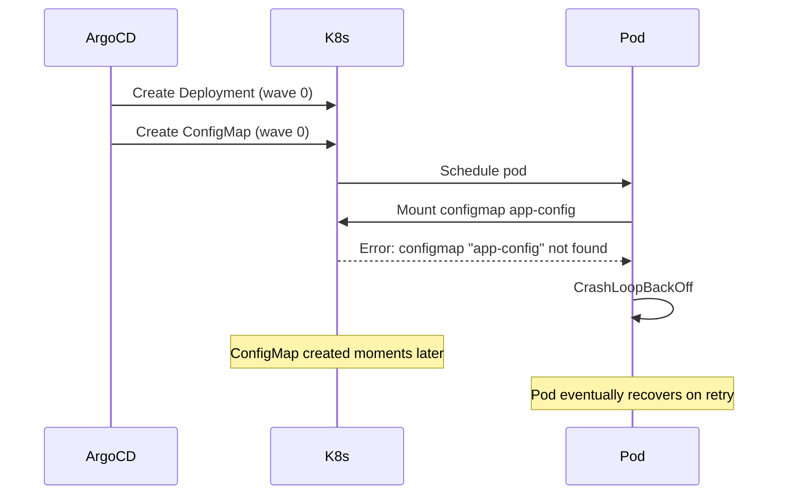

# How to Order ConfigMaps and Secrets Before Deployments in ArgoCD

Author: [nawazdhandala](https://github.com/nawazdhandala)

Tags: ArgoCD, GitOps, Kubernetes, Sync Waves, Configuration Management

Description: Learn how to use ArgoCD sync waves to deploy ConfigMaps and Secrets before the Deployments that reference them, preventing pod startup failures and CrashLoopBackOff issues.

---

A Deployment that references a ConfigMap or Secret that does not exist yet will create pods that crash on startup. The container runtime cannot mount the missing volume or inject the missing environment variable, so the pod enters CrashLoopBackOff. ArgoCD sync waves prevent this by ensuring configuration resources exist before the workloads that consume them.

## The Problem: Missing Configuration at Pod Start

When ArgoCD applies resources in the same sync wave, ConfigMaps, Secrets, and Deployments may be created in any order. If the Deployment reaches the API server first, Kubernetes schedules pods immediately. Those pods try to mount or read the ConfigMap or Secret, fail, and crash.



The pod might eventually recover after Kubernetes retries, but this creates a noisy deployment with transient errors. With sync waves, you avoid the problem entirely.

## Basic ConfigMap-Before-Deployment Ordering

Place ConfigMaps and Secrets at wave -1, and Deployments at wave 0.

```yaml
# configmap.yaml - Wave -1: Configuration first
apiVersion: v1
kind: ConfigMap
metadata:
  name: app-config
  namespace: production
  annotations:
    argocd.argoproj.io/sync-wave: "-1"
data:
  DATABASE_HOST: "postgres.data.svc.cluster.local"
  DATABASE_PORT: "5432"
  LOG_LEVEL: "info"
  CACHE_TTL: "300"
```

```yaml
# secret.yaml - Wave -1: Secrets alongside ConfigMaps
apiVersion: v1
kind: Secret
metadata:
  name: app-secrets
  namespace: production
  annotations:
    argocd.argoproj.io/sync-wave: "-1"
type: Opaque
data:
  DATABASE_PASSWORD: cGFzc3dvcmQxMjM=  # base64 encoded
  API_KEY: c2VjcmV0LWFwaS1rZXk=
```

```yaml
# deployment.yaml - Wave 0: Workload after config exists
apiVersion: apps/v1
kind: Deployment
metadata:
  name: my-app
  namespace: production
  annotations:
    argocd.argoproj.io/sync-wave: "0"
spec:
  replicas: 3
  selector:
    matchLabels:
      app: my-app
  template:
    metadata:
      labels:
        app: my-app
    spec:
      containers:
        - name: app
          image: myregistry/my-app:v2.1.0
          envFrom:
            - configMapRef:
                name: app-config
            - secretRef:
                name: app-secrets
          volumeMounts:
            - name: config-volume
              mountPath: /etc/config
      volumes:
        - name: config-volume
          configMap:
            name: app-config
```

ArgoCD creates the ConfigMap and Secret in wave -1, confirms they exist, and then creates the Deployment in wave 0. The pods start with all configuration already available.

## Multiple ConfigMaps for Different Components

Larger applications often have separate ConfigMaps for different concerns: database settings, feature flags, logging configuration. Group them all in the same wave before the Deployment.

```yaml
# configs/database.yaml
apiVersion: v1
kind: ConfigMap
metadata:
  name: db-config
  namespace: production
  annotations:
    argocd.argoproj.io/sync-wave: "-1"
data:
  DB_HOST: "postgres-primary.data.svc.cluster.local"
  DB_PORT: "5432"
  DB_NAME: "myapp"
  DB_POOL_SIZE: "20"
  DB_POOL_TIMEOUT: "30"
---
# configs/features.yaml
apiVersion: v1
kind: ConfigMap
metadata:
  name: feature-flags
  namespace: production
  annotations:
    argocd.argoproj.io/sync-wave: "-1"
data:
  ENABLE_NEW_CHECKOUT: "true"
  ENABLE_DARK_MODE: "false"
  MAX_UPLOAD_SIZE: "10485760"
---
# configs/logging.yaml
apiVersion: v1
kind: ConfigMap
metadata:
  name: logging-config
  namespace: production
  annotations:
    argocd.argoproj.io/sync-wave: "-1"
data:
  LOG_LEVEL: "info"
  LOG_FORMAT: "json"
  LOG_OUTPUT: "stdout"
```

All three ConfigMaps deploy in wave -1, in parallel. The Deployment in wave 0 can safely reference all of them.

## Handling Optional ConfigMaps

Sometimes a ConfigMap is optional. The pod should start even if the ConfigMap does not exist. In this case, mark the volume or env reference as optional in the pod spec.

```yaml
apiVersion: apps/v1
kind: Deployment
metadata:
  name: my-app
  namespace: production
  annotations:
    argocd.argoproj.io/sync-wave: "0"
spec:
  replicas: 2
  selector:
    matchLabels:
      app: my-app
  template:
    metadata:
      labels:
        app: my-app
    spec:
      containers:
        - name: app
          image: myregistry/my-app:v2.1.0
          env:
            - name: OPTIONAL_CONFIG
              valueFrom:
                configMapKeyRef:
                  name: optional-config
                  key: SOME_KEY
                  optional: true  # Pod starts even if ConfigMap is missing
          volumeMounts:
            - name: optional-volume
              mountPath: /etc/optional
      volumes:
        - name: optional-volume
          configMap:
            name: optional-config
            optional: true  # Volume mount succeeds even if ConfigMap is missing
```

With optional references, you do not strictly need sync wave ordering. But it is still good practice to deploy ConfigMaps first for consistency.

## Pattern: External Secrets Before Deployments

When using External Secrets Operator, the ExternalSecret resource creates a Kubernetes Secret by fetching data from an external provider like AWS Secrets Manager or HashiCorp Vault. The ExternalSecret needs time to reconcile before the Secret is available.

```yaml
# Wave -2: ExternalSecret triggers secret creation
apiVersion: external-secrets.io/v1beta1
kind: ExternalSecret
metadata:
  name: app-credentials
  namespace: production
  annotations:
    argocd.argoproj.io/sync-wave: "-2"
spec:
  refreshInterval: 1h
  secretStoreRef:
    name: aws-secret-store
    kind: ClusterSecretStore
  target:
    name: app-credentials  # The Kubernetes Secret that gets created
    creationPolicy: Owner
  data:
    - secretKey: db-password
      remoteRef:
        key: production/myapp/db-password
    - secretKey: api-key
      remoteRef:
        key: production/myapp/api-key
```

```yaml
# Wave 0: Deployment uses the Secret created by ExternalSecret
apiVersion: apps/v1
kind: Deployment
metadata:
  name: my-app
  namespace: production
  annotations:
    argocd.argoproj.io/sync-wave: "0"
spec:
  replicas: 3
  selector:
    matchLabels:
      app: my-app
  template:
    metadata:
      labels:
        app: my-app
    spec:
      containers:
        - name: app
          image: myregistry/my-app:v2.1.0
          envFrom:
            - secretRef:
                name: app-credentials
```

The gap between wave -2 and wave 0 gives the External Secrets Operator time to fetch the secret data and create the Kubernetes Secret. If you use wave -1 for the ExternalSecret and wave 0 for the Deployment, there might not be enough time for reconciliation.

## ConfigMap Updates and Deployment Rollouts

A subtle issue with ConfigMaps: if you update a ConfigMap but the Deployment spec does not change, Kubernetes does not restart the pods. The running pods will not pick up the new configuration unless they watch for file changes.

A common workaround is to hash the ConfigMap content and include it as an annotation on the pod template.

```yaml
apiVersion: apps/v1
kind: Deployment
metadata:
  name: my-app
  namespace: production
  annotations:
    argocd.argoproj.io/sync-wave: "0"
spec:
  replicas: 3
  selector:
    matchLabels:
      app: my-app
  template:
    metadata:
      labels:
        app: my-app
      annotations:
        # Change this hash when ConfigMap changes to trigger rollout
        configmap-hash: "abc123def456"
    spec:
      containers:
        - name: app
          image: myregistry/my-app:v2.1.0
          envFrom:
            - configMapRef:
                name: app-config
```

Tools like Kustomize have a `configMapGenerator` that automatically creates unique ConfigMap names with content hashes, which forces a rollout on every change.

## Full Wave Ordering for a Typical Application

Here is a complete wave ordering that covers namespaces, configuration, and workloads.

```yaml
# Wave -3: Namespace
apiVersion: v1
kind: Namespace
metadata:
  name: production
  annotations:
    argocd.argoproj.io/sync-wave: "-3"
---
# Wave -2: RBAC
apiVersion: v1
kind: ServiceAccount
metadata:
  name: my-app
  namespace: production
  annotations:
    argocd.argoproj.io/sync-wave: "-2"
---
# Wave -1: Configuration
apiVersion: v1
kind: ConfigMap
metadata:
  name: app-config
  namespace: production
  annotations:
    argocd.argoproj.io/sync-wave: "-1"
data:
  APP_PORT: "8080"
  LOG_LEVEL: "info"
---
# Wave 0: Workloads
apiVersion: apps/v1
kind: Deployment
metadata:
  name: my-app
  namespace: production
  annotations:
    argocd.argoproj.io/sync-wave: "0"
spec:
  replicas: 3
  selector:
    matchLabels:
      app: my-app
  template:
    metadata:
      labels:
        app: my-app
    spec:
      serviceAccountName: my-app
      containers:
        - name: app
          image: myregistry/my-app:v2.1.0
          envFrom:
            - configMapRef:
                name: app-config
---
# Wave 1: Networking
apiVersion: v1
kind: Service
metadata:
  name: my-app
  namespace: production
  annotations:
    argocd.argoproj.io/sync-wave: "1"
spec:
  selector:
    app: my-app
  ports:
    - port: 80
      targetPort: 8080
```

This layered approach guarantees that every dependency is satisfied before it is needed. Namespace exists before anything deploys into it, configuration exists before workloads reference it, and networking is set up after workloads are running.

For more on sync wave fundamentals, see the [ArgoCD sync waves guide](https://oneuptime.com/blog/post/2026-02-09-argocd-sync-waves-ordered-deployments/view). For namespace ordering specifically, check out the [namespace ordering guide](https://oneuptime.com/blog/post/2026-02-26-argocd-order-namespace-creation-sync-waves/view).
