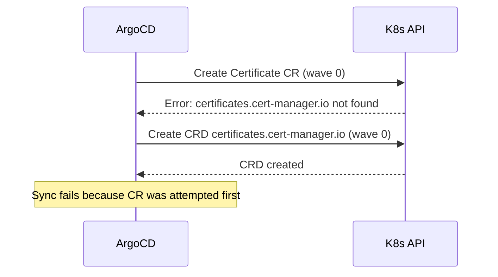

# How to Order CRD Installation Before CR Creation with Sync Waves in ArgoCD

Author: [nawazdhandala](https://github.com/nawazdhandala)

Tags: ArgoCD, GitOps, Kubernetes, Sync Waves, CRD

Description: Learn how to use ArgoCD sync waves to install Custom Resource Definitions before creating Custom Resources, preventing the most common CRD-related deployment failure.

---

If you have ever tried deploying a Custom Resource before its CRD exists, you know the error well: the resource type is not recognized by the Kubernetes API server. This is one of the most frequent ArgoCD deployment failures, and sync waves solve it cleanly.

This guide covers the CRD-then-CR ordering problem, how to fix it with sync waves, and patterns for handling CRDs that come from external sources like Helm charts.

## The CRD Ordering Problem

Custom Resource Definitions (CRDs) extend the Kubernetes API. Once you install a CRD, the API server recognizes a new resource type. Custom Resources (CRs) are instances of that type. The problem is simple: you cannot create a CR before its CRD is registered.



When ArgoCD applies resources in the same wave, the order within that wave is not guaranteed. If the CR reaches the API server before the CRD, the sync fails.

## Basic CRD-Before-CR Ordering

The fix is to place CRDs in a lower sync wave than their corresponding CRs.

```yaml
# crd.yaml - Wave -3: Install CRD first
apiVersion: apiextensions.k8s.io/v1
kind: CustomResourceDefinition
metadata:
  name: certificates.cert-manager.io
  annotations:
    argocd.argoproj.io/sync-wave: "-3"
spec:
  group: cert-manager.io
  versions:
    - name: v1
      served: true
      storage: true
      schema:
        openAPIV3Schema:
          type: object
          properties:
            spec:
              type: object
  scope: Namespaced
  names:
    plural: certificates
    singular: certificate
    kind: Certificate
```

```yaml
# certificate.yaml - Wave 1: Create CR after CRD is registered
apiVersion: cert-manager.io/v1
kind: Certificate
metadata:
  name: my-app-tls
  namespace: production
  annotations:
    argocd.argoproj.io/sync-wave: "1"
spec:
  secretName: my-app-tls-secret
  issuerRef:
    name: letsencrypt-prod
    kind: ClusterIssuer
  dnsNames:
    - app.example.com
```

ArgoCD will install the CRD at wave -3, wait for it to be established, and then create the Certificate CR at wave 1.

## The SkipDryRunOnMissingResource Option

ArgoCD performs a dry-run validation before applying resources. If the CRD does not exist yet, the dry-run fails for any CR of that type. ArgoCD provides a sync option to skip dry-run for resources whose types are not yet registered.

```yaml
apiVersion: argoproj.io/v1alpha1
kind: Application
metadata:
  name: cert-manager-app
  namespace: argocd
spec:
  project: default
  source:
    repoURL: https://github.com/myorg/infra.git
    targetRevision: main
    path: cert-manager/
  destination:
    server: https://kubernetes.default.svc
    namespace: cert-manager
  syncPolicy:
    syncOptions:
      - CreateNamespace=true
      - SkipDryRunOnMissingResource=true
```

Even with this option, you still need sync waves. The option prevents the dry-run failure but does not guarantee ordering. Without sync waves, the CR might still be applied before the CRD.

## Pattern: Operator CRDs Then Application CRs

A common real-world scenario is deploying an operator (which includes CRDs) and then deploying resources managed by that operator.

```yaml
# wave-hierarchy.yaml
# Wave -3: CRDs
# Wave -2: Operator namespace and RBAC
# Wave -1: Operator deployment
# Wave 0: Operator-managed resources (CRs)

---
# CRD for the operator
apiVersion: apiextensions.k8s.io/v1
kind: CustomResourceDefinition
metadata:
  name: mongodbs.mongodb.com
  annotations:
    argocd.argoproj.io/sync-wave: "-3"
spec:
  group: mongodb.com
  versions:
    - name: v1
      served: true
      storage: true
      schema:
        openAPIV3Schema:
          type: object
  scope: Namespaced
  names:
    plural: mongodbs
    singular: mongodb
    kind: MongoDB
---
# Operator namespace
apiVersion: v1
kind: Namespace
metadata:
  name: mongodb-operator
  annotations:
    argocd.argoproj.io/sync-wave: "-2"
---
# Operator deployment
apiVersion: apps/v1
kind: Deployment
metadata:
  name: mongodb-operator
  namespace: mongodb-operator
  annotations:
    argocd.argoproj.io/sync-wave: "-1"
spec:
  replicas: 1
  selector:
    matchLabels:
      app: mongodb-operator
  template:
    metadata:
      labels:
        app: mongodb-operator
    spec:
      containers:
        - name: operator
          image: quay.io/mongodb/mongodb-kubernetes-operator:0.8.0
---
# Custom Resource managed by the operator
apiVersion: mongodb.com/v1
kind: MongoDB
metadata:
  name: my-mongodb
  namespace: production
  annotations:
    argocd.argoproj.io/sync-wave: "0"
spec:
  members: 3
  type: ReplicaSet
  version: "6.0.0"
```

This four-wave structure ensures proper ordering: CRDs register first, the operator namespace is created, the operator starts running, and finally the CR is created for the operator to reconcile.

## Handling CRDs from Helm Charts

When using Helm charts, CRDs can be tricky. Helm has a special `crds/` directory that installs CRDs before the rest of the chart, but this does not work with ArgoCD's sync wave mechanism because ArgoCD treats Helm chart rendering differently.

The recommended approach is to split your CRDs into a separate ArgoCD Application.

```yaml
# Application 1: CRDs only
apiVersion: argoproj.io/v1alpha1
kind: Application
metadata:
  name: prometheus-crds
  namespace: argocd
  annotations:
    argocd.argoproj.io/sync-wave: "-1"
spec:
  project: default
  source:
    repoURL: https://prometheus-community.github.io/helm-charts
    chart: prometheus-operator-crds
    targetRevision: 8.0.0
  destination:
    server: https://kubernetes.default.svc
---
# Application 2: Prometheus stack (depends on CRDs)
apiVersion: argoproj.io/v1alpha1
kind: Application
metadata:
  name: kube-prometheus-stack
  namespace: argocd
  annotations:
    argocd.argoproj.io/sync-wave: "1"
spec:
  project: default
  source:
    repoURL: https://prometheus-community.github.io/helm-charts
    chart: kube-prometheus-stack
    targetRevision: 55.0.0
    helm:
      values: |
        prometheus:
          prometheusSpec:
            retention: 30d
  destination:
    server: https://kubernetes.default.svc
    namespace: monitoring
  syncPolicy:
    syncOptions:
      - CreateNamespace=true
      - SkipDryRunOnMissingResource=true
```

By splitting CRDs into their own application with a lower sync wave, you guarantee they are registered before the main chart tries to create CRs.

## Handling CRD Updates

CRD updates require care. When you update a CRD, the API server needs time to process the schema changes. If a CR is applied with new fields immediately after the CRD update, validation might fail.

Add a health check to your CRD resource to make ArgoCD wait until the CRD is fully established.

```yaml
apiVersion: apiextensions.k8s.io/v1
kind: CustomResourceDefinition
metadata:
  name: certificates.cert-manager.io
  annotations:
    argocd.argoproj.io/sync-wave: "-3"
    # ArgoCD checks the Established condition on CRDs by default
    # No additional health check annotation is needed
```

ArgoCD includes a built-in health check for CRDs that monitors the `Established` condition. It will not proceed to the next wave until the CRD reports `Established: True`. This means you get ordering safety out of the box with sync waves.

## Debugging CRD Ordering Failures

When CRD ordering goes wrong, check these things.

First, verify the CRD is actually in a lower wave than the CR.

```bash
# List all resources with their sync waves
argocd app resources my-app --output json | \
  jq '.[] | select(.kind == "CustomResourceDefinition" or .group != "") | {kind, name, syncWave}'
```

Second, check if the CRD reached the Established state.

```bash
# Check CRD status
kubectl get crd certificates.cert-manager.io -o jsonpath='{.status.conditions[?(@.type=="Established")].status}'
```

If the CRD never becomes Established, the sync will hang at that wave forever. Look at the CRD spec for schema validation errors that would prevent establishment.

Third, make sure `SkipDryRunOnMissingResource` is set on the application if this is the first deployment. Without it, ArgoCD cannot even start the sync because the dry-run phase rejects unknown resource types.

## Recommended Wave Assignment for CRD-Heavy Deployments

Here is a battle-tested wave ordering for applications that include operators and CRDs.

| Wave | Resource Type | Purpose |
|------|---------------|---------|
| -5 | Namespaces | Target namespaces for everything |
| -4 | CRDs | Register new API types |
| -3 | ClusterRoles, ClusterRoleBindings | Cluster-wide RBAC |
| -2 | ServiceAccounts, Roles, RoleBindings | Namespace-scoped RBAC |
| -1 | Operator Deployments | Start operators that reconcile CRs |
| 0 | ConfigMaps, Secrets | Configuration data |
| 1 | Custom Resources | Instances managed by operators |
| 2 | Application Deployments | Main workloads |
| 3 | Services, Ingresses | Networking |

This structure ensures every dependency is satisfied before the resources that need it are created. For more on sync waves fundamentals, see the [ArgoCD sync waves guide](https://oneuptime.com/blog/post/2026-01-27-argocd-sync-waves/view).
