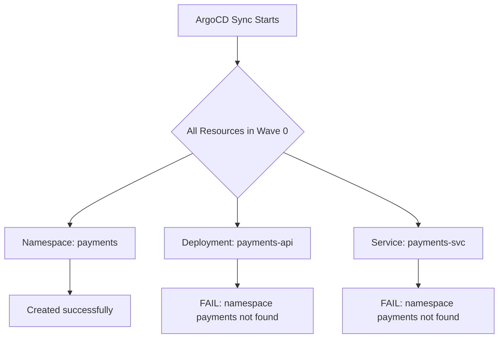

# How to Order Namespace Creation Before Other Resources in ArgoCD

Author: [nawazdhandala](https://github.com/nawazdhandala)

Tags: ArgoCD, GitOps, Kubernetes, Sync Waves, Namespaces

Description: Learn how to use ArgoCD sync waves to ensure namespaces are created before any resources that depend on them, preventing deployment failures in multi-namespace applications.

---

One of the most common ArgoCD deployment failures happens when resources try to land in a namespace that does not exist yet. Kubernetes rejects the create request, the sync fails, and you are left staring at a red status in the UI. The fix is straightforward: use sync waves to guarantee namespace creation happens first.

This guide walks through the problem, the solution, and several real-world patterns for ordering namespace creation in ArgoCD.

## Why Namespace Ordering Matters

When ArgoCD syncs an application, it applies all resources in a wave together. If you have a Namespace resource and a Deployment that targets that namespace in the same wave (wave 0 by default), there is no guarantee the namespace will be created before the Deployment. Kubernetes API calls happen in parallel, and the race condition is real.



The Deployment and Service fire off at the same time as the Namespace. If they reach the API server first, they fail because the namespace does not exist yet.

## The Solution: Negative Sync Waves

Assign your Namespace resources a lower sync wave number than the resources that depend on them. ArgoCD processes waves in ascending order, so wave -1 runs before wave 0.

```yaml
# namespace.yaml - Wave -1: Create namespace first
apiVersion: v1
kind: Namespace
metadata:
  name: payments
  annotations:
    argocd.argoproj.io/sync-wave: "-1"
  labels:
    app.kubernetes.io/part-of: payments-system
```

```yaml
# deployment.yaml - Wave 0 (default): Deploy after namespace exists
apiVersion: apps/v1
kind: Deployment
metadata:
  name: payments-api
  namespace: payments
spec:
  replicas: 3
  selector:
    matchLabels:
      app: payments-api
  template:
    metadata:
      labels:
        app: payments-api
    spec:
      containers:
        - name: api
          image: myregistry/payments-api:v1.2.0
          ports:
            - containerPort: 8080
```

ArgoCD will create the namespace in wave -1, wait for it to be ready, and then proceed to wave 0 where the Deployment lives.

## Using the CreateNamespace Sync Option Instead

ArgoCD provides a built-in sync option called `CreateNamespace=true` that handles namespace creation for the application's target namespace. This is the simpler approach when your application deploys into a single namespace.

```yaml
apiVersion: argoproj.io/v1alpha1
kind: Application
metadata:
  name: payments-app
  namespace: argocd
spec:
  project: default
  source:
    repoURL: https://github.com/myorg/payments.git
    targetRevision: main
    path: k8s/
  destination:
    server: https://kubernetes.default.svc
    namespace: payments
  syncPolicy:
    syncOptions:
      - CreateNamespace=true
    automated:
      prune: true
      selfHeal: true
```

However, `CreateNamespace=true` only handles the single destination namespace defined in `spec.destination.namespace`. If your application spans multiple namespaces, you need sync waves.

## Multi-Namespace Application Pattern

Many real applications span multiple namespaces. A microservices architecture might separate services by domain. Here is how to order namespace creation for a multi-namespace deployment.

```yaml
# namespaces.yaml - All namespaces in wave -2
apiVersion: v1
kind: Namespace
metadata:
  name: frontend
  annotations:
    argocd.argoproj.io/sync-wave: "-2"
---
apiVersion: v1
kind: Namespace
metadata:
  name: backend
  annotations:
    argocd.argoproj.io/sync-wave: "-2"
---
apiVersion: v1
kind: Namespace
metadata:
  name: data
  annotations:
    argocd.argoproj.io/sync-wave: "-2"
```

```yaml
# backend/deployment.yaml - Wave 0
apiVersion: apps/v1
kind: Deployment
metadata:
  name: order-service
  namespace: backend
  annotations:
    argocd.argoproj.io/sync-wave: "0"
spec:
  replicas: 2
  selector:
    matchLabels:
      app: order-service
  template:
    metadata:
      labels:
        app: order-service
    spec:
      containers:
        - name: app
          image: myregistry/order-service:v3.1.0
```

The wave ordering guarantees all three namespaces exist before any workloads attempt to deploy into them.

## Namespace with ResourceQuota and LimitRange

In production environments, you typically create namespaces alongside their ResourceQuota and LimitRange resources. These should be in the same wave as the namespace since they are namespace-level configuration.

```yaml
# namespace-config.yaml - Wave -2 for namespace setup
apiVersion: v1
kind: Namespace
metadata:
  name: production
  annotations:
    argocd.argoproj.io/sync-wave: "-2"
---
apiVersion: v1
kind: ResourceQuota
metadata:
  name: production-quota
  namespace: production
  annotations:
    argocd.argoproj.io/sync-wave: "-1"
spec:
  hard:
    requests.cpu: "10"
    requests.memory: 20Gi
    limits.cpu: "20"
    limits.memory: 40Gi
    pods: "50"
---
apiVersion: v1
kind: LimitRange
metadata:
  name: production-limits
  namespace: production
  annotations:
    argocd.argoproj.io/sync-wave: "-1"
spec:
  limits:
    - default:
        cpu: 500m
        memory: 512Mi
      defaultRequest:
        cpu: 100m
        memory: 128Mi
      type: Container
```

Notice the ResourceQuota and LimitRange sit at wave -1 while the Namespace sits at wave -2. The namespace must exist before you can create resources inside it, so the ordering is Namespace (-2) then ResourceQuota/LimitRange (-1) then workloads (0+).

## Namespace Creation with RBAC

Another common pattern is creating RoleBindings in a namespace right after the namespace itself. This ensures the proper permissions are in place before workloads start.

```yaml
# Wave -2: Namespace
apiVersion: v1
kind: Namespace
metadata:
  name: team-alpha
  annotations:
    argocd.argoproj.io/sync-wave: "-2"
---
# Wave -1: RBAC for the namespace
apiVersion: rbac.authorization.k8s.io/v1
kind: RoleBinding
metadata:
  name: team-alpha-developers
  namespace: team-alpha
  annotations:
    argocd.argoproj.io/sync-wave: "-1"
subjects:
  - kind: Group
    name: team-alpha-devs
    apiGroup: rbac.authorization.k8s.io
roleRef:
  kind: ClusterRole
  name: edit
  apiGroup: rbac.authorization.k8s.io
```

## Handling Namespace Deletion

When you remove a namespace from your Git repository and have pruning enabled, ArgoCD will delete the namespace. This cascades and deletes everything inside it. Be careful with this behavior.

If you want to protect namespaces from accidental deletion, add the `argocd.argoproj.io/sync-options: Prune=false` annotation.

```yaml
apiVersion: v1
kind: Namespace
metadata:
  name: production
  annotations:
    argocd.argoproj.io/sync-wave: "-2"
    argocd.argoproj.io/sync-options: Prune=false
```

This ensures that even if someone removes the namespace manifest from Git, ArgoCD will not delete it.

## Debugging Namespace Ordering Failures

If your sync still fails with namespace-not-found errors, check these common issues.

First, verify the sync wave annotations are correct. A typo in the annotation key means ArgoCD ignores it and treats the resource as wave 0.

```bash
# Check the sync wave annotation on your resources
kubectl get namespace payments -o jsonpath='{.metadata.annotations}'

# Check ArgoCD application resource tree
argocd app resources payments-app --output json | jq '.[] | {kind, name, syncWave}'
```

Second, make sure the namespace resource is actually part of your application. If the namespace is managed by a different ArgoCD application, you have a cross-application dependency that sync waves cannot solve. In that case, consider using sync hooks or restructuring your applications.

Third, check if the namespace is in a healthy state. ArgoCD waits for each wave to be healthy before proceeding. If a namespace gets stuck (which is rare but possible with admission webhooks), subsequent waves will not execute.

## Best Practice Summary

Use wave -2 or lower for namespaces, wave -1 for namespace-level configuration like ResourceQuotas and RBAC, and wave 0 and above for workloads. This three-tier approach keeps things predictable.

For single-namespace applications, the `CreateNamespace=true` sync option is simpler and requires no wave annotations. For multi-namespace applications, explicit sync waves give you full control.

Always add `Prune=false` to production namespace manifests to prevent accidental cascade deletions. And always test your wave ordering in a staging environment before rolling it out to production.

For more on sync waves in general, check out the [ArgoCD sync waves guide](https://oneuptime.com/blog/post/2026-01-27-argocd-sync-waves/view). For debugging sync issues broadly, see the [ArgoCD sync debugging guide](https://oneuptime.com/blog/post/2026-02-02-argocd-sync-hooks/view).
