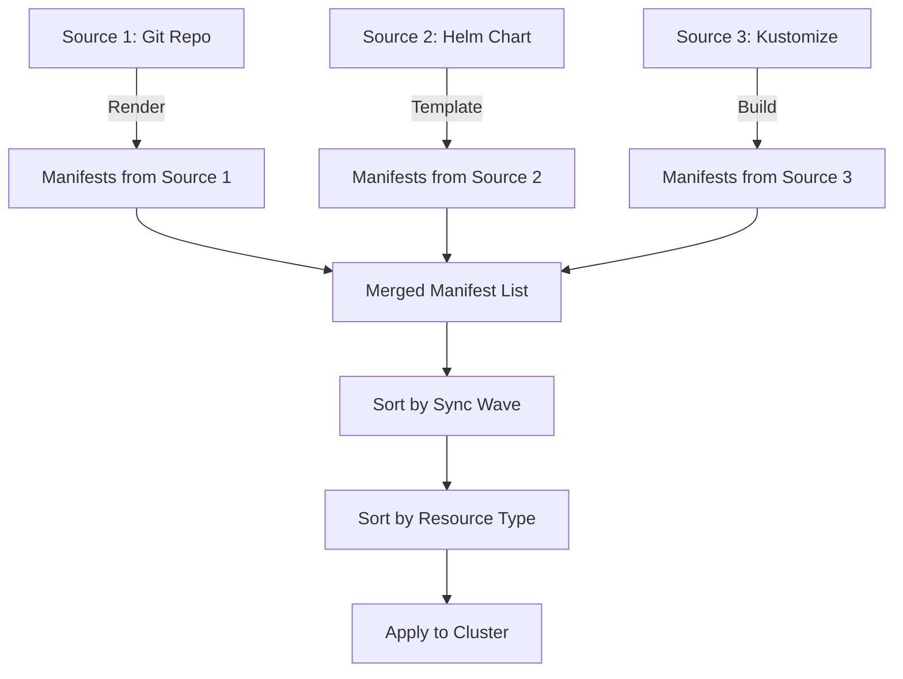
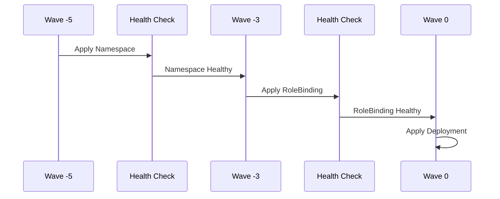

# How to Control Ordering Priority When Using Multiple Sources in ArgoCD

Author: [nawazdhandala](https://github.com/nawazdhandala)

Tags: ArgoCD, GitOps, Kubernetes, Multi-Source, Sync Waves

Description: Learn how ArgoCD determines resource ordering when using multiple sources, and how to use sync waves and resource hooks to control deployment sequence across sources.

---

When an ArgoCD application has multiple sources, a natural question arises: in what order are the resources from different sources applied? The answer involves understanding how ArgoCD merges manifests from all sources and then applies its standard ordering logic. Source array position alone does not determine apply order - sync waves, resource types, and hooks are what actually control the sequence.

## How ArgoCD Processes Multiple Sources

ArgoCD processes multi-source applications in two phases:

**Phase 1: Manifest Collection** - ArgoCD renders manifests from each source independently. Git repos are cloned, Helm charts are templated, Kustomize overlays are built, and Jsonnet is evaluated. Each source produces a list of Kubernetes objects.

**Phase 2: Merge and Apply** - All manifests from all sources are merged into a single flat list. ArgoCD then applies its standard sync logic to this merged list, using sync waves, resource type ordering, and hooks.



The key insight is that the position of a source in the `sources` array does not affect apply order. A Namespace from Source 3 can still be applied before a Deployment from Source 1 if it has a lower sync wave.

## Default Resource Type Ordering

Even without sync waves, ArgoCD applies resources in a specific order based on their kind. This built-in ordering ensures dependencies are created before dependents:

1. Namespaces
2. NetworkPolicy
3. ResourceQuota
4. LimitRange
5. PodSecurityPolicy
6. ServiceAccount
7. Secret
8. SecretList
9. ConfigMap
10. StorageClass
11. PersistentVolume
12. PersistentVolumeClaim
13. CustomResourceDefinition
14. ClusterRole
15. ClusterRoleBinding
16. Role
17. RoleBinding
18. Service
19. DaemonSet
20. Pod
21. ReplicaSet
22. Deployment
23. StatefulSet
24. Job
25. CronJob
26. Ingress
27. APIService

This ordering applies regardless of which source the resource came from.

## Using Sync Waves for Cross-Source Ordering

Sync waves give you explicit control over the apply order. Resources across all sources are sorted by wave number, with lower waves applied first:

```yaml
# Source 1 (platform-infra repo): namespace.yaml
apiVersion: v1
kind: Namespace
metadata:
  name: payments
  annotations:
    argocd.argoproj.io/sync-wave: "-5"
```

```yaml
# Source 1 (platform-infra repo): resourcequota.yaml
apiVersion: v1
kind: ResourceQuota
metadata:
  name: payments-quota
  namespace: payments
  annotations:
    argocd.argoproj.io/sync-wave: "-4"
```

```yaml
# Source 2 (security-policies repo): rbac.yaml
apiVersion: rbac.authorization.k8s.io/v1
kind: RoleBinding
metadata:
  name: payment-service-rb
  namespace: payments
  annotations:
    argocd.argoproj.io/sync-wave: "-3"
```

```yaml
# Source 3 (payment-service repo): configmap.yaml
apiVersion: v1
kind: ConfigMap
metadata:
  name: payment-config
  namespace: payments
  annotations:
    argocd.argoproj.io/sync-wave: "-1"
```

```yaml
# Source 3 (payment-service repo): deployment.yaml
apiVersion: apps/v1
kind: Deployment
metadata:
  name: payment-api
  namespace: payments
  # No sync-wave annotation = wave 0 (default)
spec:
  replicas: 3
  selector:
    matchLabels:
      app: payment-api
  template:
    metadata:
      labels:
        app: payment-api
    spec:
      containers:
        - name: payment-api
          image: my-registry/payment-api:v2.1.0
```

```yaml
# Source 4 (observability-config repo): servicemonitor.yaml
apiVersion: monitoring.coreos.com/v1
kind: ServiceMonitor
metadata:
  name: payment-api-monitor
  namespace: payments
  annotations:
    argocd.argoproj.io/sync-wave: "1"
```

The resulting apply order is:
1. Wave -5: Namespace (Source 1)
2. Wave -4: ResourceQuota (Source 1)
3. Wave -3: RoleBinding (Source 2)
4. Wave -1: ConfigMap (Source 3)
5. Wave 0: Deployment (Source 3)
6. Wave 1: ServiceMonitor (Source 4)

## Sync Wave Strategy for Multi-Source Applications

Establish a wave numbering convention across your organization:

```text
Wave Range    Purpose                          Typical Source
-10 to -6    Cluster-wide resources            Platform infra repo
-5 to -3     Namespace setup and security      Security policies repo
-2 to -1     Configuration (ConfigMaps, etc.)  App config repo
0            Application workloads             App deployment repo
1 to 3       Post-deployment (monitoring)      Observability repo
4 to 5       Integration tests, migrations     CI/CD repo
```

Document this convention and share it across teams so everyone assigns waves consistently.

## Using PreSync and PostSync Hooks Across Sources

Hooks from different sources work together within the same sync operation:

```yaml
# Source 1: Database migration as PreSync hook
apiVersion: batch/v1
kind: Job
metadata:
  name: db-migration
  namespace: payments
  annotations:
    argocd.argoproj.io/hook: PreSync
    argocd.argoproj.io/hook-delete-policy: HookSucceeded
spec:
  template:
    spec:
      containers:
        - name: migrate
          image: my-registry/payment-migrator:v2.1.0
          command: ["./migrate", "up"]
      restartPolicy: Never
```

```yaml
# Source 3: Smoke test as PostSync hook
apiVersion: batch/v1
kind: Job
metadata:
  name: smoke-test
  namespace: payments
  annotations:
    argocd.argoproj.io/hook: PostSync
    argocd.argoproj.io/hook-delete-policy: HookSucceeded
spec:
  template:
    spec:
      containers:
        - name: test
          image: my-registry/payment-smoke-test:latest
          command: ["./run-tests"]
      restartPolicy: Never
```

The sync phases execute in order: PreSync hooks from all sources, then Sync (main resources), then PostSync hooks from all sources.

## Within the Same Wave

Resources in the same sync wave are applied in the default resource type order (Namespaces before Services before Deployments). If two resources have the same kind and the same wave, the order between them is not guaranteed.

For resources that must be applied in a specific order within the same resource type, use different wave numbers:

```yaml
# Both are ConfigMaps, but this one must be first
apiVersion: v1
kind: ConfigMap
metadata:
  name: shared-config
  annotations:
    argocd.argoproj.io/sync-wave: "-2"

---
# This ConfigMap depends on the shared one being present
apiVersion: v1
kind: ConfigMap
metadata:
  name: app-config
  annotations:
    argocd.argoproj.io/sync-wave: "-1"
```

## Health Checks Between Waves

ArgoCD waits for resources in a wave to become healthy before moving to the next wave. This is important for cross-source ordering - if a Namespace from Source 1 (wave -5) is still being created, ArgoCD will not proceed to the RoleBinding from Source 2 (wave -3).

This built-in wait mechanism ensures dependencies are truly ready:



## Common Pitfalls

**Assuming source order matters** - The position in the `sources` array does not determine apply order. Only sync waves and resource types do.

**Not coordinating wave numbers across teams** - If each team uses waves independently, you can end up with conflicting wave assignments. Establish a shared convention.

**Forgetting that resources without sync waves default to wave 0** - If your infrastructure resources do not have wave annotations, they will be applied at the same time as application workloads.

**Too many fine-grained waves** - Using waves -100 through 100 makes the system hard to understand. Keep the range small (-10 to 10) and use meaningful groupings.

## Debugging Ordering Issues

```bash
# View the sync result to see what was applied in what order
argocd app get my-app --show-operation

# Check sync status of individual resources
argocd app resources my-app

# View the manifest with sync-wave annotations
argocd app manifests my-app | grep -B5 "sync-wave"

# Watch the sync in real-time
argocd app sync my-app --watch
```

For more on multi-source applications, see [using multiple sources in ArgoCD](https://oneuptime.com/blog/post/2026-02-26-argocd-multiple-sources-single-application/view) and [combining multiple Git repos](https://oneuptime.com/blog/post/2026-02-26-argocd-combine-multiple-git-repos-sources/view).
