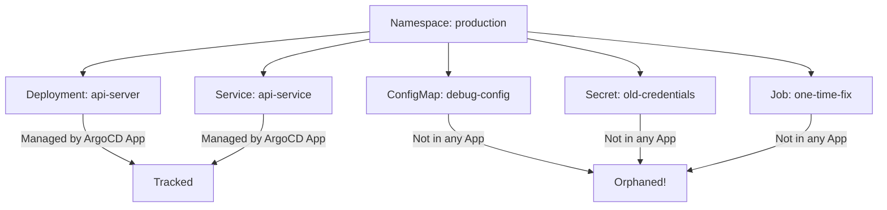
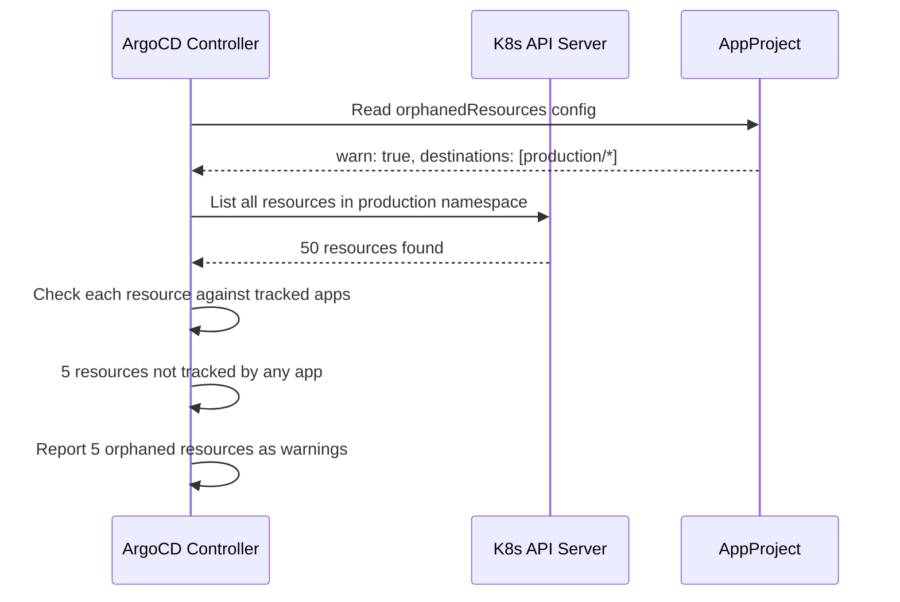

# How to Enable Orphaned Resource Monitoring in ArgoCD

Author: [nawazdhandala](https://github.com/nawazdhandala)

Tags: ArgoCD, GitOps, Kubernetes, Resource Management, Monitoring

Description: Learn how to enable and configure orphaned resource monitoring in ArgoCD projects to detect resources in your cluster that are not managed by any ArgoCD application.

---

Over time, Kubernetes clusters accumulate resources that nobody tracks. Someone creates a ConfigMap manually for debugging, a test Deployment gets left behind, or a deleted ArgoCD application's resources are not cleaned up. These orphaned resources consume cluster resources, can cause security issues, and make it harder to understand what is actually running in your cluster.

ArgoCD has a built-in orphaned resource monitoring feature that helps you find these untracked resources. This guide shows you how to enable it, configure it, and use it to keep your clusters clean.

## What Are Orphaned Resources?

In the ArgoCD context, an orphaned resource is any Kubernetes resource that exists in a namespace managed by an ArgoCD project but is not tracked by any ArgoCD application. It represents a gap between your GitOps-managed state and what actually exists in the cluster.



## Enabling Orphaned Resource Monitoring

Orphaned resource monitoring is configured at the ArgoCD Project level, not at the application level. This makes sense because projects define which namespaces and clusters are in scope.

### Basic Configuration

Edit your AppProject to enable orphaned resource monitoring:

```yaml
apiVersion: argoproj.io/v1alpha1
kind: AppProject
metadata:
  name: production
  namespace: argocd
spec:
  description: Production applications
  sourceRepos:
    - '*'
  destinations:
    - namespace: production
      server: https://kubernetes.default.svc
    - namespace: production-*
      server: https://kubernetes.default.svc
  # Enable orphaned resource monitoring
  orphanedResources:
    warn: true
```

The `warn: true` setting makes ArgoCD report orphaned resources as warnings in the UI and API without taking any automatic action.

### Using the CLI

```bash
# Enable orphaned resource monitoring on an existing project
argocd proj set production --orphaned-resources-warn
```

### Verifying the Configuration

```bash
# Check project configuration
argocd proj get production

# Look for orphaned resources section in the output
argocd proj get production -o yaml | grep -A5 orphanedResources
```

## How Orphaned Resource Monitoring Works

Once enabled, ArgoCD periodically scans the namespaces covered by the project's destination rules. For each resource found, it checks whether that resource is tracked by any ArgoCD application within the project. If not, the resource is reported as orphaned.



## Viewing Orphaned Resources

### In the ArgoCD UI

1. Navigate to Settings > Projects
2. Select your project
3. Look for the "Orphaned Resources" section
4. Orphaned resources are listed with their kind, name, and namespace

### Using the CLI

```bash
# List orphaned resources for a project
argocd proj get production -o json | \
  jq '.status.orphanedResources // empty'
```

### Using the API

```bash
# Query the ArgoCD API for orphaned resources
argocd admin proj orphaned-resources production
```

## Configuration Options

### Warning Only (Recommended Starting Point)

```yaml
orphanedResources:
  warn: true
```

This is the safest option. It shows orphaned resources in the UI and API but takes no automatic action.

### Excluding Specific Resource Types

Some resources are expected to exist without being managed by ArgoCD. Exclude them from orphan detection:

```yaml
orphanedResources:
  warn: true
  ignore:
    # Ignore Endpoints (auto-created by Services)
    - group: ""
      kind: Endpoints
    # Ignore EndpointSlices (auto-created by Services)
    - group: discovery.k8s.io
      kind: EndpointSlice
    # Ignore Events
    - group: ""
      kind: Event
    # Ignore ServiceAccounts (default one exists in every namespace)
    - group: ""
      kind: ServiceAccount
      name: default
    # Ignore Secrets created by ServiceAccounts
    - group: ""
      kind: Secret
      name: default-token-*
```

### Excluding by Name Pattern

You can use wildcards in the name field:

```yaml
orphanedResources:
  warn: true
  ignore:
    - group: ""
      kind: ConfigMap
      name: kube-root-ca.crt    # Auto-created in every namespace
    - group: ""
      kind: Secret
      name: "*-token-*"         # ServiceAccount tokens
```

## Project-Level vs Cluster-Level Monitoring

### Single-Namespace Project

```yaml
apiVersion: argoproj.io/v1alpha1
kind: AppProject
metadata:
  name: team-alpha
  namespace: argocd
spec:
  destinations:
    - namespace: team-alpha
      server: https://kubernetes.default.svc
  orphanedResources:
    warn: true
    ignore:
      - group: ""
        kind: Endpoints
      - group: discovery.k8s.io
        kind: EndpointSlice
```

### Multi-Namespace Project

```yaml
apiVersion: argoproj.io/v1alpha1
kind: AppProject
metadata:
  name: platform
  namespace: argocd
spec:
  destinations:
    - namespace: platform-*
      server: https://kubernetes.default.svc
    - namespace: monitoring
      server: https://kubernetes.default.svc
    - namespace: logging
      server: https://kubernetes.default.svc
  orphanedResources:
    warn: true
    ignore:
      - group: ""
        kind: Endpoints
      - group: discovery.k8s.io
        kind: EndpointSlice
      - group: ""
        kind: Event
```

### Multi-Cluster Project

```yaml
apiVersion: argoproj.io/v1alpha1
kind: AppProject
metadata:
  name: global-infra
  namespace: argocd
spec:
  destinations:
    - namespace: infrastructure
      server: https://cluster-us-east.example.com
    - namespace: infrastructure
      server: https://cluster-eu-west.example.com
  orphanedResources:
    warn: true
```

## Integrating with Notifications

You can set up ArgoCD notifications to alert on orphaned resources:

```yaml
apiVersion: v1
kind: ConfigMap
metadata:
  name: argocd-notifications-cm
  namespace: argocd
data:
  trigger.on-orphaned-resource: |
    - description: Application has orphaned resources
      when: app.status.operationState.phase in ['Succeeded'] and app.status.orphanedResources | length > 0
      send: [slack-orphaned-warning]
  template.slack-orphaned-warning: |
    message: |
      Application {{.app.metadata.name}} has orphaned resources in project {{.app.spec.project}}.
      Please review and clean up untracked resources.
```

## Common Resources That Trigger False Orphan Warnings

These resources commonly appear as orphaned but are expected:

| Resource | Why It Exists | Action |
|----------|--------------|--------|
| `Endpoints` | Auto-created by Services | Ignore |
| `EndpointSlice` | Auto-created by Services | Ignore |
| `Event` | Kubernetes system events | Ignore |
| `default` ServiceAccount | Auto-created in every namespace | Ignore |
| `kube-root-ca.crt` ConfigMap | Auto-created for CA distribution | Ignore |
| ServiceAccount token Secrets | Auto-created by Kubernetes | Ignore |
| ReplicaSets | Managed by Deployments | Usually tracked |

## Monitoring Orphaned Resources with Metrics

ArgoCD exposes Prometheus metrics for orphaned resources:

```promql
# Count of orphaned resources per project
argocd_app_orphaned_resources_count{project="production"}
```

Create a Grafana alert for clusters accumulating too many orphaned resources:

```yaml
# Example Prometheus alert rule
groups:
  - name: argocd-orphaned
    rules:
      - alert: HighOrphanedResourceCount
        expr: argocd_app_orphaned_resources_count > 20
        for: 1h
        labels:
          severity: warning
        annotations:
          summary: "Project {{ $labels.project }} has {{ $value }} orphaned resources"
```

## Best Practices

1. **Start with warn: true** - Never enable automatic deletion of orphaned resources without understanding what is orphaned first
2. **Build a comprehensive ignore list** - Auto-created Kubernetes resources should always be ignored
3. **Review orphans weekly** - Set up a regular cadence to review and clean up orphaned resources
4. **Enable on all projects** - Orphaned resource monitoring should be a standard part of every project configuration
5. **Monitor metrics** - Track orphaned resource counts over time to catch trends

For finding and cleaning up orphaned resources, see [How to Find Orphaned Resources in Your Cluster](https://oneuptime.com/blog/post/2026-02-26-argocd-find-orphaned-resources/view) and [How to Clean Up Orphaned Resources Safely](https://oneuptime.com/blog/post/2026-02-26-argocd-clean-up-orphaned-resources/view).
