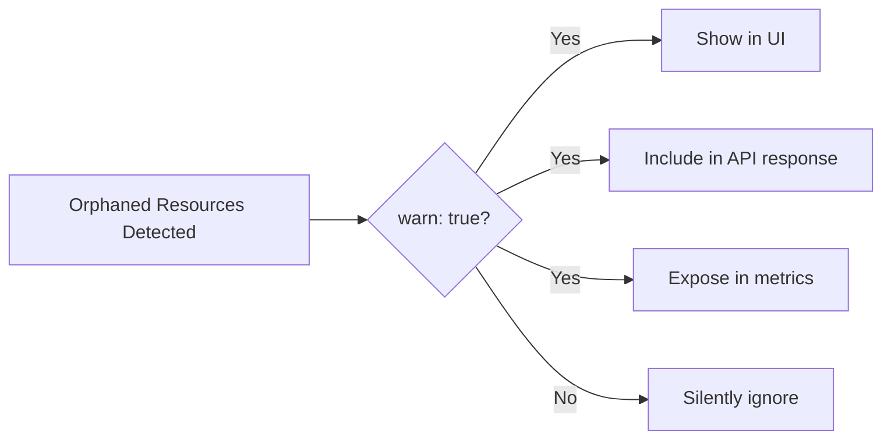
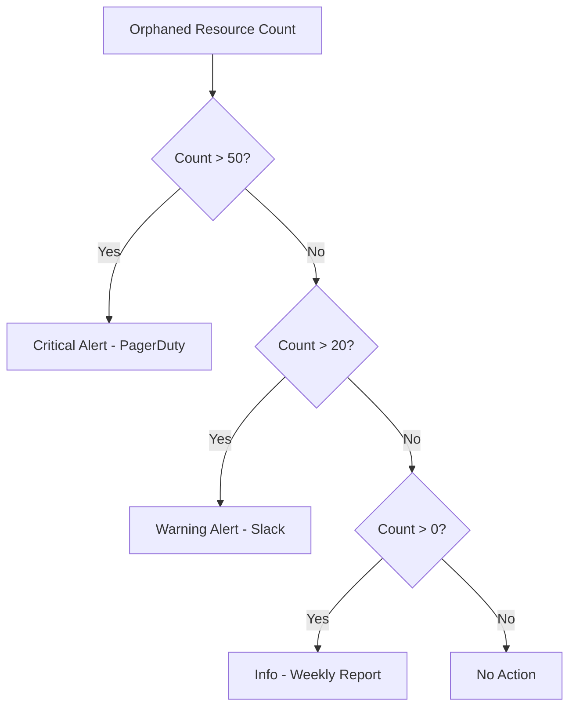

# How to Configure Orphaned Resource Warnings in ArgoCD

Author: [nawazdhandala](https://github.com/nawazdhandala)

Tags: ArgoCD, GitOps, Kubernetes, Resource Management, Alerts

Description: Learn how to configure and customize orphaned resource warnings in ArgoCD projects including notification setup, severity tuning, and integration with monitoring tools.

---

ArgoCD orphaned resource monitoring detects resources that exist in your cluster but are not tracked by any ArgoCD application. By default, it just reports their existence. But to make this feature actionable, you need to configure proper warnings, notifications, and alerting so your team actually sees and responds to orphaned resources.

This guide walks you through configuring orphaned resource warnings at various levels, from basic UI warnings to full integration with notification systems.

## Basic Warning Configuration

The simplest orphaned resource warning is the `warn: true` flag on an AppProject:

```yaml
apiVersion: argoproj.io/v1alpha1
kind: AppProject
metadata:
  name: production
  namespace: argocd
spec:
  destinations:
    - namespace: production
      server: https://kubernetes.default.svc
  orphanedResources:
    warn: true
```

When `warn: true` is set, ArgoCD:
1. Scans the namespaces defined in the project's destinations
2. Identifies resources not tracked by any application in the project
3. Reports them in the project status
4. Shows a warning badge in the ArgoCD UI



## Understanding Warning Behavior

### What Triggers a Warning

A resource triggers an orphaned resource warning when:
- It exists in a namespace covered by the project's destinations
- It is not part of any ArgoCD application within the project
- It is not in the project's ignore list

### What Does Not Trigger a Warning

- Resources in namespaces not covered by any project destination
- Resources explicitly listed in the `ignore` section
- Resources in namespaces managed by other projects
- Cluster-scoped resources (orphaned resource monitoring only covers namespaced resources)

## Configuring Ignore Lists

A well-tuned ignore list is essential for meaningful warnings. Without it, you will be flooded with false positives from auto-generated Kubernetes resources.

### Standard Ignore List

This covers the most common auto-generated resources:

```yaml
orphanedResources:
  warn: true
  ignore:
    # Auto-created by Services
    - group: ""
      kind: Endpoints
    - group: discovery.k8s.io
      kind: EndpointSlice

    # Kubernetes system resources
    - group: ""
      kind: Event
    - group: ""
      kind: ConfigMap
      name: kube-root-ca.crt

    # Default ServiceAccount in every namespace
    - group: ""
      kind: ServiceAccount
      name: default

    # ReplicaSets managed by Deployments (tracked through their parent)
    - group: apps
      kind: ReplicaSet

    # Pods managed by ReplicaSets/Jobs/DaemonSets
    - group: ""
      kind: Pod

    # ControllerRevisions managed by StatefulSets/DaemonSets
    - group: apps
      kind: ControllerRevision
```

### Extended Ignore List for Service Mesh Environments

If you run Istio or Linkerd, their control plane generates additional resources:

```yaml
orphanedResources:
  warn: true
  ignore:
    # ... standard ignores above ...

    # Istio auto-generated resources
    - group: networking.istio.io
      kind: DestinationRule
      name: "*.local"
    - group: security.istio.io
      kind: PeerAuthentication

    # Cert-manager auto-generated resources
    - group: cert-manager.io
      kind: CertificateRequest
    - group: acme.cert-manager.io
      kind: Order
    - group: acme.cert-manager.io
      kind: Challenge
```

### Team-Specific Ignore Patterns

Different teams may have different needs:

```yaml
# Team with monitoring stack
orphanedResources:
  warn: true
  ignore:
    - group: monitoring.coreos.com
      kind: PrometheusRule
      name: "auto-*"        # Auto-generated alert rules
    - group: monitoring.coreos.com
      kind: ServiceMonitor
      name: "kube-*"        # Default kube monitors
```

## Setting Up Notifications for Orphaned Resources

### Slack Notifications

Configure ArgoCD Notifications to send alerts when orphaned resources are detected:

```yaml
apiVersion: v1
kind: ConfigMap
metadata:
  name: argocd-notifications-cm
  namespace: argocd
data:
  service.slack: |
    token: $slack-token

  template.orphaned-resources-warning: |
    slack:
      attachments: |
        [{
          "color": "#E8B339",
          "title": "Orphaned Resources Detected",
          "text": "Project **{{.app.spec.project}}** has orphaned resources in the cluster.",
          "fields": [{
            "title": "Application",
            "value": "{{.app.metadata.name}}",
            "short": true
          },{
            "title": "Project",
            "value": "{{.app.spec.project}}",
            "short": true
          }]
        }]

  trigger.on-orphaned-resources: |
    - description: Notify when orphaned resources exist
      send: [orphaned-resources-warning]
      when: app.status.orphanedResources | length > 0
```

### Email Notifications

```yaml
apiVersion: v1
kind: ConfigMap
metadata:
  name: argocd-notifications-cm
  namespace: argocd
data:
  service.email: |
    host: smtp.example.com
    port: 587
    username: $email-username
    password: $email-password
    from: argocd@example.com

  template.orphaned-email: |
    email:
      subject: "ArgoCD: Orphaned resources detected in {{ .app.spec.project }}"
    message: |
      Orphaned resources have been detected in project {{ .app.spec.project }}.
      Please review the ArgoCD UI for details and clean up untracked resources.
```

### Webhook Notifications

Send orphaned resource data to a custom webhook for processing:

```yaml
apiVersion: v1
kind: ConfigMap
metadata:
  name: argocd-notifications-cm
  namespace: argocd
data:
  service.webhook.orphan-handler: |
    url: https://hooks.example.com/argocd-orphans
    headers:
      - name: Content-Type
        value: application/json
      - name: Authorization
        value: Bearer $webhook-token

  template.orphaned-webhook: |
    webhook:
      orphan-handler:
        method: POST
        body: |
          {
            "project": "{{.app.spec.project}}",
            "app": "{{.app.metadata.name}}",
            "timestamp": "{{.app.status.operationState.finishedAt}}"
          }
```

## Prometheus Metrics and Alerting

### Available Metrics

ArgoCD exposes orphaned resource counts as Prometheus metrics:

```promql
# Total orphaned resources per project
argocd_app_orphaned_resources_count{project="production"}
```

### Prometheus Alert Rules

```yaml
apiVersion: monitoring.coreos.com/v1
kind: PrometheusRule
metadata:
  name: argocd-orphan-alerts
  namespace: monitoring
spec:
  groups:
    - name: argocd-orphaned-resources
      rules:
        # Warning when orphaned resources exceed threshold
        - alert: ArgocdOrphanedResourcesHigh
          expr: argocd_app_orphaned_resources_count > 10
          for: 24h
          labels:
            severity: warning
          annotations:
            summary: "High number of orphaned resources in project {{ $labels.project }}"
            description: "{{ $value }} orphaned resources detected in project {{ $labels.project }} for over 24 hours."

        # Critical when orphaned resources are growing
        - alert: ArgocdOrphanedResourcesGrowing
          expr: increase(argocd_app_orphaned_resources_count[7d]) > 20
          for: 1h
          labels:
            severity: warning
          annotations:
            summary: "Orphaned resources growing rapidly in project {{ $labels.project }}"
            description: "{{ $value }} new orphaned resources added in the last 7 days."
```

### Grafana Dashboard Panel

Create a panel showing orphaned resource trends:

```json
{
  "title": "Orphaned Resources by Project",
  "type": "timeseries",
  "targets": [
    {
      "expr": "argocd_app_orphaned_resources_count",
      "legendFormat": "{{ project }}"
    }
  ]
}
```

## Warning Severity Levels

ArgoCD does not have built-in severity levels for orphaned resources, but you can implement them through your notification rules:



Implement this with Prometheus alerts at different thresholds:

```yaml
rules:
  - alert: OrphanedResourcesCritical
    expr: argocd_app_orphaned_resources_count > 50
    for: 1h
    labels:
      severity: critical

  - alert: OrphanedResourcesWarning
    expr: argocd_app_orphaned_resources_count > 20
    for: 6h
    labels:
      severity: warning

  - alert: OrphanedResourcesInfo
    expr: argocd_app_orphaned_resources_count > 0
    for: 168h  # 7 days
    labels:
      severity: info
```

## Per-Project Warning Configuration

Different projects can have different warning thresholds based on their importance:

```yaml
# Production - strict monitoring
apiVersion: argoproj.io/v1alpha1
kind: AppProject
metadata:
  name: production
spec:
  orphanedResources:
    warn: true
    ignore:
      - group: ""
        kind: Endpoints
      - group: discovery.k8s.io
        kind: EndpointSlice
---
# Staging - relaxed monitoring
apiVersion: argoproj.io/v1alpha1
kind: AppProject
metadata:
  name: staging
spec:
  orphanedResources:
    warn: true
    ignore:
      - group: ""
        kind: Endpoints
      - group: discovery.k8s.io
        kind: EndpointSlice
      - group: ""
        kind: ConfigMap      # Allow temp ConfigMaps in staging
      - group: ""
        kind: Secret         # Allow temp Secrets in staging
---
# Development - minimal monitoring
apiVersion: argoproj.io/v1alpha1
kind: AppProject
metadata:
  name: development
spec:
  orphanedResources:
    warn: true
    ignore:
      - group: "*"
        kind: "*"
        name: "dev-*"       # Ignore anything with dev- prefix
```

## Debugging Warning Issues

If warnings are not appearing when expected:

```bash
# Check if orphaned resource monitoring is enabled
argocd proj get production -o yaml | grep -A10 orphanedResources

# Verify the project covers the namespace
argocd proj get production -o yaml | grep -A5 destinations

# Check if the resource is in the ignore list
argocd proj get production -o json | jq '.spec.orphanedResources.ignore'

# Force a refresh of orphaned resource detection
argocd app get <any-app-in-project> --hard-refresh
```

## Best Practices

1. **Start with a comprehensive ignore list** - Reduce false positives before adding notifications
2. **Use tiered alerting** - Different severity for different orphan counts
3. **Set up weekly reports** - Even low counts should be reviewed periodically
4. **Include orphan cleanup in your sprint process** - Treat it like tech debt
5. **Track trends** - Growing orphan counts indicate a process problem

For a complete guide to orphaned resource management, see [How to Enable Orphaned Resource Monitoring](https://oneuptime.com/blog/post/2026-02-26-argocd-orphaned-resource-monitoring/view) and [How to Exclude Resources from Orphan Detection](https://oneuptime.com/blog/post/2026-02-26-argocd-exclude-orphan-detection/view).
