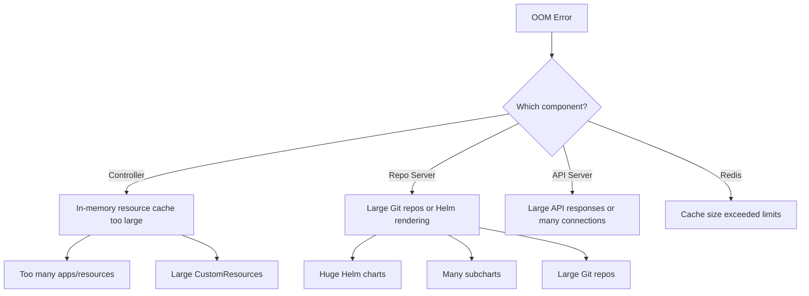

# How to Handle ArgoCD Out-of-Memory Errors

Author: [nawazdhandala](https://github.com/nawazdhandala)

Tags: ArgoCD, GitOps, Kubernetes, Troubleshooting, Memory

Description: Learn how to diagnose and fix ArgoCD out-of-memory (OOM) errors, including identifying memory-hungry applications, tuning garbage collection, and right-sizing resource limits.

---

OOMKilled restarts are one of the most disruptive issues in ArgoCD. When the application controller or repo server runs out of memory, Kubernetes kills the pod. The controller then restarts, loses its in-memory state, and has to rebuild everything from scratch - which itself consumes significant memory. This creates a cycle where the component repeatedly OOMs during startup. This guide helps you break that cycle.

## Identifying OOM Issues

First, confirm you are actually seeing OOM kills:

```bash
# Check for OOMKilled events
kubectl get events -n argocd --field-selector reason=OOMKilling --sort-by='.lastTimestamp'

# Check pod restart counts and reasons
kubectl get pods -n argocd -o json | \
  jq '.items[] | select(.status.containerStatuses[].restartCount > 0) |
    {name: .metadata.name,
     restarts: .status.containerStatuses[].restartCount,
     lastState: .status.containerStatuses[].lastState}'

# Check if any container was OOMKilled
kubectl get pods -n argocd -o json | \
  jq '.items[].status.containerStatuses[] |
    select(.lastState.terminated.reason == "OOMKilled") |
    {container: .name, exitCode: .lastState.terminated.exitCode}'
```

You will also see these patterns in the logs before an OOM:

```bash
# Check controller logs for memory warnings
kubectl logs statefulset/argocd-application-controller -n argocd --previous | \
  grep -i "memory\|heap\|gc\|oom"
```

## Which Component is OOMing?

Each component has different memory characteristics:



## Fix 1: Increase Memory Limits

The most direct fix is giving the component more memory:

```yaml
# For the application controller (most common OOM source)
controller:
  resources:
    requests:
      memory: 2Gi
    limits:
      memory: 8Gi

# For the repo server
repoServer:
  resources:
    requests:
      memory: 1Gi
    limits:
      memory: 4Gi

# For the API server
server:
  resources:
    requests:
      memory: 512Mi
    limits:
      memory: 2Gi
```

Apply with kubectl:

```bash
# Quick fix for controller OOM
kubectl patch statefulset argocd-application-controller -n argocd \
  --type merge -p '{
    "spec": {
      "template": {
        "spec": {
          "containers": [{
            "name": "argocd-application-controller",
            "resources": {
              "requests": {"memory": "2Gi"},
              "limits": {"memory": "8Gi"}
            }
          }]
        }
      }
    }
  }'
```

## Fix 2: Tune Go Garbage Collection

ArgoCD components are written in Go. Tuning the Go garbage collector can significantly reduce memory usage:

```yaml
controller:
  env:
    # Set GOGC to trigger garbage collection more frequently
    # Default is 100 (collect when heap doubles)
    # Lower values = more frequent GC = lower memory but more CPU
    - name: GOGC
      value: "50"
    # Set a soft memory limit for the Go runtime
    - name: GOMEMLIMIT
      value: "6GiB"  # Set to ~75% of your memory limit
```

For the repo server:

```yaml
repoServer:
  env:
    - name: GOGC
      value: "50"
    - name: GOMEMLIMIT
      value: "3GiB"
```

GOMEMLIMIT (available in Go 1.19+, which ArgoCD uses) tells the Go runtime to try harder to keep memory usage below the specified limit. It does not guarantee it, but it helps the GC make better decisions.

## Fix 3: Reduce Controller Memory Usage

The controller keeps the entire resource tree for every application in memory. Reduce what it tracks:

### Exclude High-Volume Resources

```yaml
apiVersion: v1
kind: ConfigMap
metadata:
  name: argocd-cm
  namespace: argocd
data:
  resource.exclusions: |
    - apiGroups:
        - "events.k8s.io"
      kinds:
        - "Event"
      clusters:
        - "*"
    - apiGroups:
        - "metrics.k8s.io"
      kinds:
        - "*"
      clusters:
        - "*"
    - apiGroups:
        - "cilium.io"
      kinds:
        - "CiliumIdentity"
        - "CiliumEndpoint"
      clusters:
        - "*"
    - apiGroups:
        - "kyverno.io"
      kinds:
        - "AdmissionReport"
        - "ClusterAdmissionReport"
        - "BackgroundScanReport"
        - "ClusterBackgroundScanReport"
      clusters:
        - "*"
```

### Use Controller Sharding

Distribute the memory load across multiple controller instances:

```bash
# Scale from 1 to 3 shards
kubectl scale statefulset argocd-application-controller -n argocd --replicas=3

kubectl set env statefulset/argocd-application-controller -n argocd \
  ARGOCD_CONTROLLER_REPLICAS=3
```

Each shard only manages a subset of clusters, so each instance uses less memory.

## Fix 4: Reduce Repo Server Memory Usage

The repo server OOMs when rendering large Helm charts or cloning large repositories.

### Enable Shallow Clones

```yaml
apiVersion: v1
kind: ConfigMap
metadata:
  name: argocd-cmd-params-cm
  namespace: argocd
data:
  reposerver.git.shallow.clone: "true"
```

### Limit Concurrent Manifest Generation

```yaml
data:
  reposerver.parallelism.limit: "5"
```

Each concurrent manifest generation holds a cloned repository and rendered manifests in memory. Limiting parallelism caps the total memory usage.

### Identify the Offending Application

Find which application causes the OOM:

```bash
# List applications by resource count
argocd app list -o json | \
  jq 'sort_by(.status.resources | length) | reverse | .[:10] |
    .[] | {name: .metadata.name, resources: (.status.resources | length)}'

# Check which repositories are large
kubectl exec -n argocd deployment/argocd-repo-server -- \
  du -sh /tmp/_argocd-repo/* 2>/dev/null | sort -rh | head -10
```

If a specific application has thousands of resources, consider splitting it into smaller applications.

## Fix 5: Redis Memory Management

If Redis is OOMing, configure memory limits:

```yaml
redis:
  resources:
    limits:
      memory: 1Gi
  config:
    maxmemory: 768mb  # 75% of limit
    maxmemory-policy: allkeys-lru  # Evict least recently used keys
```

For Redis HA:

```yaml
redis-ha:
  redis:
    config:
      maxmemory: 768mb
      maxmemory-policy: allkeys-lru
      # Disable persistence to save memory
      save: ""
      appendonly: "no"
```

## Fix 6: Handle Startup OOM Loops

If the controller OOMs during startup because rebuilding state exceeds memory:

```bash
# Temporarily increase limits significantly for startup
kubectl patch statefulset argocd-application-controller -n argocd \
  --type merge -p '{
    "spec": {
      "template": {
        "spec": {
          "containers": [{
            "name": "argocd-application-controller",
            "resources": {
              "limits": {"memory": "16Gi"}
            }
          }]
        }
      }
    }
  }'

# Wait for the controller to fully start and stabilize
kubectl wait --for=condition=ready pod \
  -l app.kubernetes.io/name=argocd-application-controller \
  -n argocd --timeout=600s

# Check the actual memory usage after stabilization
kubectl top pod -n argocd -l app.kubernetes.io/name=argocd-application-controller

# Set limits to 2x the stabilized usage
```

## Monitoring Memory Usage

Set up proactive monitoring to prevent OOMs:

```yaml
groups:
  - name: argocd-memory
    rules:
      - alert: ArgocdControllerHighMemory
        expr: |
          container_memory_working_set_bytes{
            namespace="argocd",
            container="argocd-application-controller"
          }
          /
          container_spec_memory_limit_bytes{
            namespace="argocd",
            container="argocd-application-controller"
          }
          > 0.8
        for: 10m
        labels:
          severity: warning
        annotations:
          summary: "ArgoCD controller memory usage above 80% of limit"
          description: "Current usage: {{ $value | humanizePercentage }}. Consider increasing memory limits or adding controller shards."

      - alert: ArgocdRepoServerHighMemory
        expr: |
          container_memory_working_set_bytes{
            namespace="argocd",
            container="argocd-repo-server"
          }
          /
          container_spec_memory_limit_bytes{
            namespace="argocd",
            container="argocd-repo-server"
          }
          > 0.8
        for: 10m
        labels:
          severity: warning
        annotations:
          summary: "ArgoCD repo server memory usage above 80%"

      - alert: ArgocdPodOOMKilled
        expr: |
          kube_pod_container_status_last_terminated_reason{
            namespace="argocd",
            reason="OOMKilled"
          } == 1
        labels:
          severity: critical
        annotations:
          summary: "ArgoCD pod {{ $labels.pod }} was OOMKilled"
```

## Quick Reference: Memory Sizing

| Scenario | Controller Memory | Repo Server Memory |
|---|---|---|
| 50 apps, small resources | 1Gi | 512Mi |
| 200 apps, medium resources | 4Gi | 2Gi |
| 500 apps, mixed resources | 8Gi | 4Gi |
| 1000+ apps | 12Gi (sharded) | 4Gi (scaled) |

OOM errors in ArgoCD are always fixable. The priority is: increase limits first to stop the bleeding, then optimize to reduce actual usage. Monitor memory trends so you can scale proactively before OOMs happen. For comprehensive monitoring, see our guide on [monitoring ArgoCD component health](https://oneuptime.com/blog/post/2026-02-26-argocd-monitor-component-health/view).
