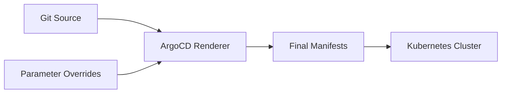

# How to Override Application Parameters in ArgoCD

Author: [nawazdhandala](https://github.com/nawazdhandala)

Tags: ArgoCD, GitOps, Kubernetes, Configuration Management, DevOps

Description: Learn how to override application parameters in ArgoCD for Helm, Kustomize, and plain YAML applications, including when to use overrides vs modifying the source repository.

---

Parameter overrides in ArgoCD let you change application configuration without modifying the source repository. They are applied at the ArgoCD Application level and override values that would normally come from your Helm values files, Kustomize overlays, or other configuration sources.

This guide explains when and how to use parameter overrides, and when you should avoid them in favor of Git-based changes.

## What Are Parameter Overrides

When ArgoCD renders your application manifests, it takes input from your Git repository (Helm charts, Kustomize bases, plain YAML) and produces Kubernetes resources. Parameter overrides let you inject or change values during this rendering process without changing what is in Git.

Think of it this way:



The overrides are stored in the ArgoCD Application resource, not in your Git repository.

## Override Methods by Source Type

### Helm Parameter Overrides

For Helm-based applications, you can override any value that the chart accepts:

```yaml
apiVersion: argoproj.io/v1alpha1
kind: Application
metadata:
  name: backend-api
  namespace: argocd
spec:
  project: default
  source:
    repoURL: https://charts.example.com
    chart: backend-api
    targetRevision: 2.5.0
    helm:
      # Override individual parameters
      parameters:
        - name: replicaCount
          value: "5"
        - name: image.tag
          value: "v2.1.0"
        - name: resources.limits.memory
          value: "1Gi"

      # Or override with a values block
      values: |
        replicaCount: 5
        image:
          tag: v2.1.0
        resources:
          limits:
            memory: 1Gi
  destination:
    server: https://kubernetes.default.svc
    namespace: backend-api
```

The `parameters` field overrides individual dot-notation values. The `values` field provides a YAML block that merges with the chart's default values.

### Kustomize Parameter Overrides

For Kustomize applications, overrides apply to images and common metadata:

```yaml
apiVersion: argoproj.io/v1alpha1
kind: Application
metadata:
  name: frontend
  namespace: argocd
spec:
  project: default
  source:
    repoURL: https://github.com/myorg/config-repo.git
    targetRevision: main
    path: apps/frontend/overlays/production
    kustomize:
      # Override images
      images:
        - myorg/frontend:v3.0.0

      # Override name prefix
      namePrefix: prod-

      # Override name suffix
      nameSuffix: -v3

      # Override common labels
      commonLabels:
        app.kubernetes.io/version: v3.0.0

      # Override common annotations
      commonAnnotations:
        deployed-by: argocd
  destination:
    server: https://kubernetes.default.svc
    namespace: frontend
```

### Plain YAML (Directory) Overrides

For plain YAML directory sources, ArgoCD does not support parameter overrides directly. If you need overrides, consider switching to Kustomize or Helm.

## Using the CLI for Overrides

You can set parameter overrides with the ArgoCD CLI:

```bash
# Set a Helm parameter
argocd app set backend-api \
  --helm-set replicaCount=5

# Set multiple Helm parameters
argocd app set backend-api \
  --helm-set replicaCount=5 \
  --helm-set image.tag=v2.1.0 \
  --helm-set resources.limits.memory=1Gi

# Set Helm values from a string
argocd app set backend-api \
  --values '
replicaCount: 5
image:
  tag: v2.1.0
'

# Set Kustomize image override
argocd app set frontend \
  --kustomize-image myorg/frontend:v3.0.0

# Set Kustomize name prefix
argocd app set frontend \
  --kustomize-name-prefix prod-
```

## Using the UI for Overrides

In the ArgoCD web UI:

1. Navigate to your Application
2. Click "App Details" in the top bar
3. Click the "Parameters" tab
4. Click "Edit" to modify parameters
5. Update the values and save

The UI provides a form-based interface for Helm parameters, showing all available values from the chart with their current and default values.

## Override Priority

When multiple sources of values exist, ArgoCD follows a specific priority order for Helm applications:

1. Default values from `values.yaml` in the chart (lowest priority)
2. Values from additional values files specified in `valueFiles`
3. Values from the `values` block in the Application spec
4. Individual `parameters` (highest priority)

```yaml
spec:
  source:
    helm:
      # Priority 2: values files
      valueFiles:
        - values.yaml
        - values-production.yaml

      # Priority 3: inline values block
      values: |
        replicaCount: 3

      # Priority 4: individual parameters (wins)
      parameters:
        - name: replicaCount
          value: "5"    # This wins over the values block
```

## When to Use Parameter Overrides

Parameter overrides are useful in specific scenarios:

**Emergency hotfixes.** When you need to change a value immediately without waiting for a Git PR to be reviewed and merged:

```bash
# Scale up immediately for incident response
argocd app set backend-api --helm-set replicaCount=10
```

**Image tag updates from CI/CD.** Your CI pipeline can update the image tag after building a new container:

```bash
# CI pipeline updates the image tag
argocd app set backend-api \
  --helm-set image.tag=$CI_COMMIT_SHA
```

**Environment-specific testing.** Temporarily change a value for testing without polluting Git history:

```bash
# Test with a new feature flag
argocd app set backend-api \
  --helm-set env.FEATURE_NEW_UI=true
```

## When to Avoid Parameter Overrides

For most cases, you should make changes in Git instead of using overrides. Here is why:

**Overrides are not in Git.** They break the GitOps principle that Git is the single source of truth. If you lose the ArgoCD installation, you lose the overrides.

**Overrides are hard to track.** There is no PR review, no commit history, and no easy way to diff changes over time.

**Overrides can drift.** If someone updates a value in Git and another person has an override, the override silently wins. This causes confusion.

**Overrides bypass review.** Anyone with ArgoCD write access can change production parameters without peer review.

## Making Overrides Visible

If you use overrides, make them visible. ArgoCD shows a warning when an application has parameter overrides that differ from the Git source. You can also query overrides via the API:

```bash
# Show current overrides
argocd app get backend-api -o json | \
  jq '.spec.source.helm.parameters'

# List all apps with overrides
argocd app list -o json | \
  jq '.[] | select(.spec.source.helm.parameters != null) | .metadata.name'
```

## Converting Overrides to Git

When an emergency override has served its purpose, commit the change to Git and remove the override:

```bash
# 1. Update the values file in Git
# Edit values-production.yaml with the new replicaCount

# 2. Commit and push
git add values-production.yaml
git commit -m "Set replicaCount to 5 for production backend-api"
git push

# 3. Remove the override
argocd app unset backend-api --helm-set replicaCount

# 4. Sync to verify
argocd app sync backend-api
```

## Force Overrides in Declarative Applications

When managing Applications declaratively (Application YAML in Git), the parameters in the Application spec act as overrides:

```yaml
apiVersion: argoproj.io/v1alpha1
kind: Application
metadata:
  name: backend-api-production
spec:
  source:
    repoURL: https://charts.example.com
    chart: backend-api
    targetRevision: 2.5.0
    helm:
      parameters:
        - name: replicaCount
          value: "5"
        - name: image.tag
          value: "v2.1.0"
```

In this case, the overrides are in Git (the Application manifest repo), which maintains the GitOps principle. This is the preferred pattern for permanent overrides.

## Summary

Parameter overrides in ArgoCD are a powerful tool for changing application behavior without modifying the source repository. Use them for emergency changes, CI-driven image updates, and temporary testing. For permanent changes, always commit to Git and remove the override. When you must use overrides, make them visible and have a process for converting them to Git-based changes.
