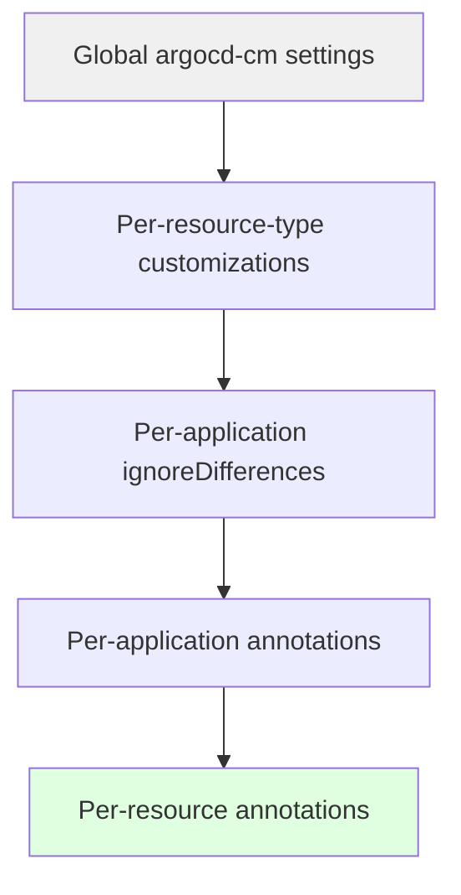

# How to Override Default Compare Behavior in ArgoCD

Author: [nawazdhandala](https://github.com/nawazdhandala)

Tags: ArgoCD, GitOps, Kubernetes, Configuration Management

Description: Learn how to override ArgoCD default resource comparison behavior at the system, project, and application level to handle edge cases in diff calculation and sync determination.

---

ArgoCD ships with a sensible default comparison strategy that works well for standard Kubernetes resources. But real-world clusters have custom operators, mutating webhooks, and infrastructure patterns that break these defaults. When the built-in comparison logic does not match your needs, you need to override it. This guide covers every level of override available - from global system settings to per-resource customizations.

## How ArgoCD Default Comparison Works

Before overriding anything, it helps to understand the default behavior. ArgoCD compares resources by:

1. Fetching the desired state from your Git repository
2. Fetching the live state from the Kubernetes API server
3. Normalizing both states (removing known server-side fields)
4. Computing a structured diff between the two
5. Marking resources as Synced or OutOfSync based on whether differences exist

The default normalization removes common server-side fields like `metadata.resourceVersion`, `metadata.uid`, `metadata.creationTimestamp`, and the entire `status` block for built-in resources. Everything else is compared field by field.

## Override Level 1: Global System Settings

The broadest override applies to all resources across all applications. Configure these in the `argocd-cm` ConfigMap:

```yaml
apiVersion: v1
kind: ConfigMap
metadata:
  name: argocd-cm
  namespace: argocd
data:
  # Enable server-side diff for all applications
  controller.diff.server.side: "true"

  # Ignore aggregated ClusterRole rules
  resource.compareoptions: |
    ignoreAggregatedRoles: true

  # Ignore specific fields on ALL resource types
  resource.customizations.ignoreDifferences.all: |
    managedFieldsManagers:
      - kube-controller-manager
      - kube-scheduler
    jsonPointers:
      - /metadata/annotations/kubectl.kubernetes.io~1last-applied-configuration
```

### Server-Side Diff Mode

Server-side diff delegates the comparison to the Kubernetes API server using dry-run apply. This is the most accurate comparison method because the API server understands field ownership, defaulting, and conversion natively:

```yaml
# Enable globally
data:
  controller.diff.server.side: "true"

  # Optional: also include mutation webhook effects in the comparison
  controller.diff.server.side.mutation: "true"
```

With mutation enabled, ArgoCD sends the manifest through admission webhooks during dry-run, so the comparison accounts for webhook modifications. This eliminates most false OutOfSync reports from mutating webhooks.

### Ignoring Aggregated ClusterRoles

Kubernetes aggregates ClusterRoles based on label selectors. The aggregated rules are server-managed and should not trigger sync:

```yaml
data:
  resource.compareoptions: |
    ignoreAggregatedRoles: true
```

## Override Level 2: Per-Resource-Type Customizations

Override comparison for specific resource types using the `resource.customizations.ignoreDifferences.<group>_<kind>` pattern:

```yaml
apiVersion: v1
kind: ConfigMap
metadata:
  name: argocd-cm
  namespace: argocd
data:
  # Deployments: ignore replicas (HPA-managed) and revision annotation
  resource.customizations.ignoreDifferences.apps_Deployment: |
    jsonPointers:
      - /spec/replicas
    jqPathExpressions:
      - .metadata.annotations["deployment.kubernetes.io/revision"]

  # Services: ignore clusterIP assignment
  resource.customizations.ignoreDifferences._Service: |
    jsonPointers:
      - /spec/clusterIP
      - /spec/clusterIPs

  # Jobs: ignore controller-uid label
  resource.customizations.ignoreDifferences.batch_Job: |
    jqPathExpressions:
      - .spec.selector
      - .spec.template.metadata.labels["controller-uid"]
      - .spec.template.metadata.labels["batch.kubernetes.io/controller-uid"]

  # PVCs: ignore volume name after binding
  resource.customizations.ignoreDifferences._PersistentVolumeClaim: |
    jsonPointers:
      - /spec/volumeName
      - /spec/storageClassName
```

The naming convention is `<apiGroup>_<Kind>`. For core API group resources (no group), use an underscore prefix: `_Service`, `_ConfigMap`, `_Secret`.

## Override Level 3: Per-Application Settings

Override comparison on individual applications using `spec.ignoreDifferences`:

```yaml
apiVersion: argoproj.io/v1alpha1
kind: Application
metadata:
  name: payment-service
  namespace: argocd
spec:
  project: production
  source:
    repoURL: https://github.com/my-org/payment-service.git
    targetRevision: main
    path: k8s
  destination:
    server: https://kubernetes.default.svc
    namespace: payments
  ignoreDifferences:
    - group: apps
      kind: Deployment
      name: payment-api
      jsonPointers:
        - /spec/replicas
    - group: ""
      kind: ConfigMap
      name: payment-config
      jqPathExpressions:
        - .data["dynamic-settings.json"]
```

### Using Annotations for Compare Options

You can also set compare options through annotations on the Application resource:

```yaml
apiVersion: argoproj.io/v1alpha1
kind: Application
metadata:
  name: my-app
  namespace: argocd
  annotations:
    # Enable server-side diff for this app only
    argocd.argoproj.io/compare-options: ServerSideDiff=true
    # Or combine multiple options
    argocd.argoproj.io/compare-options: ServerSideDiff=true,IncludeMutationWebhook=true
spec:
  # ...
```

Available annotation options:
- `ServerSideDiff=true` - Use server-side apply for comparison
- `IncludeMutationWebhook=true` - Include mutation webhook effects in server-side diff
- `IgnoreExtraneous=true` - Do not track resources that exist in the cluster but not in Git

## Override Level 4: Resource-Level Annotations

For the most granular control, annotate individual Kubernetes resources within your Git manifests:

```yaml
apiVersion: apps/v1
kind: Deployment
metadata:
  name: my-app
  annotations:
    # Tell ArgoCD to ignore this resource in comparison
    argocd.argoproj.io/compare-options: IgnoreExtraneous
```

This annotation on the resource itself (not the Application) tells ArgoCD to skip comparison for that specific resource.

## Custom Diff Normalization with Lua

For complex comparison overrides, ArgoCD supports Lua scripts that normalize resources before comparison:

```yaml
apiVersion: v1
kind: ConfigMap
metadata:
  name: argocd-cm
  namespace: argocd
data:
  resource.customizations: |
    # Custom normalization for a CRD
    mygroup.io/MyResource:
      ignoreDifferences: |
        jsonPointers:
          - /status
          - /metadata/annotations/last-reconciled
```

## Overriding Compare Behavior in ApplicationSets

When using ApplicationSets, you can template compare options:

```yaml
apiVersion: argoproj.io/v1alpha1
kind: ApplicationSet
metadata:
  name: microservices
  namespace: argocd
spec:
  generators:
    - git:
        repoURL: https://github.com/my-org/apps.git
        revision: main
        directories:
          - path: services/*
  template:
    metadata:
      name: '{{path.basename}}'
      annotations:
        argocd.argoproj.io/compare-options: ServerSideDiff=true
    spec:
      project: default
      source:
        repoURL: https://github.com/my-org/apps.git
        targetRevision: main
        path: '{{path}}'
      destination:
        server: https://kubernetes.default.svc
        namespace: '{{path.basename}}'
      ignoreDifferences:
        - group: apps
          kind: Deployment
          jsonPointers:
            - /spec/replicas
```

## How Overrides Stack Together

Understanding the precedence of overrides is important:



Overrides are additive, not replacing. A field ignored at the global level stays ignored even if the per-application configuration does not mention it. Per-application rules add additional ignore rules on top of system-level settings.

## Testing Override Configurations

Always verify your overrides work correctly before declaring victory:

```bash
# Test 1: Check application diff after override
argocd app diff my-app

# Test 2: Force a hard refresh to bypass cache
argocd app get my-app --hard-refresh

# Test 3: Check if the application is now in sync
argocd app get my-app -o json | jq '.status.sync.status'

# Test 4: Verify the override is actually applied
argocd app get my-app -o yaml | grep -A 30 ignoreDifferences

# Test 5: Check controller logs for any comparison errors
kubectl logs -n argocd -l app.kubernetes.io/name=argocd-application-controller \
  --tail=50 | grep -i "diff\|compare"
```

## Common Pitfalls

1. **Forgetting to hard refresh** - ArgoCD caches comparison results. After changing ignore rules, always hard refresh.
2. **Wrong API group format** - Use `apps` not `apps/v1`. The group does not include the version.
3. **Overly broad ignores** - Ignoring `/spec` on all Deployments means ArgoCD will never detect real drift in deployment specs.
4. **Missing CRD status ignores** - Every CRD with a status field needs an explicit ignore rule (unlike built-in resources).
5. **Not testing after config changes** - Always verify with `argocd app diff` after changing comparison overrides.

Mastering comparison overrides is key to running ArgoCD smoothly in production. Start with the most specific override level that solves your problem, and only escalate to broader overrides when the same pattern affects many applications. For per-application configuration details, see [How to Configure Compare Options per Application](https://oneuptime.com/blog/post/2026-02-26-argocd-compare-options-per-application/view).
