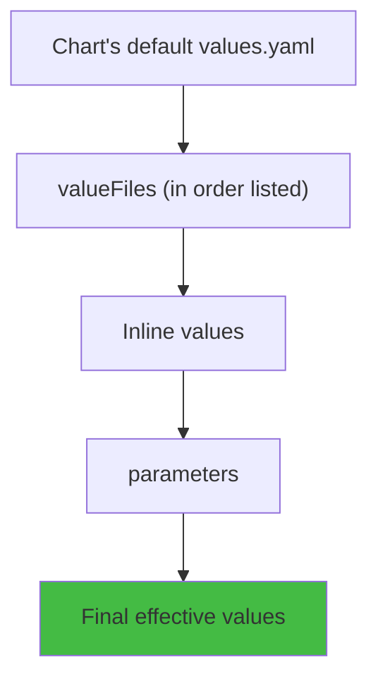

# How to Override Helm Values in ArgoCD

Author: [nawazdhandala](https://github.com/nawazdhandala)

Tags: ArgoCD, GitOps, Kubernetes, Helm, Configuration

Description: Learn all the ways to override Helm values in ArgoCD applications including inline values, parameters, value files, and their precedence order.

---

When deploying Helm charts with ArgoCD, you often need to override specific values without modifying the chart itself. ArgoCD provides several mechanisms for overriding Helm values, each with different use cases and precedence levels. Understanding how these mechanisms work together is essential for managing Helm-based deployments effectively.

In this guide, we will cover every method for overriding Helm values in ArgoCD, explain their precedence order, and walk through practical scenarios.

## Override Methods

ArgoCD supports four primary ways to override Helm values:

1. **Value files** (`valueFiles`) - YAML files containing value overrides
2. **Inline values** (`values`) - YAML values embedded directly in the Application spec
3. **Parameters** (`parameters`) - Individual key-value pairs
4. **File parameters** (`fileParameters`) - Values loaded from files

## Method 1: Inline Values

The most straightforward override method is inline values. You embed the YAML directly in your Application spec:

```yaml
apiVersion: argoproj.io/v1alpha1
kind: Application
metadata:
  name: my-app
  namespace: argocd
spec:
  source:
    repoURL: https://github.com/myorg/my-charts.git
    targetRevision: main
    path: charts/my-app
    helm:
      # Inline values override the chart's default values.yaml
      values: |
        replicaCount: 3
        image:
          tag: v2.0.0
        resources:
          requests:
            memory: "512Mi"
            cpu: "500m"
        service:
          type: LoadBalancer
          port: 80
  destination:
    server: https://kubernetes.default.svc
    namespace: production
```

Using the CLI:

```bash
argocd app set my-app --values '
replicaCount: 3
image:
  tag: v2.0.0
'
```

## Method 2: Helm Parameters

For overriding individual values without writing YAML, use parameters. These are key-value pairs that map to Helm's `--set` flag:

```yaml
apiVersion: argoproj.io/v1alpha1
kind: Application
metadata:
  name: my-app
  namespace: argocd
spec:
  source:
    repoURL: https://github.com/myorg/my-charts.git
    targetRevision: main
    path: charts/my-app
    helm:
      parameters:
        # Simple value
        - name: replicaCount
          value: "3"
        # Nested value (dot notation)
        - name: image.tag
          value: "v2.0.0"
        # Boolean value
        - name: ingress.enabled
          value: "true"
        # Force string type (prevents YAML interpretation)
        - name: image.tag
          value: "1.0"
          forceString: true
```

Using the CLI:

```bash
# Set individual parameters
argocd app set my-app -p replicaCount=3
argocd app set my-app -p image.tag=v2.0.0
argocd app set my-app -p ingress.enabled=true

# Force string type (useful for values that look like numbers or booleans)
argocd app set my-app -p image.tag=1.0 --helm-set-string image.tag=1.0
```

Parameters are particularly useful for CI/CD pipelines where you need to set a single value (like an image tag) without managing a full values file.

## Method 3: File Parameters

File parameters let you load the contents of a file as a Helm value. This is useful for certificates, configurations, or other multi-line content:

```yaml
apiVersion: argoproj.io/v1alpha1
kind: Application
metadata:
  name: my-app
  namespace: argocd
spec:
  source:
    repoURL: https://github.com/myorg/my-charts.git
    targetRevision: main
    path: charts/my-app
    helm:
      fileParameters:
        - name: config
          path: files/app-config.json
        - name: tls.crt
          path: files/tls.crt
```

This maps to Helm's `--set-file` flag.

## Precedence Order

When you use multiple override methods, they are applied in a specific order. Later overrides win:



The full precedence from lowest to highest:

1. **Chart's default `values.yaml`** (lowest priority)
2. **`valueFiles`** (applied in the order listed)
3. **Inline `values`**
4. **`parameters`** (highest priority)

This means a parameter will always override an inline value, and an inline value will always override a values file.

### Example Demonstrating Precedence

```yaml
apiVersion: argoproj.io/v1alpha1
kind: Application
metadata:
  name: my-app
  namespace: argocd
spec:
  source:
    repoURL: https://github.com/myorg/my-charts.git
    path: charts/my-app
    helm:
      # Step 1: Chart's values.yaml has replicaCount: 1

      # Step 2: values-prod.yaml sets replicaCount: 3
      valueFiles:
        - values-prod.yaml

      # Step 3: Inline values set replicaCount: 5
      values: |
        replicaCount: 5

      # Step 4: Parameter sets replicaCount: 10 (THIS WINS)
      parameters:
        - name: replicaCount
          value: "10"
```

The effective `replicaCount` will be `10` because parameters have the highest precedence.

## Practical Scenarios

### Scenario 1: Base Chart with Per-Environment Overrides

```yaml
# Production: uses values file + specific parameter override
apiVersion: argoproj.io/v1alpha1
kind: Application
metadata:
  name: my-app-production
  namespace: argocd
spec:
  source:
    repoURL: https://github.com/myorg/my-charts.git
    path: charts/my-app
    helm:
      valueFiles:
        - values.yaml
        - values-prod.yaml
      # Override just the image tag (highest precedence)
      parameters:
        - name: image.tag
          value: "v2.1.0"
  destination:
    server: https://kubernetes.default.svc
    namespace: production
```

### Scenario 2: CI/CD Pipeline Updating Image Tag

In a CI/CD pipeline, you typically only need to update the image tag:

```bash
# In your CI pipeline after building and pushing a new image
NEW_TAG="v$(git rev-parse --short HEAD)"

argocd app set my-app-production \
  -p image.tag=$NEW_TAG
```

### Scenario 3: Overriding Third-Party Chart Defaults

When using charts from public repositories, you often need significant overrides:

```yaml
apiVersion: argoproj.io/v1alpha1
kind: Application
metadata:
  name: prometheus
  namespace: argocd
spec:
  source:
    chart: kube-prometheus-stack
    repoURL: https://prometheus-community.github.io/helm-charts
    targetRevision: 55.0.0
    helm:
      # Extensive inline overrides for the community chart
      values: |
        prometheus:
          prometheusSpec:
            retention: 30d
            storageSpec:
              volumeClaimTemplate:
                spec:
                  storageClassName: gp3
                  resources:
                    requests:
                      storage: 100Gi
        grafana:
          enabled: true
          adminPassword: "${GRAFANA_PASSWORD}"
          persistence:
            enabled: true
            size: 10Gi
        alertmanager:
          alertmanagerSpec:
            storage:
              volumeClaimTemplate:
                spec:
                  resources:
                    requests:
                      storage: 10Gi
  destination:
    server: https://kubernetes.default.svc
    namespace: monitoring
```

## Overriding Values via ArgoCD UI

You can also override values through the ArgoCD web UI:

1. Navigate to your application
2. Click "App Details"
3. Scroll to the "Parameters" section
4. Click "Edit" on any parameter to change its value
5. Click "Save" to apply the override

Changes made through the UI update the Application resource directly and are reflected in `kubectl get application my-app -o yaml`.

## Viewing Effective Values

To see what values ArgoCD is actually passing to Helm:

```bash
# See all Helm configuration
argocd app get my-app -o json | jq '.spec.source.helm'

# Preview the rendered manifests
argocd app manifests my-app

# Compare current vs desired
argocd app diff my-app
```

## Removing Overrides

```bash
# Remove all parameters
argocd app unset my-app -p replicaCount

# Remove inline values
argocd app set my-app --values ''

# Remove all value files
argocd app unset my-app --values
```

## Summary

ArgoCD gives you four ways to override Helm values: value files, inline values, parameters, and file parameters. They follow a clear precedence order where parameters win over inline values, which win over value files, which win over chart defaults. Use value files for bulk environment configuration, inline values for moderate customization, and parameters for CI/CD automation where you need to set specific values like image tags. For managing values across multiple environments, see our guide on [using multiple Helm values files](https://oneuptime.com/blog/post/2026-02-26-argocd-multiple-helm-values-files/view).
