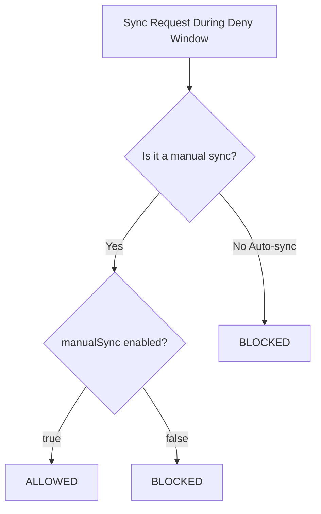

# How to Override Sync Windows for Emergency Deployments in ArgoCD

Author: [nawazdhandala](https://github.com/nawazdhandala)

Tags: ArgoCD, GitOps, Kubernetes, Sync Windows, Incident Response

Description: Learn how to bypass ArgoCD sync windows during emergencies, including manual sync overrides, temporary window modifications, and emergency deployment procedures.

---

Sync windows protect production from unplanned changes, but emergencies do not follow schedules. When a critical bug needs a hotfix at 2 PM on a Tuesday and your sync window only allows deployments between 2 and 6 AM, you need a way to override the restriction. ArgoCD provides several mechanisms for emergency deployments.

## Understanding the manualSync Setting

The primary override mechanism is the `manualSync` field on sync windows. When set to `true`, manual syncs bypass the window restrictions. Only automated syncs are blocked.

```yaml
syncWindows:
  - kind: deny
    schedule: '0 9 * * 1-5'
    duration: 8h
    applications:
      - '*'
    manualSync: true   # Manual syncs are ALLOWED during the deny window
```

With `manualSync: true`:
- Automated syncs (auto-sync policy) are blocked during the window
- Manual syncs (triggered by a human via CLI or UI) are allowed

With `manualSync: false`:
- Both automated and manual syncs are blocked during the window
- No exceptions without modifying the window configuration



## Emergency Override via Manual Sync

If your sync windows have `manualSync: true`, the simplest override is to trigger a manual sync.

```bash
# Manual sync during a deny window (works if manualSync: true)
argocd app sync my-critical-app

# Manual selective sync for just the hotfix
argocd app sync my-critical-app --resource apps:Deployment:payment-service

# Manual sync with force to ensure the update applies
argocd app sync my-critical-app --force
```

From the UI, click the "Sync" button on the application page. Manual syncs triggered from the UI are treated the same as CLI manual syncs.

## Temporary Window Modification

If `manualSync` is set to `false` (the strictest setting), you need to modify the sync window configuration to allow the emergency deployment.

### Option 1: Temporarily enable manualSync

```bash
# Get the current project configuration
argocd proj get production --output json > /tmp/project-backup.json

# Update the sync window to allow manual syncs
argocd proj windows update production 0 --manual-sync

# Perform the emergency sync
argocd app sync my-critical-app

# Restore the original setting after the emergency
argocd proj windows update production 0 --manual-sync=false
```

### Option 2: Add a temporary allow window

```bash
# Add a temporary allow window that covers the current time
argocd proj windows add production \
  --kind allow \
  --schedule "$(date -u +'%M %H %d %m *')" \
  --duration 1h \
  --applications "my-critical-app" \
  --manual-sync

# Perform the emergency sync
argocd app sync my-critical-app

# Remove the temporary window after the emergency
# First, find the window index
argocd proj windows list production
# Then delete it
argocd proj windows delete production <index>
```

### Option 3: Delete the blocking deny window temporarily

```bash
# CAUTION: This removes the deny window entirely
# Save the project configuration first
kubectl get appproject production -n argocd -o yaml > /tmp/project-backup.yaml

# Remove the deny window by index
argocd proj windows delete production 0

# Perform the emergency sync
argocd app sync my-critical-app

# Restore the deny window from backup
kubectl apply -f /tmp/project-backup.yaml
```

This is the most aggressive override. It removes all protection for the duration. Use only when other options are not available.

## Emergency Deployment Script

Create a standardized emergency deployment script that your on-call team can use.

```bash
#!/bin/bash
# emergency-deploy.sh - Emergency deployment that overrides sync windows
# Usage: ./emergency-deploy.sh APP_NAME [RESOURCE]

set -euo pipefail

APP_NAME="${1:?Usage: $0 APP_NAME [GROUP:KIND:NAME]}"
RESOURCE="${2:-}"

echo "============================================"
echo "EMERGENCY DEPLOYMENT PROCEDURE"
echo "Application: $APP_NAME"
echo "Time: $(date -u)"
echo "============================================"

# Step 1: Verify the application exists
if ! argocd app get "$APP_NAME" > /dev/null 2>&1; then
  echo "ERROR: Application $APP_NAME not found"
  exit 1
fi

# Step 2: Get the project name
PROJECT=$(argocd app get "$APP_NAME" --output json | jq -r '.spec.project')
echo "Project: $PROJECT"

# Step 3: Check if manual sync is already allowed
echo ""
echo "Checking sync window status..."
argocd proj windows list "$PROJECT"

# Step 4: Try manual sync first
echo ""
echo "Attempting manual sync..."
if [ -n "$RESOURCE" ]; then
  SYNC_CMD="argocd app sync $APP_NAME --resource $RESOURCE"
else
  SYNC_CMD="argocd app sync $APP_NAME"
fi

if eval "$SYNC_CMD" 2>/dev/null; then
  echo "Manual sync succeeded."
else
  echo "Manual sync blocked by sync window."
  echo ""
  echo "Temporarily enabling manual sync on the project..."

  # Find the blocking window and enable manual sync
  WINDOW_COUNT=$(argocd proj windows list "$PROJECT" --output json | jq 'length')

  for i in $(seq 0 $((WINDOW_COUNT - 1))); do
    argocd proj windows update "$PROJECT" "$i" --manual-sync 2>/dev/null || true
  done

  echo "Retrying sync..."
  eval "$SYNC_CMD"

  echo ""
  echo "WARNING: manualSync has been enabled on all windows in project $PROJECT"
  echo "Remember to restore the original settings after the emergency."
fi

# Step 5: Wait for health
echo ""
echo "Waiting for application to be healthy..."
argocd app wait "$APP_NAME" --health --timeout 300

echo ""
echo "Emergency deployment complete."
echo "REMINDER: Review and restore sync window settings."
```

## Logging Emergency Overrides

For audit compliance, log every emergency override.

```bash
#!/bin/bash
# log-emergency-override.sh - Called by the emergency deploy script

APP_NAME="$1"
OPERATOR="$2"
REASON="$3"
TIMESTAMP=$(date -u +"%Y-%m-%dT%H:%M:%SZ")

# Log to a Kubernetes ConfigMap for audit trail
kubectl create configmap "emergency-override-${TIMESTAMP//:/}" \
  -n argocd \
  --from-literal=application="$APP_NAME" \
  --from-literal=operator="$OPERATOR" \
  --from-literal=reason="$REASON" \
  --from-literal=timestamp="$TIMESTAMP" \
  --dry-run=client -o yaml | kubectl apply -f -

echo "Emergency override logged: $APP_NAME by $OPERATOR at $TIMESTAMP"
echo "Reason: $REASON"
```

## Using kubectl as a Last Resort

If ArgoCD itself is having issues or the sync window configuration cannot be modified, you can apply changes directly with kubectl. This breaks the GitOps model but is sometimes necessary during a genuine emergency.

```bash
# Apply the hotfix directly to the cluster
kubectl set image deployment/payment-service \
  payment-service=myregistry/payment-service:v2.1.1-hotfix \
  -n production

# Verify the rollout
kubectl rollout status deployment/payment-service -n production
```

After the emergency, update the Git repository to match the cluster state and perform a full ArgoCD sync to restore GitOps alignment.

```bash
# After updating Git with the hotfix change
argocd app sync my-critical-app
argocd app wait my-critical-app --health
```

## RBAC Considerations for Emergency Overrides

Control who can perform emergency overrides through ArgoCD RBAC.

```yaml
# In argocd-rbac-cm ConfigMap
apiVersion: v1
kind: ConfigMap
metadata:
  name: argocd-rbac-cm
  namespace: argocd
data:
  policy.csv: |
    # Regular developers: can sync but not override projects
    p, role:developer, applications, sync, */*, allow

    # On-call SREs: can modify projects (to change sync windows)
    p, role:oncall-sre, applications, sync, */*, allow
    p, role:oncall-sre, projects, update, *, allow

    # Admins: full access
    p, role:admin, *, *, */*, allow
```

Only the `oncall-sre` and `admin` roles can modify project settings (including sync windows). Regular developers can only trigger manual syncs, which works if `manualSync: true` is set.

## Post-Emergency Procedures

After the emergency is resolved:

1. Verify the hotfix is working in production
2. Restore sync window settings to their original values
3. Update Git to reflect any direct cluster changes
4. Perform a full ArgoCD sync to verify alignment
5. Document the emergency in your incident log
6. Review whether the sync window configuration needs adjustment

```bash
# Restore original project settings
kubectl apply -f /tmp/project-backup.yaml

# Verify sync windows are back to normal
argocd proj windows list production

# Full sync to verify GitOps alignment
argocd app sync my-critical-app
argocd app get my-critical-app
```

For the fundamentals of sync window configuration, see the [sync windows guide](https://oneuptime.com/blog/post/2026-02-26-argocd-configure-sync-windows/view). For debugging sync window issues, check the [debug sync windows guide](https://oneuptime.com/blog/post/2026-02-26-argocd-debug-sync-window-issues/view).
