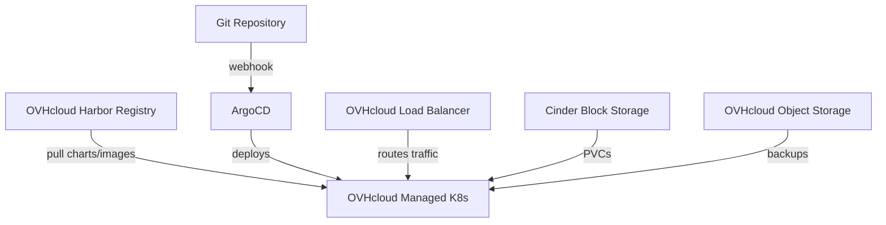

# How to Use ArgoCD with OVHcloud Managed Kubernetes

Author: [nawazdhandala](https://github.com/nawazdhandala)

Tags: ArgoCD, GitOps, Kubernetes, OVHcloud, Cloud

Description: Learn how to deploy and configure ArgoCD on OVHcloud Managed Kubernetes with load balancers, private registry integration, and European data sovereignty.

---

OVHcloud Managed Kubernetes is a compelling option for teams that need a European cloud provider with GDPR compliance built in. It is fully CNCF-conformant, surprisingly affordable, and runs on OVHcloud's extensive infrastructure across Europe. Combining it with ArgoCD gives you a GitOps workflow that keeps your data and operations within European borders.

This guide covers deploying ArgoCD on OVHcloud Managed Kubernetes, configuring load balancers, integrating with OVHcloud's private registry, and handling the platform-specific details.

## Why OVHcloud for ArgoCD?

There are several reasons teams choose OVHcloud:

- **Data sovereignty** - Data centers across Europe with GDPR compliance
- **Predictable pricing** - No hidden egress fees between OVHcloud services
- **CNCF conformant** - Standard Kubernetes, no vendor lock-in
- **Free control plane** - You only pay for worker nodes

## Prerequisites

- An OVHcloud account with a Managed Kubernetes cluster
- The `kubectl` CLI configured with your cluster's kubeconfig
- OVHcloud CLI or web console access

## Step 1: Set Up Your OVHcloud Kubernetes Cluster

You can create a cluster through the OVHcloud Control Panel or API. Download the kubeconfig from the Control Panel.

```bash
# Download kubeconfig from OVHcloud Control Panel
# Navigate to: Public Cloud > Managed Kubernetes > Your Cluster > kubeconfig

export KUBECONFIG=~/kubeconfig-ovh.yml
kubectl get nodes
```

## Step 2: Install ArgoCD

ArgoCD installs cleanly on OVHcloud Managed Kubernetes with no modifications needed.

```bash
# Create namespace and install
kubectl create namespace argocd
kubectl apply -n argocd -f https://raw.githubusercontent.com/argoproj/argo-cd/stable/manifests/install.yaml

# Wait for all components
kubectl wait --for=condition=Ready pod --all -n argocd --timeout=300s

# Retrieve the initial admin password
kubectl -n argocd get secret argocd-initial-admin-secret \
  -o jsonpath="{.data.password}" | base64 -d && echo
```

## Step 3: Expose ArgoCD with OVHcloud Load Balancer

OVHcloud provides a cloud controller manager that automatically provisions load balancers when you create a Kubernetes Service of type LoadBalancer.

```yaml
# argocd-lb-service.yaml
apiVersion: v1
kind: Service
metadata:
  name: argocd-server-lb
  namespace: argocd
  annotations:
    # OVHcloud load balancer annotations
    service.beta.kubernetes.io/ovh-loadbalancer-proxy-protocol: "v2"
spec:
  type: LoadBalancer
  ports:
    - name: https
      port: 443
      targetPort: 8080
      protocol: TCP
    - name: grpc
      port: 8443
      targetPort: 8080
      protocol: TCP
  selector:
    app.kubernetes.io/name: argocd-server
```

For a more production-ready setup, use an ingress controller.

```yaml
# nginx-ingress-ovh.yaml
apiVersion: argoproj.io/v1alpha1
kind: Application
metadata:
  name: nginx-ingress
  namespace: argocd
spec:
  project: default
  source:
    repoURL: https://kubernetes.github.io/ingress-nginx
    chart: ingress-nginx
    targetRevision: 4.x
    helm:
      values: |
        controller:
          service:
            type: LoadBalancer
          config:
            use-proxy-protocol: "true"
  destination:
    server: https://kubernetes.default.svc
    namespace: ingress-nginx
  syncPolicy:
    automated:
      prune: true
      selfHeal: true
    syncOptions:
      - CreateNamespace=true
```

Then create the ArgoCD ingress.

```yaml
# argocd-ingress.yaml
apiVersion: networking.k8s.io/v1
kind: Ingress
metadata:
  name: argocd-server
  namespace: argocd
  annotations:
    nginx.ingress.kubernetes.io/ssl-passthrough: "true"
    nginx.ingress.kubernetes.io/backend-protocol: "HTTPS"
spec:
  ingressClassName: nginx
  rules:
    - host: argocd.example.com
      http:
        paths:
          - path: /
            pathType: Prefix
            backend:
              service:
                name: argocd-server
                port:
                  number: 443
```

## Step 4: Integrate with OVHcloud Private Registry

OVHcloud offers a managed Harbor registry. To use it with ArgoCD for Helm charts:

```yaml
# ovh-registry-secret.yaml
apiVersion: v1
kind: Secret
metadata:
  name: ovh-registry
  namespace: argocd
  labels:
    argocd.argoproj.io/secret-type: repository
stringData:
  type: helm
  name: ovh-harbor
  url: https://my-registry.c1.gra9.container-registry.ovh.net/chartrepo/my-project
  username: "<HARBOR_USERNAME>"
  password: "<HARBOR_PASSWORD>"
```

For OCI-based Helm charts in Harbor:

```yaml
# ovh-oci-registry-secret.yaml
apiVersion: v1
kind: Secret
metadata:
  name: ovh-oci-registry
  namespace: argocd
  labels:
    argocd.argoproj.io/secret-type: repository
stringData:
  type: helm
  name: ovh-harbor-oci
  enableOCI: "true"
  url: my-registry.c1.gra9.container-registry.ovh.net
  username: "<HARBOR_USERNAME>"
  password: "<HARBOR_PASSWORD>"
```

For image pull secrets in your application namespaces:

```bash
# Create image pull secret for OVHcloud Harbor
kubectl create secret docker-registry ovh-registry-creds \
  --namespace my-app \
  --docker-server=my-registry.c1.gra9.container-registry.ovh.net \
  --docker-username="<USERNAME>" \
  --docker-password="<PASSWORD>"
```

## Step 5: Configure Storage

OVHcloud provides Cinder-based persistent volumes through their CSI driver.

```bash
# Check available storage classes
kubectl get storageclass
```

You should see storage classes like `csi-cinder-classic` and `csi-cinder-high-speed`. Use them in your application manifests.

```yaml
# pvc-example.yaml
apiVersion: v1
kind: PersistentVolumeClaim
metadata:
  name: app-storage
spec:
  accessModes:
    - ReadWriteOnce
  storageClassName: csi-cinder-high-speed
  resources:
    requests:
      storage: 20Gi
```

## Step 6: Set Up TLS with cert-manager

Deploy cert-manager through ArgoCD for automatic TLS certificate management.

```yaml
# cert-manager-app.yaml
apiVersion: argoproj.io/v1alpha1
kind: Application
metadata:
  name: cert-manager
  namespace: argocd
spec:
  project: default
  source:
    repoURL: https://charts.jetstack.io
    chart: cert-manager
    targetRevision: v1.14.x
    helm:
      values: |
        installCRDs: true
  destination:
    server: https://kubernetes.default.svc
    namespace: cert-manager
  syncPolicy:
    automated:
      prune: true
      selfHeal: true
    syncOptions:
      - CreateNamespace=true
```

## Architecture on OVHcloud



## Multi-Region with OVHcloud

OVHcloud has data centers across Europe, which makes multi-region deployments straightforward. You can use ArgoCD ApplicationSets to deploy across regions.

```yaml
# multi-region-appset.yaml
apiVersion: argoproj.io/v1alpha1
kind: ApplicationSet
metadata:
  name: my-app-multi-region
  namespace: argocd
spec:
  generators:
    - list:
        elements:
          - cluster: gra-cluster
            url: https://gra-cluster-api.example.com
            region: GRA
          - cluster: sbg-cluster
            url: https://sbg-cluster-api.example.com
            region: SBG
          - cluster: rbx-cluster
            url: https://rbx-cluster-api.example.com
            region: RBX
  template:
    metadata:
      name: "my-app-{{region}}"
    spec:
      project: default
      source:
        repoURL: https://github.com/my-org/my-app
        targetRevision: main
        path: k8s/overlays/{{region}}
      destination:
        server: "{{url}}"
        namespace: production
      syncPolicy:
        automated:
          prune: true
          selfHeal: true
```

## OVHcloud-Specific Tips

### Free Egress Between Services

One of OVHcloud's biggest advantages is free bandwidth between their services. This means ArgoCD pulling charts from OVHcloud Harbor, and pods pulling images from the same registry, costs nothing extra.

### Node Flavors for ArgoCD

OVHcloud offers various instance types. For ArgoCD:

- **b2-7** (2 vCPU, 7GB RAM) - Good for small deployments (under 50 apps)
- **b2-15** (4 vCPU, 15GB RAM) - Suitable for medium deployments (50 to 200 apps)
- **b2-30** (8 vCPU, 30GB RAM) - For larger deployments with many applications

### ETCD Backup

OVHcloud automatically backs up the etcd database for your Kubernetes cluster. This means your ArgoCD Application resources are backed up as part of the cluster state.

## Troubleshooting on OVHcloud

### Load Balancer Not Getting an IP

If the load balancer stays in Pending state, check your OVHcloud quotas.

```bash
# Check load balancer services
kubectl get svc -n argocd
kubectl describe svc argocd-server-lb -n argocd
```

### Slow Image Pulls

If image pulls are slow, make sure you are using the registry endpoint in the same region as your cluster (GRA, SBG, RBX, etc.).

### Node Not Ready

OVHcloud nodes occasionally take longer to become ready. Check the node status and events.

```bash
kubectl get nodes
kubectl describe node <NODE_NAME>
```

## Conclusion

OVHcloud Managed Kubernetes is a strong choice for European teams that need data sovereignty and predictable pricing. ArgoCD runs perfectly on it with no special modifications needed. The integration with OVHcloud's Harbor registry and Cinder storage is seamless, and the free internal bandwidth makes it cost-effective for GitOps workflows that involve frequent image and chart pulls. If GDPR compliance is a priority for your organization, the OVHcloud and ArgoCD combination is hard to beat.
