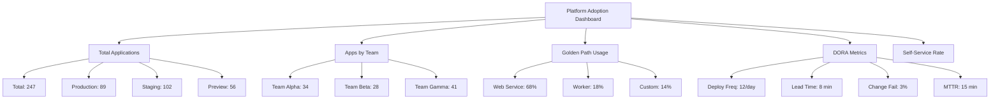

# How to Measure Platform Adoption with ArgoCD Metrics

Author: [nawazdhandala](https://github.com/nawazdhandala)

Tags: ArgoCD, GitOps, Kubernetes, Platform Engineering, Metrics

Description: Learn how to measure platform adoption and developer productivity using ArgoCD metrics, custom dashboards, and DORA metrics for data-driven platform engineering.

---

Building a platform is only half the challenge. The other half is proving it works. Platform teams need to measure adoption, track developer productivity improvements, and identify areas where the platform falls short. ArgoCD exposes a rich set of metrics that, combined with custom instrumentation, give you a complete picture of how your platform is performing.

This guide covers collecting ArgoCD metrics, building adoption dashboards, calculating DORA metrics, and using data to drive platform decisions.

## Why Measure Platform Adoption?

Without metrics, platform decisions become opinion-based. With metrics, you can answer:

- How many teams are actively using the platform?
- What is the average time from code commit to production deployment?
- Are deployment failures increasing or decreasing?
- Which golden paths are popular and which are ignored?
- How much time has self-service saved compared to ticket-based workflows?

## ArgoCD's Built-In Metrics

ArgoCD exposes Prometheus metrics on port 8082 (controller) and 8083 (server). Here are the most useful ones for platform adoption:

```yaml
# Key ArgoCD metrics
argocd_app_info                    # Application metadata (labels, project, health)
argocd_app_sync_total              # Total sync operations
argocd_app_reconcile_count         # Reconciliation counts
argocd_app_reconcile_bucket        # Reconciliation duration
argocd_app_sync_status             # Current sync status per app
argocd_app_health_status           # Current health status per app
argocd_cluster_info                # Cluster connection info
argocd_git_request_total           # Git operations
argocd_git_request_duration        # Git operation duration
```

## Step 1: Set Up Metric Collection

Ensure ArgoCD metrics are being scraped by Prometheus:

```yaml
# monitoring/argocd-service-monitor.yaml
apiVersion: monitoring.coreos.com/v1
kind: ServiceMonitor
metadata:
  name: argocd-metrics
  namespace: argocd
  labels:
    release: prometheus
spec:
  selector:
    matchLabels:
      app.kubernetes.io/part-of: argocd
  endpoints:
    - port: metrics
      interval: 30s
      path: /metrics
```

## Step 2: Custom Metrics for Platform Adoption

ArgoCD's built-in metrics do not cover everything. Add custom metrics through a sidecar or separate exporter.

```python
# platform/metrics-exporter/exporter.py
from prometheus_client import start_http_server, Gauge, Counter, Histogram
import requests
import time

# Custom platform metrics
APPS_BY_TEAM = Gauge(
    'platform_apps_by_team',
    'Number of applications per team',
    ['team', 'environment']
)

APPS_BY_GOLDEN_PATH = Gauge(
    'platform_apps_by_golden_path',
    'Number of applications using each golden path',
    ['golden_path']
)

APPS_USING_TEMPLATES = Gauge(
    'platform_apps_using_templates',
    'Percentage of apps using platform templates',
    ['team']
)

DEPLOYMENT_LEAD_TIME = Histogram(
    'platform_deployment_lead_time_seconds',
    'Time from commit to deployment',
    ['team', 'environment'],
    buckets=[60, 300, 600, 1800, 3600, 7200, 14400]
)

SELF_SERVICE_ONBOARDINGS = Counter(
    'platform_self_service_onboardings_total',
    'Number of self-service application onboardings',
    ['team']
)

PLATFORM_TICKETS_AVOIDED = Gauge(
    'platform_tickets_avoided',
    'Estimated tickets avoided through self-service',
    ['category']
)


def collect_metrics():
    """Collect metrics from ArgoCD API."""
    response = requests.get(
        f'{ARGOCD_SERVER}/api/v1/applications',
        headers={'Authorization': f'Bearer {ARGOCD_TOKEN}'}
    )
    apps = response.json().get('items', [])

    # Count apps by team and environment
    team_env_counts = {}
    golden_path_counts = {}
    team_template_usage = {}

    for app in apps:
        labels = app.get('metadata', {}).get('labels', {})
        team = labels.get('team', 'unknown')
        env = labels.get('environment', 'unknown')
        golden_path = labels.get('golden-path', 'custom')

        # Count by team and environment
        key = (team, env)
        team_env_counts[key] = team_env_counts.get(key, 0) + 1

        # Count by golden path
        golden_path_counts[golden_path] = \
            golden_path_counts.get(golden_path, 0) + 1

        # Track template usage per team
        if team not in team_template_usage:
            team_template_usage[team] = {'total': 0, 'templated': 0}
        team_template_usage[team]['total'] += 1
        if golden_path != 'custom':
            team_template_usage[team]['templated'] += 1

    # Update Prometheus metrics
    for (team, env), count in team_env_counts.items():
        APPS_BY_TEAM.labels(team=team, environment=env).set(count)

    for path, count in golden_path_counts.items():
        APPS_BY_GOLDEN_PATH.labels(golden_path=path).set(count)

    for team, usage in team_template_usage.items():
        pct = (usage['templated'] / usage['total'] * 100) \
            if usage['total'] > 0 else 0
        APPS_USING_TEMPLATES.labels(team=team).set(pct)


if __name__ == '__main__':
    start_http_server(9090)
    while True:
        collect_metrics()
        time.sleep(60)
```

## Step 3: DORA Metrics from ArgoCD

Calculate the four DORA metrics using ArgoCD data:

### Deployment Frequency

```promql
# Deployments per day per team
sum by (team) (
  increase(
    argocd_app_sync_total{
      phase="Succeeded",
      dest_namespace=~".*-production"
    }[24h]
  )
  * on(name) group_left(team)
  argocd_app_labels{label_team!=""}
)
```

### Lead Time for Changes

Track the time between a Git commit and when ArgoCD completes the sync:

```yaml
# Capture this via ArgoCD Notifications
template.lead-time-metric: |
  webhook:
    metrics-collector:
      method: POST
      body: |
        {
          "metric": "deployment_lead_time",
          "labels": {
            "application": "{{.app.metadata.name}}",
            "team": "{{index .app.metadata.labels "team"}}",
            "environment": "{{index .app.metadata.labels "environment"}}"
          },
          "started_at": "{{.app.status.operationState.startedAt}}",
          "finished_at": "{{.app.status.operationState.finishedAt}}",
          "revision": "{{.app.status.operationState.syncResult.revision}}"
        }
```

### Change Failure Rate

```promql
# Percentage of deployments that result in degraded health
sum by (team) (
  increase(
    argocd_app_sync_total{phase="Error"}[7d]
  )
  + increase(
    argocd_app_sync_total{phase="Failed"}[7d]
  )
)
/
sum by (team) (
  increase(
    argocd_app_sync_total[7d]
  )
)
```

### Mean Time to Recovery

```promql
# Average time applications spend in Degraded state
avg by (team) (
  argocd_app_health_status{health_status="Degraded"}
  * on(name) group_left(team)
  argocd_app_labels{label_team!=""}
)
```

## Step 4: Build the Adoption Dashboard

Create a Grafana dashboard with these panels:



### Key Dashboard Queries

Total applications managed:

```promql
count(argocd_app_info)
```

Applications by health status:

```promql
count by (health_status) (argocd_app_health_status)
```

Sync operations over time:

```promql
sum(rate(argocd_app_sync_total[1h])) by (phase)
```

Application reconciliation time (platform performance):

```promql
histogram_quantile(0.99,
  sum(rate(argocd_app_reconcile_bucket[5m])) by (le)
)
```

## Step 5: Track Self-Service Efficiency

Measure the impact of self-service by tracking what used to require tickets:

```yaml
# Track self-service actions
# Each action that would have been a ticket is logged
self_service_actions:
  - type: new_application
    previous_lead_time: "2 days"  # Via ticket
    current_lead_time: "5 minutes"  # Via self-service
    monthly_volume: 15

  - type: environment_creation
    previous_lead_time: "1 day"
    current_lead_time: "instant"
    monthly_volume: 30

  - type: domain_configuration
    previous_lead_time: "4 hours"
    current_lead_time: "10 minutes"
    monthly_volume: 8

  - type: secret_rotation
    previous_lead_time: "1 hour"
    current_lead_time: "5 minutes"
    monthly_volume: 20
```

Calculate time saved:

```python
# Monthly time savings calculation
def calculate_time_savings(actions):
    total_hours_saved = 0
    for action in actions:
        old_time = parse_duration(action['previous_lead_time'])
        new_time = parse_duration(action['current_lead_time'])
        savings = (old_time - new_time) * action['monthly_volume']
        total_hours_saved += savings.total_seconds() / 3600

    return total_hours_saved

# Example output:
# New applications: 15 * (2 days - 5 min) = ~720 hours saved
# Environment creation: 30 * (1 day - instant) = ~720 hours saved
# Domain config: 8 * (4 hours - 10 min) = ~31 hours saved
# Secret rotation: 20 * (1 hour - 5 min) = ~18 hours saved
# Total: ~1,489 developer-hours saved per month
```

## Step 6: Platform Health Metrics

Track the health of the platform itself:

```promql
# ArgoCD controller processing time
histogram_quantile(0.95,
  sum(rate(argocd_app_reconcile_bucket[5m])) by (le)
)

# Git request latency
histogram_quantile(0.95,
  sum(rate(argocd_git_request_duration_bucket[5m])) by (le)
)

# Pending applications (queue depth)
sum(argocd_app_sync_status{sync_status="OutOfSync"})

# Controller memory usage
process_resident_memory_bytes{job="argocd-application-controller"}
```

Monitor these platform health metrics with [OneUptime](https://oneuptime.com) to ensure the platform itself remains responsive and reliable for all teams.

## Reporting to Leadership

Translate technical metrics into business impact:

```
Platform Engineering Monthly Report
------------------------------------
Active Teams: 12 (+2 from last month)
Applications Managed: 247 (+18)
Deployments This Month: 1,847
Deployment Success Rate: 97.2%
Average Deploy Time: 8 minutes
Developer Hours Saved: ~1,489 hours
Golden Path Adoption: 86%
Platform Availability: 99.97%
```

## Conclusion

Measuring platform adoption turns platform engineering from a cost center into a demonstrable value driver. ArgoCD's Prometheus metrics provide the foundation, but you need custom instrumentation for adoption-specific measurements. Track DORA metrics to show delivery performance improvements, measure self-service efficiency to quantify time savings, and monitor golden path adoption to identify where the platform needs improvement. Data-driven platform engineering is the difference between building what you think teams need and building what they actually use.
