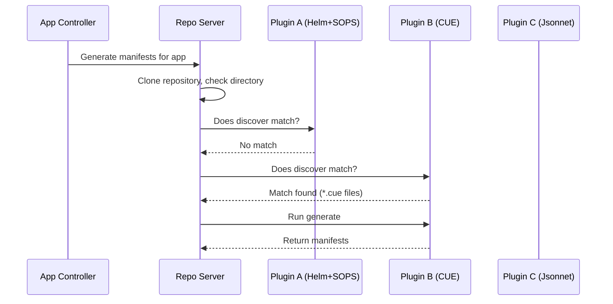

# How to Configure Plugin Discovery in ArgoCD

Author: [nawazdhandala](https://github.com/nawazdhandala)

Tags: ArgoCD, GitOps, Kubernetes, Config Management Plugins, Automation

Description: Learn how to configure automatic plugin discovery in ArgoCD so CMP plugins are selected based on repository file patterns without manual configuration.

---

When you have multiple Config Management Plugins installed as sidecars on the ArgoCD repo-server, you need a way for ArgoCD to know which plugin should handle which application. Plugin discovery automates this by letting plugins declare what types of repositories they can handle. Instead of manually specifying a plugin name in every Application spec, ArgoCD examines the repository contents and automatically routes to the right plugin.

This guide covers how discovery works, how to configure it correctly, and how to handle conflicts when multiple plugins match the same repository.

## How Plugin Discovery Works

Every CMP plugin can include a `discover` section in its `plugin.yaml` configuration. When ArgoCD encounters an application that does not explicitly specify a plugin name, it checks each installed plugin's discovery rules against the repository content:



ArgoCD stops at the first plugin that matches, in the order the plugins are registered.

## Discovery Methods

There are two ways to configure discovery: file pattern matching with `find.glob` and command-based discovery with `find.command`.

### Glob-Based Discovery

The simplest approach - match repositories based on file patterns:

```yaml
# plugin.yaml
apiVersion: argoproj.io/v1alpha1
kind: ConfigManagementPlugin
metadata:
  name: cue-manifests
spec:
  discover:
    find:
      # Match directories containing CUE files
      glob: "**/*.cue"
  generate:
    command: [sh, -c]
    args:
      - |
        cue export . --out yaml --expression objects
```

The glob pattern is evaluated relative to the application's source path in the repository. Common patterns:

```yaml
# Match a specific file in the root
glob: "custom-config.yaml"

# Match any YAML file with a prefix
glob: "**/sops-*.yaml"

# Match a specific directory structure
glob: "**/cue.mod/module.cue"

# Match multiple patterns (any match triggers discovery)
glob: "{*.cue,cue.mod/**}"
```

### Command-Based Discovery

For more complex matching logic, use a command that returns a non-empty string when the plugin should be used:

```yaml
# plugin.yaml
apiVersion: argoproj.io/v1alpha1
kind: ConfigManagementPlugin
metadata:
  name: sops-kustomize
spec:
  discover:
    find:
      command: [sh, -c]
      args:
        - |
          # Match if both kustomization.yaml and encrypted files exist
          if [ -f "kustomization.yaml" ] && grep -rq "^sops:" *.yaml 2>/dev/null; then
            echo "true"
          fi
  generate:
    command: [sh, -c]
    args:
      - |
        # Decrypt then build
        find . -name "*.yaml" -exec grep -l "^sops:" {} \; | while read f; do
          sops --decrypt --in-place "$f"
        done
        kustomize build .
```

The rule is simple: if the command outputs anything to stdout, the plugin matches. If it outputs nothing (empty string), it does not match. The exit code does not matter for discovery - only the output.

```yaml
# More discovery examples

# Match repos with a specific marker file
discover:
  find:
    command: [sh, -c]
    args:
      - |
        # Check for a .argocd-plugin marker file
        if [ -f ".argocd-plugin" ]; then
          cat .argocd-plugin  # Output the plugin config
        fi

# Match based on file content
discover:
  find:
    command: [sh, -c]
    args:
      - |
        # Match Chart.yaml that uses a specific apiVersion
        if [ -f "Chart.yaml" ] && grep -q "apiVersion: v2" Chart.yaml; then
          echo "helm-v2-chart"
        fi

# Match based on environment variable or annotation
discover:
  find:
    command: [sh, -c]
    args:
      - |
        # Only match if a specific env is set
        if [ -n "${USE_CUSTOM_PLUGIN:-}" ]; then
          echo "matched"
        fi
```

## Configuring Discovery for Multiple Plugins

When you have several plugins installed, order and specificity matter. Here is a setup with three plugins:

```yaml
# Plugin 1: SOPS + Kustomize (most specific)
apiVersion: argoproj.io/v1alpha1
kind: ConfigManagementPlugin
metadata:
  name: sops-kustomize
spec:
  discover:
    find:
      command: [sh, -c]
      args:
        - |
          # Only match if BOTH kustomization.yaml AND sops-encrypted files exist
          if [ -f "kustomization.yaml" ] && find . -name "*.yaml" -exec grep -l "^sops:" {} \; 2>/dev/null | head -1 | grep -q .; then
            echo "sops-kustomize"
          fi
  generate:
    command: [sh, -c]
    args:
      - |
        find . -name "*.yaml" -exec grep -l "^sops:" {} \; | while read f; do
          sops --decrypt --in-place "$f"
        done
        kustomize build .
---
# Plugin 2: SOPS + plain YAML (medium specificity)
apiVersion: argoproj.io/v1alpha1
kind: ConfigManagementPlugin
metadata:
  name: sops-plain
spec:
  discover:
    find:
      command: [sh, -c]
      args:
        - |
          # Match if sops-encrypted files exist but no kustomization.yaml
          if [ ! -f "kustomization.yaml" ] && find . -name "*.yaml" -exec grep -l "^sops:" {} \; 2>/dev/null | head -1 | grep -q .; then
            echo "sops-plain"
          fi
  generate:
    command: [sh, -c]
    args:
      - |
        for f in *.yaml; do
          if grep -q "^sops:" "$f"; then
            sops --decrypt "$f"
          else
            cat "$f"
          fi
          echo "---"
        done
---
# Plugin 3: CUE (least overlap with others)
apiVersion: argoproj.io/v1alpha1
kind: ConfigManagementPlugin
metadata:
  name: cue-manifests
spec:
  discover:
    find:
      glob: "**/*.cue"
  generate:
    command: [sh, -c]
    args:
      - |
        cue export . --out yaml --expression objects
```

## Discovery vs Explicit Plugin Selection

You do not have to use discovery at all. You can always specify the plugin name explicitly in the Application spec:

```yaml
# Explicit: no discovery needed
spec:
  source:
    plugin:
      name: sops-kustomize
```

When to use each approach:

| Approach | Use When |
|----------|----------|
| Discovery | You have many applications and want automatic plugin selection |
| Explicit | You need precise control over which plugin handles each app |
| Both | Discovery for defaults, explicit override for special cases |

If an Application spec includes `plugin.name`, discovery is skipped entirely and ArgoCD uses the named plugin directly.

## Handling Discovery Conflicts

When multiple plugins match the same repository, ArgoCD uses the first one it finds. The order depends on how the sidecars are registered, which is typically the order they appear in the pod spec.

To avoid conflicts:

1. Make discovery rules as specific as possible
2. Use command-based discovery with multiple conditions
3. Use negative matching to exclude repos that should be handled by other plugins

```yaml
# Avoid conflicts with negative matching
discover:
  find:
    command: [sh, -c]
    args:
      - |
        # Match Kustomize repos, but NOT ones with encrypted files
        # (those should be handled by sops-kustomize plugin)
        if [ -f "kustomization.yaml" ] && ! find . -name "*.yaml" -exec grep -l "^sops:" {} \; 2>/dev/null | head -1 | grep -q .; then
          echo "plain-kustomize"
        fi
```

## Testing Discovery Rules

Before deploying, test your discovery logic locally:

```bash
# Simulate what the discovery command would do
cd /path/to/your/repo/app-directory

# Test glob-based discovery
# Check if the glob pattern matches any files
find . -name "*.cue" | head -1

# Test command-based discovery
# Run the exact command from your plugin.yaml
sh -c '
if [ -f "kustomization.yaml" ] && grep -rq "^sops:" *.yaml 2>/dev/null; then
  echo "true"
fi
'
```

## Disabling Discovery for Built-in Tools

If you have a custom plugin that should handle Helm charts instead of ArgoCD's built-in Helm support, you need to be careful. ArgoCD checks built-in tools before CMP plugins. To force your plugin to handle Helm charts, use explicit plugin selection in the Application spec rather than relying on discovery.

```yaml
# Force custom Helm handling with explicit plugin name
spec:
  source:
    plugin:
      name: my-custom-helm-plugin
      env:
        - name: HELM_ARGS
          value: "--set-string imageTag=v1.0"
```

## Summary

Plugin discovery in ArgoCD lets CMP sidecar plugins automatically claim repositories based on file patterns or custom logic. Use glob patterns for simple file-based matching and command-based discovery for complex conditions. When running multiple plugins, keep discovery rules specific and use negative matching to prevent conflicts. For critical applications, consider using explicit plugin names instead of relying on discovery to ensure the right plugin always handles the right repos.
