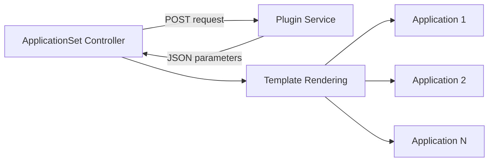

# How to Use Plugin Generator in ArgoCD ApplicationSets

Author: [nawazdhandala](https://github.com/nawazdhandala)

Tags: ArgoCD, GitOps, Kubernetes, ApplicationSet, Automation

Description: Learn how to use the ArgoCD ApplicationSet plugin generator to call external services and APIs to dynamically generate application parameters for custom deployment workflows.

---

The plugin generator is the escape hatch in the ApplicationSet generator system. When the built-in generators (list, cluster, git, SCM provider, pull request) do not fit your use case, the plugin generator lets you call an external HTTP service that returns the parameter sets. This gives you unlimited flexibility to integrate ArgoCD with any data source - CMDBs, service registries, internal APIs, or custom deployment logic.

## How the Plugin Generator Works

The plugin generator sends an HTTP POST request to an external service. The service returns a JSON array of parameter maps. Each parameter map becomes one Application through the template.



The controller sends the request on every reconciliation cycle, so the plugin service should be fast and idempotent.

## Plugin Service Requirements

The plugin service must:
- Accept HTTP POST requests
- Return a JSON response with a `parameters` array
- Each element in the array must be an object with string key-value pairs
- Respond quickly (the controller has a timeout, default 3 seconds)

### Expected Response Format

```json
{
  "parameters": [
    {
      "name": "api-gateway",
      "namespace": "api",
      "cluster": "production",
      "image_tag": "v1.5.0"
    },
    {
      "name": "user-service",
      "namespace": "users",
      "cluster": "production",
      "image_tag": "v2.1.0"
    }
  ]
}
```

### Request Format

The controller sends a POST request with this body:

```json
{
  "applicationSetName": "my-appset",
  "input": {
    "parameters": {
      "key1": "value1",
      "key2": "value2"
    }
  }
}
```

The `input.parameters` come from the ApplicationSet spec (more on this below).

## Configuring the Plugin Generator

### Step 1: Create the Plugin ConfigMap

The plugin generator is configured through a ConfigMap that specifies how to reach the external service:

```yaml
apiVersion: v1
kind: ConfigMap
metadata:
  name: service-registry-plugin
  namespace: argocd
data:
  token: "$plugin.token"
  baseUrl: "http://service-registry.internal.svc.cluster.local:8080"
```

### Step 2: Store the Token in a Secret

If your plugin service requires authentication:

```yaml
apiVersion: v1
kind: Secret
metadata:
  name: argocd-applicationset-plugin-token
  namespace: argocd
type: Opaque
stringData:
  plugin.token: "your-auth-token-here"
```

### Step 3: Create the ApplicationSet

```yaml
apiVersion: argoproj.io/v1alpha1
kind: ApplicationSet
metadata:
  name: from-service-registry
  namespace: argocd
spec:
  generators:
    - plugin:
        configMapRef:
          name: service-registry-plugin
        input:
          parameters:
            environment: production
            team: platform
  template:
    metadata:
      name: '{{name}}'
      labels:
        environment: '{{cluster}}'
    spec:
      project: default
      source:
        repoURL: 'https://github.com/company/{{name}}.git'
        targetRevision: '{{image_tag}}'
        path: 'deploy/k8s'
      destination:
        server: 'https://{{cluster}}-cluster.example.com'
        namespace: '{{namespace}}'
```

The `input.parameters` are sent to the plugin service with every request, allowing you to pass context about what parameters you need.

## Building a Plugin Service

Here is a minimal plugin service in Python that returns applications from a service registry:

```python
# plugin_service.py
from flask import Flask, request, jsonify

app = Flask(__name__)

# Simulated service registry
SERVICE_REGISTRY = {
    "production": [
        {"name": "api-gateway", "namespace": "api", "cluster": "production", "image_tag": "v1.5.0"},
        {"name": "user-service", "namespace": "users", "cluster": "production", "image_tag": "v2.1.0"},
        {"name": "payment-service", "namespace": "payments", "cluster": "production", "image_tag": "v3.0.2"},
    ],
    "staging": [
        {"name": "api-gateway", "namespace": "api", "cluster": "staging", "image_tag": "main"},
        {"name": "user-service", "namespace": "users", "cluster": "staging", "image_tag": "main"},
    ],
}

@app.route("/api/v1/getparams.execute", methods=["POST"])
def get_parameters():
    # Parse the input parameters from ArgoCD
    body = request.json
    input_params = body.get("input", {}).get("parameters", {})
    environment = input_params.get("environment", "staging")

    # Look up services for the requested environment
    services = SERVICE_REGISTRY.get(environment, [])

    return jsonify({"parameters": services})

if __name__ == "__main__":
    app.run(host="0.0.0.0", port=8080)
```

### Deploying the Plugin Service

```yaml
apiVersion: apps/v1
kind: Deployment
metadata:
  name: service-registry-plugin
  namespace: argocd
spec:
  replicas: 2
  selector:
    matchLabels:
      app: service-registry-plugin
  template:
    metadata:
      labels:
        app: service-registry-plugin
    spec:
      containers:
        - name: plugin
          image: company/service-registry-plugin:v1.0.0
          ports:
            - containerPort: 8080
          resources:
            requests:
              cpu: 100m
              memory: 128Mi
            limits:
              cpu: 200m
              memory: 256Mi
          readinessProbe:
            httpGet:
              path: /health
              port: 8080
            initialDelaySeconds: 5
---
apiVersion: v1
kind: Service
metadata:
  name: service-registry-plugin
  namespace: argocd
spec:
  selector:
    app: service-registry-plugin
  ports:
    - port: 8080
      targetPort: 8080
```

## Real-World Use Cases

### CMDB Integration

Pull application metadata from your Configuration Management Database:

```python
@app.route("/api/v1/getparams.execute", methods=["POST"])
def get_from_cmdb():
    body = request.json
    team = body["input"]["parameters"].get("team")

    # Query CMDB for team's services
    services = cmdb_client.get_services(team=team, status="active")

    parameters = []
    for svc in services:
        parameters.append({
            "name": svc.name,
            "namespace": svc.kubernetes_namespace,
            "repo": svc.git_repository,
            "revision": svc.deployed_version,
            "cluster": svc.target_cluster,
        })

    return jsonify({"parameters": parameters})
```

### Feature Flag Service Integration

Deploy applications based on feature flags:

```python
@app.route("/api/v1/getparams.execute", methods=["POST"])
def get_from_feature_flags():
    body = request.json
    environment = body["input"]["parameters"].get("environment")

    # Get active feature flags
    flags = feature_flag_client.get_flags(environment=environment)

    parameters = []
    for flag in flags:
        if flag.is_enabled:
            parameters.append({
                "name": f"{flag.service}-{flag.name}",
                "service": flag.service,
                "feature_branch": flag.branch,
                "namespace": f"feature-{flag.name}",
            })

    return jsonify({"parameters": parameters})
```

### Dynamic Cluster Assignment

Let an external scheduler decide which cluster each application should deploy to:

```python
@app.route("/api/v1/getparams.execute", methods=["POST"])
def get_cluster_assignments():
    # Query scheduler for optimal cluster assignments
    assignments = scheduler.get_assignments()

    parameters = []
    for assignment in assignments:
        parameters.append({
            "name": assignment.app_name,
            "cluster_url": assignment.cluster_url,
            "namespace": assignment.namespace,
            "repo": assignment.source_repo,
            "path": assignment.manifest_path,
        })

    return jsonify({"parameters": parameters})
```

## Plugin Generator with Go Templates

For complex parameter handling, enable Go templates:

```yaml
apiVersion: argoproj.io/v1alpha1
kind: ApplicationSet
metadata:
  name: from-plugin
  namespace: argocd
spec:
  goTemplate: true
  generators:
    - plugin:
        configMapRef:
          name: service-registry-plugin
        input:
          parameters:
            environment: production
  template:
    metadata:
      name: '{{ .name }}'
      labels:
        team: '{{ default "unknown" .team }}'
    spec:
      project: default
      source:
        repoURL: '{{ .repo }}'
        targetRevision: '{{ .revision }}'
        path: '{{ if .customPath }}{{ .customPath }}{{ else }}deploy/k8s{{ end }}'
      destination:
        server: '{{ .cluster_url }}'
        namespace: '{{ .namespace }}'
```

## Security Considerations

### Authentication

Always authenticate requests to your plugin service:

```python
@app.before_request
def check_auth():
    token = request.headers.get("Authorization", "").replace("Bearer ", "")
    if token != os.environ["EXPECTED_TOKEN"]:
        return jsonify({"error": "unauthorized"}), 401
```

### Network Policies

Restrict access to the plugin service:

```yaml
apiVersion: networking.k8s.io/v1
kind: NetworkPolicy
metadata:
  name: plugin-service-access
  namespace: argocd
spec:
  podSelector:
    matchLabels:
      app: service-registry-plugin
  policyTypes:
    - Ingress
  ingress:
    - from:
        - podSelector:
            matchLabels:
              app.kubernetes.io/component: applicationset-controller
      ports:
        - port: 8080
```

### Input Validation

Validate all input parameters in your plugin service:

```python
@app.route("/api/v1/getparams.execute", methods=["POST"])
def get_parameters():
    body = request.json

    # Validate required fields
    if "input" not in body or "parameters" not in body["input"]:
        return jsonify({"error": "missing input parameters"}), 400

    environment = body["input"]["parameters"].get("environment")
    if environment not in ["production", "staging", "development"]:
        return jsonify({"error": f"invalid environment: {environment}"}), 400

    # Process valid request
    ...
```

## Debugging Plugin Generator Issues

```bash
# Check ApplicationSet controller logs for plugin errors
kubectl logs -n argocd -l app.kubernetes.io/component=applicationset-controller | \
  grep -i "plugin\|error\|from-service"

# Test the plugin service directly
kubectl port-forward -n argocd svc/service-registry-plugin 8080:8080 &
curl -X POST http://localhost:8080/api/v1/getparams.execute \
  -H "Content-Type: application/json" \
  -d '{"applicationSetName":"test","input":{"parameters":{"environment":"production"}}}'

# Check plugin service health
kubectl logs -n argocd -l app=service-registry-plugin --tail=50
```

Common issues:
- **Timeout**: The default timeout is 3 seconds. If your plugin service takes longer, the controller reports an error. Optimize the service or increase the timeout.
- **Wrong endpoint**: The controller sends to `<baseUrl>/api/v1/getparams.execute` by default. Make sure your service handles this path.
- **Non-string values**: All parameter values must be strings. If your service returns integers or booleans, convert them to strings.
- **Empty response**: Return `{"parameters": []}` for no results, not an empty body.

The plugin generator opens up ArgoCD ApplicationSets to any data source you can imagine. When the built-in generators are not enough, build a simple HTTP service and let the plugin generator call it. For built-in generator options, see the [ApplicationSet controllers and generators overview](https://oneuptime.com/blog/post/2026-02-26-argocd-applicationset-controllers-generators/view).
