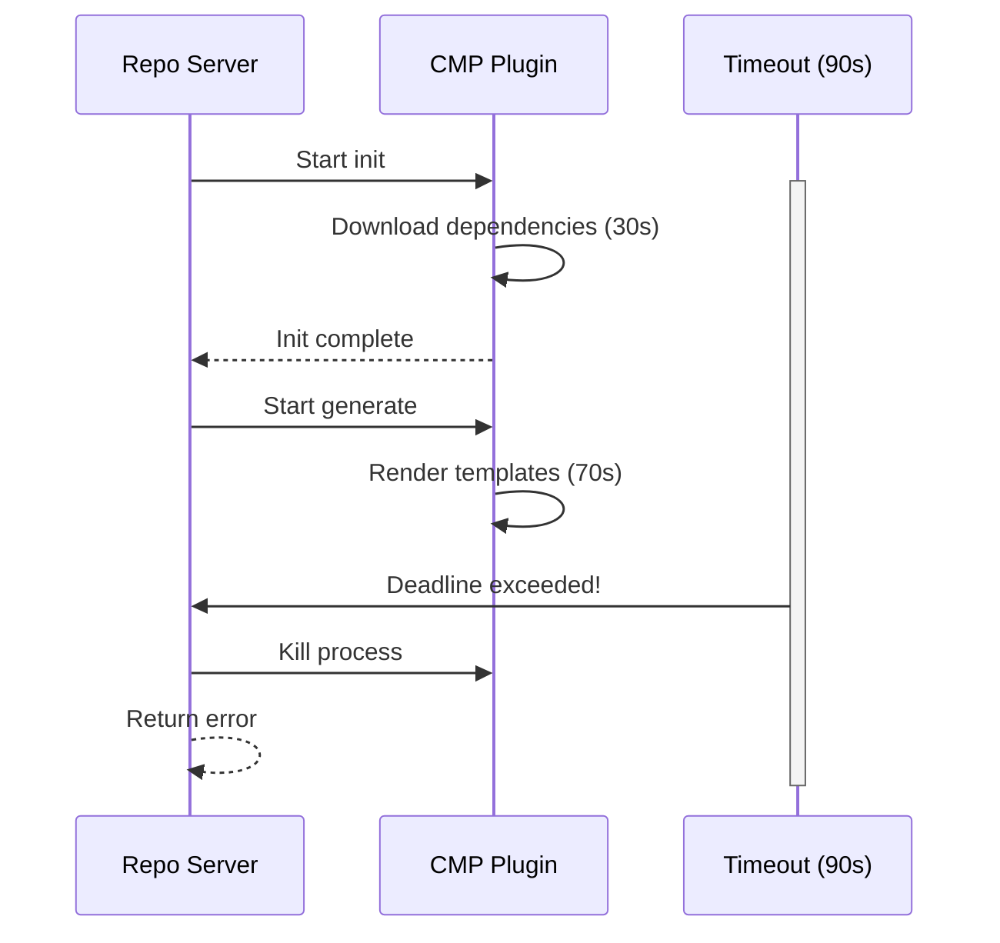

# How to Handle Plugin Timeouts in ArgoCD

Author: [nawazdhandala](https://github.com/nawazdhandala)

Tags: ArgoCD, GitOps, Kubernetes, Config Management Plugins, Performance

Description: Learn how to configure and troubleshoot plugin timeouts in ArgoCD when manifest generation takes too long in CMP sidecar plugins.

---

When an ArgoCD Config Management Plugin takes too long to generate manifests, the request times out and the application sync fails with a `DeadlineExceeded` error. This is one of the most common CMP issues, especially with plugins that download dependencies, decrypt secrets, or render complex templates. Understanding how timeouts work and how to configure them properly is essential for running CMP plugins in production.

## Default Timeout Behavior

ArgoCD has a default timeout of 90 seconds for manifest generation. This applies to the entire CMP pipeline - the init command and the generate command combined. If your plugin does not complete within this window, ArgoCD kills the operation and returns an error:

```text
rpc error: code = DeadlineExceeded desc = context deadline exceeded
```

The timeout is enforced at the repo-server level, not within the plugin itself. Even if your plugin's shell script would eventually complete, the repo-server will cut the connection after the deadline.



## Configuring the Timeout

### Global Timeout Setting

The manifest generation timeout is configured on the repo-server through the `--cmp-timeout` flag or the `ARGOCD_EXEC_TIMEOUT` environment variable:

```yaml
apiVersion: apps/v1
kind: Deployment
metadata:
  name: argocd-repo-server
  namespace: argocd
spec:
  template:
    spec:
      containers:
        - name: argocd-repo-server
          args:
            - /usr/local/bin/argocd-repo-server
            # Increase timeout to 180 seconds
            - --cmp-timeout
            - "180"
          env:
            # Alternative: use environment variable
            - name: ARGOCD_EXEC_TIMEOUT
              value: "180s"
```

If you are using Helm to deploy ArgoCD:

```yaml
# values.yaml for ArgoCD Helm chart
repoServer:
  extraArgs:
    - --cmp-timeout
    - "180"
  # Or via environment variable
  env:
    - name: ARGOCD_EXEC_TIMEOUT
      value: "180s"
```

### What Timeout Value to Choose

The right timeout depends on what your plugin does:

| Plugin Type | Typical Duration | Recommended Timeout |
|-------------|-----------------|-------------------|
| Simple template rendering | 1-5s | 90s (default) |
| Helm with dependencies | 10-30s | 120s |
| SOPS decryption with KMS | 5-15s | 120s |
| jsonnet-bundler install + render | 30-60s | 180s |
| Complex multi-step pipelines | 60-120s | 300s |

Setting the timeout too high can mask performance problems. Setting it too low causes unnecessary failures. Measure your plugin's actual execution time before choosing a value.

## Diagnosing Timeout Issues

### Measure Plugin Execution Time

First, figure out how long your plugin actually takes:

```bash
# Get into the sidecar and time the generate command
kubectl exec -it deployment/argocd-repo-server \
  -n argocd \
  -c my-custom-plugin -- \
  sh -c 'time (cd /tmp/test-repo && /path/to/generate-script.sh)'
```

Or add timing to your plugin temporarily:

```yaml
generate:
  command: [sh, -c]
  args:
    - |
      START=$(date +%s)

      # Your actual generation logic
      helm dependency build . 2>/dev/null
      helm template my-app . -f values.yaml

      END=$(date +%s)
      echo "Generation took $((END - START)) seconds" >&2
```

### Check Logs for Timeout Events

```bash
# Look for timeout errors in repo-server logs
kubectl logs deployment/argocd-repo-server \
  -n argocd \
  -c argocd-repo-server \
  --tail=200 | grep -i "deadline\|timeout\|exceeded"

# Check the plugin sidecar for incomplete operations
kubectl logs deployment/argocd-repo-server \
  -n argocd \
  -c my-custom-plugin \
  --tail=200 | grep -i "killed\|signal\|abort"
```

## Optimizing Plugin Performance to Avoid Timeouts

Instead of just increasing the timeout, optimize your plugin to run faster.

### Cache Dependencies

The biggest time waster is downloading dependencies on every generation. Use persistent volumes or init containers to cache them:

```yaml
# Cache Helm chart dependencies
apiVersion: apps/v1
kind: Deployment
metadata:
  name: argocd-repo-server
  namespace: argocd
spec:
  template:
    spec:
      containers:
        - name: helm-plugin
          image: my-registry/argocd-cmp-helm:v1.0
          volumeMounts:
            # Persistent Helm cache
            - name: helm-cache
              mountPath: /home/argocd/.cache/helm
            - name: helm-repos
              mountPath: /home/argocd/.config/helm
      volumes:
        # Use emptyDir for pod-level caching
        # Use PVC for persistent caching across restarts
        - name: helm-cache
          emptyDir: {}
        - name: helm-repos
          emptyDir: {}
```

### Skip Unnecessary Init Steps

Make your init command conditional:

```yaml
init:
  command: [sh, -c]
  args:
    - |
      # Only download dependencies if not already present
      if [ -f "Chart.yaml" ] && [ ! -d "charts/" ]; then
        helm dependency build .
      else
        echo "Dependencies already present, skipping init" >&2
      fi
```

### Parallelize Where Possible

If your plugin does multiple independent operations, run them in parallel:

```yaml
generate:
  command: [sh, -c]
  args:
    - |
      set -euo pipefail

      # Decrypt multiple files in parallel
      find . -name "*.enc.yaml" | xargs -P 4 -I {} \
        sh -c 'sops --decrypt "$1" > "${1%.enc.yaml}.yaml"' _ {}

      # Now render
      kustomize build .
```

### Reduce Network Calls

Network operations (KMS calls, dependency downloads, registry authentication) are the most common source of slowness:

```yaml
generate:
  command: [sh, -c]
  args:
    - |
      # Cache the KMS decryption key in a temp file
      # SOPS caches the data key, so decrypting multiple files
      # with the same key only requires one KMS call
      export SOPS_AGE_KEY_FILE=/home/argocd/.config/sops/age/keys.txt

      # Batch decrypt all files
      for f in secrets/*.yaml; do
        sops --decrypt "$f"
        echo "---"
      done
```

## Handling Intermittent Timeouts

Sometimes timeouts happen only occasionally due to network latency or resource contention. ArgoCD supports retry logic at the application level:

```yaml
apiVersion: argoproj.io/v1alpha1
kind: Application
metadata:
  name: my-app
spec:
  syncPolicy:
    retry:
      limit: 3
      backoff:
        duration: 10s
        factor: 2
        maxDuration: 1m
```

This retries the sync (including manifest generation) up to 3 times with exponential backoff. It helps with transient timeout issues but does not fix systematic performance problems.

## Monitoring Plugin Duration

Track manifest generation time with ArgoCD metrics to catch slowdowns before they cause timeouts:

```bash
# ArgoCD exposes manifest generation duration as a metric
# Query it with PromQL
argocd_repo_server_manifest_generation_duration_seconds{quantile="0.99"}
```

Set up an alert for when generation time approaches your timeout:

```yaml
# Prometheus alert rule
groups:
  - name: argocd-cmp
    rules:
      - alert: SlowManifestGeneration
        expr: |
          histogram_quantile(0.95,
            rate(argocd_repo_server_manifest_generation_duration_seconds_bucket[5m])
          ) > 60
        for: 10m
        labels:
          severity: warning
        annotations:
          summary: "ArgoCD manifest generation is slow (p95 > 60s)"
          description: "Consider increasing timeout or optimizing plugins"
```

## Platform-Specific Timeout Considerations

### AWS KMS

If using AWS KMS for SOPS decryption, KMS API calls can be slow when there is throttling. Check CloudWatch for KMS throttling events and consider requesting a quota increase.

### Helm Repository Index

Large Helm repository indexes (like the Bitnami repo) take time to download and parse. Use the `--repository-cache` flag or pin specific chart versions to avoid index downloads.

### Git Clone Time

For large repositories, the git clone phase (handled by the repo-server, not the plugin) can eat into the overall timeout. Consider using Git sparse checkout or separating large repos.

## Summary

Plugin timeouts in ArgoCD are controlled by the repo-server's `--cmp-timeout` flag, defaulting to 90 seconds. When your plugins need more time, increase the timeout to a reasonable value based on actual measurements. But more importantly, optimize your plugins to be faster - cache dependencies, skip unnecessary init steps, parallelize operations, and minimize network calls. Monitor manifest generation duration with Prometheus metrics to catch slowdowns before they turn into timeout failures.
