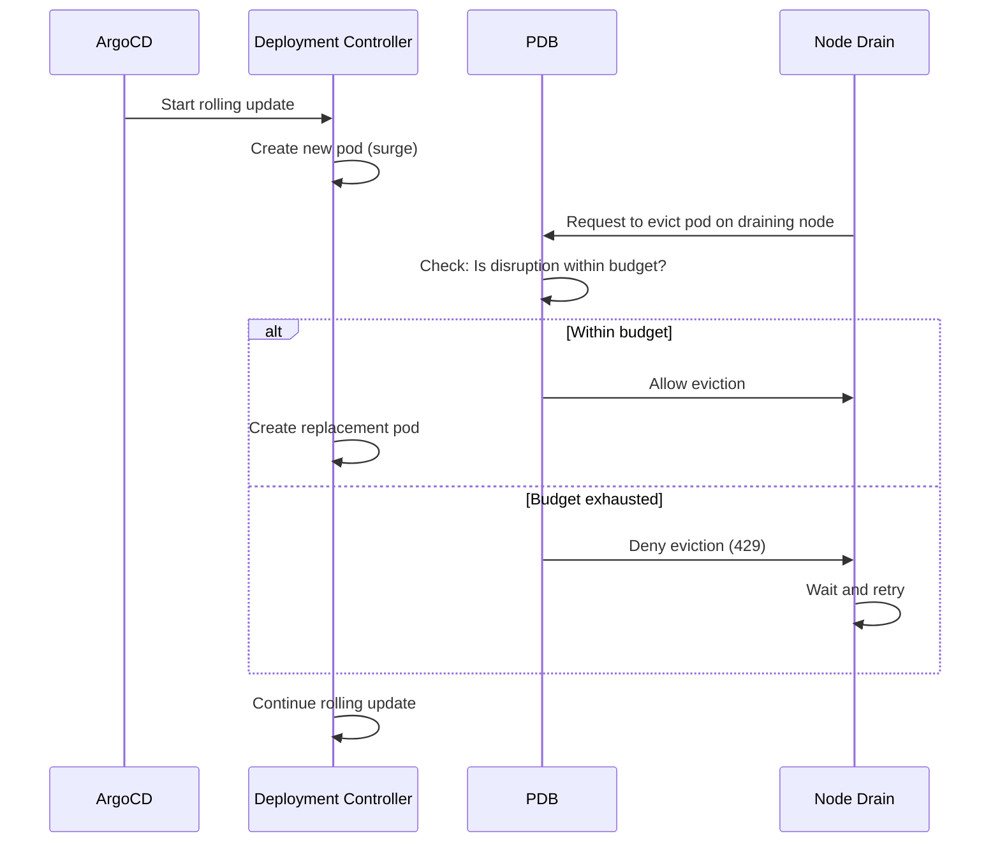

# How to Handle Pod Disruption During Deployment with ArgoCD

Author: [nawazdhandala](https://github.com/nawazdhandala)

Tags: ArgoCD, GitOps, Kubernetes, Pod Disruption, Deployment

Description: Learn how to handle pod disruptions during ArgoCD deployments including PDB configuration, node drains, preemption, and maintaining service availability during rollouts.

---

Pod disruptions during deployments are a common source of service degradation. While you are rolling out a new version, Kubernetes might also be draining nodes, the cluster autoscaler might be scaling down, or spot instances might be reclaimed. When these events overlap with your ArgoCD deployment, you can lose more pods than expected and impact users. This guide covers how to protect your services from pod disruptions during deployments.

## Understanding Pod Disruptions

There are two types of pod disruptions:

**Voluntary disruptions** (things you or the system intentionally trigger):
- Node drains for maintenance
- Cluster autoscaler scaling down
- ArgoCD rolling updates
- Manual pod deletions

**Involuntary disruptions** (things you cannot control):
- Hardware failures
- Kernel panics
- Spot instance reclamation
- OOM kills

During an ArgoCD deployment, a rolling update is already a voluntary disruption. If another voluntary disruption happens simultaneously, you can end up with fewer pods than your minimum availability requires.

## Pod Disruption Budgets

PDBs are your primary defense against cascading disruptions:

```yaml
# pdb.yaml
apiVersion: policy/v1
kind: PodDisruptionBudget
metadata:
  name: api-server-pdb
spec:
  # Option 1: Minimum available (use for services with known minimum capacity)
  minAvailable: 3

  # Option 2: Maximum unavailable (use for services where you know acceptable loss)
  # maxUnavailable: 1

  selector:
    matchLabels:
      app: api-server
```

The choice between `minAvailable` and `maxUnavailable` matters:

- `minAvailable: 3` with 4 replicas means only 1 can be down at a time (including during deployment)
- `maxUnavailable: 1` with 4 replicas also means only 1 can be down, but scales better when you change replica counts

For most services, `maxUnavailable: 1` is the better choice because it adapts to replica count changes.

## Configuring PDB with Rolling Updates

Your PDB and rolling update strategy need to be coordinated:

```yaml
apiVersion: apps/v1
kind: Deployment
metadata:
  name: api-server
spec:
  replicas: 6
  strategy:
    type: RollingUpdate
    rollingUpdate:
      maxSurge: 2        # Create up to 2 extra pods
      maxUnavailable: 0  # Never remove a ready pod before its replacement is ready
  template:
    spec:
      terminationGracePeriodSeconds: 60
      containers:
        - name: api
          image: myregistry/api:v2.0.0
          readinessProbe:
            httpGet:
              path: /healthz
              port: 8080
            initialDelaySeconds: 10
            periodSeconds: 5
          lifecycle:
            preStop:
              exec:
                command: ["/bin/sh", "-c", "sleep 15"]
---
apiVersion: policy/v1
kind: PodDisruptionBudget
metadata:
  name: api-server-pdb
spec:
  maxUnavailable: 1
  selector:
    matchLabels:
      app: api-server
```

With this configuration:

- The deployment creates 2 new pods at a time (maxSurge: 2)
- Old pods are not removed until new pods are ready (maxUnavailable: 0)
- The PDB ensures that at most 1 pod is disrupted by external factors (node drain, etc.)
- Combined, you might temporarily have 7 pods running (6 + 2 surge - 1 being removed)

## Handling Node Drains During Deployment

When a node drain happens during a deployment, the PDB protects you, but you need to be aware of the interaction:



The PDB will block the node drain from evicting pods if it would violate the disruption budget. The drain will wait (with a timeout) until the PDB allows it.

## Configuring ArgoCD for Disruption Awareness

Make ArgoCD aware of PDBs in its health checks:

```yaml
# argocd-cm
apiVersion: v1
kind: ConfigMap
metadata:
  name: argocd-cm
  namespace: argocd
data:
  resource.customizations.health.policy_PodDisruptionBudget: |
    hs = {}
    if obj.status ~= nil then
      if obj.status.currentHealthy ~= nil and obj.status.desiredHealthy ~= nil then
        if obj.status.currentHealthy >= obj.status.desiredHealthy then
          hs.status = "Healthy"
          hs.message = string.format("Current healthy: %d, Desired healthy: %d",
            obj.status.currentHealthy, obj.status.desiredHealthy)
        else
          hs.status = "Degraded"
          hs.message = string.format("Current healthy: %d, Desired healthy: %d - below threshold",
            obj.status.currentHealthy, obj.status.desiredHealthy)
        end
      end
    end
    return hs
```

This makes ArgoCD show the PDB as degraded when the number of healthy pods drops below the desired minimum.

## Handling Spot Instance Preemption

If you run workloads on spot instances, preemption can happen at any time:

```yaml
apiVersion: apps/v1
kind: Deployment
metadata:
  name: api-server
spec:
  template:
    spec:
      # Spread pods across nodes and zones
      topologySpreadConstraints:
        - maxSkew: 1
          topologyKey: kubernetes.io/hostname
          whenUnsatisfiable: DoNotSchedule
          labelSelector:
            matchLabels:
              app: api-server
        - maxSkew: 1
          topologyKey: topology.kubernetes.io/zone
          whenUnsatisfiable: ScheduleAnyway
          labelSelector:
            matchLabels:
              app: api-server
      # Prefer on-demand nodes for critical services
      affinity:
        nodeAffinity:
          preferredDuringSchedulingIgnoredDuringExecution:
            - weight: 100
              preference:
                matchExpressions:
                  - key: node.kubernetes.io/lifecycle
                    operator: In
                    values:
                      - on-demand
```

Topology spread constraints ensure your pods are distributed across nodes and zones, so a single node loss does not take out all your replicas.

## Graceful Handling of Disruptions in Application Code

Your application should handle disruptions gracefully:

```yaml
# deployment with graceful shutdown
apiVersion: apps/v1
kind: Deployment
metadata:
  name: api-server
spec:
  template:
    spec:
      terminationGracePeriodSeconds: 90
      containers:
        - name: api
          lifecycle:
            preStop:
              exec:
                command:
                  - /bin/sh
                  - -c
                  - |
                    # Signal the app to stop accepting new connections
                    curl -s -X POST http://localhost:8080/admin/drain

                    # Wait for in-flight requests to complete
                    sleep 20

                    # Check if there are still active connections
                    ACTIVE=$(curl -s http://localhost:8080/admin/connections)
                    if [ "$ACTIVE" -gt "0" ]; then
                      echo "Waiting for $ACTIVE connections to drain"
                      sleep 30
                    fi
```

## ArgoCD Application Configuration

Configure the ArgoCD Application to handle disruptions:

```yaml
apiVersion: argoproj.io/v1alpha1
kind: Application
metadata:
  name: api-server
  namespace: argocd
spec:
  project: production
  source:
    repoURL: https://github.com/myorg/api-server.git
    targetRevision: main
    path: k8s/production
  destination:
    server: https://kubernetes.default.svc
    namespace: api
  syncPolicy:
    automated:
      prune: true
      selfHeal: true
    syncOptions:
      - ApplyOutOfSyncOnly=true
    retry:
      limit: 5
      backoff:
        duration: 30s
        factor: 2
        maxDuration: 5m
```

The retry configuration is important. If a sync fails because pods cannot be scheduled (due to node drain or resource pressure), ArgoCD will retry with exponential backoff.

## Multi-Replica Deployment with Disruption Protection

Here is a complete example tying everything together:

```yaml
# Complete disruption-aware deployment
apiVersion: apps/v1
kind: Deployment
metadata:
  name: api-server
  labels:
    app: api-server
spec:
  replicas: 6
  strategy:
    type: RollingUpdate
    rollingUpdate:
      maxSurge: 2
      maxUnavailable: 0
  selector:
    matchLabels:
      app: api-server
  template:
    metadata:
      labels:
        app: api-server
    spec:
      terminationGracePeriodSeconds: 90
      topologySpreadConstraints:
        - maxSkew: 1
          topologyKey: kubernetes.io/hostname
          whenUnsatisfiable: DoNotSchedule
          labelSelector:
            matchLabels:
              app: api-server
      containers:
        - name: api
          image: myregistry/api:v2.0.0
          ports:
            - containerPort: 8080
          readinessProbe:
            httpGet:
              path: /healthz
              port: 8080
            initialDelaySeconds: 15
            periodSeconds: 5
            successThreshold: 2
          livenessProbe:
            httpGet:
              path: /healthz/live
              port: 8080
            initialDelaySeconds: 30
            periodSeconds: 10
            failureThreshold: 5
          lifecycle:
            preStop:
              exec:
                command: ["/bin/sh", "-c", "sleep 20"]
          resources:
            requests:
              cpu: "500m"
              memory: "512Mi"
            limits:
              cpu: "2"
              memory: "2Gi"
---
apiVersion: policy/v1
kind: PodDisruptionBudget
metadata:
  name: api-server-pdb
spec:
  maxUnavailable: 1
  selector:
    matchLabels:
      app: api-server
```

## Monitoring Disruptions

Track pod disruptions with Prometheus:

```yaml
apiVersion: monitoring.coreos.com/v1
kind: PrometheusRule
metadata:
  name: disruption-alerts
spec:
  groups:
    - name: pod_disruptions
      rules:
        - alert: HighPodEvictionRate
          expr: |
            sum(increase(kube_pod_status_reason{reason="Evicted"}[1h])) by (namespace) > 5
          for: 5m
          labels:
            severity: warning
          annotations:
            summary: "High pod eviction rate in {{ $labels.namespace }}"

        - alert: PDBViolation
          expr: |
            kube_poddisruptionbudget_status_current_healthy
            < kube_poddisruptionbudget_status_desired_healthy
          for: 5m
          labels:
            severity: critical
          annotations:
            summary: "PDB {{ $labels.poddisruptionbudget }} is violated"
```

## Best Practices

1. **Always create PDBs for production services** - Without PDBs, node drains can evict all pods of a service simultaneously.

2. **Coordinate PDB with rolling update strategy** - If your PDB allows `maxUnavailable: 1` and your deployment has `maxUnavailable: 1`, a node drain during deployment could take 2 pods offline.

3. **Use `maxUnavailable: 0` in your deployment** - Let the PDB handle external disruptions, and let `maxSurge` handle the rollout pace.

4. **Spread pods across nodes and zones** - Topology spread constraints prevent a single node failure from taking out all replicas.

5. **Set generous termination grace periods** - Give pods enough time to drain connections before they are killed.

6. **Monitor PDB status** - Alert when healthy pod count drops below the desired minimum.

Handling pod disruptions during ArgoCD deployments requires coordination between your deployment strategy, PDB configuration, and application behavior. Getting this right ensures your services remain available even when multiple disruption events happen simultaneously.
