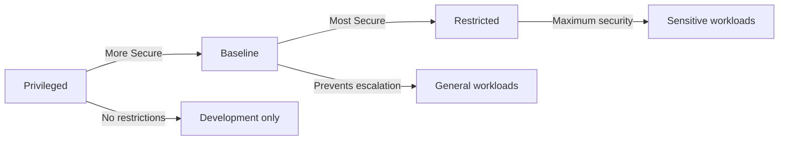

# How to Configure Pod Security Standards for ArgoCD

Author: [nawazdhandala](https://github.com/nawazdhandala)

Tags: ArgoCD, GitOps, Kubernetes, Security, Pod Security

Description: Learn how to configure Kubernetes Pod Security Standards and Pod Security Admission for ArgoCD to enforce container security best practices.

---

Pod Security Standards (PSS) define three levels of security for Kubernetes pods: Privileged, Baseline, and Restricted. Starting with Kubernetes 1.25, Pod Security Admission (PSA) is the built-in mechanism for enforcing these standards. This guide covers how to configure PSS for both the ArgoCD namespace and the namespaces where ArgoCD deploys applications.

## Understanding Pod Security Standards

Kubernetes defines three security levels:

- **Privileged**: No restrictions. Allows anything.
- **Baseline**: Prevents known privilege escalations. Blocks hostNetwork, hostPID, privileged containers, etc.
- **Restricted**: The most secure. Requires running as non-root, drops all capabilities, and enforces read-only root filesystem.



## Applying PSS to the ArgoCD Namespace

ArgoCD components are designed to run under the Restricted policy with minor adjustments. Apply Pod Security labels to the argocd namespace:

```yaml
apiVersion: v1
kind: Namespace
metadata:
  name: argocd
  labels:
    # Enforce baseline as minimum
    pod-security.kubernetes.io/enforce: baseline
    pod-security.kubernetes.io/enforce-version: latest
    # Warn on restricted violations (helpful during migration)
    pod-security.kubernetes.io/warn: restricted
    pod-security.kubernetes.io/warn-version: latest
    # Audit restricted violations
    pod-security.kubernetes.io/audit: restricted
    pod-security.kubernetes.io/audit-version: latest
```

This configuration enforces the Baseline standard (blocking obvious security issues) while warning about violations of the stricter Restricted standard.

## Making ArgoCD Containers Restricted-Compliant

To run ArgoCD under the Restricted policy, you need to configure security contexts for all components.

### ArgoCD Server

```yaml
apiVersion: apps/v1
kind: Deployment
metadata:
  name: argocd-server
  namespace: argocd
spec:
  template:
    spec:
      securityContext:
        runAsNonRoot: true
        runAsUser: 999
        fsGroup: 999
        seccompProfile:
          type: RuntimeDefault
      containers:
        - name: argocd-server
          securityContext:
            allowPrivilegeEscalation: false
            readOnlyRootFilesystem: true
            runAsNonRoot: true
            runAsUser: 999
            capabilities:
              drop:
                - ALL
          volumeMounts:
            - name: tmp
              mountPath: /tmp
            - name: static-files
              mountPath: /shared/app
      volumes:
        - name: tmp
          emptyDir: {}
        - name: static-files
          emptyDir: {}
```

### Application Controller

```yaml
apiVersion: apps/v1
kind: Deployment
metadata:
  name: argocd-application-controller
  namespace: argocd
spec:
  template:
    spec:
      securityContext:
        runAsNonRoot: true
        runAsUser: 999
        fsGroup: 999
        seccompProfile:
          type: RuntimeDefault
      containers:
        - name: argocd-application-controller
          securityContext:
            allowPrivilegeEscalation: false
            readOnlyRootFilesystem: true
            runAsNonRoot: true
            runAsUser: 999
            capabilities:
              drop:
                - ALL
          volumeMounts:
            - name: tmp
              mountPath: /tmp
      volumes:
        - name: tmp
          emptyDir: {}
```

### Repo Server

The repo server needs writable directories for cloning repositories and running plugins:

```yaml
apiVersion: apps/v1
kind: Deployment
metadata:
  name: argocd-repo-server
  namespace: argocd
spec:
  template:
    spec:
      securityContext:
        runAsNonRoot: true
        runAsUser: 999
        fsGroup: 999
        seccompProfile:
          type: RuntimeDefault
      containers:
        - name: argocd-repo-server
          securityContext:
            allowPrivilegeEscalation: false
            readOnlyRootFilesystem: true
            runAsNonRoot: true
            runAsUser: 999
            capabilities:
              drop:
                - ALL
          volumeMounts:
            - name: tmp
              mountPath: /tmp
            - name: helm-working-dir
              mountPath: /helm-working-dir
            - name: plugins
              mountPath: /home/argocd/cmp-server/plugins
            - name: gpg-keys
              mountPath: /app/config/gpg/source
            - name: gpg-keyring
              mountPath: /app/config/gpg/keys
      volumes:
        - name: tmp
          emptyDir: {}
        - name: helm-working-dir
          emptyDir: {}
        - name: plugins
          emptyDir: {}
        - name: gpg-keys
          configMap:
            name: argocd-gpg-keys-cm
        - name: gpg-keyring
          emptyDir: {}
```

### Redis

```yaml
apiVersion: apps/v1
kind: Deployment
metadata:
  name: argocd-redis
  namespace: argocd
spec:
  template:
    spec:
      securityContext:
        runAsNonRoot: true
        runAsUser: 999
        fsGroup: 999
        seccompProfile:
          type: RuntimeDefault
      containers:
        - name: redis
          securityContext:
            allowPrivilegeEscalation: false
            readOnlyRootFilesystem: true
            runAsNonRoot: true
            runAsUser: 999
            capabilities:
              drop:
                - ALL
          volumeMounts:
            - name: data
              mountPath: /data
      volumes:
        - name: data
          emptyDir: {}
```

## Configuring PSS with Helm

If you install ArgoCD with Helm, set security contexts in your values file:

```yaml
# values-security.yaml
global:
  securityContext:
    runAsNonRoot: true
    runAsUser: 999
    fsGroup: 999
    seccompProfile:
      type: RuntimeDefault

server:
  containerSecurityContext:
    allowPrivilegeEscalation: false
    readOnlyRootFilesystem: true
    runAsNonRoot: true
    capabilities:
      drop:
        - ALL

controller:
  containerSecurityContext:
    allowPrivilegeEscalation: false
    readOnlyRootFilesystem: true
    runAsNonRoot: true
    capabilities:
      drop:
        - ALL

repoServer:
  containerSecurityContext:
    allowPrivilegeEscalation: false
    readOnlyRootFilesystem: true
    runAsNonRoot: true
    capabilities:
      drop:
        - ALL

redis:
  containerSecurityContext:
    allowPrivilegeEscalation: false
    readOnlyRootFilesystem: true
    runAsNonRoot: true
    capabilities:
      drop:
        - ALL
```

Install with:

```bash
helm install argocd argo/argo-cd \
  --namespace argocd \
  --create-namespace \
  -f values-security.yaml
```

## Enforcing PSS on Target Namespaces

ArgoCD deploys applications to other namespaces. Enforce Pod Security Standards on those namespaces too:

```yaml
# For production namespaces, enforce restricted
apiVersion: v1
kind: Namespace
metadata:
  name: app-production
  labels:
    pod-security.kubernetes.io/enforce: restricted
    pod-security.kubernetes.io/enforce-version: latest
---
# For staging, enforce baseline and warn on restricted
apiVersion: v1
kind: Namespace
metadata:
  name: app-staging
  labels:
    pod-security.kubernetes.io/enforce: baseline
    pod-security.kubernetes.io/warn: restricted
---
# For development, warn on baseline
apiVersion: v1
kind: Namespace
metadata:
  name: app-dev
  labels:
    pod-security.kubernetes.io/warn: baseline
```

## Handling PSS Violations in ArgoCD Syncs

When ArgoCD tries to sync an application that violates the namespace's Pod Security Standard, the sync will fail. Here is how to handle this:

```bash
# Check for PSA violations in the namespace events
kubectl get events -n app-production --field-selector reason=FailedCreate

# Check ArgoCD application status for sync errors
argocd app get my-app --show-operation
```

The error will look something like:

```
pods "my-app-xxx" is forbidden: violates PodSecurity "restricted:latest":
allowPrivilegeEscalation != false
(container "app" must set securityContext.allowPrivilegeEscalation=false)
```

Fix the application manifests to comply with the Pod Security Standard:

```yaml
# Fix: Add security context to the deployment
apiVersion: apps/v1
kind: Deployment
metadata:
  name: my-app
spec:
  template:
    spec:
      securityContext:
        runAsNonRoot: true
        seccompProfile:
          type: RuntimeDefault
      containers:
        - name: app
          securityContext:
            allowPrivilegeEscalation: false
            capabilities:
              drop:
                - ALL
```

## Validation and Testing

Verify that your ArgoCD installation complies with Pod Security Standards:

```bash
# Check for PSA warnings on existing pods
kubectl label --dry-run=server --overwrite namespace argocd \
  pod-security.kubernetes.io/enforce=restricted

# Check specific pods against restricted standard
kubectl get pods -n argocd -o json | jq '
  .items[] | {
    name: .metadata.name,
    runAsNonRoot: .spec.securityContext.runAsNonRoot,
    containers: [.spec.containers[] | {
      name: .name,
      allowPrivilegeEscalation: .securityContext.allowPrivilegeEscalation,
      readOnlyRootFilesystem: .securityContext.readOnlyRootFilesystem,
      capabilities: .securityContext.capabilities
    }]
  }
'
```

## Migrating from PodSecurityPolicy to Pod Security Standards

If you are migrating from the deprecated PodSecurityPolicy (PSP) to Pod Security Standards:

```bash
# Step 1: Check existing PSPs
kubectl get psp

# Step 2: Identify which PSP applies to ArgoCD
kubectl get rolebinding,clusterrolebinding -A -o json | \
  jq '.items[] | select(.subjects[]?.name == "argocd-server")'

# Step 3: Map PSP to PSS level
# Baseline PSS roughly maps to a restrictive PSP
# Restricted PSS maps to the most restrictive PSP

# Step 4: Apply PSS labels and test
kubectl label namespace argocd \
  pod-security.kubernetes.io/warn=restricted \
  --overwrite

# Step 5: Once everything passes, switch to enforce
kubectl label namespace argocd \
  pod-security.kubernetes.io/enforce=restricted \
  --overwrite
```

## Conclusion

Pod Security Standards provide a standardized way to enforce container security in Kubernetes. For ArgoCD, start with the Baseline standard in enforce mode and work toward Restricted. The key changes are running as non-root, dropping all capabilities, using read-only root filesystems, and enabling seccomp profiles. Apply the same standards to namespaces where ArgoCD deploys applications. Use the warn mode first to identify violations before switching to enforce mode.

For more security hardening, see our guide on [preventing privilege escalation in ArgoCD](https://oneuptime.com/blog/post/2026-02-26-argocd-prevent-privilege-escalation/view).
