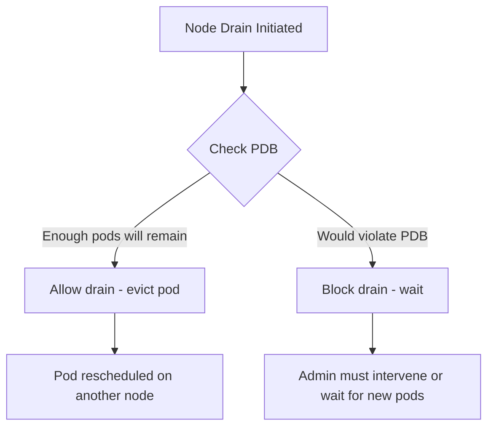

# How to Configure PodDisruptionBudgets for ArgoCD

Author: [nawazdhandala](https://github.com/nawazdhandala)

Tags: ArgoCD, GitOps, Kubernetes, High Availability, PDB

Description: Learn how to configure PodDisruptionBudgets for ArgoCD components to ensure high availability during node drains, upgrades, and cluster maintenance operations.

---

PodDisruptionBudgets (PDBs) protect your ArgoCD deployment from voluntary disruptions like node drains, cluster upgrades, and autoscaler scale-downs. Without PDBs, a node drain could kill all replicas of an ArgoCD component simultaneously, taking down your entire GitOps pipeline during maintenance. This guide covers PDB configuration for every ArgoCD component.

## What PDBs Do

A PDB tells Kubernetes how many pods of a given set must remain available (or how many can be unavailable) during voluntary disruptions:



PDBs only apply to voluntary disruptions. They do not protect against involuntary disruptions like node crashes, OOMKills, or hardware failures.

## PDB Configuration for Each Component

### API Server PDB

The API server is stateless with multiple replicas. Keep at least 2 running:

```yaml
apiVersion: policy/v1
kind: PodDisruptionBudget
metadata:
  name: argocd-server
  namespace: argocd
spec:
  minAvailable: 2
  selector:
    matchLabels:
      app.kubernetes.io/name: argocd-server
```

With 3 replicas and minAvailable 2, Kubernetes can drain one node at a time while keeping the API server accessible.

### Application Controller PDB

The controller uses leader election. With 2 replicas, keep at least 1 running:

```yaml
apiVersion: policy/v1
kind: PodDisruptionBudget
metadata:
  name: argocd-application-controller
  namespace: argocd
spec:
  minAvailable: 1
  selector:
    matchLabels:
      app.kubernetes.io/name: argocd-application-controller
```

With sharding (more replicas), adjust accordingly:

```yaml
# For 4 controller shards
apiVersion: policy/v1
kind: PodDisruptionBudget
metadata:
  name: argocd-application-controller
  namespace: argocd
spec:
  maxUnavailable: 1  # Allow at most 1 shard to be down
  selector:
    matchLabels:
      app.kubernetes.io/name: argocd-application-controller
```

### Repo Server PDB

The repo server is stateless. Keep most replicas running:

```yaml
apiVersion: policy/v1
kind: PodDisruptionBudget
metadata:
  name: argocd-repo-server
  namespace: argocd
spec:
  minAvailable: 2
  selector:
    matchLabels:
      app.kubernetes.io/name: argocd-repo-server
```

### Redis PDB

For Redis HA with 3 replicas, keep the majority running for quorum:

```yaml
apiVersion: policy/v1
kind: PodDisruptionBudget
metadata:
  name: argocd-redis-ha
  namespace: argocd
spec:
  minAvailable: 2
  selector:
    matchLabels:
      app.kubernetes.io/name: argocd-redis-ha
```

For Redis HA HAProxy:

```yaml
apiVersion: policy/v1
kind: PodDisruptionBudget
metadata:
  name: argocd-redis-ha-haproxy
  namespace: argocd
spec:
  minAvailable: 1
  selector:
    matchLabels:
      app.kubernetes.io/name: argocd-redis-ha-haproxy
```

### ApplicationSet Controller PDB

```yaml
apiVersion: policy/v1
kind: PodDisruptionBudget
metadata:
  name: argocd-applicationset-controller
  namespace: argocd
spec:
  minAvailable: 1
  selector:
    matchLabels:
      app.kubernetes.io/name: argocd-applicationset-controller
```

## Using Helm to Configure PDBs

The ArgoCD Helm chart has built-in PDB support:

```yaml
# argocd-pdb-values.yaml

controller:
  replicas: 2
  pdb:
    enabled: true
    minAvailable: 1
    # OR use maxUnavailable instead:
    # maxUnavailable: 1

server:
  replicas: 3
  pdb:
    enabled: true
    minAvailable: 2

repoServer:
  replicas: 3
  pdb:
    enabled: true
    minAvailable: 2

redis-ha:
  enabled: true
  replicas: 3
  # Redis HA chart manages its own PDBs

applicationSet:
  replicas: 2
  pdb:
    enabled: true
    minAvailable: 1

notifications:
  # Only 1 replica typically, PDB not useful
  pdb:
    enabled: false
```

Apply:

```bash
helm upgrade argocd argo/argo-cd \
  --namespace argocd \
  --values argocd-pdb-values.yaml
```

## minAvailable vs maxUnavailable

The choice between minAvailable and maxUnavailable affects how PDBs interact with scaling:

**minAvailable**: Sets an absolute minimum. If you have 3 replicas with minAvailable: 2, Kubernetes can disrupt 1 pod. If you scale down to 2 replicas, no disruption is allowed.

**maxUnavailable**: Sets the maximum number that can be down. With 3 replicas and maxUnavailable: 1, Kubernetes can disrupt 1 pod regardless of the current replica count.

For ArgoCD, the general recommendation:

| Component | Strategy | Value | Reasoning |
|---|---|---|---|
| API Server | minAvailable | 2 | Always need multiple for load balancing |
| Controller | maxUnavailable | 1 | Works with any replica count |
| Repo Server | minAvailable | 2 | Always need capacity for manifest generation |
| Redis HA | minAvailable | 2 | Need quorum for failover |
| ApplicationSet | minAvailable | 1 | At least one must process generators |

## Percentage-Based PDBs

For deployments that scale dynamically, use percentages:

```yaml
apiVersion: policy/v1
kind: PodDisruptionBudget
metadata:
  name: argocd-repo-server
  namespace: argocd
spec:
  maxUnavailable: "33%"
  selector:
    matchLabels:
      app.kubernetes.io/name: argocd-repo-server
```

With 33% maxUnavailable:
- 3 replicas: 1 can be disrupted
- 6 replicas: 2 can be disrupted
- 9 replicas: 3 can be disrupted

## Verifying PDBs

After creating PDBs, verify they are active:

```bash
# List all PDBs in the argocd namespace
kubectl get pdb -n argocd

# Expected output:
# NAME                              MIN AVAILABLE   MAX UNAVAILABLE   ALLOWED DISRUPTIONS   AGE
# argocd-server                     2               N/A               1                     5m
# argocd-application-controller     1               N/A               1                     5m
# argocd-repo-server                2               N/A               1                     5m
# argocd-redis-ha                   2               N/A               1                     5m

# Detailed PDB status
kubectl describe pdb argocd-server -n argocd
```

The `ALLOWED DISRUPTIONS` column shows how many pods can currently be disrupted. If it shows 0, no voluntary disruption is allowed.

## Testing PDBs

Test that PDBs work by simulating a node drain:

```bash
# Find which node an ArgoCD pod is running on
kubectl get pods -n argocd -o wide

# Attempt to drain the node (will respect PDBs)
kubectl drain node-1 --ignore-daemonsets --delete-emptydir-data

# If the drain would violate a PDB, you will see:
# error when evicting pods/"argocd-server-abc123" -n "argocd":
# Cannot evict pod as it would violate the pod's disruption budget.

# Cancel the drain
kubectl uncordon node-1
```

## PDB Interaction with Pod Anti-Affinity

PDBs work best when combined with pod anti-affinity rules that spread pods across nodes:

```yaml
server:
  replicas: 3
  pdb:
    enabled: true
    minAvailable: 2
  affinity:
    podAntiAffinity:
      preferredDuringSchedulingIgnoredDuringExecution:
        - weight: 100
          podAffinityTerm:
            labelSelector:
              matchLabels:
                app.kubernetes.io/name: argocd-server
            topologyKey: kubernetes.io/hostname
```

Without anti-affinity, all API server pods might end up on the same node. When that node is drained, the PDB blocks the drain entirely because evicting any pod would violate minAvailable: 2 (all 3 are on the same node).

With anti-affinity, pods are spread across different nodes. Draining any single node only affects one pod, staying within the PDB limits.

## Common Issues

### Drain Stuck Due to PDB

If a node drain is blocked by a PDB:

```bash
# Check which PDBs are blocking
kubectl get pdb -n argocd

# If ALLOWED DISRUPTIONS is 0, check if you have enough healthy replicas
kubectl get pods -n argocd -l app.kubernetes.io/name=argocd-server

# If a pod is not ready, the PDB may be overly restrictive
# Temporarily relax the PDB if needed for maintenance
kubectl patch pdb argocd-server -n argocd \
  --type merge -p '{"spec": {"minAvailable": 1}}'

# After maintenance, restore
kubectl patch pdb argocd-server -n argocd \
  --type merge -p '{"spec": {"minAvailable": 2}}'
```

### PDB Prevents Cluster Autoscaler

The cluster autoscaler respects PDBs. If PDBs prevent eviction, the autoscaler cannot scale down nodes:

```bash
# Check autoscaler logs for PDB blocks
kubectl logs -n kube-system deployment/cluster-autoscaler | grep -i "pdb\|disruption"
```

Make sure your PDB values allow at least one disruption when all replicas are healthy.

### Single Replica Components

For the notifications controller (typically 1 replica), a PDB with minAvailable: 1 means the pod can never be voluntarily evicted:

```yaml
# Do NOT do this for single-replica components:
# minAvailable: 1 with replicas: 1 = no disruption ever allowed

# Instead, skip the PDB or set maxUnavailable: 1
notifications:
  pdb:
    enabled: false  # Or maxUnavailable: 1
```

PodDisruptionBudgets are a simple but essential configuration for production ArgoCD. They prevent cluster maintenance from accidentally taking down your deployment pipeline. Configure them alongside pod anti-affinity and topology spread constraints for the most resilient setup. For monitoring ArgoCD during maintenance windows, see our guide on [monitoring ArgoCD component health](https://oneuptime.com/blog/post/2026-02-26-argocd-monitor-component-health/view).
