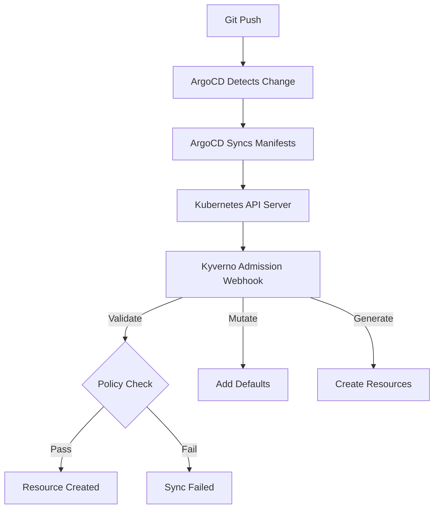

# How to Implement Policy-As-Code with ArgoCD and Kyverno

Author: [nawazdhandala](https://github.com/nawazdhandala)

Tags: ArgoCD, GitOps, Kubernetes, Kyverno, Policy as Code

Description: Learn how to use Kyverno with ArgoCD to enforce Kubernetes policies using simple YAML declarations without learning a new language like Rego.

---

If you have been looking at policy enforcement for Kubernetes and felt intimidated by OPA's Rego language, Kyverno might be exactly what you need. Kyverno lets you write policies in plain YAML - the same language you already use for everything else in Kubernetes. When paired with ArgoCD, you get a complete GitOps-driven policy enforcement pipeline that your entire team can understand and contribute to.

In this guide, I will show you how to deploy Kyverno through ArgoCD, write practical policies, and build a workflow where policies are managed as code alongside your application manifests.

## Why Kyverno Over OPA for ArgoCD Workflows?

Both tools solve the same problem, but Kyverno has some advantages in an ArgoCD-centric workflow. Kyverno policies are native Kubernetes resources written in YAML. There is no separate policy language to learn, no compilation step, and no external policy engine. Kyverno also supports mutation (modifying resources) and generation (creating new resources), which OPA Gatekeeper does not natively handle.

For teams already deep in YAML from Kubernetes and ArgoCD, Kyverno feels natural.



## Installing Kyverno Through ArgoCD

Deploy Kyverno as an ArgoCD Application to manage it through GitOps.

```yaml
# kyverno-application.yaml
apiVersion: argoproj.io/v1alpha1
kind: Application
metadata:
  name: kyverno
  namespace: argocd
  annotations:
    argocd.argoproj.io/sync-wave: "-10"
spec:
  project: platform
  source:
    repoURL: https://kyverno.github.io/kyverno
    chart: kyverno
    targetRevision: 3.1.4
    helm:
      values: |
        replicaCount: 3
        backgroundController:
          enabled: true
        cleanupController:
          enabled: true
        config:
          webhooks:
            # Exclude ArgoCD namespace from policy enforcement
            - objectSelector:
                matchExpressions:
                  - key: app.kubernetes.io/part-of
                    operator: NotIn
                    values:
                      - argocd
  destination:
    server: https://kubernetes.default.svc
    namespace: kyverno
  syncPolicy:
    automated:
      prune: true
      selfHeal: true
    syncOptions:
      - CreateNamespace=true
      - ServerSideApply=true
```

The ServerSideApply option is important here because Kyverno's CRDs can be large and may exceed annotation size limits with client-side apply.

## Writing Validation Policies

Here is a policy that requires all Deployments to have specific labels.

```yaml
# require-labels.yaml
apiVersion: kyverno.io/v1
kind: ClusterPolicy
metadata:
  name: require-labels
  annotations:
    policies.kyverno.io/title: Require Labels
    policies.kyverno.io/category: Best Practices
    policies.kyverno.io/severity: medium
    policies.kyverno.io/description: >-
      Requires all Deployments to have team, environment, and cost-center labels.
spec:
  validationFailureAction: Enforce
  background: true
  rules:
    - name: check-required-labels
      match:
        any:
          - resources:
              kinds:
                - Deployment
                - StatefulSet
      validate:
        message: >-
          The label '{{request.object.metadata.labels | keys(@)}}' is missing
          required labels: team, environment, cost-center.
        pattern:
          metadata:
            labels:
              team: "?*"
              environment: "?*"
              cost-center: "?*"
```

## Writing Mutation Policies

One of Kyverno's strengths is resource mutation. This policy automatically adds a `managed-by: argocd` label to all resources.

```yaml
# add-default-labels.yaml
apiVersion: kyverno.io/v1
kind: ClusterPolicy
metadata:
  name: add-default-labels
spec:
  rules:
    - name: add-managed-by-label
      match:
        any:
          - resources:
              kinds:
                - Deployment
                - Service
                - ConfigMap
      mutate:
        patchStrategicMerge:
          metadata:
            labels:
              +(managed-by): argocd
              +(deployed-at): "{{time_now_utc()}}"
```

Be careful with mutations when using ArgoCD. Mutated resources will differ from what is in Git, causing ArgoCD to show them as OutOfSync. Use `ignoreDifferences` in your ArgoCD Application spec to handle this.

```yaml
spec:
  ignoreDifferences:
    - group: apps
      kind: Deployment
      jsonPointers:
        - /metadata/labels/deployed-at
```

## Writing Generate Policies

Kyverno can automatically create resources when other resources are created. This is useful for creating NetworkPolicies whenever a new namespace is created.

```yaml
# generate-network-policy.yaml
apiVersion: kyverno.io/v1
kind: ClusterPolicy
metadata:
  name: generate-default-networkpolicy
spec:
  rules:
    - name: default-deny-ingress
      match:
        any:
          - resources:
              kinds:
                - Namespace
      exclude:
        any:
          - resources:
              namespaces:
                - kube-system
                - argocd
                - kyverno
      generate:
        synchronize: true
        apiVersion: networking.k8s.io/v1
        kind: NetworkPolicy
        name: default-deny-ingress
        namespace: "{{request.object.metadata.name}}"
        data:
          spec:
            podSelector: {}
            policyTypes:
              - Ingress
```

## Managing Policies as ArgoCD Applications

Create a dedicated ArgoCD Application for your policy repository.

```yaml
# policies-app.yaml
apiVersion: argoproj.io/v1alpha1
kind: Application
metadata:
  name: kyverno-policies
  namespace: argocd
spec:
  project: platform
  source:
    repoURL: https://github.com/myorg/kyverno-policies.git
    targetRevision: main
    path: policies
  destination:
    server: https://kubernetes.default.svc
  syncPolicy:
    automated:
      prune: true
      selfHeal: true
```

Use sync waves to make sure Kyverno itself is installed before the policies are applied.

```yaml
# On the kyverno Application
annotations:
  argocd.argoproj.io/sync-wave: "-10"

# On the kyverno-policies Application
annotations:
  argocd.argoproj.io/sync-wave: "-5"
```

## Policy Exceptions for ArgoCD Resources

ArgoCD manages its own resources, and you do not want Kyverno blocking ArgoCD operations. Create policy exceptions to handle this.

```yaml
# argocd-exception.yaml
apiVersion: kyverno.io/v2beta1
kind: PolicyException
metadata:
  name: argocd-exception
  namespace: kyverno
spec:
  exceptions:
    - policyName: require-labels
      ruleNames:
        - check-required-labels
    - policyName: disallow-privileged-containers
      ruleNames:
        - check-privileged
  match:
    any:
      - resources:
          namespaces:
            - argocd
```

## Testing Policies Before Deployment

Kyverno provides a CLI tool for testing policies locally before they reach the cluster.

```bash
# Install the Kyverno CLI
brew install kyverno

# Test a policy against a resource
kyverno apply policies/require-labels.yaml \
  --resource test-deployment.yaml

# Test all policies against all resources in a directory
kyverno apply policies/ --resource manifests/

# Run in audit mode to see what would fail
kyverno apply policies/ --resource manifests/ --audit
```

Integrate this into your CI pipeline so that policy violations are caught before they even reach ArgoCD.

## Monitoring Kyverno with ArgoCD

Kyverno generates PolicyReport resources that show the compliance status of your cluster. You can create an ArgoCD custom health check to monitor these.

```yaml
# argocd-cm configmap
data:
  resource.customizations.health.wgpolicyk8s.io_PolicyReport: |
    hs = {}
    if obj.summary.fail > 0 then
      hs.status = "Degraded"
      hs.message = "Policy violations detected: " .. obj.summary.fail .. " failures"
    else
      hs.status = "Healthy"
      hs.message = "All policies passing"
    end
    return hs
```

For more details on custom health checks in ArgoCD, see our guide on [implementing health checks in ArgoCD](https://oneuptime.com/blog/post/2026-01-25-health-checks-argocd/view).

## Gradual Policy Rollout Strategy

When rolling out new policies, use this progression to avoid disrupting existing workloads.

Start with `Audit` mode. Set `validationFailureAction: Audit` to log violations without blocking them. Review the PolicyReport resources to understand the impact. Then switch to `Enforce` mode with exceptions for known violations. Finally, work with teams to fix existing violations and remove exceptions.

This approach lets you introduce policy enforcement incrementally without causing deployment outages for existing applications managed by ArgoCD.

## Conclusion

Kyverno and ArgoCD together provide a powerful, YAML-native policy enforcement system. Since Kyverno policies are Kubernetes resources, they fit naturally into the GitOps model. You store them in Git, deploy them through ArgoCD, and they enforce rules at the admission level. The combination of validation, mutation, and generation gives you comprehensive control over what runs in your clusters - all without leaving the comfort of YAML.
