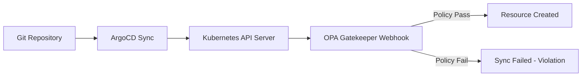

# How to Implement Policy-As-Code with ArgoCD and OPA

Author: [nawazdhandala](https://github.com/nawazdhandala)

Tags: ArgoCD, GitOps, Kubernetes, OPA, Policy as Code

Description: Learn how to integrate Open Policy Agent with ArgoCD to enforce security, compliance, and operational policies on every deployment through policy-as-code.

---

One of the biggest challenges with GitOps adoption is making sure that developers can deploy freely while still adhering to organizational policies. You do not want a human bottleneck reviewing every manifest, but you also cannot let anything slide through unchecked. This is where policy-as-code with Open Policy Agent (OPA) and ArgoCD comes together beautifully.

In this guide, I will walk you through integrating OPA Gatekeeper with ArgoCD so that every deployment automatically passes through policy checks before it reaches your cluster.

## Why Policy-As-Code with ArgoCD?

When you use ArgoCD for deployments, Git becomes your source of truth. But Git alone does not enforce rules. Someone could push a Deployment without resource limits, a Pod running as root, or a Service exposing a NodePort in production. Without policy enforcement, ArgoCD will happily sync those manifests to your cluster.

OPA Gatekeeper acts as an admission controller in your Kubernetes cluster. It intercepts API requests and evaluates them against policies you define in Rego, OPA's policy language. When combined with ArgoCD, this means every sync operation gets validated against your organization's rules.



## Setting Up OPA Gatekeeper

First, install OPA Gatekeeper in your cluster. This is best done through ArgoCD itself so that Gatekeeper is managed as part of your GitOps workflow.

```yaml
# gatekeeper-application.yaml
apiVersion: argoproj.io/v1alpha1
kind: Application
metadata:
  name: gatekeeper
  namespace: argocd
spec:
  project: default
  source:
    repoURL: https://open-policy-agent.github.io/gatekeeper/charts
    chart: gatekeeper
    targetRevision: 3.14.0
    helm:
      values: |
        replicas: 3
        auditInterval: 60
        constraintViolationsLimit: 20
        auditFromCache: true
  destination:
    server: https://kubernetes.default.svc
    namespace: gatekeeper-system
  syncPolicy:
    automated:
      prune: true
      selfHeal: true
    syncOptions:
      - CreateNamespace=true
```

Deploy Gatekeeper before your application workloads. Use sync waves to ensure proper ordering.

```yaml
metadata:
  annotations:
    argocd.argoproj.io/sync-wave: "-5"
```

## Creating Constraint Templates

Constraint templates define the policy logic in Rego. Here is a template that requires all containers to have resource limits defined.

```yaml
# constraint-template-resource-limits.yaml
apiVersion: templates.gatekeeper.sh/v1
kind: ConstraintTemplate
metadata:
  name: k8srequiredresourcelimits
spec:
  crd:
    spec:
      names:
        kind: K8sRequiredResourceLimits
      validation:
        openAPIV3Schema:
          type: object
          properties:
            resources:
              type: array
              items:
                type: string
  targets:
    - target: admission.k8s.gatekeeper.sh
      rego: |
        package k8srequiredresourcelimits

        violation[{"msg": msg}] {
          container := input.review.object.spec.containers[_]
          not container.resources.limits
          msg := sprintf("Container '%v' must have resource limits defined", [container.name])
        }

        violation[{"msg": msg}] {
          container := input.review.object.spec.containers[_]
          required := input.parameters.resources[_]
          not container.resources.limits[required]
          msg := sprintf("Container '%v' must have '%v' limit defined", [container.name, required])
        }
```

## Applying Constraints

Once the template exists, create a constraint that uses it.

```yaml
# constraint-require-limits.yaml
apiVersion: constraints.gatekeeper.sh/v1beta1
kind: K8sRequiredResourceLimits
metadata:
  name: require-resource-limits
spec:
  enforcementAction: deny
  match:
    kinds:
      - apiGroups: ["apps"]
        kinds: ["Deployment", "StatefulSet", "DaemonSet"]
    excludedNamespaces:
      - kube-system
      - gatekeeper-system
      - argocd
  parameters:
    resources:
      - cpu
      - memory
```

This constraint will reject any Deployment, StatefulSet, or DaemonSet that lacks CPU and memory limits. Note that we exclude system namespaces and ArgoCD itself to avoid breaking infrastructure components.

## Managing Policies Through ArgoCD

The real power comes from managing your policies as ArgoCD Applications. Store all your constraint templates and constraints in a dedicated Git repository.

```yaml
# policies-application.yaml
apiVersion: argoproj.io/v1alpha1
kind: Application
metadata:
  name: cluster-policies
  namespace: argocd
spec:
  project: platform
  source:
    repoURL: https://github.com/myorg/cluster-policies.git
    targetRevision: main
    path: policies/production
  destination:
    server: https://kubernetes.default.svc
  syncPolicy:
    automated:
      prune: true
      selfHeal: true
    syncOptions:
      - CreateNamespace=true
  ignoreDifferences:
    - group: constraints.gatekeeper.sh
      kind: "*"
      jsonPointers:
        - /status
```

## Handling Sync Failures from Policy Violations

When ArgoCD tries to sync a resource that violates a Gatekeeper policy, the sync will fail. ArgoCD shows the violation message in the UI and in the sync status. You can configure notifications to alert your team.

```yaml
# notification-template for policy violations
apiVersion: v1
kind: ConfigMap
metadata:
  name: argocd-notifications-cm
  namespace: argocd
data:
  template.policy-violation: |
    message: |
      Application {{.app.metadata.name}} sync failed due to policy violation.
      {{range .app.status.operationState.syncResult.resources}}
      {{if eq .status "SyncFailed"}}
      Resource: {{.kind}}/{{.name}}
      Message: {{.message}}
      {{end}}
      {{end}}
  trigger.on-policy-violation: |
    - when: app.status.operationState.phase == 'Failed'
      send: [policy-violation]
```

## Using Dry Run Mode for Gradual Rollout

When introducing new policies, start with `warn` enforcement action instead of `deny`. This lets you see which existing resources would violate the policy without blocking deployments.

```yaml
spec:
  enforcementAction: warn  # Log violations but don't block
```

After reviewing the audit results, switch to `dryrun` for testing, then finally to `deny` for enforcement.

```yaml
# Check audit results
kubectl get k8srequiredresourcelimits require-resource-limits -o yaml
```

The status section will show all existing violations, giving you a clear picture of what needs to be fixed before you flip to enforcement mode.

## Advanced: Custom Sync Hook for Pre-Deployment Policy Check

You can also add a pre-sync hook that runs conftest against your manifests before ArgoCD even attempts the sync.

```yaml
# pre-sync-policy-check.yaml
apiVersion: batch/v1
kind: Job
metadata:
  name: policy-check
  annotations:
    argocd.argoproj.io/hook: PreSync
    argocd.argoproj.io/hook-delete-policy: HookSucceeded
spec:
  template:
    spec:
      containers:
        - name: conftest
          image: openpolicyagent/conftest:latest
          command:
            - /bin/sh
            - -c
            - |
              # Pull policies from OCI registry
              conftest pull oci://registry.myorg.com/policies:latest
              # Test all manifests in the directory
              conftest test /manifests/*.yaml --policy /policies
          volumeMounts:
            - name: manifests
              mountPath: /manifests
      restartPolicy: Never
```

## Repository Structure for Policies

A well-organized policy repository makes life easier for everyone.

```text
cluster-policies/
  base/
    constraint-templates/
      require-resource-limits.yaml
      require-labels.yaml
      deny-privileged-containers.yaml
    constraints/
      require-resource-limits.yaml
      require-labels.yaml
  overlays/
    production/
      kustomization.yaml   # Stricter enforcement
    staging/
      kustomization.yaml   # Warn-only mode
```

Using Kustomize overlays, you can have strict `deny` enforcement in production while keeping `warn` mode in staging. ArgoCD handles each environment as a separate Application pointing to the appropriate overlay.

## Monitoring Policy Compliance

OPA Gatekeeper exposes Prometheus metrics that you can scrape to track policy compliance over time.

Key metrics to monitor include `gatekeeper_violations` for the total number of current violations, `gatekeeper_constraint_template_status` for template health, and the audit results that show historical compliance data.

For a complete monitoring setup with ArgoCD, check out our guide on [implementing health checks in ArgoCD](https://oneuptime.com/blog/post/2026-01-25-health-checks-argocd/view) which covers how to build custom health assessments for your policy infrastructure.

## Conclusion

Combining OPA Gatekeeper with ArgoCD gives you automated policy enforcement that scales with your organization. Policies are versioned in Git, deployed through ArgoCD, and enforced at the admission level. Start with a few critical policies in warn mode, prove out the workflow, and gradually expand your policy coverage. The key is treating policies as code - they deserve the same review process, testing, and deployment pipeline as your application code.
