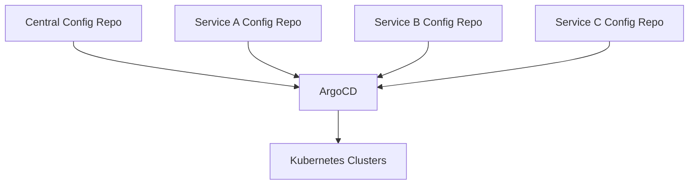

# How to Implement the Polyrepo Pattern with ArgoCD

Author: [nawazdhandala](https://github.com/nawazdhandala)

Tags: ArgoCD, GitOps, Kubernetes, Polyrepo, Architecture

Description: Learn how to implement the polyrepo pattern with ArgoCD where each team or service owns its own Git repository for deployment configuration.

---

The polyrepo pattern is the opposite of monorepo. Each service, team, or application gets its own dedicated Git repository for deployment configuration. This approach gives teams full autonomy over their deployment configs while still maintaining centralized orchestration through ArgoCD. Here is how to implement it effectively.

## Why Polyrepo

The polyrepo pattern works well when:

- **Teams want autonomy** - Each team controls their own repo, branching strategy, and release cadence
- **Access control is critical** - Different repos can have different permission models
- **Repository size matters** - Each repo stays small and focused
- **Independent release cycles** - Services deploy on their own schedule
- **Existing team structure** - Teams already have service-specific repos

The trade-off is operational complexity. You need to manage credentials for multiple repos, coordinate cross-cutting changes across repos, and maintain consistency without a shared base.

## Architecture Overview



You typically have one central repository that contains the ArgoCD Application definitions and per-service repositories that contain the actual Kubernetes manifests.

## Repository Structure

### Central Orchestration Repo

This repo contains only ArgoCD Application and ApplicationSet definitions:

```text
argocd-config/
├── apps/
│   ├── root.yaml
│   ├── platform/
│   │   ├── cert-manager.yaml
│   │   ├── ingress-nginx.yaml
│   │   └── monitoring.yaml
│   └── services/
│       ├── service-a.yaml
│       ├── service-b.yaml
│       └── service-c.yaml
├── projects/
│   ├── platform.yaml
│   ├── team-a.yaml
│   └── team-b.yaml
└── repos/
    └── repo-credentials.yaml
```

### Per-Service Repos

Each service repo has its own deployment configuration:

```text
service-a-config/
├── base/
│   ├── deployment.yaml
│   ├── service.yaml
│   ├── configmap.yaml
│   └── kustomization.yaml
├── overlays/
│   ├── dev/
│   │   ├── kustomization.yaml
│   │   └── patches/
│   ├── staging/
│   │   ├── kustomization.yaml
│   │   └── patches/
│   └── production/
│       ├── kustomization.yaml
│       └── patches/
└── README.md
```

## Registering Multiple Repositories

Register all service repos with ArgoCD. You can do this through the UI, CLI, or declaratively:

```bash
# Register repos via CLI
argocd repo add https://github.com/org/service-a-config.git \
  --ssh-private-key-path ~/.ssh/id_rsa \
  --name service-a

argocd repo add https://github.com/org/service-b-config.git \
  --ssh-private-key-path ~/.ssh/id_rsa \
  --name service-b
```

Or use credential templates for repos that share the same auth pattern:

```yaml
# In argocd-cm ConfigMap or as a Secret
apiVersion: v1
kind: Secret
metadata:
  name: repo-creds-github
  namespace: argocd
  labels:
    argocd.argoproj.io/secret-type: repo-creds
type: Opaque
stringData:
  url: https://github.com/org/
  password: ghp_xxxxxxxxxxxx
  username: argocd-bot
  type: git
```

With credential templates, any repo URL that starts with `https://github.com/org/` will automatically use these credentials. No need to register each repo individually.

## Application Definitions

### Individual Applications

```yaml
# apps/services/service-a.yaml
apiVersion: argoproj.io/v1alpha1
kind: Application
metadata:
  name: service-a-production
  namespace: argocd
spec:
  project: team-a
  source:
    repoURL: https://github.com/org/service-a-config.git
    targetRevision: main
    path: overlays/production
  destination:
    server: https://production-cluster.example.com
    namespace: team-a
  syncPolicy:
    automated:
      selfHeal: true
      prune: true
    syncOptions:
      - CreateNamespace=true
```

### SCM Provider Generator for Auto-Discovery

The SCM Provider Generator can automatically discover repos and create Applications:

```yaml
apiVersion: argoproj.io/v1alpha1
kind: ApplicationSet
metadata:
  name: auto-discover-services
  namespace: argocd
spec:
  generators:
    - scmProvider:
        github:
          organization: org
          tokenRef:
            secretName: github-token
            key: token
        filters:
          # Only include repos with a specific naming convention
          - repositoryMatch: ".*-config$"
            # Only repos with these paths
            pathsExist:
              - overlays/production/kustomization.yaml
  template:
    metadata:
      name: '{{repository}}-production'
    spec:
      project: default
      source:
        repoURL: '{{url}}'
        targetRevision: main
        path: overlays/production
      destination:
        server: https://production-cluster.example.com
        namespace: '{{repository}}'
      syncPolicy:
        automated:
          selfHeal: true
          prune: true
```

This automatically creates an ArgoCD Application for every GitHub repo in your organization that matches the naming pattern and has the expected directory structure.

## Multi-Environment with ApplicationSets

Create applications across environments for each repo:

```yaml
apiVersion: argoproj.io/v1alpha1
kind: ApplicationSet
metadata:
  name: service-a-environments
  namespace: argocd
spec:
  generators:
    - list:
        elements:
          - env: dev
            cluster: https://kubernetes.default.svc
            namespace: dev
          - env: staging
            cluster: https://kubernetes.default.svc
            namespace: staging
          - env: production
            cluster: https://production-cluster.example.com
            namespace: production
  template:
    metadata:
      name: 'service-a-{{env}}'
    spec:
      project: team-a
      source:
        repoURL: https://github.com/org/service-a-config.git
        targetRevision: main
        path: 'overlays/{{env}}'
      destination:
        server: '{{cluster}}'
        namespace: '{{namespace}}'
      syncPolicy:
        automated:
          selfHeal: true
          prune: true
```

## Cross-Cutting Changes

The biggest challenge with polyrepo is making changes that affect all services. For example, updating a security policy or adding a standard label to all deployments.

### Strategy 1: Shared Helm Chart

Publish a shared Helm chart that all services use:

```yaml
# In each service's Chart.yaml
apiVersion: v2
name: service-a
dependencies:
  - name: microservice-base
    version: "1.2.0"
    repository: "https://charts.example.com"
```

When you update the base chart, teams bump the version in their repos.

### Strategy 2: Automated PRs

Use a tool like Renovate or a custom script to create PRs across all repos:

```bash
#!/bin/bash
# update-all-repos.sh
# Creates a PR in each service repo with the updated config

REPOS=("service-a-config" "service-b-config" "service-c-config")
BRANCH="update/security-policy-v2"

for repo in "${REPOS[@]}"; do
  gh repo clone "org/$repo" "/tmp/$repo"
  cd "/tmp/$repo"
  git checkout -b "$BRANCH"

  # Apply the change
  cp /path/to/new/network-policy.yaml base/network-policy.yaml

  git add .
  git commit -m "Update network policy to v2"
  git push origin "$BRANCH"
  gh pr create --title "Update network policy to v2" --body "Automated cross-cutting change"

  cd -
  rm -rf "/tmp/$repo"
done
```

### Strategy 3: Kustomize Remote Bases

Services can reference remote bases from a shared repo:

```yaml
# In each service's kustomization.yaml
apiVersion: kustomize.config.k8s.io/v1beta1
kind: Kustomization
resources:
  - deployment.yaml
  - service.yaml
  # Pull shared resources from a common repo
  - https://github.com/org/shared-configs//network-policies/?ref=v1.0.0
```

## Webhook Configuration

With many repos, you need webhooks for each one. Use a GitHub organization-level webhook instead of per-repo:

```bash
# Create an org-level webhook that covers all repos
gh api orgs/org/hooks --method POST \
  --field name=web \
  --field active=true \
  --field events='["push"]' \
  --field config[url]="https://argocd.example.com/api/webhook" \
  --field config[content_type]="json" \
  --field config[secret]="your-webhook-secret"
```

## AppProject Configuration

```yaml
apiVersion: argoproj.io/v1alpha1
kind: AppProject
metadata:
  name: team-a
  namespace: argocd
spec:
  description: Team A services
  sourceRepos:
    # Allow all team A repos
    - https://github.com/org/service-a-config.git
    - https://github.com/org/service-b-config.git
    # Or use a wildcard
    - https://github.com/org/team-a-*
  destinations:
    - namespace: team-a
      server: '*'
    - namespace: team-a-*
      server: '*'
  roles:
    - name: admin
      policies:
        - p, proj:team-a:admin, applications, *, team-a/*, allow
      groups:
        - team-a-engineers
```

## Monitoring Polyrepo Deployments

Track which repos have the latest changes deployed:

```bash
# List all applications and their sync status
argocd app list -o wide

# Check a specific team's apps
argocd app list -l team=team-a

# Find apps that are out of sync
argocd app list -o json | jq '.[] | select(.status.sync.status != "Synced") | .metadata.name'
```

## When to Choose Polyrepo vs Monorepo

Choose polyrepo when:
- Teams need independent release control
- Strict access separation between teams is required
- Repository size would be unmanageable in a monorepo
- Teams have different review and approval workflows

Choose monorepo when:
- You make frequent cross-cutting changes
- You want a single source of truth
- You have a small team
- Consistency across services is a priority

For more on ArgoCD repository management, see our post on [ArgoCD repository credentials](https://oneuptime.com/blog/post/2026-01-25-repository-credentials-argocd/view) and [ArgoCD private repos](https://oneuptime.com/blog/post/2026-02-02-argocd-private-repos/view).
