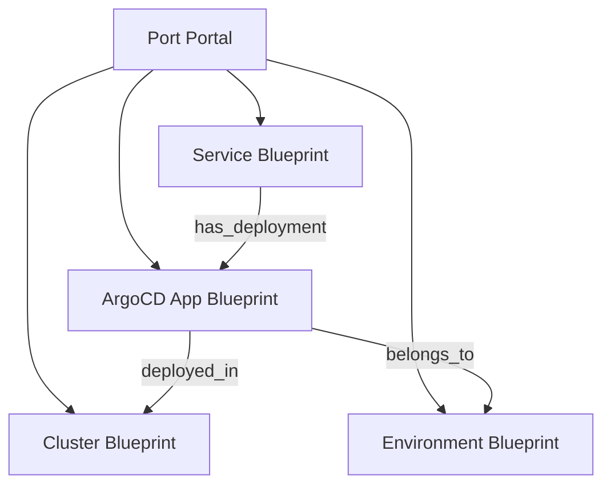

# How to Integrate ArgoCD with Port (Developer Portal)

Author: [nawazdhandala](https://github.com/nawazdhandala)

Tags: ArgoCD, GitOps, Kubernetes, Port, Developer Portal

Description: Learn how to integrate ArgoCD with Port developer portal to create a unified service catalog with real-time deployment status and self-service actions.

---

Port is a developer portal platform that lets you build an internal developer portal with a flexible data model, scorecards, and self-service actions. Integrating ArgoCD with Port gives your developers a real-time view of deployment states, sync history, and application health - all within Port's customizable interface. This guide covers the complete integration setup.

## Why Port with ArgoCD

Port differs from other developer portals in its flexible data model. Instead of predefined entities, you define your own blueprints that model your infrastructure exactly as it exists. This means you can model ArgoCD Applications as first-class entities with relationships to services, clusters, teams, and environments.



## Setting Up the Port ArgoCD Exporter

Port provides a Kubernetes exporter that can watch ArgoCD Application resources and sync their state to Port automatically.

### Install the Port Exporter

```bash
# Add the Port Helm repo
helm repo add port-labs https://port-labs.github.io/helm-charts
helm repo update

# Install the Port Kubernetes exporter
helm install port-k8s-exporter port-labs/port-k8s-exporter \
  --namespace port \
  --create-namespace \
  --set secret.secrets.portClientId="${PORT_CLIENT_ID}" \
  --set secret.secrets.portClientSecret="${PORT_CLIENT_SECRET}" \
  -f port-exporter-values.yaml
```

### Configure the Exporter for ArgoCD

Create a values file that tells the exporter how to map ArgoCD resources to Port:

```yaml
# port-exporter-values.yaml
secret:
  secrets:
    portClientId: ""
    portClientSecret: ""

configMap:
  config:
    resources:
      - kind: argoproj.io/v1alpha1/applications
        selector:
          query: .metadata.namespace == "argocd"
        port:
          entity:
            mappings:
              - identifier: .metadata.name
                title: .metadata.name
                blueprint: '"argocd_application"'
                properties:
                  syncStatus: .status.sync.status
                  healthStatus: .status.health.status
                  revision: .status.sync.revision
                  repoURL: .spec.source.repoURL
                  path: .spec.source.path
                  targetRevision: .spec.source.targetRevision
                  destinationServer: .spec.destination.server
                  destinationNamespace: .spec.destination.namespace
                  lastSyncTime: .status.operationState.finishedAt
                  syncPhase: .status.operationState.phase
                  project: .spec.project
                relations:
                  cluster: .spec.destination.server | gsub("https://"; "") | gsub(":6443"; "")
```

## Creating Blueprints in Port

Before the exporter can send data, you need to create the blueprints in Port. Use the Port API or the Port UI.

### ArgoCD Application Blueprint

```bash
# Create the ArgoCD Application blueprint via Port API
curl -X POST "https://api.getport.io/v1/blueprints" \
  -H "Authorization: Bearer ${PORT_ACCESS_TOKEN}" \
  -H "Content-Type: application/json" \
  -d '{
  "identifier": "argocd_application",
  "title": "ArgoCD Application",
  "icon": "Argo",
  "schema": {
    "properties": {
      "syncStatus": {
        "type": "string",
        "title": "Sync Status",
        "enum": ["Synced", "OutOfSync", "Unknown"],
        "enumColors": {
          "Synced": "green",
          "OutOfSync": "red",
          "Unknown": "darkGray"
        }
      },
      "healthStatus": {
        "type": "string",
        "title": "Health Status",
        "enum": ["Healthy", "Degraded", "Progressing", "Suspended", "Missing", "Unknown"],
        "enumColors": {
          "Healthy": "green",
          "Degraded": "red",
          "Progressing": "blue",
          "Suspended": "yellow",
          "Missing": "red",
          "Unknown": "darkGray"
        }
      },
      "revision": {
        "type": "string",
        "title": "Current Revision"
      },
      "repoURL": {
        "type": "string",
        "title": "Repository URL",
        "format": "url"
      },
      "path": {
        "type": "string",
        "title": "Path"
      },
      "targetRevision": {
        "type": "string",
        "title": "Target Revision"
      },
      "destinationServer": {
        "type": "string",
        "title": "Destination Server"
      },
      "destinationNamespace": {
        "type": "string",
        "title": "Destination Namespace"
      },
      "lastSyncTime": {
        "type": "string",
        "title": "Last Sync Time",
        "format": "date-time"
      },
      "syncPhase": {
        "type": "string",
        "title": "Last Sync Phase"
      },
      "project": {
        "type": "string",
        "title": "ArgoCD Project"
      }
    }
  },
  "relations": {
    "cluster": {
      "title": "Cluster",
      "target": "cluster",
      "required": false,
      "many": false
    },
    "service": {
      "title": "Service",
      "target": "service",
      "required": false,
      "many": false
    }
  }
}'
```

### Service Blueprint with ArgoCD Relation

```bash
# Create or update the Service blueprint to include ArgoCD relation
curl -X PATCH "https://api.getport.io/v1/blueprints/service" \
  -H "Authorization: Bearer ${PORT_ACCESS_TOKEN}" \
  -H "Content-Type: application/json" \
  -d '{
  "relations": {
    "argocd_app": {
      "title": "ArgoCD Application",
      "target": "argocd_application",
      "required": false,
      "many": true
    }
  }
}'
```

## Creating Self-Service Actions

One of Port's key features is self-service actions. Create actions that trigger ArgoCD syncs directly from Port:

```bash
# Create a sync action for ArgoCD applications
curl -X POST "https://api.getport.io/v1/blueprints/argocd_application/actions" \
  -H "Authorization: Bearer ${PORT_ACCESS_TOKEN}" \
  -H "Content-Type: application/json" \
  -d '{
  "identifier": "sync_application",
  "title": "Sync Application",
  "icon": "Argo",
  "description": "Trigger an ArgoCD sync for this application",
  "trigger": "DAY-2",
  "invocationMethod": {
    "type": "WEBHOOK",
    "url": "https://your-webhook-handler.example.com/argocd/sync",
    "agent": false
  },
  "userInputs": {
    "properties": {
      "prune": {
        "type": "boolean",
        "title": "Prune Resources",
        "description": "Delete resources that are no longer defined in Git",
        "default": false
      },
      "force": {
        "type": "boolean",
        "title": "Force Sync",
        "description": "Force sync even if already synced",
        "default": false
      }
    }
  }
}'
```

Create the webhook handler that processes sync requests:

```python
# webhook-handler.py - Handles Port self-service action webhooks
from flask import Flask, request, jsonify
import requests
import os

app = Flask(__name__)

ARGOCD_URL = os.environ["ARGOCD_URL"]
ARGOCD_TOKEN = os.environ["ARGOCD_TOKEN"]

@app.route("/argocd/sync", methods=["POST"])
def sync_application():
    payload = request.json
    app_name = payload["context"]["entity"]
    prune = payload["payload"]["properties"].get("prune", False)
    force = payload["payload"]["properties"].get("force", False)

    # Trigger ArgoCD sync
    response = requests.post(
        f"{ARGOCD_URL}/api/v1/applications/{app_name}/sync",
        headers={"Authorization": f"Bearer {ARGOCD_TOKEN}"},
        json={
            "prune": prune,
            "strategy": {
                "apply": {"force": force}
            }
        }
    )

    if response.status_code == 200:
        return jsonify({"status": "success", "message": f"Sync triggered for {app_name}"})
    else:
        return jsonify({"status": "error", "message": response.text}), 500

if __name__ == "__main__":
    app.run(host="0.0.0.0", port=8080)
```

## Building Scorecards

Port scorecards let you measure and track the quality of your ArgoCD deployments:

```bash
# Create a deployment health scorecard
curl -X POST "https://api.getport.io/v1/blueprints/argocd_application/scorecards" \
  -H "Authorization: Bearer ${PORT_ACCESS_TOKEN}" \
  -H "Content-Type: application/json" \
  -d '{
  "identifier": "deployment_health",
  "title": "Deployment Health",
  "rules": [
    {
      "identifier": "is_synced",
      "title": "Application is Synced",
      "level": "Gold",
      "query": {
        "combinator": "and",
        "conditions": [
          {
            "property": "syncStatus",
            "operator": "=",
            "value": "Synced"
          }
        ]
      }
    },
    {
      "identifier": "is_healthy",
      "title": "Application is Healthy",
      "level": "Gold",
      "query": {
        "combinator": "and",
        "conditions": [
          {
            "property": "healthStatus",
            "operator": "=",
            "value": "Healthy"
          }
        ]
      }
    },
    {
      "identifier": "recent_sync",
      "title": "Synced in Last 24 Hours",
      "level": "Silver",
      "query": {
        "combinator": "and",
        "conditions": [
          {
            "property": "lastSyncTime",
            "operator": ">",
            "value": {
              "jqQuery": "now - 86400 | todate"
            }
          }
        ]
      }
    }
  ]
}'
```

## Configuring Real-Time Updates

The Port Kubernetes exporter watches ArgoCD Application resources and pushes updates in real-time. To ensure timely updates, configure the exporter's resync interval:

```yaml
# port-exporter-values.yaml
configMap:
  config:
    # Resync interval in minutes
    resyncIntervalMinutes: 1
    resources:
      - kind: argoproj.io/v1alpha1/applications
        selector:
          query: .metadata.namespace == "argocd"
        # ... mapping configuration ...
```

## Dashboard Configuration

Create a Port dashboard that shows deployment overview:

- **Widget 1**: Table of all ArgoCD applications with sync and health status
- **Widget 2**: Pie chart of applications by health status
- **Widget 3**: Timeline of recent sync operations
- **Widget 4**: Count of out-of-sync applications (highlighted)

These dashboards update in real-time as the exporter syncs ArgoCD state to Port.

## Summary

Integrating ArgoCD with Port creates a powerful developer portal where deployment status, self-service actions, and quality scorecards come together. The Port Kubernetes exporter automatically syncs ArgoCD Application state, the flexible blueprint model lets you define relationships between services and deployments, and self-service actions enable developers to trigger syncs directly from the portal. For other developer portal options, see our guides on [integrating ArgoCD with Backstage](https://oneuptime.com/blog/post/2026-02-26-argocd-backstage-service-catalog/view) and [integrating ArgoCD with OpsLevel](https://oneuptime.com/blog/post/2026-02-26-argocd-opslevel-integration/view).
