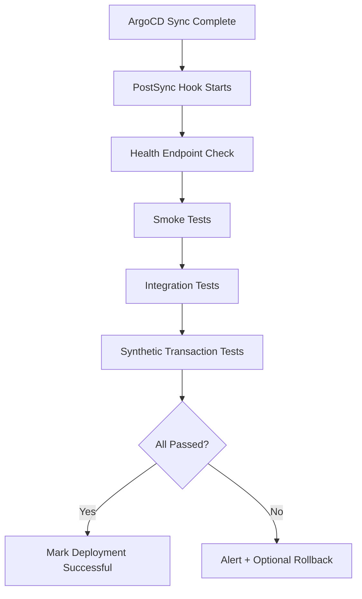
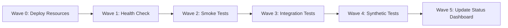

# How to Implement Post-Deployment Verification Pipeline

Author: [nawazdhandala](https://github.com/nawazdhandala)

Tags: ArgoCD, GitOps, Kubernetes, Verification, Testing

Description: Learn how to build a post-deployment verification pipeline with ArgoCD using resource hooks, smoke tests, synthetic monitoring, and automated validation to ensure deployments are working correctly.

---

Deployment is not done when the pods are running. A production deployment is only truly successful when the application serves correct responses, integrations work, and business-critical flows complete without errors. Post-deployment verification (PDV) automates these checks immediately after ArgoCD syncs changes, catching issues before they affect users at scale.

This guide covers building a comprehensive post-deployment verification pipeline using ArgoCD hooks, external test frameworks, and monitoring integration.

## Post-Deployment Verification Architecture



## Basic PostSync Health Check

Start with a simple PostSync hook that validates basic health:

```yaml
apiVersion: batch/v1
kind: Job
metadata:
  name: post-deploy-health-check
  annotations:
    argocd.argoproj.io/hook: PostSync
    argocd.argoproj.io/hook-delete-policy: BeforeHookCreation
spec:
  backoffLimit: 0
  activeDeadlineSeconds: 300
  template:
    spec:
      containers:
      - name: health-check
        image: curlimages/curl:latest
        command:
        - /bin/sh
        - -c
        - |
          echo "Starting post-deployment health checks..."

          # Wait for service to be ready
          echo "Waiting for service to become available..."
          for i in $(seq 1 60); do
            if curl -sf http://myapp.production.svc.cluster.local:8080/health > /dev/null 2>&1; then
              echo "Service is responding (attempt $i)"
              break
            fi
            if [ $i -eq 60 ]; then
              echo "FAIL: Service did not become available within 5 minutes"
              exit 1
            fi
            sleep 5
          done

          # Check health endpoint returns expected response
          HEALTH=$(curl -sf http://myapp.production.svc.cluster.local:8080/health)
          STATUS=$(echo "$HEALTH" | grep -o '"status":"[^"]*"' | cut -d'"' -f4)

          if [ "$STATUS" != "ok" ] && [ "$STATUS" != "healthy" ]; then
            echo "FAIL: Health check returned status: $STATUS"
            echo "Full response: $HEALTH"
            exit 1
          fi

          echo "Health check passed: $STATUS"

          # Check readiness endpoint
          READY=$(curl -sf -o /dev/null -w "%{http_code}" \
            http://myapp.production.svc.cluster.local:8080/ready)
          if [ "$READY" != "200" ]; then
            echo "FAIL: Readiness check returned $READY"
            exit 1
          fi

          echo "Readiness check passed"
          echo "All basic health checks passed"
      restartPolicy: Never
```

## Smoke Test Suite

Run lightweight functional tests after deployment:

```yaml
apiVersion: batch/v1
kind: Job
metadata:
  name: post-deploy-smoke-tests
  annotations:
    argocd.argoproj.io/hook: PostSync
    argocd.argoproj.io/hook-delete-policy: BeforeHookCreation
    # Run after health check
    argocd.argoproj.io/sync-wave: "1"
spec:
  backoffLimit: 0
  activeDeadlineSeconds: 600
  template:
    spec:
      containers:
      - name: smoke-tests
        image: org/smoke-test-runner:latest
        command:
        - /bin/sh
        - -c
        - |
          BASE_URL="http://myapp.production.svc.cluster.local:8080"

          echo "Running smoke tests against $BASE_URL"
          FAILED=0

          # Test 1: API returns valid JSON
          echo "Test 1: API response format..."
          RESPONSE=$(curl -sf "$BASE_URL/api/v1/status")
          echo "$RESPONSE" | python3 -m json.tool > /dev/null 2>&1
          if [ $? -ne 0 ]; then
            echo "  FAIL: API did not return valid JSON"
            FAILED=$((FAILED + 1))
          else
            echo "  PASS"
          fi

          # Test 2: Authentication endpoint works
          echo "Test 2: Auth endpoint..."
          AUTH_STATUS=$(curl -sf -o /dev/null -w "%{http_code}" \
            "$BASE_URL/api/v1/auth/health")
          if [ "$AUTH_STATUS" != "200" ]; then
            echo "  FAIL: Auth endpoint returned $AUTH_STATUS"
            FAILED=$((FAILED + 1))
          else
            echo "  PASS"
          fi

          # Test 3: Database connectivity
          echo "Test 3: Database health..."
          DB_HEALTH=$(curl -sf "$BASE_URL/health/dependencies" | \
            python3 -c "import sys,json; print(json.load(sys.stdin).get('database','unknown'))")
          if [ "$DB_HEALTH" != "connected" ]; then
            echo "  FAIL: Database status: $DB_HEALTH"
            FAILED=$((FAILED + 1))
          else
            echo "  PASS"
          fi

          # Test 4: Cache connectivity
          echo "Test 4: Cache health..."
          CACHE_HEALTH=$(curl -sf "$BASE_URL/health/dependencies" | \
            python3 -c "import sys,json; print(json.load(sys.stdin).get('cache','unknown'))")
          if [ "$CACHE_HEALTH" != "connected" ]; then
            echo "  FAIL: Cache status: $CACHE_HEALTH"
            FAILED=$((FAILED + 1))
          else
            echo "  PASS"
          fi

          # Test 5: Response time within SLA
          echo "Test 5: Response time..."
          RESPONSE_TIME=$(curl -sf -o /dev/null -w "%{time_total}" "$BASE_URL/api/v1/status")
          RT_MS=$(echo "$RESPONSE_TIME * 1000" | bc | cut -d. -f1)
          if [ "$RT_MS" -gt 500 ]; then
            echo "  FAIL: Response time ${RT_MS}ms exceeds 500ms SLA"
            FAILED=$((FAILED + 1))
          else
            echo "  PASS (${RT_MS}ms)"
          fi

          echo ""
          echo "===================="
          if [ $FAILED -gt 0 ]; then
            echo "FAILED: $FAILED smoke test(s) failed"
            exit 1
          else
            echo "ALL SMOKE TESTS PASSED"
          fi
      restartPolicy: Never
```

## Integration Test Suite with Pytest

For more comprehensive testing, run a containerized test suite:

```yaml
apiVersion: batch/v1
kind: Job
metadata:
  name: post-deploy-integration-tests
  annotations:
    argocd.argoproj.io/hook: PostSync
    argocd.argoproj.io/hook-delete-policy: BeforeHookCreation
    argocd.argoproj.io/sync-wave: "2"
spec:
  backoffLimit: 0
  activeDeadlineSeconds: 900  # 15 minutes max
  template:
    spec:
      containers:
      - name: integration-tests
        image: org/integration-tests:latest
        command: ["pytest"]
        args:
        - tests/post_deploy/
        - -v
        - --junitxml=/tmp/results.xml
        - --tb=short
        - -x  # Stop on first failure
        env:
        - name: BASE_URL
          value: "http://myapp.production.svc.cluster.local:8080"
        - name: TEST_API_KEY
          valueFrom:
            secretKeyRef:
              name: test-credentials
              key: api-key
        - name: ENVIRONMENT
          value: "production"
        resources:
          requests:
            cpu: 500m
            memory: 512Mi
          limits:
            cpu: "1"
            memory: 1Gi
      restartPolicy: Never
```

Example test file:

```python
# tests/post_deploy/test_api.py
import requests
import pytest
import os

BASE_URL = os.environ["BASE_URL"]
API_KEY = os.environ.get("TEST_API_KEY", "")

class TestAPIEndpoints:
    """Post-deployment API verification tests"""

    def test_health_endpoint(self):
        resp = requests.get(f"{BASE_URL}/health", timeout=10)
        assert resp.status_code == 200
        data = resp.json()
        assert data["status"] in ["ok", "healthy"]

    def test_api_version_header(self):
        resp = requests.get(f"{BASE_URL}/api/v1/status", timeout=10)
        assert "X-API-Version" in resp.headers

    def test_create_and_read_resource(self):
        """Verify basic CRUD operations work"""
        # Create
        create_resp = requests.post(
            f"{BASE_URL}/api/v1/test-resources",
            json={"name": "pdv-test", "type": "verification"},
            headers={"Authorization": f"Bearer {API_KEY}"},
            timeout=10
        )
        assert create_resp.status_code == 201
        resource_id = create_resp.json()["id"]

        # Read
        read_resp = requests.get(
            f"{BASE_URL}/api/v1/test-resources/{resource_id}",
            headers={"Authorization": f"Bearer {API_KEY}"},
            timeout=10
        )
        assert read_resp.status_code == 200
        assert read_resp.json()["name"] == "pdv-test"

        # Cleanup
        requests.delete(
            f"{BASE_URL}/api/v1/test-resources/{resource_id}",
            headers={"Authorization": f"Bearer {API_KEY}"},
            timeout=10
        )

    def test_response_time_sla(self):
        """Verify response times are within SLA"""
        import time
        start = time.time()
        resp = requests.get(f"{BASE_URL}/api/v1/status", timeout=10)
        duration = (time.time() - start) * 1000  # ms

        assert resp.status_code == 200
        assert duration < 500, f"Response time {duration:.0f}ms exceeds 500ms SLA"

    def test_external_dependencies(self):
        """Verify all external dependencies are reachable"""
        resp = requests.get(f"{BASE_URL}/health/dependencies", timeout=10)
        deps = resp.json()

        for dep_name, dep_status in deps.items():
            assert dep_status in ["connected", "healthy", "ok"], \
                f"Dependency {dep_name} is {dep_status}"
```

## Synthetic Transaction Tests

Run synthetic user flows that simulate real user behavior:

```yaml
apiVersion: batch/v1
kind: Job
metadata:
  name: synthetic-transaction-test
  annotations:
    argocd.argoproj.io/hook: PostSync
    argocd.argoproj.io/hook-delete-policy: BeforeHookCreation
    argocd.argoproj.io/sync-wave: "3"
spec:
  backoffLimit: 0
  activeDeadlineSeconds: 600
  template:
    spec:
      containers:
      - name: synthetic-tests
        image: grafana/k6:latest
        command: ["k6", "run", "--vus", "5", "--duration", "2m", "/tests/post-deploy.js"]
        volumeMounts:
        - name: test-scripts
          mountPath: /tests
      volumes:
      - name: test-scripts
        configMap:
          name: k6-post-deploy-tests
      restartPolicy: Never
---
apiVersion: v1
kind: ConfigMap
metadata:
  name: k6-post-deploy-tests
data:
  post-deploy.js: |
    import http from 'k6/http';
    import { check, sleep } from 'k6';

    const BASE_URL = 'http://myapp.production.svc.cluster.local:8080';

    export const options = {
      thresholds: {
        // 95% of requests must complete within 500ms
        http_req_duration: ['p(95)<500'],
        // Error rate must be below 1%
        http_req_failed: ['rate<0.01'],
      },
    };

    export default function () {
      // Simulate user browsing flow
      let statusRes = http.get(`${BASE_URL}/api/v1/status`);
      check(statusRes, {
        'status is 200': (r) => r.status === 200,
        'response has body': (r) => r.body.length > 0,
      });

      sleep(1);

      let listRes = http.get(`${BASE_URL}/api/v1/resources?limit=10`);
      check(listRes, {
        'list returns 200': (r) => r.status === 200,
        'list has results': (r) => JSON.parse(r.body).items.length > 0,
      });

      sleep(1);
    }
```

## Chaining Verification Steps with Sync Waves

Use sync waves to run verification steps in order:



If any wave fails, subsequent waves do not execute.

## Reporting Results

Post verification results back to your team:

```yaml
apiVersion: batch/v1
kind: Job
metadata:
  name: report-verification-results
  annotations:
    argocd.argoproj.io/hook: PostSync
    argocd.argoproj.io/hook-delete-policy: BeforeHookCreation
    argocd.argoproj.io/sync-wave: "5"
spec:
  template:
    spec:
      containers:
      - name: reporter
        image: curlimages/curl:latest
        command:
        - /bin/sh
        - -c
        - |
          # Post to Slack
          curl -X POST "$SLACK_WEBHOOK" \
            -H 'Content-type: application/json' \
            -d '{
              "text": "Post-deployment verification PASSED for myapp-production. All health checks, smoke tests, integration tests, and synthetic tests passed."
            }'
        env:
        - name: SLACK_WEBHOOK
          valueFrom:
            secretKeyRef:
              name: slack-webhook
              key: url
      restartPolicy: Never
```

For comprehensive deployment verification monitoring beyond individual test runs, integrate with OneUptime to track verification pass rates across deployments and detect reliability trends.

## Conclusion

Post-deployment verification closes the loop between "deployment completed" and "deployment is actually working." By layering health checks, smoke tests, integration tests, and synthetic user flows as ArgoCD PostSync hooks, you catch issues within minutes of deployment rather than waiting for user reports. The sync wave mechanism ensures tests run in order with proper dependencies. Start with basic health checks, then progressively add more comprehensive verification as your confidence and test infrastructure mature. The investment in PDV pays off quickly by reducing mean time to detection for deployment-caused incidents.
