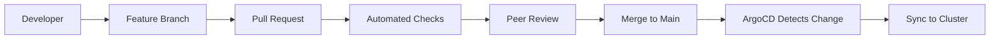

# How to Implement GitOps PR-Based Deployment Workflows

Author: [nawazdhandala](https://github.com/nawazdhandala)

Tags: ArgoCD, GitOps, Kubernetes, Pull Requests, CI/CD

Description: Learn how to implement pull request-based deployment workflows with ArgoCD, including PR previews, automated validation, approval gates, and promotion across environments.

---

Pull request-based deployment is the heart of GitOps. Instead of running deployment commands or clicking buttons in a CI/CD UI, engineers propose changes through pull requests, reviewers approve them, and ArgoCD automatically applies the merged changes to the cluster. This workflow provides a full audit trail, enables code review for infrastructure changes, and makes rollbacks as simple as reverting a commit.

This guide covers implementing a complete PR-based deployment workflow with ArgoCD, from branch strategy to production promotion.

## The PR-Based Deployment Model

In a GitOps PR workflow, the config repository is the single source of truth:



Every deployment is a Git merge. Every merge has a PR. Every PR has a review. This creates an unbreakable audit chain.

## Repository Structure

Organize your config repository for PR-based workflows:

```text
config-repo/
  environments/
    dev/
      kustomization.yaml
      patches/
    staging/
      kustomization.yaml
      patches/
    production/
      kustomization.yaml
      patches/
  base/
    deployment.yaml
    service.yaml
    configmap.yaml
```

Each environment is a directory with Kustomize overlays. PRs target specific environments by modifying files in the corresponding directory.

## ArgoCD Applications per Environment

Create separate ArgoCD Applications that watch different paths in the same repo:

```yaml
# Dev environment - auto-sync enabled
apiVersion: argoproj.io/v1alpha1
kind: Application
metadata:
  name: myapp-dev
  namespace: argocd
spec:
  project: default
  source:
    repoURL: https://github.com/org/config-repo.git
    targetRevision: HEAD
    path: environments/dev
  destination:
    server: https://kubernetes.default.svc
    namespace: myapp-dev
  syncPolicy:
    automated:
      prune: true
      selfHeal: true
---
# Staging - auto-sync with approval via PR
apiVersion: argoproj.io/v1alpha1
kind: Application
metadata:
  name: myapp-staging
  namespace: argocd
spec:
  project: default
  source:
    repoURL: https://github.com/org/config-repo.git
    targetRevision: HEAD
    path: environments/staging
  destination:
    server: https://kubernetes.default.svc
    namespace: myapp-staging
  syncPolicy:
    automated:
      prune: true
      selfHeal: true
---
# Production - manual sync only
apiVersion: argoproj.io/v1alpha1
kind: Application
metadata:
  name: myapp-production
  namespace: argocd
spec:
  project: default
  source:
    repoURL: https://github.com/org/config-repo.git
    targetRevision: HEAD
    path: environments/production
  destination:
    server: https://kubernetes.default.svc
    namespace: myapp-production
  # No automated sync - require manual trigger after merge
```

## CI Pipeline for PR Validation

When a PR is opened, run automated validation before human review:

```yaml
# .github/workflows/validate-pr.yaml
name: Validate Config PR
on:
  pull_request:
    branches: [main]

jobs:
  validate:
    runs-on: ubuntu-latest
    steps:
    - uses: actions/checkout@v4

    - name: Setup tools
      run: |
        # Install kustomize
        curl -s "https://raw.githubusercontent.com/kubernetes-sigs/kustomize/master/hack/install_kustomize.sh" | bash
        sudo mv kustomize /usr/local/bin/

        # Install kubeval for schema validation
        wget https://github.com/instrumenta/kubeval/releases/latest/download/kubeval-linux-amd64.tar.gz
        tar xf kubeval-linux-amd64.tar.gz
        sudo mv kubeval /usr/local/bin/

    - name: Identify changed environments
      id: changes
      run: |
        CHANGED_ENVS=$(git diff --name-only origin/main...HEAD | grep "^environments/" | cut -d/ -f2 | sort -u)
        echo "envs=${CHANGED_ENVS}" >> $GITHUB_OUTPUT

    - name: Build and validate manifests
      run: |
        for env in ${{ steps.changes.outputs.envs }}; do
          echo "Validating environment: ${env}"
          # Build the manifests
          kustomize build environments/${env} > /tmp/${env}-manifests.yaml
          # Validate against Kubernetes schema
          kubeval /tmp/${env}-manifests.yaml --strict
        done

    - name: Diff against current state
      run: |
        for env in ${{ steps.changes.outputs.envs }}; do
          echo "=== Diff for ${env} ==="
          # Show what would change
          kustomize build environments/${env} | \
            kubectl diff -f - --server-side 2>/dev/null || true
        done

    - name: Policy check with Kyverno CLI
      run: |
        for env in ${{ steps.changes.outputs.envs }}; do
          kustomize build environments/${env} | \
            kyverno apply policies/ --resource=-
        done
```

## PR Preview Environments

For development branches, create temporary preview environments using ArgoCD ApplicationSet with the Pull Request generator:

```yaml
apiVersion: argoproj.io/v1alpha1
kind: ApplicationSet
metadata:
  name: pr-preview-environments
  namespace: argocd
spec:
  generators:
  - pullRequest:
      github:
        owner: org
        repo: config-repo
        tokenRef:
          secretName: github-token
          key: token
        labels:
        - preview
      requeueAfterSeconds: 60
  template:
    metadata:
      name: 'preview-{{branch_slug}}-{{number}}'
      annotations:
        # Auto-delete after PR is closed
        argocd.argoproj.io/managed-by: applicationset-controller
    spec:
      project: previews
      source:
        repoURL: https://github.com/org/config-repo.git
        targetRevision: '{{head_sha}}'
        path: environments/dev
        kustomize:
          nameSuffix: '-pr-{{number}}'
      destination:
        server: https://kubernetes.default.svc
        namespace: 'preview-{{number}}'
      syncPolicy:
        automated:
          prune: true
          selfHeal: true
        syncOptions:
        - CreateNamespace=true
```

When a PR is opened with the `preview` label, ArgoCD creates a complete preview environment. When the PR is closed, the environment is automatically cleaned up.

## Branch Protection Rules

Configure branch protection to enforce the PR workflow:

```yaml
# GitHub branch protection (configured via API or UI)
# Main branch:
# - Require pull request reviews: 1 reviewer minimum
# - Require status checks to pass: validate-pr
# - Require branches to be up to date
# - Restrict pushes to main (no direct commits)
# - Require signed commits (optional)
```

This ensures nobody can bypass the PR workflow and push directly to main.

## Environment Promotion Workflow

Promote changes across environments by creating PRs:

```bash
#!/bin/bash
# promote.sh - Promote a change from one environment to another
SOURCE_ENV=$1
TARGET_ENV=$2

# Create a promotion branch
git checkout -b promote/${SOURCE_ENV}-to-${TARGET_ENV}

# Copy the image tag from source to target
SOURCE_TAG=$(grep "newTag:" environments/${SOURCE_ENV}/kustomization.yaml | awk '{print $2}')
sed -i "s/newTag: .*/newTag: ${SOURCE_TAG}/" environments/${TARGET_ENV}/kustomization.yaml

# Commit and create PR
git add environments/${TARGET_ENV}/
git commit -m "Promote ${SOURCE_TAG} from ${SOURCE_ENV} to ${TARGET_ENV}"
git push origin promote/${SOURCE_ENV}-to-${TARGET_ENV}

# Create PR using GitHub CLI
gh pr create \
  --title "Promote to ${TARGET_ENV}: ${SOURCE_TAG}" \
  --body "Promoting image tag ${SOURCE_TAG} from ${SOURCE_ENV} to ${TARGET_ENV}" \
  --reviewer platform-team \
  --label "deployment,${TARGET_ENV}"
```

## Automated Image Updates

When your CI pipeline builds a new container image, automatically create a PR to update the config repo:

```yaml
# .github/workflows/update-image.yaml (in your application repo)
name: Update Image Tag
on:
  push:
    tags:
    - 'v*'

jobs:
  update-config:
    runs-on: ubuntu-latest
    steps:
    - name: Checkout config repo
      uses: actions/checkout@v4
      with:
        repository: org/config-repo
        token: ${{ secrets.CONFIG_REPO_TOKEN }}

    - name: Update image tag
      run: |
        NEW_TAG="${GITHUB_REF_NAME}"
        cd environments/dev
        kustomize edit set image myapp=registry.example.com/myapp:${NEW_TAG}

    - name: Create PR
      run: |
        git checkout -b update-image/${GITHUB_REF_NAME}
        git add .
        git commit -m "Update myapp image to ${GITHUB_REF_NAME}"
        git push origin update-image/${GITHUB_REF_NAME}
        gh pr create \
          --title "Update myapp to ${GITHUB_REF_NAME}" \
          --body "Automated image update from CI pipeline" \
          --label "automated,dev"
```

## Notifications for PR Status

Configure ArgoCD notifications to post sync results back to PRs:

```yaml
apiVersion: v1
kind: ConfigMap
metadata:
  name: argocd-notifications-cm
  namespace: argocd
data:
  trigger.on-sync-succeeded: |
    - when: app.status.operationState.phase in ['Succeeded']
      send: [github-commit-status]

  trigger.on-sync-failed: |
    - when: app.status.operationState.phase in ['Error', 'Failed']
      send: [github-commit-status]

  template.github-commit-status: |
    webhook:
      github:
        method: POST
        path: /repos/{{call .repo.FullNameByRepoURL .app.spec.source.repoURL}}/statuses/{{.app.status.operationState.operation.sync.revision}}
        body: |
          {
            "state": "{{if eq .app.status.operationState.phase "Succeeded"}}success{{else}}failure{{end}}",
            "description": "ArgoCD sync {{.app.status.operationState.phase}}",
            "target_url": "{{.context.argocdUrl}}/applications/{{.app.metadata.name}}",
            "context": "argocd/{{.app.metadata.name}}"
          }

  service.webhook.github: |
    url: https://api.github.com
    headers:
    - name: Authorization
      value: token $github-token
```

This posts the sync result as a commit status on the PR, visible to reviewers.

For comprehensive deployment monitoring beyond PR status, integrate with OneUptime to track deployment health after merge.

## Conclusion

PR-based deployment workflows with ArgoCD transform infrastructure changes into reviewable, auditable, and reversible operations. The workflow combines Git's collaboration features (branches, PRs, reviews) with ArgoCD's automated synchronization to create a deployment process that is both fast and safe. The key components are: branch protection to enforce the PR workflow, automated validation in CI, preview environments for testing, and notifications that feed deployment results back into the PR. This approach scales from small teams deploying a single application to large organizations managing hundreds of microservices across multiple environments.
