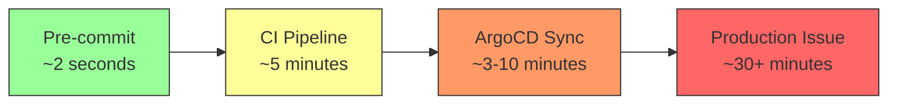

# How to Set Up Pre-Commit Hooks for ArgoCD Manifests

Author: [nawazdhandala](https://github.com/nawazdhandala)

Tags: ArgoCD, GitOps, Kubernetes, Pre-Commit, DevOps

Description: Learn how to set up pre-commit hooks that validate ArgoCD manifests before they reach your Git repository, catching errors at the earliest stage.

---

The earlier you catch a manifest error, the less time you waste. Pre-commit hooks run validation on your local machine before a commit even reaches Git. For ArgoCD manifests, this means YAML syntax errors, schema violations, and policy failures get caught in seconds rather than minutes (in CI) or longer (when ArgoCD tries to sync).

This guide shows how to set up a comprehensive pre-commit hook pipeline for ArgoCD manifests.

## Why Pre-Commit Hooks?

The cost of fixing an error increases at each stage of the pipeline:



Pre-commit hooks give you instant feedback without leaving your editor.

## Setting Up the pre-commit Framework

The pre-commit framework is the standard tool for managing Git hooks. Install it first:

```bash
# Install pre-commit
pip install pre-commit

# Or on macOS
brew install pre-commit

# Verify
pre-commit --version
```

## Basic Configuration

Create `.pre-commit-config.yaml` in your repository root:

```yaml
repos:
  # YAML linting
  - repo: https://github.com/adrienverge/yamllint
    rev: v1.33.0
    hooks:
      - id: yamllint
        args: [-c, .yamllint.yaml]
        files: \.(yaml|yml)$
        exclude: (charts/.*/templates/|node_modules/)

  # Trailing whitespace and file endings
  - repo: https://github.com/pre-commit/pre-commit-hooks
    rev: v4.5.0
    hooks:
      - id: trailing-whitespace
        files: \.(yaml|yml)$
      - id: end-of-file-fixer
        files: \.(yaml|yml)$
      - id: check-yaml
        args: [--allow-multiple-documents]
        exclude: (charts/.*/templates/)
      - id: check-merge-conflict
      - id: detect-private-key
```

Configure yamllint for Kubernetes manifests:

```yaml
# .yamllint.yaml
extends: default
rules:
  line-length:
    max: 250
    level: warning
  truthy:
    check-keys: false
  comments:
    min-spaces-from-content: 1
  indentation:
    spaces: 2
    indent-sequences: consistent
  document-start: disable
```

Install the hooks:

```bash
pre-commit install
```

## Adding Kubernetes Schema Validation

Add kubeconform as a local hook:

```yaml
# Add to .pre-commit-config.yaml
  - repo: local
    hooks:
      - id: kubeconform
        name: Validate Kubernetes manifests
        entry: bash -c '
          if ! command -v kubeconform &> /dev/null; then
            echo "kubeconform not installed. Install with: brew install kubeconform"
            exit 1
          fi
          kubeconform \
            -kubernetes-version 1.29.0 \
            -schema-location default \
            -schema-location "https://raw.githubusercontent.com/datreeio/CRDs-catalog/main/{{.Group}}/{{.ResourceKind}}_{{.ResourceAPIVersion}}.json" \
            -summary \
            -strict \
            "$@"
        '
        language: system
        files: \.(yaml|yml)$
        exclude: (charts/.*/templates/|kustomization\.yaml|.yamllint|.pre-commit|values)
        types: [file]
```

## Adding Kustomize Build Validation

Validate that Kustomize overlays build successfully:

```yaml
  - repo: local
    hooks:
      - id: kustomize-build
        name: Validate Kustomize overlays
        entry: bash -c '
          # Find all kustomization.yaml files in changed paths
          for file in "$@"; do
            dir=$(dirname "$file")
            if [ -f "$dir/kustomization.yaml" ] || [ -f "$dir/kustomization.yml" ]; then
              echo "Building kustomization in: $dir"
              if ! kustomize build "$dir" > /dev/null 2>&1; then
                echo "FAIL: Kustomize build failed for $dir"
                kustomize build "$dir"
                exit 1
              fi
              echo "OK: $dir"
            fi
          done
        '
        language: system
        files: \.(yaml|yml)$
        pass_filenames: true
```

## Adding Helm Lint Validation

For Helm charts in your repository:

```yaml
  - repo: local
    hooks:
      - id: helm-lint
        name: Lint Helm charts
        entry: bash -c '
          # Find Chart.yaml files from changed files
          declare -A checked_charts
          for file in "$@"; do
            chart_dir="$file"
            while [ "$chart_dir" != "." ] && [ "$chart_dir" != "/" ]; do
              if [ -f "$chart_dir/Chart.yaml" ]; then
                if [ -z "${checked_charts[$chart_dir]+x}" ]; then
                  echo "Linting chart: $chart_dir"
                  helm lint "$chart_dir" --strict
                  checked_charts[$chart_dir]=1
                fi
                break
              fi
              chart_dir=$(dirname "$chart_dir")
            done
          done
        '
        language: system
        files: charts/.*\.(yaml|yml|tpl)$
        pass_filenames: true
```

## Adding Conftest Policy Checks

Enforce policies on every commit:

```yaml
  - repo: local
    hooks:
      - id: conftest
        name: Policy checks with Conftest
        entry: bash -c '
          if ! command -v conftest &> /dev/null; then
            echo "conftest not installed. Install with: brew install conftest"
            exit 1
          fi
          # Only check non-template files
          files=()
          for f in "$@"; do
            case "$f" in
              charts/*/templates/*) continue ;;
              *kustomization*) continue ;;
              *values*) continue ;;
              *) files+=("$f") ;;
            esac
          done
          if [ ${#files[@]} -gt 0 ]; then
            conftest test --policy policy/ "${files[@]}"
          fi
        '
        language: system
        files: \.(yaml|yml)$
        pass_filenames: true
```

## Complete Pre-Commit Configuration

Here is the full `.pre-commit-config.yaml` with all hooks:

```yaml
repos:
  # Standard pre-commit hooks
  - repo: https://github.com/pre-commit/pre-commit-hooks
    rev: v4.5.0
    hooks:
      - id: trailing-whitespace
        files: \.(yaml|yml)$
      - id: end-of-file-fixer
        files: \.(yaml|yml)$
      - id: check-yaml
        args: [--allow-multiple-documents]
        exclude: (charts/.*/templates/)
      - id: check-merge-conflict
      - id: detect-private-key
      - id: check-added-large-files
        args: [--maxkb=500]

  # YAML linting
  - repo: https://github.com/adrienverge/yamllint
    rev: v1.33.0
    hooks:
      - id: yamllint
        args: [-c, .yamllint.yaml]
        files: \.(yaml|yml)$
        exclude: (charts/.*/templates/|node_modules/)

  # Local hooks for Kubernetes-specific validation
  - repo: local
    hooks:
      # Kubernetes schema validation
      - id: kubeconform
        name: Validate K8s manifests with kubeconform
        entry: bash -c '
          kubeconform \
            -kubernetes-version 1.29.0 \
            -schema-location default \
            -schema-location "https://raw.githubusercontent.com/datreeio/CRDs-catalog/main/{{.Group}}/{{.ResourceKind}}_{{.ResourceAPIVersion}}.json" \
            -summary \
            "$@"
        '
        language: system
        files: (apps|argocd-apps)/.*\.(yaml|yml)$
        exclude: kustomization\.yaml
        types: [file]

      # Kustomize build check
      - id: kustomize-build
        name: Validate Kustomize builds
        entry: bash -c '
          dirs_checked=""
          for file in "$@"; do
            dir=$(dirname "$file")
            while [ "$dir" != "." ]; do
              if [ -f "$dir/kustomization.yaml" ]; then
                if ! echo "$dirs_checked" | grep -q "$dir"; then
                  kustomize build "$dir" > /dev/null || exit 1
                  dirs_checked="$dirs_checked $dir"
                fi
                break
              fi
              dir=$(dirname "$dir")
            done
          done
        '
        language: system
        files: \.(yaml|yml)$
        pass_filenames: true

      # Helm lint
      - id: helm-lint
        name: Lint Helm charts
        entry: bash -c '
          for file in "$@"; do
            dir="$file"
            while [ "$dir" != "." ]; do
              if [ -f "$dir/Chart.yaml" ]; then
                helm lint "$dir" --strict || exit 1
                break
              fi
              dir=$(dirname "$dir")
            done
          done
        '
        language: system
        files: charts/.*\.(yaml|yml|tpl)$
        pass_filenames: true

      # Conftest policy checks
      - id: conftest-policies
        name: Check policies with Conftest
        entry: bash -c '
          valid_files=()
          for f in "$@"; do
            case "$f" in
              charts/*/templates/*|*kustomization*|*values*) ;;
              *) valid_files+=("$f") ;;
            esac
          done
          [ ${#valid_files[@]} -eq 0 ] || conftest test --policy policy/ "${valid_files[@]}"
        '
        language: system
        files: (apps|argocd-apps)/.*\.(yaml|yml)$
        pass_filenames: true
```

## Handling Slow Hooks

Some hooks (like downloading CRD schemas) can be slow on first run. Optimize with caching:

```bash
# Pre-download schemas to a local cache
mkdir -p .schemas

# Download ArgoCD schemas
curl -sL 'https://raw.githubusercontent.com/datreeio/CRDs-catalog/main/argoproj.io/application_v1alpha1.json' \
  -o .schemas/application_v1alpha1.json

curl -sL 'https://raw.githubusercontent.com/datreeio/CRDs-catalog/main/argoproj.io/appproject_v1alpha1.json' \
  -o .schemas/appproject_v1alpha1.json
```

Update the kubeconform hook to use local schemas:

```yaml
      - id: kubeconform
        name: Validate K8s manifests
        entry: bash -c '
          kubeconform \
            -kubernetes-version 1.29.0 \
            -schema-location default \
            -schema-location ".schemas/{{ .ResourceKind }}_{{ .ResourceAPIVersion }}.json" \
            -summary \
            "$@"
        '
        language: system
        files: (apps|argocd-apps)/.*\.(yaml|yml)$
        exclude: kustomization\.yaml
```

## Skipping Hooks When Needed

Sometimes you need to bypass hooks (during emergencies, for example):

```bash
# Skip all hooks
git commit --no-verify -m "HOTFIX: emergency fix"

# Skip specific hooks
SKIP=conftest-policies git commit -m "WIP: work in progress"

# Run hooks manually without committing
pre-commit run --all-files
pre-commit run kubeconform --all-files
```

## Team Onboarding

Make it easy for new team members to set up hooks:

```bash
# Add to your Makefile
setup:
	pip install pre-commit
	pre-commit install
	@echo "Pre-commit hooks installed!"

# Or add to package.json scripts
# "prepare": "pre-commit install"
```

Add a check in CI that verifies hooks are not bypassed:

```yaml
# .github/workflows/hook-check.yaml
name: Verify Pre-Commit
on: [pull_request]
jobs:
  pre-commit:
    runs-on: ubuntu-latest
    steps:
      - uses: actions/checkout@v4
      - uses: actions/setup-python@v5
      - uses: pre-commit/action@v3.0.1
```

## Monitoring Hook Effectiveness

Track how many errors your pre-commit hooks catch over time. This data helps justify the investment in tooling and identify which hooks are most valuable. Use [OneUptime](https://oneuptime.com) to correlate pre-commit adoption with decreased ArgoCD sync failure rates.

## Conclusion

Pre-commit hooks are the first line of defense in your GitOps quality pipeline. By catching YAML syntax errors, schema violations, build failures, and policy violations before code reaches Git, you dramatically reduce the number of failed ArgoCD syncs. Set up the framework once, share the configuration with your team, and enjoy the confidence that comes from knowing every commit has been validated.
