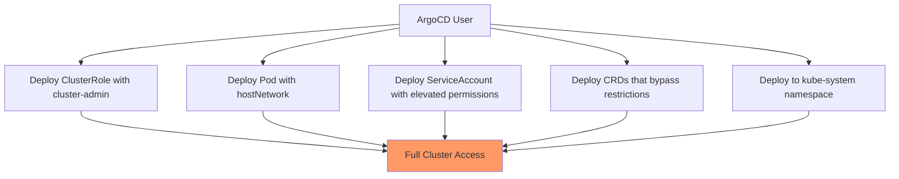

# How to Prevent Privilege Escalation in ArgoCD

Author: [nawazdhandala](https://github.com/nawazdhandala)

Tags: ArgoCD, GitOps, Kubernetes, Security, RBAC

Description: Learn how to prevent privilege escalation attacks in ArgoCD by restricting resource types, namespace access, and RBAC configurations in projects.

---

ArgoCD has powerful access to your Kubernetes clusters. If not properly configured, a user with limited ArgoCD permissions could escalate their privileges by deploying resources that grant them broader access. This guide covers the attack vectors and how to prevent them.

## Understanding Privilege Escalation in ArgoCD

Privilege escalation in ArgoCD happens when a user deploys Kubernetes resources that grant more permissions than they should have. Here are the most common vectors:



For example, a developer with permission to sync applications could push a manifest that creates a ClusterRoleBinding granting their service account cluster-admin privileges. Without proper controls, ArgoCD would happily deploy this.

## Restricting Resource Types in Projects

The first line of defense is using ArgoCD projects to restrict what types of resources can be deployed.

### Block Dangerous Cluster-Scoped Resources

```yaml
apiVersion: argoproj.io/v1alpha1
kind: AppProject
metadata:
  name: team-frontend
  namespace: argocd
spec:
  description: "Frontend team project"
  # Only allow specific cluster-scoped resources
  clusterResourceWhitelist:
    - group: ""
      kind: Namespace
  # Block everything else at cluster scope
  # (ClusterRole, ClusterRoleBinding, etc. are implicitly denied)

  # Only allow specific namespace-scoped resources
  namespaceResourceWhitelist:
    - group: ""
      kind: ConfigMap
    - group: ""
      kind: Secret
    - group: ""
      kind: Service
    - group: ""
      kind: ServiceAccount
    - group: apps
      kind: Deployment
    - group: apps
      kind: StatefulSet
    - group: networking.k8s.io
      kind: Ingress

  # Explicitly block dangerous resource types
  namespaceResourceBlacklist:
    - group: rbac.authorization.k8s.io
      kind: Role
    - group: rbac.authorization.k8s.io
      kind: RoleBinding
    - group: ""
      kind: LimitRange
    - group: ""
      kind: ResourceQuota
```

The whitelist approach is more secure than the blacklist approach because it denies everything except what is explicitly allowed. Use whitelists whenever possible.

### Prevent RBAC Resource Deployment

The most critical restriction is preventing users from deploying RBAC resources:

```yaml
apiVersion: argoproj.io/v1alpha1
kind: AppProject
metadata:
  name: restricted-project
  namespace: argocd
spec:
  # Block all RBAC resources at both cluster and namespace level
  clusterResourceBlacklist:
    - group: rbac.authorization.k8s.io
      kind: ClusterRole
    - group: rbac.authorization.k8s.io
      kind: ClusterRoleBinding
  namespaceResourceBlacklist:
    - group: rbac.authorization.k8s.io
      kind: Role
    - group: rbac.authorization.k8s.io
      kind: RoleBinding
```

## Restricting Destination Namespaces

Prevent applications from deploying to sensitive namespaces:

```yaml
apiVersion: argoproj.io/v1alpha1
kind: AppProject
metadata:
  name: team-backend
  namespace: argocd
spec:
  # Only allow deployment to specific namespaces
  destinations:
    - server: https://kubernetes.default.svc
      namespace: backend-dev
    - server: https://kubernetes.default.svc
      namespace: backend-staging
    - server: https://kubernetes.default.svc
      namespace: backend-prod

  # These namespaces are implicitly denied:
  # - kube-system
  # - kube-public
  # - argocd
  # - default
```

Never use wildcard namespace patterns in production:

```yaml
# DANGEROUS - allows deployment to any namespace
destinations:
  - server: https://kubernetes.default.svc
    namespace: "*"  # DO NOT DO THIS

# SAFE - explicit namespace list
destinations:
  - server: https://kubernetes.default.svc
    namespace: "app-frontend"
  - server: https://kubernetes.default.svc
    namespace: "app-backend"
```

## Preventing Privileged Container Deployment

Users could deploy pods with privileged security contexts that escape the container sandbox. Use Kubernetes admission controllers alongside ArgoCD:

### Using Kyverno

```yaml
apiVersion: kyverno.io/v1
kind: ClusterPolicy
metadata:
  name: restrict-privileged-containers
spec:
  validationFailureAction: Enforce
  rules:
    - name: deny-privileged
      match:
        any:
          - resources:
              kinds:
                - Pod
      validate:
        message: "Privileged containers are not allowed"
        pattern:
          spec:
            containers:
              - securityContext:
                  privileged: "false"
                  allowPrivilegeEscalation: "false"
    - name: deny-host-namespaces
      match:
        any:
          - resources:
              kinds:
                - Pod
      validate:
        message: "Host namespaces are not allowed"
        pattern:
          spec:
            hostNetwork: "false"
            hostPID: "false"
            hostIPC: "false"
```

### Using Pod Security Standards

Apply Pod Security Standards to namespaces where ArgoCD deploys:

```yaml
apiVersion: v1
kind: Namespace
metadata:
  name: app-production
  labels:
    # Enforce restricted pod security standard
    pod-security.kubernetes.io/enforce: restricted
    pod-security.kubernetes.io/warn: restricted
    pod-security.kubernetes.io/audit: restricted
```

## Restricting Source Repositories

Prevent users from deploying manifests from unauthorized repositories:

```yaml
apiVersion: argoproj.io/v1alpha1
kind: AppProject
metadata:
  name: team-frontend
  namespace: argocd
spec:
  # Only allow specific source repositories
  sourceRepos:
    - https://github.com/your-org/frontend-manifests.git
    - https://github.com/your-org/shared-helm-charts.git

  # DANGEROUS - allows any repository
  # sourceRepos:
  #   - "*"  # DO NOT DO THIS in production
```

## Preventing ArgoCD Self-Modification

A subtle attack vector is deploying manifests that modify ArgoCD itself. Prevent this by restricting access to the argocd namespace:

```yaml
apiVersion: argoproj.io/v1alpha1
kind: AppProject
metadata:
  name: team-backend
  namespace: argocd
spec:
  destinations:
    # Never include the argocd namespace
    - server: https://kubernetes.default.svc
      namespace: backend-*
    # Explicitly deny argocd namespace
    # (it is denied by default if not in the destinations list)
```

Additionally, use RBAC to prevent users from modifying ArgoCD settings:

```yaml
apiVersion: v1
kind: ConfigMap
metadata:
  name: argocd-rbac-cm
  namespace: argocd
data:
  policy.csv: |
    # Developers cannot modify settings, clusters, or repos
    p, role:developer, applications, get, */*, allow
    p, role:developer, applications, sync, */*, allow
    p, role:developer, logs, get, */*, allow
    # No access to: settings, clusters, repositories, projects
```

## Validating Manifests Before Deployment

Use ArgoCD's built-in manifest validation along with external tools:

```yaml
apiVersion: argoproj.io/v1alpha1
kind: Application
metadata:
  name: secure-app
  namespace: argocd
spec:
  syncPolicy:
    syncOptions:
      # Enable manifest validation
      - Validate=true
```

For advanced validation, use a Config Management Plugin that runs security checks:

```yaml
apiVersion: v1
kind: ConfigMap
metadata:
  name: argocd-cmp-cm
  namespace: argocd
data:
  plugin.yaml: |
    apiVersion: argoproj.io/v1alpha1
    kind: ConfigManagementPlugin
    metadata:
      name: security-validator
    spec:
      generate:
        command:
          - sh
          - -c
          - |
            # Generate manifests
            kustomize build . > /tmp/manifests.yaml
            # Check for privilege escalation patterns
            if grep -q "privileged: true" /tmp/manifests.yaml; then
              echo "ERROR: Privileged containers not allowed" >&2
              exit 1
            fi
            if grep -q "ClusterRoleBinding" /tmp/manifests.yaml; then
              echo "ERROR: ClusterRoleBinding not allowed" >&2
              exit 1
            fi
            cat /tmp/manifests.yaml
```

## Monitoring for Escalation Attempts

Set up alerts for potential privilege escalation attempts:

```bash
# Check for applications trying to deploy RBAC resources
kubectl logs deployment/argocd-application-controller -n argocd | \
  jq 'select(.msg | test("ClusterRole|ClusterRoleBinding|Role|RoleBinding"))'

# Check for applications targeting restricted namespaces
kubectl logs deployment/argocd-application-controller -n argocd | \
  jq 'select(.msg | test("kube-system|argocd|default"))'
```

## Security Testing

Regularly test your privilege escalation protections:

```bash
# Try to create an application that deploys a ClusterRoleBinding
# This should fail if your project restrictions are correct
argocd app create test-escalation \
  --project team-frontend \
  --repo https://github.com/your-org/test-manifests.git \
  --path escalation-test \
  --dest-server https://kubernetes.default.svc \
  --dest-namespace kube-system

# Expected: Error - destination namespace not allowed
```

## Conclusion

Preventing privilege escalation in ArgoCD requires a defense-in-depth approach. Start with ArgoCD project restrictions to limit resource types and namespaces. Add Kubernetes admission controllers (Kyverno, OPA Gatekeeper, or Pod Security Standards) as a second layer. Restrict source repositories to prevent unauthorized manifests. And monitor for escalation attempts so you can respond quickly. No single control is sufficient - it is the combination that creates a secure deployment pipeline.

For related security topics, see our guides on [hardening ArgoCD server for production](https://oneuptime.com/blog/post/2026-02-26-argocd-harden-server-production/view) and configuring RBAC policies.
