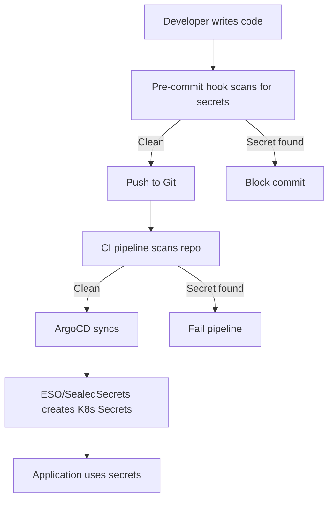

# How to Prevent Secrets from Being Stored in Git with ArgoCD

Author: [nawazdhandala](https://github.com/nawazdhandala)

Tags: ArgoCD, GitOps, Kubernetes, Secret, Security

Description: Learn how to prevent secrets from being committed to Git repositories when using ArgoCD for GitOps workflows, using pre-commit hooks, scanning tools, and external secret management patterns.

---

One of the core principles of GitOps is that Git should be the single source of truth for your infrastructure. But here is the problem: secrets should never live in Git. Committing a plaintext Kubernetes Secret to your repository is a security incident waiting to happen. Even if you delete it later, Git history remembers everything.

In this post, I will walk you through practical strategies to keep secrets out of Git while still getting the benefits of ArgoCD-driven GitOps.

## Why Secrets in Git Are Dangerous

Before we get into solutions, let us understand the threat model. When you commit a secret to Git:

1. Every developer with repo access can see it
2. Every clone, fork, or mirror contains the secret
3. Git history preserves it even after deletion
4. CI/CD systems that cache repos may store it
5. Leaked repos expose everything immediately

Even in private repositories, the blast radius is significant. A single compromised developer account could expose every secret in your cluster.

## Strategy 1: Pre-Commit Hooks with gitleaks

The first line of defense is preventing secrets from being committed in the first place. Install gitleaks as a pre-commit hook:

```yaml
# .pre-commit-config.yaml
repos:
  - repo: https://github.com/gitleaks/gitleaks
    rev: v8.18.0
    hooks:
      - id: gitleaks
```

Install and activate the hook:

```bash
# Install pre-commit
pip install pre-commit

# Install the hooks
pre-commit install

# Test it on existing commits
gitleaks detect --source . --verbose
```

You can customize what gitleaks looks for by creating a `.gitleaks.toml` file:

```toml
# .gitleaks.toml
title = "ArgoCD Repo Secret Scanner"

[[rules]]
id = "kubernetes-secret-base64"
description = "Base64 encoded Kubernetes secret data"
regex = '''data:\s*\n\s+\w+:\s*[A-Za-z0-9+/=]{20,}'''
tags = ["kubernetes", "secret"]

[[rules]]
id = "generic-password"
description = "Generic password pattern"
regex = '''(?i)(password|passwd|pwd)\s*[:=]\s*['"]?[^\s'"]{8,}'''
tags = ["password"]

[allowlist]
paths = [
  '''.*_test\.go''',
  '''.*\.md''',
]
```

## Strategy 2: Use Sealed Secrets

Bitnami Sealed Secrets encrypts your secrets so only the cluster can decrypt them. The encrypted form is safe to commit to Git:

```bash
# Install kubeseal CLI
brew install kubeseal

# Create a regular secret
kubectl create secret generic db-creds \
  --from-literal=username=admin \
  --from-literal=password=supersecret \
  --dry-run=client -o yaml > secret.yaml

# Seal it (encrypt for the cluster)
kubeseal --format yaml < secret.yaml > sealed-secret.yaml

# Remove the plaintext version
rm secret.yaml
```

The sealed secret YAML is safe for Git:

```yaml
# sealed-secret.yaml - this is safe to commit
apiVersion: bitnami.com/v1alpha1
kind: SealedSecret
metadata:
  name: db-creds
  namespace: production
spec:
  encryptedData:
    username: AgBy3i4OJSWK+PiTySYZZA9rO43cGDEq...
    password: AgCtr8pMQLpEY2YJIuc+7RHKM43bGDzq...
  template:
    metadata:
      name: db-creds
      namespace: production
```

Configure your ArgoCD Application to deploy it:

```yaml
apiVersion: argoproj.io/v1alpha1
kind: Application
metadata:
  name: sealed-secrets-app
  namespace: argocd
spec:
  project: default
  source:
    repoURL: https://github.com/your-org/your-repo.git
    targetRevision: main
    path: environments/production
  destination:
    server: https://kubernetes.default.svc
    namespace: production
  syncPolicy:
    automated:
      selfHeal: true
      prune: true
```

## Strategy 3: External Secrets Operator

The External Secrets Operator (ESO) creates Kubernetes Secrets from external stores. You only commit the ExternalSecret manifest, which contains no sensitive data:

```yaml
# This is safe to commit - no secrets here
apiVersion: external-secrets.io/v1beta1
kind: ExternalSecret
metadata:
  name: db-credentials
  namespace: production
spec:
  refreshInterval: 1h
  secretStoreRef:
    name: vault-backend
    kind: ClusterSecretStore
  target:
    name: db-credentials
    creationPolicy: Owner
  data:
    - secretKey: username
      remoteRef:
        key: secret/data/production/database
        property: username
    - secretKey: password
      remoteRef:
        key: secret/data/production/database
        property: password
```

The ClusterSecretStore points to your vault:

```yaml
apiVersion: external-secrets.io/v1beta1
kind: ClusterSecretStore
metadata:
  name: vault-backend
spec:
  provider:
    vault:
      server: "https://vault.example.com"
      path: "secret"
      version: "v2"
      auth:
        kubernetes:
          mountPath: "kubernetes"
          role: "external-secrets"
```

## Strategy 4: SOPS Encryption

Mozilla SOPS encrypts specific values in YAML files while leaving keys readable. Combined with an ArgoCD plugin, you can commit encrypted files:

```bash
# Create a SOPS configuration
cat > .sops.yaml << 'EOF'
creation_rules:
  - path_regex: .*secrets.*\.yaml$
    age: age1ql3z7hjy54pw3hyww5ayyfg7zqgvc7w3j2elw8zmrj2kg5sfn9aqmcac8p
  - path_regex: .*\.enc\.yaml$
    age: age1ql3z7hjy54pw3hyww5ayyfg7zqgvc7w3j2elw8zmrj2kg5sfn9aqmcac8p
EOF

# Encrypt a secret file
sops --encrypt --in-place secrets.yaml
```

The encrypted file looks like this in Git:

```yaml
apiVersion: v1
kind: Secret
metadata:
  name: app-secrets
type: Opaque
stringData:
  DB_PASSWORD: ENC[AES256_GCM,data:p673w==,iv:YY=,tag:A=,type:str]
  API_KEY: ENC[AES256_GCM,data:Hx0x,iv:Z=,tag:B=,type:str]
sops:
  age:
    - recipient: age1ql3z7hjy54pw3hyww5ayyfg7zqgvc7w3j2elw8zmrj2kg5sfn9aqmcac8p
      enc: |
        -----BEGIN AGE ENCRYPTED FILE-----
        ...
        -----END AGE ENCRYPTED FILE-----
  lastmodified: "2026-02-26T10:00:00Z"
  version: 3.8.0
```

Configure ArgoCD to decrypt with a Config Management Plugin:

```yaml
# argocd-cm ConfigMap
apiVersion: v1
kind: ConfigMap
metadata:
  name: argocd-cm
  namespace: argocd
data:
  configManagementPlugins: |
    - name: sops
      generate:
        command: ["bash", "-c"]
        args:
          - |
            for f in $(find . -name '*.enc.yaml'); do
              sops --decrypt "$f"
            done
```

## Strategy 5: Git Repository Scanning in CI

Add secret scanning to your CI pipeline as a safety net:

```yaml
# .github/workflows/secret-scan.yaml
name: Secret Scanning
on: [push, pull_request]

jobs:
  scan:
    runs-on: ubuntu-latest
    steps:
      - uses: actions/checkout@v4
        with:
          fetch-depth: 0

      - name: Run gitleaks
        uses: gitleaks/gitleaks-action@v2
        env:
          GITHUB_TOKEN: ${{ secrets.GITHUB_TOKEN }}

      - name: Scan for Kubernetes secrets
        run: |
          # Find any plaintext Kubernetes Secret manifests
          if grep -r "kind: Secret" --include="*.yaml" --include="*.yml" . | \
             grep -v "SealedSecret" | \
             grep -v "ExternalSecret" | \
             grep -v "SecretStore"; then
            echo "ERROR: Plaintext Kubernetes Secret found!"
            exit 1
          fi
```

## Strategy 6: .gitignore Patterns

As a basic hygiene practice, make sure common secret file patterns are in your `.gitignore`:

```gitignore
# .gitignore
# Secret files
**/secrets.yaml
**/secrets.yml
**/*-secret.yaml
**/*-secret.yml
*.key
*.pem
*.crt
.env
.env.*

# Allow encrypted secrets
!**/*.enc.yaml
!**/*.enc.yml
!**/sealed-*.yaml
!**/external-secret*.yaml
```

## Strategy 7: OPA/Gatekeeper Policies

Add a cluster-level safety net with OPA Gatekeeper that prevents creating secrets directly:

```yaml
apiVersion: templates.gatekeeper.sh/v1
kind: ConstraintTemplate
metadata:
  name: k8sblockrawsecrets
spec:
  crd:
    spec:
      names:
        kind: K8sBlockRawSecrets
  targets:
    - target: admission.k8s.gatekeeper.sh
      rego: |
        package k8sblockrawsecrets
        violation[{"msg": msg}] {
          input.review.kind.kind == "Secret"
          not input.review.object.metadata.labels["sealed-secrets.bitnami.com/managed"]
          not input.review.object.metadata.ownerReferences
          msg := "Direct Secret creation is blocked. Use SealedSecrets or ExternalSecrets instead."
        }
```

## Putting It All Together

The strongest approach layers multiple strategies:



A practical layered setup looks like this:

1. Pre-commit hooks catch secrets before they enter Git
2. CI scanning catches anything hooks miss
3. SealedSecrets or ExternalSecrets handle the actual secret creation
4. OPA policies prevent raw Secret creation in the cluster
5. Git repository settings enable secret scanning features

## Cleaning Up After an Accidental Commit

If a secret does get committed despite your best efforts, act fast:

```bash
# Rotate the compromised credential immediately
# This is the most important step

# Remove the secret from Git history
git filter-branch --force --index-filter \
  'git rm --cached --ignore-unmatch path/to/secret.yaml' \
  --prune-empty --tag-name-filter cat -- --all

# Force push (coordinate with your team)
git push origin --force --all

# Clean up local references
git for-each-ref --format='delete %(refname)' refs/original | git update-ref --stdin
git reflog expire --expire=now --all
git gc --prune=now --aggressive
```

Remember: rotating the credential is more important than cleaning Git history. Assume the secret has been compromised the moment it was pushed.

## Monitoring for Secret Leaks

For ongoing protection, consider using OneUptime to monitor your ArgoCD deployments and receive alerts when sync issues arise from secret-related problems. You can learn more about monitoring ArgoCD health in our post on [monitoring ArgoCD deployments](https://oneuptime.com/blog/post/2026-02-06-monitor-argocd-deployments-opentelemetry/view).

## Summary

Preventing secrets from reaching Git requires defense in depth. No single tool solves the problem. Combine pre-commit hooks, CI scanning, encrypted secrets (Sealed Secrets or SOPS), and external secret stores (ESO with Vault) for a robust setup. ArgoCD fits naturally into this model since it syncs whatever is in Git, and when what is in Git is only encrypted or reference manifests, your secrets stay safe.
