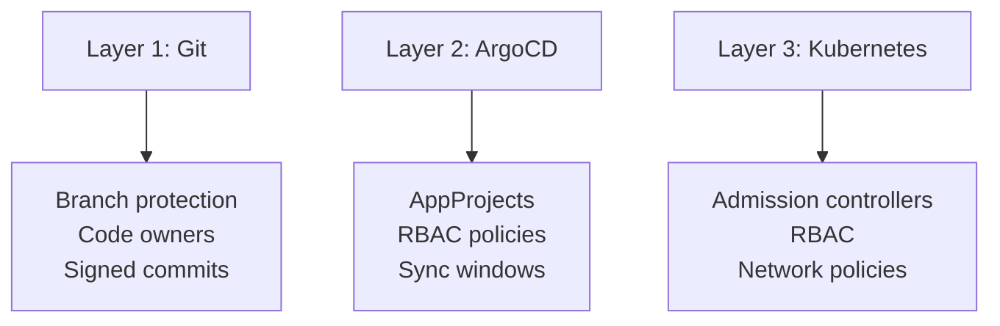

# How to Prevent Unauthorized Configuration Changes

Author: [nawazdhandala](https://github.com/nawazdhandala)

Tags: ArgoCD, GitOps, Kubernetes, Security, RBAC

Description: Learn how to prevent unauthorized configuration changes in ArgoCD using AppProjects, RBAC policies, admission controllers, and policy engines to enforce deployment guardrails.

---

In a GitOps workflow, unauthorized changes can come from multiple directions - someone pushing directly to the config repo, a misconfigured RBAC policy granting too much access, or a team member manually editing resources in the cluster. Preventing unauthorized changes requires a defense-in-depth strategy that covers Git, ArgoCD, and the Kubernetes cluster itself.

## The Three Layers of Defense



Each layer catches different types of unauthorized changes. Together, they provide comprehensive protection.

## Layer 1: Git-Level Controls

### Restrict Direct Pushes

No one should push directly to the deployment branch:

```bash
# GitHub: protect the main branch
gh api repos/org/config-repo/branches/main/protection \
  --method PUT \
  --field required_pull_request_reviews='{"required_approving_review_count":2}' \
  --field enforce_admins=true \
  --field allow_force_pushes=false
```

### Enforce Signed Commits

Require GPG-signed commits to prove author identity:

```yaml
# ArgoCD project with signature verification
apiVersion: argoproj.io/v1alpha1
kind: AppProject
metadata:
  name: production
spec:
  signatureKeys:
    - keyID: "ABCDEF1234567890"
    - keyID: "0987654321FEDCBA"
```

### Restrict Who Can Approve

Use CODEOWNERS to require specific team approvals:

```
# CODEOWNERS
/services/*/overlays/production/  @org/platform-team @org/security-team
/platform/                        @org/platform-team
/apps/                            @org/platform-team
```

## Layer 2: ArgoCD Controls

### AppProject Restrictions

AppProjects are your primary tool for limiting what teams can deploy:

```yaml
apiVersion: argoproj.io/v1alpha1
kind: AppProject
metadata:
  name: team-a
  namespace: argocd
spec:
  # Restrict source repositories
  sourceRepos:
    - https://github.com/org/team-a-config.git
    # Teams cannot use arbitrary repos

  # Restrict deployment targets
  destinations:
    - namespace: team-a
      server: https://kubernetes.default.svc
    - namespace: team-a-*
      server: https://kubernetes.default.svc
    # Teams cannot deploy to other namespaces

  # Block cluster-scoped resources entirely
  clusterResourceBlacklist:
    - group: '*'
      kind: '*'

  # Whitelist only safe namespace-scoped resources
  namespaceResourceWhitelist:
    - group: apps
      kind: Deployment
    - group: apps
      kind: StatefulSet
    - group: ""
      kind: Service
    - group: ""
      kind: ConfigMap
    - group: ""
      kind: Secret
    - group: ""
      kind: PersistentVolumeClaim
    - group: networking.k8s.io
      kind: Ingress
    - group: autoscaling
      kind: HorizontalPodAutoscaler
    - group: policy
      kind: PodDisruptionBudget

  # Block dangerous resources
  namespaceResourceBlacklist:
    - group: rbac.authorization.k8s.io
      kind: '*'
    - group: ""
      kind: ResourceQuota
    - group: ""
      kind: LimitRange
    - group: networking.k8s.io
      kind: NetworkPolicy
```

### RBAC Policies

Implement least-privilege RBAC:

```yaml
# argocd-rbac-cm ConfigMap
apiVersion: v1
kind: ConfigMap
metadata:
  name: argocd-rbac-cm
  namespace: argocd
data:
  # Default: no access
  policy.default: role:none

  policy.csv: |
    # Team A developers can only view and sync their own apps
    p, role:team-a-dev, applications, get, team-a/*, allow
    p, role:team-a-dev, applications, sync, team-a/*, allow

    # They CANNOT create, delete, or modify applications
    p, role:team-a-dev, applications, create, team-a/*, deny
    p, role:team-a-dev, applications, delete, team-a/*, deny
    p, role:team-a-dev, applications, update, team-a/*, deny

    # They CANNOT access other teams' apps
    p, role:team-a-dev, applications, *, team-b/*, deny

    # Platform admins have full access
    p, role:platform-admin, applications, *, */*, allow
    p, role:platform-admin, clusters, *, *, allow
    p, role:platform-admin, repositories, *, *, allow
    p, role:platform-admin, certificates, *, *, allow
    p, role:platform-admin, gpgkeys, *, *, allow
    p, role:platform-admin, projects, *, *, allow

    # Map groups to roles
    g, team-a-developers, role:team-a-dev
    g, platform-engineers, role:platform-admin
```

### Sync Windows

Restrict when deployments can happen:

```yaml
apiVersion: argoproj.io/v1alpha1
kind: AppProject
metadata:
  name: production
spec:
  syncWindows:
    # Only allow syncs during business hours
    - kind: allow
      schedule: "0 9 * * 1-5"
      duration: 8h
      applications:
        - "*"
      namespaces:
        - production

    # Block all syncs during weekends
    - kind: deny
      schedule: "0 0 * * 0,6"
      duration: 48h
      applications:
        - "*"

    # Allow manual syncs for emergencies
    - kind: allow
      schedule: "* * * * *"
      duration: 24h
      manualSync: true
      applications:
        - "*"
```

### Disable Self-Heal for Sensitive Apps

For applications where you want full manual control:

```yaml
apiVersion: argoproj.io/v1alpha1
kind: Application
metadata:
  name: critical-app
spec:
  syncPolicy:
    automated:
      selfHeal: false  # Do not auto-revert manual changes
      prune: false      # Do not auto-delete resources
```

## Layer 3: Kubernetes Controls

### Admission Controllers

Use policy engines to enforce rules at the Kubernetes API level:

```yaml
# Kyverno: block deployments without resource limits
apiVersion: kyverno.io/v1
kind: ClusterPolicy
metadata:
  name: require-resource-limits
spec:
  validationFailureAction: enforce
  rules:
    - name: require-limits
      match:
        resources:
          kinds:
            - Deployment
            - StatefulSet
      validate:
        message: "Resource limits are required for all containers"
        pattern:
          spec:
            template:
              spec:
                containers:
                  - resources:
                      limits:
                        memory: "?*"
                        cpu: "?*"
```

```yaml
# Kyverno: restrict image registries
apiVersion: kyverno.io/v1
kind: ClusterPolicy
metadata:
  name: restrict-registries
spec:
  validationFailureAction: enforce
  rules:
    - name: validate-image-registry
      match:
        resources:
          kinds:
            - Pod
      validate:
        message: "Images must come from the approved registry"
        pattern:
          spec:
            containers:
              - image: "registry.example.com/*"
            initContainers:
              - image: "registry.example.com/*"
```

```yaml
# Kyverno: prevent privilege escalation
apiVersion: kyverno.io/v1
kind: ClusterPolicy
metadata:
  name: disallow-privileged
spec:
  validationFailureAction: enforce
  rules:
    - name: deny-privileged
      match:
        resources:
          kinds:
            - Pod
      validate:
        message: "Privileged containers are not allowed"
        pattern:
          spec:
            containers:
              - securityContext:
                  privileged: "!true"
            initContainers:
              - securityContext:
                  privileged: "!true"
```

### Kubernetes RBAC

Lock down cluster RBAC so that only ArgoCD can modify resources in production namespaces:

```yaml
# Only ArgoCD service account can create/update in production
apiVersion: rbac.authorization.k8s.io/v1
kind: RoleBinding
metadata:
  name: argocd-deploy
  namespace: production
roleRef:
  apiGroup: rbac.authorization.k8s.io
  kind: ClusterRole
  name: admin
subjects:
  - kind: ServiceAccount
    name: argocd-application-controller
    namespace: argocd
---
# Developers get read-only access to production
apiVersion: rbac.authorization.k8s.io/v1
kind: RoleBinding
metadata:
  name: dev-readonly
  namespace: production
roleRef:
  apiGroup: rbac.authorization.k8s.io
  kind: ClusterRole
  name: view
subjects:
  - kind: Group
    name: developers
    apiGroup: rbac.authorization.k8s.io
```

### Prevent kubectl Drift

When someone manually edits a resource with kubectl, ArgoCD will show it as OutOfSync. Enable self-heal to automatically revert unauthorized manual changes:

```yaml
apiVersion: argoproj.io/v1alpha1
kind: Application
metadata:
  name: production-app
spec:
  syncPolicy:
    automated:
      selfHeal: true  # Revert any manual changes
      prune: true      # Remove resources not in Git
```

## Monitoring Unauthorized Changes

### ArgoCD Event Monitoring

```bash
# Watch for sync events
kubectl get events -n argocd --field-selector reason=ResourceUpdated --watch

# Check who initiated syncs
argocd app list -o json | jq '.[] | {
  name: .metadata.name,
  syncBy: .status.operationState.operation.initiatedBy.username,
  syncTime: .status.operationState.finishedAt,
  syncStatus: .status.operationState.phase
}'
```

### Alert on Manual Changes

Set up alerts when ArgoCD detects drift (indicating manual changes):

```yaml
# ArgoCD notification trigger for drift detection
trigger.on-out-of-sync: |
  - when: app.status.sync.status == 'OutOfSync'
    send: [slack-drift-alert]

template.slack-drift-alert: |
  slack:
    attachments: |
      [{
        "color": "#E96D76",
        "title": "Drift Detected: {{ .app.metadata.name }}",
        "text": "Someone may have made manual changes. ArgoCD will revert if self-heal is enabled.",
        "fields": [
          {"title": "Application", "value": "{{ .app.metadata.name }}", "short": true},
          {"title": "Namespace", "value": "{{ .app.spec.destination.namespace }}", "short": true}
        ]
      }]
```

## Defense-in-Depth Summary

| Control | Git Layer | ArgoCD Layer | Kubernetes Layer |
|---|---|---|---|
| Who can change | Branch protection, CODEOWNERS | RBAC, AppProjects | Kubernetes RBAC |
| What can change | PR review, CI validation | Resource whitelists, AppProject restrictions | Admission controllers |
| When changes happen | PR approval workflow | Sync windows | N/A |
| Detecting violations | Git audit log | ArgoCD events, notifications | Audit logs, policy reports |
| Auto-remediation | N/A | Self-heal, auto-sync | Admission controller deny |

For more on ArgoCD RBAC and project configuration, see our guides on [RBAC policies in ArgoCD](https://oneuptime.com/blog/post/2026-01-25-rbac-policies-argocd/view) and [ArgoCD multi-tenancy](https://oneuptime.com/blog/post/2026-01-27-argocd-multi-tenancy/view).
