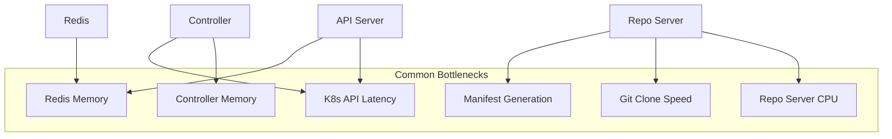

# How to Profile ArgoCD Performance Issues

Author: [nawazdhandala](https://github.com/nawazdhandala)

Tags: ArgoCD, GitOps, Kubernetes, Performance, Monitoring

Description: Learn how to profile and diagnose ArgoCD performance issues using Prometheus metrics, Go pprof, resource monitoring, and systematic bottleneck analysis for large-scale deployments.

---

ArgoCD performance degrades as you add more applications, repositories, and clusters. The UI gets slow, syncs take longer, reconciliation falls behind, and eventually components start running out of memory. This guide teaches you how to systematically profile ArgoCD performance and identify exactly where the bottleneck is.

## Performance Architecture Overview



## Step 1: Establish Baseline Metrics

Before diagnosing, establish what "normal" looks like:

```bash
# Current resource usage for all components
kubectl top pods -n argocd

# Application count
kubectl get applications -n argocd --no-headers | wc -l

# Repository count
argocd repo list 2>/dev/null | tail -n +2 | wc -l

# Cluster count
argocd cluster list 2>/dev/null | tail -n +2 | wc -l
```

## Step 2: Prometheus Metrics Analysis

ArgoCD exposes detailed Prometheus metrics. Access them directly:

```bash
# Port-forward to each component's metrics port
# Controller metrics on 8082
kubectl port-forward -n argocd deploy/argocd-application-controller 8082:8082 &

# API server metrics on 8083
kubectl port-forward -n argocd deploy/argocd-server 8083:8083 &

# Repo server metrics on 8084
kubectl port-forward -n argocd deploy/argocd-repo-server 8084:8084 &
```

### Key Controller Metrics

```bash
# Reconciliation duration - how long each app takes to reconcile
curl -s localhost:8082/metrics | grep argocd_app_reconcile

# App sync total - sync success/failure rates
curl -s localhost:8082/metrics | grep argocd_app_sync_total

# Work queue depth - how many apps are waiting to be processed
curl -s localhost:8082/metrics | grep workqueue_depth

# Work queue latency - how long items wait in queue
curl -s localhost:8082/metrics | grep workqueue_queue_duration

# Cluster info - per-cluster resource counts
curl -s localhost:8082/metrics | grep argocd_cluster_info

# kubectl exec count - how many K8s API calls are made
curl -s localhost:8082/metrics | grep argocd_kubectl_exec
```

### Key Repo Server Metrics

```bash
# Git request duration - how long Git operations take
curl -s localhost:8084/metrics | grep argocd_git_request_duration

# Git request total - count of Git operations
curl -s localhost:8084/metrics | grep argocd_git_request_total

# Pending requests - queued manifest generation requests
curl -s localhost:8084/metrics | grep argocd_repo_pending_request_total
```

### Key API Server Metrics

```bash
# gRPC request duration
curl -s localhost:8083/metrics | grep grpc_server_handling_seconds

# gRPC request counts
curl -s localhost:8083/metrics | grep grpc_server_handled_total

# Redis request stats
curl -s localhost:8083/metrics | grep argocd_redis_request
```

## Step 3: Go pprof Profiling

ArgoCD components expose Go pprof endpoints for CPU and memory profiling:

```bash
# Enable pprof by checking if the debug port is available
# The controller exposes pprof on port 6060 by default

# Port-forward to the pprof endpoint
kubectl port-forward -n argocd deploy/argocd-application-controller 6060:6060 &

# CPU profile (30 second sample)
curl -o controller-cpu.prof http://localhost:6060/debug/pprof/profile?seconds=30

# Memory/heap profile
curl -o controller-heap.prof http://localhost:6060/debug/pprof/heap

# Goroutine dump (useful for deadlock detection)
curl -o controller-goroutine.txt http://localhost:6060/debug/pprof/goroutine?debug=2

# Analyze with go tool pprof
go tool pprof -http=:8080 controller-cpu.prof
go tool pprof -http=:8081 controller-heap.prof
```

For the repo server:

```bash
kubectl port-forward -n argocd deploy/argocd-repo-server 6060:6060 &
curl -o repo-cpu.prof http://localhost:6060/debug/pprof/profile?seconds=30
curl -o repo-heap.prof http://localhost:6060/debug/pprof/heap
```

## Step 4: Identify Specific Bottlenecks

### Bottleneck: Slow Reconciliation

```bash
# Find the slowest applications to reconcile
curl -s localhost:8082/metrics | grep argocd_app_reconcile_bucket | \
  grep 'le="10"' | sort -t'=' -k2 -rn | head -10

# Check reconciliation queue
curl -s localhost:8082/metrics | grep workqueue_depth
# If depth is consistently > 0, reconciliation is falling behind

# Check reconciliation duration histogram
curl -s localhost:8082/metrics | grep 'argocd_app_reconcile_bucket.*le=' | \
  awk -F'[{}]' '{print $2, $NF}' | sort -t'=' -k2 -n
```

Fix: Increase controller parallelism or reduce reconciliation frequency:

```bash
kubectl patch configmap argocd-cmd-params-cm -n argocd --type merge -p '{
  "data": {
    "controller.status.processors": "30",
    "controller.operation.processors": "15"
  }
}'
kubectl rollout restart deployment argocd-application-controller -n argocd
```

### Bottleneck: Slow Git Operations

```bash
# Check Git operation durations
curl -s localhost:8084/metrics | grep argocd_git_request_duration_seconds

# Find which repos are slowest
curl -s localhost:8084/metrics | grep argocd_git_request_duration_seconds_sum | \
  sort -t' ' -k2 -rn | head -10
```

Fix: Enable Git caching, reduce fetch frequency, or use shallow clones:

```bash
# Reduce Git operation timeout
kubectl patch configmap argocd-cm -n argocd --type merge -p '{
  "data": {
    "timeout.reconciliation": "180s"
  }
}'
```

### Bottleneck: High Memory Usage

```bash
# Track memory over time
while true; do
  kubectl top pods -n argocd | grep -E "controller|repo-server|redis"
  sleep 30
done

# Get detailed memory breakdown from pprof
curl -s http://localhost:6060/debug/pprof/heap?debug=1 | head -50
```

### Bottleneck: Kubernetes API Latency

```bash
# Check kubectl exec counts and durations
curl -s localhost:8082/metrics | grep argocd_kubectl_exec

# If K8s API is slow, ArgoCD will be slow
kubectl get --raw /metrics | grep apiserver_request_duration_seconds_bucket | head -20
```

## Step 5: Performance Testing Script

```bash
#!/bin/bash
# argocd-perf-profile.sh - Profile ArgoCD performance

NS="argocd"
echo "============================================"
echo "ArgoCD Performance Profile"
echo "Date: $(date -u)"
echo "============================================"

# Scale information
echo -e "\n=== Scale ==="
echo "Applications: $(kubectl get applications -n $NS --no-headers 2>/dev/null | wc -l)"
echo "Pods: $(kubectl get pods -n $NS --no-headers | wc -l)"

# Resource usage
echo -e "\n=== Resource Usage ==="
kubectl top pods -n $NS 2>/dev/null

# Pod restart counts (indicates instability)
echo -e "\n=== Restart Counts ==="
kubectl get pods -n $NS -o json | \
  jq -r '.items[] | "\(.metadata.name): \(.status.containerStatuses[0].restartCount // 0) restarts"'

# Check for pending/stuck apps
echo -e "\n=== Application Status Distribution ==="
kubectl get applications -n $NS -o json | \
  jq -r '[.items[] | .status.sync.status] | group_by(.) | map({status: .[0], count: length}) | .[]' 2>/dev/null

echo -e "\n=== Health Status Distribution ==="
kubectl get applications -n $NS -o json | \
  jq -r '[.items[] | .status.health.status] | group_by(.) | map({status: .[0], count: length}) | .[]' 2>/dev/null

# Check controller work queue (if metrics are accessible)
echo -e "\n=== Controller Queue (via port-forward) ==="
kubectl port-forward -n $NS deploy/argocd-application-controller 18082:8082 >/dev/null 2>&1 &
PF_PID=$!
sleep 2

if curl -s localhost:18082/metrics > /dev/null 2>&1; then
  echo "Queue depth: $(curl -s localhost:18082/metrics | grep '^workqueue_depth' | head -3)"
  echo "Reconcile count: $(curl -s localhost:18082/metrics | grep '^argocd_app_reconcile_count' | tail -1)"
fi

kill $PF_PID 2>/dev/null

echo -e "\n============================================"
echo "Profile complete"
```

## Performance Tuning Recommendations by Scale

| Applications | Controller Memory | Controller Processors | Repo Server Replicas | Redis Memory |
|-------------|------------------|-----------------------|---------------------|-------------|
| < 100 | 1Gi | 10 status / 5 ops | 1 | 128Mi |
| 100 to 500 | 2Gi | 20 status / 10 ops | 2 | 256Mi |
| 500 to 1000 | 4Gi | 30 status / 15 ops | 3 | 512Mi |
| 1000+ | 8Gi+ | 50 status / 25 ops | 5+ | 1Gi |

## Summary

Profiling ArgoCD performance follows a systematic approach: establish baseline metrics, check Prometheus metrics for each component, use Go pprof for deep CPU and memory analysis, and then identify the specific bottleneck. Most performance issues come down to controller memory (too many applications), repo server CPU (complex manifest generation), Git clone speed (large repositories), or Kubernetes API latency (large clusters). Monitor these metrics continuously with [OneUptime](https://oneuptime.com) to detect performance degradation before it impacts your deployment workflow.
