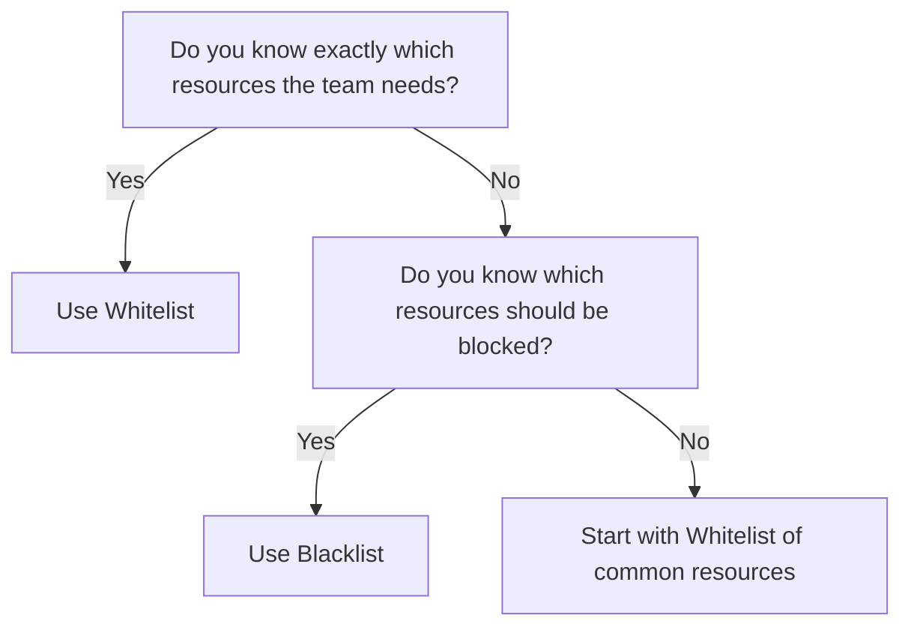

# How to Allow or Deny Specific Resource Kinds in ArgoCD Projects

Author: [nawazdhandala](https://github.com/nawazdhandala)

Tags: ArgoCD, GitOps, Kubernetes, Security, RBAC

Description: Learn how to control which Kubernetes resource types teams can create through ArgoCD projects using namespace and cluster resource whitelists and blacklists for fine-grained security.

---

Controlling which Kubernetes resource types a team can deploy is a critical security layer in ArgoCD. Even if a team's applications are restricted to specific namespaces, allowing them to create any resource kind opens the door to privilege escalation. A developer who can create a `ClusterRoleBinding` can grant themselves admin access to the entire cluster. ArgoCD project resource restrictions prevent this.

This guide covers how to use namespace resource whitelists, namespace resource blacklists, cluster resource whitelists, and cluster resource blacklists to control exactly what resource types each project can create.

## Understanding Resource Categories

Kubernetes resources fall into two categories:

**Namespace-scoped resources** exist within a namespace. Examples: Deployments, Services, ConfigMaps, Secrets, Pods, Ingresses.

**Cluster-scoped resources** exist at the cluster level and are not bound to a namespace. Examples: Namespaces, ClusterRoles, ClusterRoleBindings, PersistentVolumes, CustomResourceDefinitions, IngressClasses.

ArgoCD provides separate controls for each category:

- `namespaceResourceWhitelist` - allowed namespace-scoped resources
- `namespaceResourceBlacklist` - denied namespace-scoped resources
- `clusterResourceWhitelist` - allowed cluster-scoped resources
- `clusterResourceBlacklist` - denied cluster-scoped resources

## Default Behavior

When a project has no resource restrictions configured:

- **Namespace resources**: All namespace-scoped resources are allowed by default
- **Cluster resources**: All cluster-scoped resources are denied by default

This means by default, an application team can create Deployments and Services but cannot create ClusterRoles or Namespaces. This is a reasonable default, but you should still configure explicit whitelists.

## Configuring Namespace Resource Whitelists

The `namespaceResourceWhitelist` defines which namespace-scoped resources are allowed. When configured, only the listed resources can be created.

### Allow Specific Resource Types

```yaml
apiVersion: argoproj.io/v1alpha1
kind: AppProject
metadata:
  name: web-team
  namespace: argocd
spec:
  namespaceResourceWhitelist:
    # Core API resources
    - group: ""
      kind: ConfigMap
    - group: ""
      kind: Secret
    - group: ""
      kind: Service
    - group: ""
      kind: ServiceAccount
    - group: ""
      kind: PersistentVolumeClaim

    # Apps API group
    - group: apps
      kind: Deployment
    - group: apps
      kind: StatefulSet

    # Networking
    - group: networking.k8s.io
      kind: Ingress

    # Autoscaling
    - group: autoscaling
      kind: HorizontalPodAutoscaler

    # Disruption budgets
    - group: policy
      kind: PodDisruptionBudget
```

### Allow All Resources in an API Group

Use `*` to allow all kinds in a group:

```yaml
namespaceResourceWhitelist:
  # Allow all core API resources
  - group: ""
    kind: "*"
  # Allow all apps resources
  - group: apps
    kind: "*"
```

### Allow All Namespace Resources

```yaml
namespaceResourceWhitelist:
  - group: "*"
    kind: "*"
```

This is equivalent to no restriction and is the implicit default behavior.

## Configuring Namespace Resource Blacklists

Blacklists are the inverse of whitelists. They deny specific resources while allowing everything else. This is useful when you want to allow most resources but block a few dangerous ones.

```yaml
apiVersion: argoproj.io/v1alpha1
kind: AppProject
metadata:
  name: dev-team
  namespace: argocd
spec:
  # Allow all namespace resources EXCEPT these
  namespaceResourceBlacklist:
    # Prevent creating Roles and RoleBindings
    - group: rbac.authorization.k8s.io
      kind: Role
    - group: rbac.authorization.k8s.io
      kind: RoleBinding
    # Prevent creating ResourceQuotas (should be managed by platform team)
    - group: ""
      kind: ResourceQuota
    # Prevent creating LimitRanges
    - group: ""
      kind: LimitRange
    # Prevent creating NetworkPolicies
    - group: networking.k8s.io
      kind: NetworkPolicy
```

### Whitelist vs Blacklist: Which to Use

**Use whitelists** when you want tight control and your teams only need a known set of resources. Whitelists are more secure because new resource types are denied by default.

**Use blacklists** when your teams need flexibility and you only want to block a few dangerous resource types. Blacklists are more permissive because new resource types are allowed by default.



## Configuring Cluster Resource Whitelists

Cluster-scoped resources are denied by default, so you need an explicit whitelist to allow them.

### Platform Team: Full Cluster Access

```yaml
apiVersion: argoproj.io/v1alpha1
kind: AppProject
metadata:
  name: platform
  namespace: argocd
spec:
  clusterResourceWhitelist:
    - group: ""
      kind: Namespace
    - group: rbac.authorization.k8s.io
      kind: ClusterRole
    - group: rbac.authorization.k8s.io
      kind: ClusterRoleBinding
    - group: apiextensions.k8s.io
      kind: CustomResourceDefinition
    - group: admissionregistration.k8s.io
      kind: ValidatingWebhookConfiguration
    - group: admissionregistration.k8s.io
      kind: MutatingWebhookConfiguration
    - group: storage.k8s.io
      kind: StorageClass
    - group: networking.k8s.io
      kind: IngressClass
    - group: ""
      kind: PersistentVolume
    - group: cert-manager.io
      kind: ClusterIssuer
```

### Application Team: No Cluster Resources

```yaml
apiVersion: argoproj.io/v1alpha1
kind: AppProject
metadata:
  name: app-team
  namespace: argocd
spec:
  # Empty list means no cluster-scoped resources allowed
  clusterResourceWhitelist: []
```

### Application Team: Namespace Creation Only

Some teams need to create their own namespaces but nothing else at the cluster level:

```yaml
clusterResourceWhitelist:
  - group: ""
    kind: Namespace
```

## Configuring Cluster Resource Blacklists

Since cluster resources are denied by default (unless whitelisted), blacklists for cluster resources are useful when you want to allow most cluster resources but block a few:

```yaml
# Allow all cluster resources except the most dangerous ones
clusterResourceWhitelist:
  - group: "*"
    kind: "*"

clusterResourceBlacklist:
  # Never allow modifying webhook configurations
  - group: admissionregistration.k8s.io
    kind: ValidatingWebhookConfiguration
  - group: admissionregistration.k8s.io
    kind: MutatingWebhookConfiguration
  # Never allow modifying storage classes
  - group: storage.k8s.io
    kind: StorageClass
```

## Real-World Project Configurations

### Startup with Small Teams

When you have a few trusted teams and want simplicity:

```yaml
apiVersion: argoproj.io/v1alpha1
kind: AppProject
metadata:
  name: engineering
  namespace: argocd
spec:
  # Allow all namespace resources except RBAC
  namespaceResourceBlacklist:
    - group: rbac.authorization.k8s.io
      kind: "*"

  # Allow namespace creation only
  clusterResourceWhitelist:
    - group: ""
      kind: Namespace
```

### Enterprise with Strict Compliance

When you need tight control for compliance requirements:

```yaml
apiVersion: argoproj.io/v1alpha1
kind: AppProject
metadata:
  name: payments
  namespace: argocd
spec:
  namespaceResourceWhitelist:
    # Only the bare minimum
    - group: ""
      kind: ConfigMap
    - group: ""
      kind: Secret
    - group: ""
      kind: Service
    - group: ""
      kind: ServiceAccount
    - group: apps
      kind: Deployment
    - group: networking.k8s.io
      kind: Ingress
    - group: autoscaling
      kind: HorizontalPodAutoscaler
    - group: policy
      kind: PodDisruptionBudget

  # Absolutely no cluster resources
  clusterResourceWhitelist: []
```

### CRD-Heavy Environment

When your platform uses custom resources heavily:

```yaml
namespaceResourceWhitelist:
  # Standard resources
  - group: ""
    kind: "*"
  - group: apps
    kind: "*"
  # Custom resources from operators
  - group: monitoring.coreos.com
    kind: ServiceMonitor
  - group: monitoring.coreos.com
    kind: PrometheusRule
  - group: networking.istio.io
    kind: VirtualService
  - group: networking.istio.io
    kind: DestinationRule
  - group: cert-manager.io
    kind: Certificate
```

## Handling Resource Kind Changes

### When Teams Need New Resource Types

When a team requests a new resource type, update the project configuration:

```bash
# Check current project configuration
argocd proj get web-team -o yaml

# There is no CLI shorthand for modifying resource whitelists
# Edit the project YAML and apply
kubectl edit appproject web-team -n argocd
```

Or better, update the project YAML in Git and let ArgoCD sync it.

### When New CRDs Are Installed

After installing a new operator that creates custom resource types, update the relevant projects to allow those CRD kinds:

```yaml
# After installing Keda autoscaler
namespaceResourceWhitelist:
  # ... existing entries ...
  - group: keda.sh
    kind: ScaledObject
  - group: keda.sh
    kind: TriggerAuthentication
```

## Troubleshooting

**Application sync fails with "is not allowed"**: Check the project's resource whitelists and blacklists:

```bash
argocd proj get my-project -o yaml | grep -A 50 "ResourceWhitelist\|ResourceBlacklist"
```

**Cannot determine the correct API group**: Find the API group for a resource:

```bash
# List all API resources and their groups
kubectl api-resources | grep -i <resource-name>

# Example output:
# deployments    deploy    apps/v1    true    Deployment
# The group is "apps" and the kind is "Deployment"
```

**Wildcard not working as expected**: Remember that `group: "*"` means "any group" and `kind: "*"` means "any kind within that group". You need both wildcards to allow everything.

## Summary

Resource kind restrictions are essential for preventing privilege escalation in multi-tenant ArgoCD environments. Use whitelists for tight control (recommended for production), and blacklists when you need flexibility with a few guardrails. Always deny cluster-scoped resources for application teams unless they have a specific need. Remember that namespace-scoped resources are allowed by default until you configure a whitelist, and cluster-scoped resources are denied by default until you explicitly allow them.
