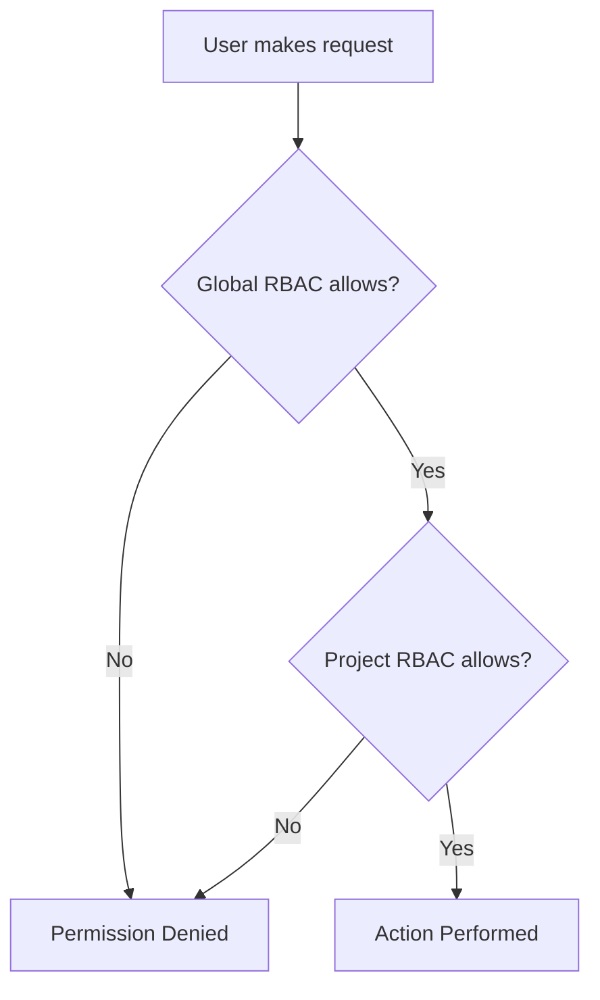

# How to Configure Project-Level RBAC in ArgoCD

Author: [nawazdhandala](https://github.com/nawazdhandala)

Tags: ArgoCD, GitOps, Kubernetes, RBAC, Projects

Description: A practical guide to configuring project-level RBAC in ArgoCD using AppProject roles, JWT tokens, and group bindings for fine-grained team access control.

---

ArgoCD provides two levels of RBAC: global policies in the `argocd-rbac-cm` ConfigMap and project-level roles defined directly within AppProject resources. Project-level RBAC is powerful because it lets project owners manage their own access control without needing cluster-wide admin permissions.

This guide covers how to set up project-level roles, bind them to SSO groups, generate tokens, and use them in practice.

## Global RBAC vs Project-Level RBAC

Before diving in, let's clarify the difference:

**Global RBAC** (in `argocd-rbac-cm`):
- Managed by ArgoCD administrators
- Applies across all projects
- Uses Casbin policy format
- Controls who can access what across the entire ArgoCD instance

**Project-Level RBAC** (in `AppProject` resources):
- Managed by project owners
- Scoped to a single project
- Defined as roles within the AppProject spec
- Controls what actions are allowed within that project

Both work together. Global RBAC determines who can access which projects, and project-level RBAC adds fine-grained control within each project.

## Defining Roles in an AppProject

Project roles are defined in the `spec.roles` field of an AppProject:

```yaml
apiVersion: argoproj.io/v1alpha1
kind: AppProject
metadata:
  name: frontend
  namespace: argocd
spec:
  description: Frontend applications
  sourceRepos:
    - 'https://github.com/myorg/frontend-*'
  destinations:
    - namespace: 'frontend-*'
      server: https://kubernetes.default.svc

  # Project-level roles
  roles:
    - name: deployer
      description: Can sync and view applications
      policies:
        - p, proj:frontend:deployer, applications, get, frontend/*, allow
        - p, proj:frontend:deployer, applications, sync, frontend/*, allow
        - p, proj:frontend:deployer, applications, action, frontend/*, allow
        - p, proj:frontend:deployer, logs, get, frontend/*, allow

    - name: viewer
      description: Read-only access to project applications
      policies:
        - p, proj:frontend:viewer, applications, get, frontend/*, allow
        - p, proj:frontend:viewer, logs, get, frontend/*, allow
```

The role name format in policies follows the pattern `proj:<project-name>:<role-name>`.

## Binding Roles to SSO Groups

To connect project roles to your identity provider groups, add `groups` to the role definition:

```yaml
apiVersion: argoproj.io/v1alpha1
kind: AppProject
metadata:
  name: frontend
  namespace: argocd
spec:
  roles:
    - name: deployer
      description: Can sync frontend apps
      policies:
        - p, proj:frontend:deployer, applications, get, frontend/*, allow
        - p, proj:frontend:deployer, applications, sync, frontend/*, allow
        - p, proj:frontend:deployer, applications, action, frontend/*, allow
      # Bind this role to SSO groups
      groups:
        - frontend-developers
        - frontend-leads

    - name: viewer
      description: Read-only access
      policies:
        - p, proj:frontend:viewer, applications, get, frontend/*, allow
      groups:
        - frontend-qa
        - frontend-interns
```

When a user logs in via SSO and their token includes the `frontend-developers` group, they automatically get the `deployer` role in the frontend project.

## Generating JWT Tokens for Project Roles

Project roles can also be used with JWT tokens, which is ideal for CI/CD pipelines or service accounts:

```bash
# Generate a token for the deployer role in the frontend project
argocd proj role create-token frontend deployer

# Generate a token with an expiration
argocd proj role create-token frontend deployer --expires-in 24h

# Generate a token with a specific token ID
argocd proj role create-token frontend deployer --token-id ci-pipeline-token
```

The generated token can be used in API calls or CLI commands:

```bash
# Use the token to sync an app
argocd app sync web-app --auth-token eyJhbGciOiJIUzI1NiIs...

# Or set it as an environment variable
export ARGOCD_AUTH_TOKEN=eyJhbGciOiJIUzI1NiIs...
argocd app sync web-app
```

## Managing Tokens

List and manage tokens for a project role:

```bash
# List tokens for a role
argocd proj role list-tokens frontend deployer

# Delete a specific token
argocd proj role delete-token frontend deployer <iat-timestamp>
```

Each token has an `iat` (issued at) timestamp that serves as its identifier. You can revoke tokens by deleting them.

## Multiple Roles with Different Permissions

Here is a complete AppProject with three different access levels:

```yaml
apiVersion: argoproj.io/v1alpha1
kind: AppProject
metadata:
  name: payments
  namespace: argocd
spec:
  description: Payment service applications
  sourceRepos:
    - 'https://github.com/myorg/payments-service'
    - 'https://github.com/myorg/payments-config'
  destinations:
    - namespace: payments
      server: https://kubernetes.default.svc
    - namespace: payments-staging
      server: https://kubernetes.default.svc

  roles:
    # Full management within the project
    - name: admin
      description: Full access to payment apps
      policies:
        - p, proj:payments:admin, applications, *, payments/*, allow
        - p, proj:payments:admin, logs, get, payments/*, allow
        - p, proj:payments:admin, exec, create, payments/*, allow
      groups:
        - payments-leads

    # Deploy and view access
    - name: deployer
      description: Can sync and view payment apps
      policies:
        - p, proj:payments:deployer, applications, get, payments/*, allow
        - p, proj:payments:deployer, applications, sync, payments/*, allow
        - p, proj:payments:deployer, applications, action, payments/*, allow
        - p, proj:payments:deployer, logs, get, payments/*, allow
      groups:
        - payments-developers

    # View only
    - name: viewer
      description: Read-only access
      policies:
        - p, proj:payments:viewer, applications, get, payments/*, allow
        - p, proj:payments:viewer, logs, get, payments/*, allow
      groups:
        - payments-qa
        - compliance-auditors
```

## Combining Project RBAC with Global RBAC

Project-level roles work alongside global RBAC. A user needs both global and project-level permissions to perform actions. Here is how they interact:

```yaml
# Global RBAC in argocd-rbac-cm
policy.csv: |
  # Allow all authenticated users to access the frontend project
  p, role:authenticated, applications, get, frontend/*, allow
  g, *, role:authenticated

# Project-level RBAC in the AppProject
roles:
  - name: deployer
    policies:
      - p, proj:frontend:deployer, applications, sync, frontend/*, allow
    groups:
      - frontend-team
```

The flow works like this:



Both layers must permit the action. If global RBAC denies access, project RBAC cannot override it.

## Project Role Policies vs Global Policies

There are some differences in what you can control at each level:

| Feature | Global RBAC | Project RBAC |
|---------|-------------|--------------|
| Application access | Yes | Yes |
| Cluster management | Yes | No |
| Repository management | Yes | No |
| Account management | Yes | No |
| Log access | Yes | Yes |
| Exec access | Yes | Yes |
| JWT token generation | No | Yes |

Project RBAC is limited to application-related operations. You cannot use project roles to manage clusters, repositories, or user accounts.

## Testing Project-Level Permissions

Test your project roles before deploying:

```bash
# Verify the project role policies
argocd proj role get frontend deployer

# Test if the role can sync
argocd admin settings rbac can proj:frontend:deployer sync applications 'frontend/web-app' \
  --namespace argocd

# Test if the role can delete
argocd admin settings rbac can proj:frontend:deployer delete applications 'frontend/web-app' \
  --namespace argocd
```

## Updating Project Roles

You can update project roles using kubectl or the ArgoCD CLI:

```bash
# Using CLI to add a policy
argocd proj role add-policy frontend deployer \
  -a get -p allow -o 'frontend/*'

# Using CLI to remove a policy
argocd proj role remove-policy frontend deployer \
  -a delete -p allow -o 'frontend/*'

# Or edit the AppProject directly
kubectl edit appproject frontend -n argocd
```

## Best Practices

1. **Use project RBAC for team-level access** - Let teams manage their own roles within their projects.

2. **Use global RBAC for cross-cutting concerns** - Platform-wide policies like "no one except admins can delete production apps" belong in global RBAC.

3. **Prefer group bindings over tokens** - SSO group bindings are easier to manage and revoke than JWT tokens.

4. **Set token expiration** - Always set an expiration on JWT tokens, especially for CI/CD pipelines.

5. **Audit role assignments** - Periodically review who has access to each project role.

## Summary

Project-level RBAC in ArgoCD lets you define fine-grained access control within each AppProject. Define roles with specific policies, bind them to SSO groups for human users, and generate JWT tokens for service accounts. Combined with global RBAC, this gives you a complete access control system where platform admins manage the big picture and project owners manage their own team access.
