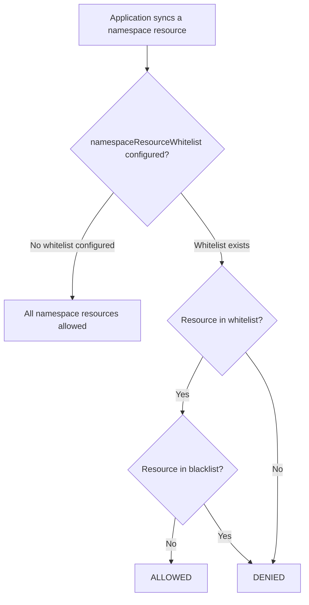

# How to Configure Project Namespace Resource Whitelists in ArgoCD

Author: [nawazdhandala](https://github.com/nawazdhandala)

Tags: ArgoCD, GitOps, Kubernetes, Security, RBAC

Description: Learn how to configure namespace resource whitelists in ArgoCD projects to control which namespace-scoped Kubernetes resources teams can deploy, with examples for different security levels.

---

Namespace resource whitelists define which namespace-scoped Kubernetes resources an ArgoCD project is allowed to create. While cluster resource whitelists protect against cluster-wide damage, namespace resource whitelists protect against unexpected or dangerous resources being deployed within a team's own namespaces.

This guide covers how to configure `namespaceResourceWhitelist` and `namespaceResourceBlacklist` for different team profiles, from restrictive environments to flexible setups.

## How Namespace Resource Whitelists Work

By default, ArgoCD projects allow all namespace-scoped resources. This is the opposite of cluster resources, which are denied by default. Once you add a `namespaceResourceWhitelist`, ArgoCD switches to an allow-only model where only listed resources are permitted.



## Finding Available Namespace Resources

Before configuring whitelists, understand what namespace-scoped resources exist in your cluster:

```bash
# List all namespace-scoped resources
kubectl api-resources --namespaced=true

# Count them
kubectl api-resources --namespaced=true | wc -l

# Common output on a typical cluster: 60-100+ resource types
```

You do not need to whitelist all of them. Only whitelist what each team actually needs.

## Basic Configuration

### Minimal Whitelist for Stateless Applications

For teams deploying standard web applications:

```yaml
apiVersion: argoproj.io/v1alpha1
kind: AppProject
metadata:
  name: web-apps
  namespace: argocd
spec:
  namespaceResourceWhitelist:
    # Core resources
    - group: ""
      kind: ConfigMap
    - group: ""
      kind: Secret
    - group: ""
      kind: Service
    - group: ""
      kind: ServiceAccount

    # Workloads
    - group: apps
      kind: Deployment

    # Networking
    - group: networking.k8s.io
      kind: Ingress

    # Scaling
    - group: autoscaling
      kind: HorizontalPodAutoscaler
```

### Extended Whitelist for Stateful Applications

For teams running databases or message queues:

```yaml
namespaceResourceWhitelist:
  # Core resources
  - group: ""
    kind: ConfigMap
  - group: ""
    kind: Secret
  - group: ""
    kind: Service
  - group: ""
    kind: ServiceAccount
  - group: ""
    kind: PersistentVolumeClaim

  # Workloads
  - group: apps
    kind: Deployment
  - group: apps
    kind: StatefulSet
  - group: apps
    kind: DaemonSet

  # Batch workloads
  - group: batch
    kind: Job
  - group: batch
    kind: CronJob

  # Networking
  - group: networking.k8s.io
    kind: Ingress

  # Scaling and availability
  - group: autoscaling
    kind: HorizontalPodAutoscaler
  - group: policy
    kind: PodDisruptionBudget
```

### Full Whitelist for Platform Team

Platform teams often need access to everything:

```yaml
namespaceResourceWhitelist:
  - group: "*"
    kind: "*"
```

## Using Blacklists Instead

When you want to allow most resources but block a few dangerous ones, use `namespaceResourceBlacklist`:

```yaml
apiVersion: argoproj.io/v1alpha1
kind: AppProject
metadata:
  name: development
  namespace: argocd
spec:
  # No whitelist = allow all (default)
  # But explicitly deny these:
  namespaceResourceBlacklist:
    # Prevent teams from managing their own RBAC
    - group: rbac.authorization.k8s.io
      kind: Role
    - group: rbac.authorization.k8s.io
      kind: RoleBinding

    # Prevent managing resource quotas
    - group: ""
      kind: ResourceQuota
    - group: ""
      kind: LimitRange

    # Prevent managing network policies
    - group: networking.k8s.io
      kind: NetworkPolicy
```

## Working with Custom Resource Definitions

When your cluster has operators installed, their custom resources are namespace-scoped. You need to add these to the whitelist explicitly.

### Prometheus / Monitoring Stack

```yaml
namespaceResourceWhitelist:
  # ... standard resources ...

  # Prometheus Operator CRDs
  - group: monitoring.coreos.com
    kind: ServiceMonitor
  - group: monitoring.coreos.com
    kind: PodMonitor
  - group: monitoring.coreos.com
    kind: PrometheusRule
```

### Istio Service Mesh

```yaml
namespaceResourceWhitelist:
  # ... standard resources ...

  # Istio networking
  - group: networking.istio.io
    kind: VirtualService
  - group: networking.istio.io
    kind: DestinationRule
  - group: networking.istio.io
    kind: Gateway

  # Istio security
  - group: security.istio.io
    kind: PeerAuthentication
  - group: security.istio.io
    kind: AuthorizationPolicy
  - group: security.istio.io
    kind: RequestAuthentication
```

### cert-manager

```yaml
namespaceResourceWhitelist:
  # ... standard resources ...

  # cert-manager
  - group: cert-manager.io
    kind: Certificate
  - group: cert-manager.io
    kind: Issuer
```

### KEDA Autoscaling

```yaml
namespaceResourceWhitelist:
  # ... standard resources ...

  # KEDA
  - group: keda.sh
    kind: ScaledObject
  - group: keda.sh
    kind: TriggerAuthentication
  - group: keda.sh
    kind: ScaledJob
```

## Combining Whitelist and Blacklist

You can use both together. The evaluation order is:

1. Check if the resource matches the whitelist (if whitelist is configured)
2. Check if the resource matches the blacklist
3. Blacklist takes precedence over whitelist

```yaml
spec:
  # Allow all apps group resources...
  namespaceResourceWhitelist:
    - group: ""
      kind: "*"
    - group: apps
      kind: "*"
    - group: batch
      kind: "*"
    - group: networking.k8s.io
      kind: "*"

  # ...but specifically deny DaemonSets
  namespaceResourceBlacklist:
    - group: apps
      kind: DaemonSet
```

## Environment-Specific Profiles

### Development Environment

Development projects can be more permissive since the blast radius is smaller:

```yaml
apiVersion: argoproj.io/v1alpha1
kind: AppProject
metadata:
  name: team-a-dev
  namespace: argocd
spec:
  namespaceResourceWhitelist:
    - group: "*"
      kind: "*"
  namespaceResourceBlacklist:
    - group: rbac.authorization.k8s.io
      kind: "*"
```

### Staging Environment

Staging should mirror production restrictions:

```yaml
apiVersion: argoproj.io/v1alpha1
kind: AppProject
metadata:
  name: team-a-staging
  namespace: argocd
spec:
  namespaceResourceWhitelist:
    - group: ""
      kind: ConfigMap
    - group: ""
      kind: Secret
    - group: ""
      kind: Service
    - group: ""
      kind: ServiceAccount
    - group: apps
      kind: Deployment
    - group: networking.k8s.io
      kind: Ingress
    - group: autoscaling
      kind: HorizontalPodAutoscaler
    - group: policy
      kind: PodDisruptionBudget
```

### Production Environment

Production should be the most restrictive:

```yaml
apiVersion: argoproj.io/v1alpha1
kind: AppProject
metadata:
  name: team-a-prod
  namespace: argocd
spec:
  namespaceResourceWhitelist:
    - group: ""
      kind: ConfigMap
    - group: ""
      kind: Secret
    - group: ""
      kind: Service
    - group: ""
      kind: ServiceAccount
    - group: apps
      kind: Deployment
    - group: networking.k8s.io
      kind: Ingress
    - group: autoscaling
      kind: HorizontalPodAutoscaler
    - group: policy
      kind: PodDisruptionBudget
    # Monitoring
    - group: monitoring.coreos.com
      kind: ServiceMonitor
    - group: monitoring.coreos.com
      kind: PrometheusRule
```

## Discovering Required Resources

When onboarding a new application, you might not know which resource types it needs. Here is a practical approach:

### Step 1: Render the Manifests Locally

```bash
# For Helm charts
helm template my-app ./my-chart | grep "^kind:" | sort -u

# For Kustomize
kustomize build ./overlays/production | grep "^kind:" | sort -u
```

### Step 2: Check API Groups

```bash
# Find the API group for each resource kind
kubectl api-resources | grep -i "ServiceMonitor\|Deployment\|Service"
```

### Step 3: Add to Whitelist

Based on the output, add only the required resource types to the project whitelist.

## Troubleshooting

**Sync fails with "resource X is not permitted"**: The resource kind is not in the project's namespace resource whitelist:

```bash
# Check the project's whitelist
argocd proj get my-project -o json | jq '.spec.namespaceResourceWhitelist'

# Find the correct group and kind for the denied resource
kubectl api-resources | grep -i "<resource-name>"
```

**Wildcard not matching CRDs**: When using `group: "*", kind: "*"`, make sure no blacklist entry overrides it for the specific CRD you need.

**Resource allowed in one project but not another**: Verify you are looking at the correct project for the application:

```bash
argocd app get my-app -o json | jq '.spec.project'
```

## Summary

Namespace resource whitelists transform ArgoCD from "allow all namespace resources by default" to "deny all unless explicitly allowed." For production environments, always configure explicit whitelists rather than relying on the permissive default. Start by identifying which resource types your applications actually need, whitelist only those, and add custom resources from operators as needed. Use blacklists for development environments where you want flexibility with just a few guardrails.
