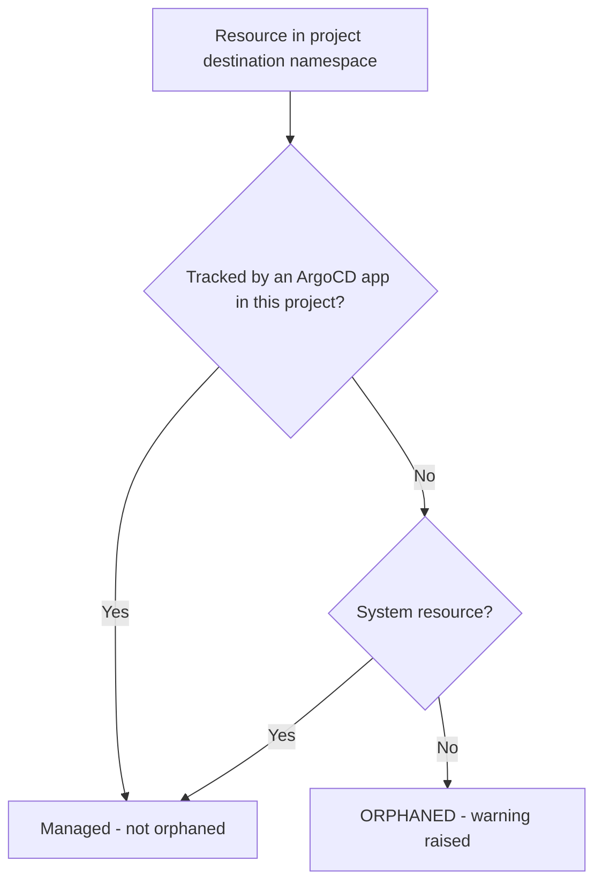

# How to Configure Project Orphaned Resources Monitoring in ArgoCD

Author: [nawazdhandala](https://github.com/nawazdhandala)

Tags: ArgoCD, GitOps, Kubernetes, Monitoring, Cleanup

Description: Learn how to configure ArgoCD's orphaned resource monitoring in projects to detect and manage Kubernetes resources that exist in the cluster but are not tracked by any ArgoCD application.

---

In a GitOps workflow, every resource in your cluster should be defined in Git and managed by ArgoCD. But reality is messy - developers create resources manually with `kubectl apply`, Helm releases leave behind forgotten resources, and deleted applications sometimes leave orphaned resources behind. ArgoCD's orphaned resource monitoring detects these unmanaged resources and warns you about them.

This guide covers how to configure orphaned resource monitoring at the project level, what it detects, and how to handle the resources it finds.

## What Are Orphaned Resources

An orphaned resource is a Kubernetes resource that:

- Exists in a namespace that is a destination for one or more ArgoCD applications
- Is not managed by any ArgoCD application in the project
- Was not created by ArgoCD

For example, if you have an ArgoCD application that manages the `payments` namespace and deploys a Deployment and a Service, but someone manually creates a ConfigMap in that namespace, that ConfigMap is an orphaned resource.

## Enabling Orphaned Resource Monitoring

Orphaned resource monitoring is configured in the AppProject spec:

```yaml
apiVersion: argoproj.io/v1alpha1
kind: AppProject
metadata:
  name: backend
  namespace: argocd
spec:
  description: "Backend team project"

  sourceRepos:
    - "https://github.com/my-org/backend-*"

  destinations:
    - server: "https://kubernetes.default.svc"
      namespace: "backend-dev"
    - server: "https://kubernetes.default.svc"
      namespace: "backend-staging"
    - server: "https://kubernetes.default.svc"
      namespace: "backend-prod"

  # Enable orphaned resource monitoring
  orphanedResources:
    warn: true
```

With `warn: true`, ArgoCD will:

- Scan all destination namespaces for the project
- Identify resources not tracked by any application in the project
- Display warnings in the ArgoCD UI and CLI
- Report orphaned resources in the application status

## Understanding the Detection Logic

ArgoCD determines if a resource is orphaned by checking:

1. The resource exists in a namespace that matches a project destination
2. No application in the project tracks this resource (via `app.kubernetes.io/instance` label or ArgoCD tracking annotations)
3. The resource was not created by Kubernetes itself (system resources are excluded)



## Excluding Resources from Orphan Detection

Not all untracked resources are problems. Some resources are created by Kubernetes automatically (like default ServiceAccounts) or by other controllers. Exclude them from orphan detection:

### Exclude by Resource Kind

```yaml
orphanedResources:
  warn: true
  ignore:
    # Ignore ServiceAccounts created by Kubernetes
    - group: ""
      kind: ServiceAccount
      name: default

    # Ignore token Secrets created for ServiceAccounts
    - group: ""
      kind: Secret
      name: "*-token-*"

    # Ignore all Events
    - group: ""
      kind: Event

    # Ignore EndpointSlices created by kube-proxy
    - group: discovery.k8s.io
      kind: EndpointSlice
```

### Exclude by Name Pattern

```yaml
orphanedResources:
  warn: true
  ignore:
    # Ignore resources with specific prefixes
    - group: ""
      kind: ConfigMap
      name: "kube-*"

    # Ignore Helm release Secrets
    - group: ""
      kind: Secret
      name: "sh.helm.release.*"
```

### Comprehensive Exclusion List

A practical exclusion list for most clusters:

```yaml
orphanedResources:
  warn: true
  ignore:
    # Default ServiceAccount in every namespace
    - group: ""
      kind: ServiceAccount
      name: default

    # Auto-generated token Secrets
    - group: ""
      kind: Secret
      name: "*-token-*"

    # Kubernetes Events
    - group: ""
      kind: Event

    # EndpointSlices
    - group: discovery.k8s.io
      kind: EndpointSlice

    # Endpoints (auto-created for Services)
    - group: ""
      kind: Endpoints

    # Leader election ConfigMaps
    - group: ""
      kind: ConfigMap
      name: "*-leader-*"

    # Kube root CA ConfigMap
    - group: ""
      kind: ConfigMap
      name: kube-root-ca.crt
```

## Viewing Orphaned Resources

### In the ArgoCD UI

When orphaned resource monitoring is enabled, the ArgoCD UI shows:

1. A warning banner on the project page
2. Individual orphaned resources listed with their kind, name, and namespace
3. A count of orphaned resources per namespace

### Via CLI

```bash
# Get project details including orphaned resource warnings
argocd proj get backend

# List applications with their orphaned resource status
argocd app list --project backend
```

### Via Kubernetes API

```bash
# Check the AppProject status
kubectl get appproject backend -n argocd -o yaml | grep -A 20 orphanedResources
```

## Handling Orphaned Resources

Once you identify orphaned resources, you have several options:

### Option 1: Add to an ArgoCD Application

If the resource should exist, add it to the appropriate application's manifests in Git:

```bash
# Check what the orphaned resource looks like
kubectl get configmap orphaned-config -n backend-prod -o yaml

# Add it to your Git repository
# Then sync the application
argocd app sync backend-api
```

### Option 2: Delete the Resource

If the resource is no longer needed:

```bash
# Delete the orphaned resource
kubectl delete configmap orphaned-config -n backend-prod
```

### Option 3: Exclude from Detection

If the resource is legitimate but not managed by ArgoCD:

```yaml
orphanedResources:
  warn: true
  ignore:
    - group: ""
      kind: ConfigMap
      name: orphaned-config
```

### Option 4: Create a Catch-All Application

For namespaces where various tools create resources, create an ArgoCD application that manages a directory of those resources:

```yaml
apiVersion: argoproj.io/v1alpha1
kind: Application
metadata:
  name: backend-prod-extras
  namespace: argocd
spec:
  project: backend
  source:
    repoURL: "https://github.com/my-org/backend-config.git"
    targetRevision: main
    path: extras/production
  destination:
    server: "https://kubernetes.default.svc"
    namespace: backend-prod
```

## Alerting on Orphaned Resources

Integrate orphaned resource warnings with your monitoring system:

### Using ArgoCD Notifications

```yaml
# In argocd-notifications-cm
apiVersion: v1
kind: ConfigMap
metadata:
  name: argocd-notifications-cm
  namespace: argocd
data:
  trigger.on-orphaned-resources: |
    - when: app.status.orphanedResources | length > 0
      send: [orphaned-resources-alert]

  template.orphaned-resources-alert: |
    message: |
      Application {{.app.metadata.name}} has {{.app.status.orphanedResources | length}} orphaned resources
      in namespace(s): {{range .app.status.orphanedResources}}{{.namespace}}/{{.kind}}/{{.name}} {{end}}
```

### Using Prometheus Metrics

ArgoCD exports metrics that can track orphaned resources:

```yaml
# Prometheus alert rule
groups:
  - name: argocd-orphaned-resources
    rules:
      - alert: OrphanedResourcesDetected
        expr: argocd_app_info{orphaned_resources="true"} > 0
        for: 24h
        labels:
          severity: warning
        annotations:
          summary: "Orphaned resources detected in {{ $labels.name }}"
```

## Project-Specific Strategies

### Strict Projects (Production)

For production projects, enable orphaned resource monitoring with tight exclusions:

```yaml
apiVersion: argoproj.io/v1alpha1
kind: AppProject
metadata:
  name: production
  namespace: argocd
spec:
  orphanedResources:
    warn: true
    ignore:
      - group: ""
        kind: ServiceAccount
        name: default
      - group: ""
        kind: Event
      - group: discovery.k8s.io
        kind: EndpointSlice
      - group: ""
        kind: Endpoints
      - group: ""
        kind: ConfigMap
        name: kube-root-ca.crt
```

### Relaxed Projects (Development)

For development projects where developers experiment frequently, either disable orphaned resource monitoring or use a broader exclusion list:

```yaml
apiVersion: argoproj.io/v1alpha1
kind: AppProject
metadata:
  name: development
  namespace: argocd
spec:
  # Either disable entirely
  # orphanedResources: {}

  # Or enable with broad exclusions
  orphanedResources:
    warn: true
    ignore:
      - group: "*"
        kind: "*"
        name: "*"
```

## Performance Considerations

Orphaned resource monitoring requires ArgoCD to list all resources in each destination namespace and compare them against tracked resources. For projects with many destination namespaces or namespaces with many resources, this can increase API server load.

Mitigations:

- Limit the number of destination namespaces per project
- Use specific namespace names instead of wildcards in destinations
- Exclude noisy resource types that are frequently auto-created

## Troubleshooting

**Too many false positives**: Refine your ignore list. Check which resources are being flagged:

```bash
argocd proj get backend -o json | jq '.status.orphanedResources'
```

**Orphaned resources not detected**: Verify that `orphanedResources.warn` is set to `true` and that the resource's namespace is in the project's destinations.

**Performance degradation**: If API server load increases after enabling orphan monitoring, check how many resources exist in destination namespaces:

```bash
kubectl get all -n backend-prod | wc -l
```

Consider excluding high-volume resource types like Events and EndpointSlices.

## Summary

Orphaned resource monitoring is a valuable feature for maintaining GitOps hygiene. Enable it on production projects to catch manually created resources and leftover artifacts from deleted applications. Use the ignore list to filter out system-generated resources and reduce noise. For development environments, either disable it or use broad exclusions to avoid overwhelming developers with warnings about their experimental resources.
