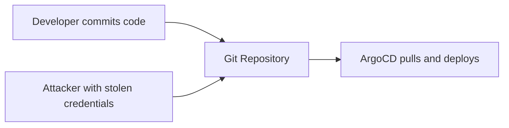
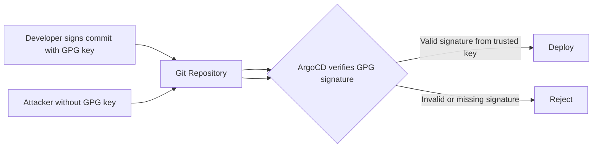

# How to Configure Project Signature Keys in ArgoCD

Author: [nawazdhandala](https://github.com/nawazdhandala)

Tags: ArgoCD, GitOps, Kubernetes, Security, GPG

Description: Learn how to configure GnuPG signature verification in ArgoCD projects to ensure only signed Git commits are deployed, providing a cryptographic chain of trust for your GitOps pipeline.

---

In a GitOps workflow, the Git repository is the source of truth for your infrastructure. But how do you know that the commits in that repository are authentic? Without signature verification, a compromised Git account could push malicious changes that ArgoCD would dutifully deploy. ArgoCD's GnuPG signature verification feature ensures that only commits signed by trusted keys can be deployed.

This guide covers configuring GPG signature keys at the project level to enforce commit signing policies.

## Why Signature Verification Matters

Without signature verification, your GitOps pipeline has a trust gap:



With signature verification:



Even if an attacker gains access to the Git repository, they cannot create commits with valid GPG signatures without the private key.

## Prerequisites

- ArgoCD v2.4 or later
- GnuPG installed on your local machine
- Git configured for commit signing
- Team members with GPG key pairs

## Step 1: Generate GPG Keys (If Needed)

If your team does not already have GPG keys:

```bash
# Generate a new GPG key
gpg --full-generate-key

# Choose:
# - RSA and RSA
# - 4096 bits
# - Key does not expire (or set an expiration)
# - Your name and email

# List your keys
gpg --list-keys --keyid-format long

# Export the public key
gpg --armor --export YOUR_KEY_ID > my-public-key.asc
```

## Step 2: Add GPG Keys to ArgoCD

ArgoCD maintains a GnuPG keyring for signature verification. Add each trusted key:

### Using the CLI

```bash
# Import a public key
argocd gpg add --from my-public-key.asc

# List configured keys
argocd gpg list

# Get key details
argocd gpg get YOUR_KEY_ID
```

### Using Kubernetes ConfigMap

Add keys via the `argocd-gpg-keys-cm` ConfigMap:

```yaml
apiVersion: v1
kind: ConfigMap
metadata:
  name: argocd-gpg-keys-cm
  namespace: argocd
data:
  # Key name is arbitrary, content is the public key
  developer1: |
    -----BEGIN PGP PUBLIC KEY BLOCK-----

    mQINBGN...
    ...
    -----END PGP PUBLIC KEY BLOCK-----

  developer2: |
    -----BEGIN PGP PUBLIC KEY BLOCK-----

    mQINBGN...
    ...
    -----END PGP PUBLIC KEY BLOCK-----
```

```bash
kubectl apply -f argocd-gpg-keys-cm.yaml
```

## Step 3: Configure Project Signature Keys

Now configure the project to require commits to be signed by specific keys:

```yaml
apiVersion: argoproj.io/v1alpha1
kind: AppProject
metadata:
  name: production
  namespace: argocd
spec:
  description: "Production applications - signed commits required"

  sourceRepos:
    - "https://github.com/my-org/production-*"

  destinations:
    - server: "https://kubernetes.default.svc"
      namespace: "prod-*"

  # Require commits to be signed by these GPG key IDs
  signatureKeys:
    - keyID: "ABCDEF1234567890"
    - keyID: "1234567890ABCDEF"
    - keyID: "FEDCBA0987654321"
```

With this configuration, ArgoCD will only sync commits that are signed by one of the listed key IDs. Unsigned commits or commits signed by unlisted keys will be rejected.

## How Verification Works

When ArgoCD syncs an application in a project with signature keys:

1. ArgoCD fetches the target commit from the Git repository
2. ArgoCD checks if the commit has a GPG signature
3. If signed, ArgoCD verifies the signature against its GPG keyring
4. ArgoCD checks if the signing key's ID matches one in the project's `signatureKeys` list
5. Only if all checks pass does ArgoCD proceed with the sync

```bash
# You can verify a commit signature locally to test
git log --show-signature -1

# Expected output for a signed commit:
# gpg: Signature made Mon Jan 15 10:30:00 2024 UTC
# gpg: using RSA key ABCDEF1234567890
# gpg: Good signature from "Developer Name <dev@example.com>"
```

## Configuring Git for Commit Signing

### For Individual Developers

```bash
# Tell Git to use your GPG key for signing
git config --global user.signingkey YOUR_KEY_ID

# Always sign commits
git config --global commit.gpgsign true

# Always sign tags
git config --global tag.gpgsign true
```

### For CI/CD Systems

CI/CD pipelines that generate commits (like image updaters) also need to sign:

```yaml
# GitHub Actions example
- name: Import GPG key
  uses: crazy-max/ghaction-import-gpg@v6
  with:
    gpg_private_key: ${{ secrets.GPG_PRIVATE_KEY }}
    passphrase: ${{ secrets.GPG_PASSPHRASE }}
    git_user_signingkey: true
    git_commit_gpgsign: true

- name: Create signed commit
  run: |
    git add .
    git commit -S -m "Update image tag to v1.2.3"
    git push
```

## Multi-Team Key Management

### Per-Team Key Sets

Different projects can require different signing keys:

```yaml
# Backend team project
apiVersion: argoproj.io/v1alpha1
kind: AppProject
metadata:
  name: backend
  namespace: argocd
spec:
  signatureKeys:
    - keyID: "BACKEND_LEAD_KEY_ID"
    - keyID: "BACKEND_DEV1_KEY_ID"
    - keyID: "BACKEND_DEV2_KEY_ID"
    - keyID: "CI_BOT_KEY_ID"
---
# Frontend team project
apiVersion: argoproj.io/v1alpha1
kind: AppProject
metadata:
  name: frontend
  namespace: argocd
spec:
  signatureKeys:
    - keyID: "FRONTEND_LEAD_KEY_ID"
    - keyID: "FRONTEND_DEV1_KEY_ID"
    - keyID: "CI_BOT_KEY_ID"
```

### Shared CI/CD Signing Key

Include a CI/CD bot key in all projects that use automated commits:

```yaml
# All projects include the CI bot key
signatureKeys:
  - keyID: "CI_BOT_KEY_ID"     # Shared CI bot
  - keyID: "TEAM_MEMBER_1_ID"   # Team-specific
  - keyID: "TEAM_MEMBER_2_ID"
```

## Key Rotation

When a team member leaves or a key is compromised:

### Remove the Old Key

```bash
# Remove from ArgoCD keyring
argocd gpg rm OLD_KEY_ID

# Remove from project signatureKeys
# Edit the project YAML and remove the keyID entry
```

### Add New Keys

```bash
# Add the new key to ArgoCD
argocd gpg add --from new-key.asc

# Update project signatureKeys
argocd proj add-signature-key production NEW_KEY_ID
```

### Handling Key Expiration

If you set expiration on GPG keys, plan for rotation before expiry:

```bash
# Check key expiration
gpg --list-keys --keyid-format long | grep -A1 "expires"

# Extend key expiration
gpg --edit-key YOUR_KEY_ID
# gpg> expire
# Set new expiration
# gpg> save

# Re-export and update in ArgoCD
gpg --armor --export YOUR_KEY_ID > updated-key.asc
argocd gpg rm YOUR_KEY_ID
argocd gpg add --from updated-key.asc
```

## Enforcement Levels

### Strict: All Production Projects

Require signing for all production deployments:

```yaml
# Production project - signing required
apiVersion: argoproj.io/v1alpha1
kind: AppProject
metadata:
  name: production
spec:
  signatureKeys:
    - keyID: "KEY1"
    - keyID: "KEY2"
    - keyID: "KEY3"
```

### Relaxed: Development Without Signing

Development projects can skip signing for faster iteration:

```yaml
# Development project - no signing required
apiVersion: argoproj.io/v1alpha1
kind: AppProject
metadata:
  name: development
spec:
  # No signatureKeys field = no signing requirement
  sourceRepos:
    - "*"
```

### Progressive: Staging Requires Signing, Dev Does Not

```yaml
# Staging - signing required (same keys as production)
apiVersion: argoproj.io/v1alpha1
kind: AppProject
metadata:
  name: staging
spec:
  signatureKeys:
    - keyID: "KEY1"
    - keyID: "KEY2"
```

## Troubleshooting

**Sync rejected with "signature verification failed"**: Check that the commit is actually signed:

```bash
git log --show-signature -1 HEAD
```

If it shows "No signature", the commit is not signed. Ensure `commit.gpgsign = true` in Git config.

**"unknown key" error**: The signing key is not in ArgoCD's keyring:

```bash
# List keys in ArgoCD
argocd gpg list

# Add the missing key
argocd gpg add --from missing-key.asc
```

**Key ID mismatch**: The key might be in ArgoCD's keyring but not in the project's `signatureKeys` list:

```bash
# Check project's required keys
argocd proj get production -o json | jq '.spec.signatureKeys'

# Add the key to the project
argocd proj add-signature-key production MISSING_KEY_ID
```

**CI pipeline commits rejected**: Ensure the CI bot has a GPG key configured and the key is in both the ArgoCD keyring and the project's `signatureKeys`.

## Integration with GitHub Verified Commits

GitHub shows a "Verified" badge on signed commits. This visual indicator complements ArgoCD's verification:

```bash
# Upload your GPG public key to GitHub
# Settings > SSH and GPG keys > New GPG key

# Then push signed commits
git commit -S -m "My signed commit"
git push
```

ArgoCD's verification is independent of GitHub's - ArgoCD uses its own keyring and does not trust GitHub's verification alone.

## Summary

GPG signature verification in ArgoCD projects provides a cryptographic chain of trust for your GitOps pipeline. Configure it for production projects to ensure only commits from authorized developers and CI systems can be deployed. Add all team members' public keys and your CI bot's key to both the ArgoCD keyring and the project's `signatureKeys` list. For development environments, you can skip signing to reduce friction while maintaining the security boundary for production.

For more on ArgoCD GnuPG key management, see our guide on [ArgoCD GnuPG Keys](https://oneuptime.com/blog/post/2026-01-30-argocd-gnupg-keys/view).
