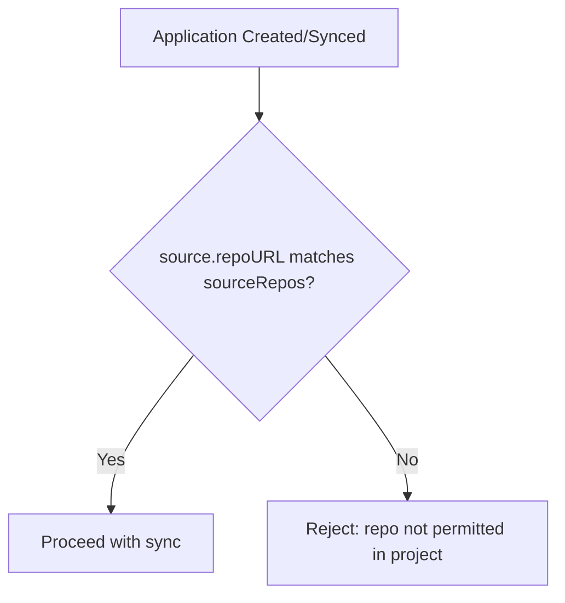

# How to Configure Project Source Restrictions in ArgoCD

Author: [nawazdhandala](https://github.com/nawazdhandala)

Tags: ArgoCD, GitOps, Kubernetes, Security, RBAC

Description: Learn how to configure ArgoCD project source repository restrictions to control which Git repos, Helm registries, and OCI sources teams can deploy from, with practical patterns and examples.

---

One of the most important security controls in ArgoCD is restricting which source repositories a project's applications can deploy from. Without source restrictions, any user with access to a project could point an application at a malicious repository and deploy arbitrary workloads to your cluster. Project source restrictions close this door.

This guide covers everything about the `sourceRepos` field in ArgoCD AppProjects, including patterns, wildcards, and the practical considerations you need to think about.

## How Source Restrictions Work

The `sourceRepos` field in an AppProject spec defines an allow list of repository URLs. When a user creates or syncs an application in that project, ArgoCD checks whether the application's `source.repoURL` matches any entry in `sourceRepos`. If it does not match, ArgoCD rejects the operation.



This check happens at multiple points:

- When creating an application (via CLI, UI, or declaratively)
- When syncing an application
- When modifying an application's source

## Basic Source Restrictions

### Allowing Specific Repositories

The most restrictive and secure approach - list each allowed repository explicitly:

```yaml
apiVersion: argoproj.io/v1alpha1
kind: AppProject
metadata:
  name: backend-team
  namespace: argocd
spec:
  sourceRepos:
    - "https://github.com/my-org/backend-api.git"
    - "https://github.com/my-org/backend-config.git"
    - "https://github.com/my-org/shared-charts.git"
```

With this configuration, applications in the `backend-team` project can only deploy from these three specific repositories.

### Allowing All Repositories in an Organization

For less restrictive setups, use a wildcard to allow any repository in your GitHub organization:

```yaml
sourceRepos:
  - "https://github.com/my-org/*"
```

This matches any repository under `my-org` on GitHub.

### Allowing All Repositories (Not Recommended)

The `default` project uses this configuration:

```yaml
sourceRepos:
  - "*"
```

This disables source restrictions entirely. Avoid this in production projects.

## Wildcard Patterns

ArgoCD uses glob matching for source repo patterns. Here are the patterns you can use:

```yaml
sourceRepos:
  # Match any repo in a specific org
  - "https://github.com/my-org/*"

  # Match repos with a specific prefix
  - "https://github.com/my-org/payments-*"

  # Match any GitHub repo (dangerous)
  - "https://github.com/*/*"

  # Match a specific GitLab group and all subgroups
  - "https://gitlab.com/my-group/**"

  # Match OCI registries
  - "ghcr.io/my-org/*"
  - "myregistry.azurecr.io/*"
```

### Pattern Best Practices

**Prefer explicit URLs over wildcards** when the number of repositories is small and stable:

```yaml
# Good: explicit list
sourceRepos:
  - "https://github.com/my-org/frontend-app.git"
  - "https://github.com/my-org/frontend-config.git"

# Acceptable: scoped wildcard for teams with many repos
sourceRepos:
  - "https://github.com/my-org/frontend-*"

# Bad: too broad
sourceRepos:
  - "https://github.com/*"
```

## Mixing Git and OCI Sources

Modern ArgoCD setups often use both Git repositories and OCI registries. Configure both in the same project:

```yaml
apiVersion: argoproj.io/v1alpha1
kind: AppProject
metadata:
  name: data-team
  namespace: argocd
spec:
  sourceRepos:
    # Git repositories
    - "https://github.com/my-org/data-pipelines.git"
    - "https://github.com/my-org/data-config.git"
    # OCI registries for Helm charts
    - "ghcr.io/my-org/helm-charts/*"
    - "myregistry.azurecr.io/charts/*"
    # Public Helm chart registries
    - "https://charts.bitnami.com/bitnami"
    - "https://prometheus-community.github.io/helm-charts"
```

## Restricting Helm Chart Sources

When teams use Helm charts from public registries, you need to decide which registries to allow:

```yaml
sourceRepos:
  # Team's own repos
  - "https://github.com/my-org/team-repos-*"
  # Approved public Helm registries
  - "https://charts.bitnami.com/bitnami"
  - "https://grafana.github.io/helm-charts"
  - "https://prometheus-community.github.io/helm-charts"
  # OCI Helm charts from the organization's registry
  - "ghcr.io/my-org/*"
```

This ensures teams can only use Helm charts from approved sources, preventing the use of untrusted or unmaintained charts.

## Source Restrictions with Multi-Source Applications

ArgoCD v2.6 introduced multi-source applications, where a single application can pull from multiple repositories. Each source URL must match the project's `sourceRepos`:

```yaml
# Application with multiple sources
apiVersion: argoproj.io/v1alpha1
kind: Application
metadata:
  name: my-app
  namespace: argocd
spec:
  project: backend-team
  sources:
    # Both of these must be in the project's sourceRepos
    - repoURL: "https://github.com/my-org/backend-api.git"
      path: k8s/base
    - repoURL: "ghcr.io/my-org/helm-charts/common"
      chart: common
      targetRevision: "1.0.0"
```

The project must allow both sources:

```yaml
sourceRepos:
  - "https://github.com/my-org/backend-api.git"
  - "ghcr.io/my-org/helm-charts/*"
```

## Updating Source Restrictions

### Adding a New Repository

When a team needs access to an additional repository:

```bash
# Using CLI
argocd proj add-source backend-team "https://github.com/my-org/new-service.git"

# Verify
argocd proj get backend-team
```

Or update the YAML and apply:

```bash
# Edit the project YAML to add the new repo to sourceRepos
kubectl apply -f backend-project.yaml
```

### Removing a Repository

```bash
# Using CLI
argocd proj remove-source backend-team "https://github.com/my-org/old-service.git"
```

Note: removing a source repository does not automatically delete applications that use it. Those applications will fail to sync but will continue to exist. You should clean up affected applications separately.

## Validating Source Restrictions

Test that restrictions work correctly:

```bash
# This should succeed (allowed repo)
argocd app create test-allowed \
  --project backend-team \
  --repo https://github.com/my-org/backend-api.git \
  --path k8s \
  --dest-server https://kubernetes.default.svc \
  --dest-namespace backend-dev

# This should fail (unauthorized repo)
argocd app create test-denied \
  --project backend-team \
  --repo https://github.com/other-org/malicious.git \
  --path k8s \
  --dest-server https://kubernetes.default.svc \
  --dest-namespace backend-dev
# Expected: application repo https://github.com/other-org/malicious.git
#           is not permitted in project 'backend-team'
```

## Common Pitfalls

**Forgetting the .git suffix**: GitHub URLs can be written with or without `.git`. ArgoCD matches the exact string, so if your source uses `https://github.com/my-org/repo.git` but the project allows `https://github.com/my-org/repo`, they will not match. Use the same format everywhere, or add both:

```yaml
sourceRepos:
  - "https://github.com/my-org/repo"
  - "https://github.com/my-org/repo.git"
```

Or use a wildcard that covers both:

```yaml
sourceRepos:
  - "https://github.com/my-org/repo*"
```

**SSH vs HTTPS URLs**: If some applications use SSH URLs (`git@github.com:my-org/repo.git`) and others use HTTPS, you need to allow both formats:

```yaml
sourceRepos:
  - "https://github.com/my-org/*"
  - "git@github.com:my-org/*"
```

**Case sensitivity**: Repository URL matching is case-sensitive. `https://github.com/My-Org/Repo` and `https://github.com/my-org/repo` are treated as different URLs.

## Monitoring Source Restriction Violations

Check the ArgoCD server logs for rejected operations:

```bash
kubectl logs -n argocd deployment/argocd-server | grep "not permitted in project"
```

You can also set up ArgoCD notifications to alert when applications fail validation:

```yaml
# In argocd-notifications-cm
trigger.on-app-sync-failed: |
  - when: app.status.operationState.phase in ['Error', 'Failed']
    send: [app-sync-failed]
```

## Summary

Source restrictions are one of the most important security controls in ArgoCD. Always use explicit repository URLs or tightly scoped wildcards. Remember to cover both Git and OCI sources, handle URL format variations (HTTPS vs SSH, with or without `.git`), and test your restrictions by attempting to create applications from unauthorized sources. Manage project definitions in Git so all source restriction changes go through code review.
