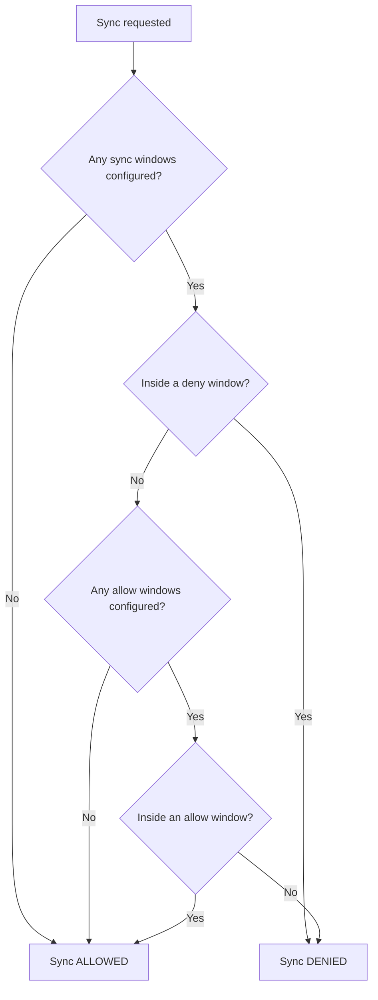

# How to Configure Project Windows (Sync Windows per Project) in ArgoCD

Author: [nawazdhandala](https://github.com/nawazdhandala)

Tags: ArgoCD, GitOps, Kubernetes, Deployments, Scheduling

Description: Learn how to configure sync windows in ArgoCD projects to control when applications can be deployed, with allow and deny windows for maintenance schedules and change freeze periods.

---

Sync windows in ArgoCD control when applications are allowed to sync. They are configured at the project level, which means you can have different sync schedules for different teams. The production payments system might have strict deployment windows, while the development environment can deploy anytime.

This guide covers how to configure sync windows in ArgoCD projects, including allow windows, deny windows, scheduling patterns, and overrides for emergencies.

## How Sync Windows Work

Sync windows are defined in the `syncWindows` field of an AppProject spec. There are two types:

- **Allow windows**: Deployments are only permitted during these time windows
- **Deny windows**: Deployments are blocked during these time windows

When both allow and deny windows are defined, deny windows take precedence. If no sync windows are configured, deployments are allowed at any time.



## Basic Sync Window Configuration

### Allow Deployments During Business Hours

```yaml
apiVersion: argoproj.io/v1alpha1
kind: AppProject
metadata:
  name: production
  namespace: argocd
spec:
  syncWindows:
    # Allow syncs Monday-Friday, 9 AM to 5 PM UTC
    - kind: allow
      schedule: "0 9 * * 1-5"
      duration: 8h
      applications:
        - "*"
```

### Deny Deployments During Weekends

```yaml
syncWindows:
  # Block all syncs on Saturday and Sunday
  - kind: deny
    schedule: "0 0 * * 0,6"
    duration: 24h
    applications:
      - "*"
```

### Maintenance Window

```yaml
syncWindows:
  # Allow syncs only during the maintenance window (Tuesday 2-4 AM UTC)
  - kind: allow
    schedule: "0 2 * * 2"
    duration: 2h
    applications:
      - "*"
```

## Sync Window Fields

Each sync window entry has these fields:

| Field | Description | Example |
|---|---|---|
| `kind` | `allow` or `deny` | `allow` |
| `schedule` | Cron expression for window start | `0 9 * * 1-5` |
| `duration` | How long the window stays open | `8h`, `30m`, `2h30m` |
| `applications` | List of app name patterns | `["*"]`, `["api-*"]` |
| `namespaces` | List of namespace patterns | `["prod-*"]` |
| `clusters` | List of cluster patterns | `["https://prod.k8s.example.com"]` |
| `manualSync` | Whether manual syncs are also blocked | `true` or `false` |
| `timeZone` | Time zone for the schedule | `America/New_York` |

## Cron Schedule Reference

The schedule follows standard cron format:

```text
┌─────── minute (0-59)
│ ┌───── hour (0-23)
│ │ ┌─── day of month (1-31)
│ │ │ ┌─ month (1-12)
│ │ │ │ ┌ day of week (0-6, 0=Sunday)
│ │ │ │ │
* * * * *
```

Common patterns:

```yaml
# Every day at midnight
schedule: "0 0 * * *"

# Weekdays at 9 AM
schedule: "0 9 * * 1-5"

# First Monday of each month at 2 AM
schedule: "0 2 1-7 * 1"

# Every 4 hours
schedule: "0 */4 * * *"
```

## Scoping Sync Windows

### By Application Name

Target specific applications:

```yaml
syncWindows:
  # Strict window for the payments API
  - kind: allow
    schedule: "0 2 * * 2"
    duration: 2h
    applications:
      - "payments-api"
      - "payments-worker"

  # More flexible window for internal tools
  - kind: allow
    schedule: "0 9 * * 1-5"
    duration: 10h
    applications:
      - "internal-*"
```

### By Namespace

Target applications deployed to specific namespaces:

```yaml
syncWindows:
  # Production namespaces: strict window
  - kind: allow
    schedule: "0 2 * * 3"
    duration: 4h
    namespaces:
      - "prod-*"

  # Staging namespaces: business hours
  - kind: allow
    schedule: "0 8 * * 1-5"
    duration: 12h
    namespaces:
      - "staging-*"
```

### By Cluster

Target applications deployed to specific clusters:

```yaml
syncWindows:
  # Production cluster: maintenance window only
  - kind: allow
    schedule: "0 2 * * 3"
    duration: 4h
    clusters:
      - "https://prod.k8s.example.com"

  # Dev cluster: anytime
  - kind: allow
    schedule: "0 0 * * *"
    duration: 24h
    clusters:
      - "https://dev.k8s.example.com"
```

## Change Freeze Periods

Block all deployments during critical business periods:

```yaml
apiVersion: argoproj.io/v1alpha1
kind: AppProject
metadata:
  name: ecommerce
  namespace: argocd
spec:
  syncWindows:
    # Normal business hours deployment window
    - kind: allow
      schedule: "0 9 * * 1-5"
      duration: 8h
      applications:
        - "*"

    # Black Friday freeze (November 25-30)
    - kind: deny
      schedule: "0 0 25 11 *"
      duration: 120h    # 5 days
      applications:
        - "*"
      manualSync: true  # Also block manual syncs

    # Year-end freeze (December 20 to January 2)
    - kind: deny
      schedule: "0 0 20 12 *"
      duration: 312h    # 13 days
      applications:
        - "*"
      manualSync: true
```

## Controlling Manual Syncs

By default, sync windows only affect automated (auto-sync) operations. Manual syncs can still proceed. To block manual syncs too:

```yaml
syncWindows:
  - kind: deny
    schedule: "0 0 * * 0,6"
    duration: 24h
    applications:
      - "*"
    # When true, even clicking "Sync" in the UI is blocked
    manualSync: true
```

When `manualSync` is `false` (the default), users can still manually trigger syncs even during deny windows. This is useful for emergency fixes while still preventing automated syncs from running.

## Time Zone Support

By default, sync windows use UTC. Specify a time zone for location-aware scheduling:

```yaml
syncWindows:
  # Business hours in US Eastern time
  - kind: allow
    schedule: "0 9 * * 1-5"
    duration: 8h
    timeZone: "America/New_York"
    applications:
      - "*"

  # Business hours in EU time
  - kind: allow
    schedule: "0 9 * * 1-5"
    duration: 8h
    timeZone: "Europe/London"
    applications:
      - "eu-*"
```

## Combining Allow and Deny Windows

When both types are present, deny windows always win:

```yaml
syncWindows:
  # Allow during weekday business hours
  - kind: allow
    schedule: "0 8 * * 1-5"
    duration: 10h
    applications:
      - "*"

  # But deny during the daily standup (10-10:30 AM UTC)
  - kind: deny
    schedule: "30 9 * * 1-5"
    duration: 30m
    applications:
      - "*"

  # And deny during month-end processing (last day of month)
  - kind: deny
    schedule: "0 0 28-31 * *"
    duration: 24h
    applications:
      - "payments-*"
```

## Complete Production Project Example

```yaml
apiVersion: argoproj.io/v1alpha1
kind: AppProject
metadata:
  name: production-apps
  namespace: argocd
spec:
  description: "Production applications with deployment windows"

  sourceRepos:
    - "https://github.com/my-org/*"

  destinations:
    - server: "https://prod.k8s.example.com"
      namespace: "*"

  syncWindows:
    # Primary deployment window: Tuesday and Thursday 2-6 AM UTC
    - kind: allow
      schedule: "0 2 * * 2,4"
      duration: 4h
      applications:
        - "*"

    # Emergency window: always allow critical services
    - kind: allow
      schedule: "0 0 * * *"
      duration: 24h
      applications:
        - "hotfix-*"
      manualSync: false

    # Holiday freeze: December 15 to January 5
    - kind: deny
      schedule: "0 0 15 12 *"
      duration: 504h   # 21 days
      applications:
        - "*"
      manualSync: true

  clusterResourceWhitelist: []
  namespaceResourceWhitelist:
    - group: "*"
      kind: "*"
```

## Checking Active Sync Windows

```bash
# Get project details including sync windows
argocd proj get production-apps

# Check if an application can sync right now
argocd proj windows list production-apps

# Output shows which windows are active and which apps they affect
```

## Overriding Sync Windows in Emergencies

When you need to deploy during a deny window:

```bash
# Force sync ignores sync windows (requires admin permissions)
argocd app sync my-critical-app --force
```

The `--force` flag requires the user to have `override` permission on the application:

```yaml
# RBAC policy to allow override
p, role:emergency-deployer, applications, override, production-apps/*, allow
```

## Troubleshooting

**Sync blocked unexpectedly**: Check all active sync windows:

```bash
argocd proj windows list production-apps
```

**Sync allowed when it should be blocked**: Verify the cron schedule is correct. Use an online cron calculator to double check. Also check if `manualSync` is set to `true` if you want to block manual syncs.

**Time zone confusion**: If sync windows seem to trigger at the wrong time, verify the `timeZone` field. Default is UTC.

## Summary

Sync windows in ArgoCD projects give you precise control over when deployments can happen. Use allow windows for maintenance windows and business hours, deny windows for change freezes and blackout periods, and the `manualSync` flag to control whether operators can override the schedule. For production environments, always configure sync windows to prevent accidental deployments during critical periods. Keep emergency override procedures documented and tested.

For more on sync windows, see our guide on [ArgoCD Sync Windows](https://oneuptime.com/blog/post/2026-01-30-argocd-sync-windows/view).
