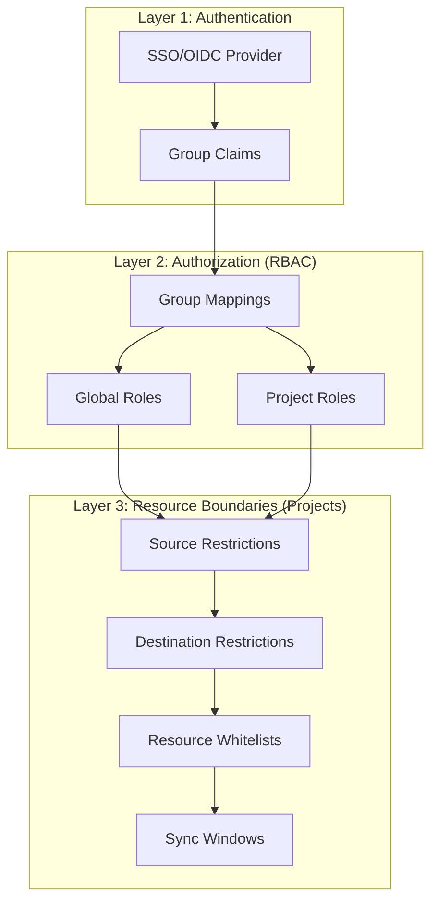

# How to Use Projects for Multi-Team Access Control in ArgoCD

Author: [nawazdhandala](https://github.com/nawazdhandala)

Tags: ArgoCD, GitOps, Kubernetes, Multi-Tenancy, RBAC

Description: Learn how to design and implement a multi-team access control strategy using ArgoCD projects, combining project restrictions with RBAC policies and SSO integration for enterprise environments.

---

When your organization has multiple teams sharing a single ArgoCD instance, you need a cohesive access control strategy that prevents teams from interfering with each other while keeping the administrative overhead manageable. ArgoCD projects are the foundation, but a real multi-team setup requires combining projects with RBAC policies, SSO group mappings, and operational procedures.

This guide presents a complete access control architecture for multi-team ArgoCD environments.

## The Three Layers of Access Control

Effective multi-team access control in ArgoCD operates at three layers:



**Layer 1 (Authentication)**: Who is the user? Handled by SSO/OIDC.

**Layer 2 (Authorization)**: What actions can they perform? Handled by RBAC policies.

**Layer 3 (Resource Boundaries)**: What resources can they affect? Handled by project restrictions.

## Designing the Project Structure

### Team-Based Projects

Each team gets their own project with appropriate restrictions:

```yaml
# Team structure:
# - Platform team: manages infrastructure
# - Backend team: manages APIs and services
# - Frontend team: manages web applications
# - Data team: manages data pipelines
```

### Environment-Based Variation

Some organizations create separate projects per team per environment:

```yaml
# Per team per environment
backend-dev      # Loose restrictions
backend-staging  # Moderate restrictions
backend-prod     # Strict restrictions
```

### Hybrid Approach (Recommended)

One project per team with sync windows controlling environment access:

```yaml
# One project per team
backend    # Source/destination restrictions handle environments
frontend   # Sync windows control production deployment timing
platform   # Broader access for infrastructure
```

## Complete Implementation

### Step 1: Define Projects

```yaml
# platform-project.yaml
apiVersion: argoproj.io/v1alpha1
kind: AppProject
metadata:
  name: platform
  namespace: argocd
  finalizers:
    - resources-finalizer.argocd.argoproj.io
spec:
  description: "Platform team - cluster infrastructure and shared services"

  sourceRepos:
    - "https://github.com/my-org/platform-*"
    - "https://github.com/my-org/infrastructure.git"
    - "https://charts.bitnami.com/bitnami"
    - "https://prometheus-community.github.io/helm-charts"
    - "https://grafana.github.io/helm-charts"

  destinations:
    - server: "*"
      namespace: "monitoring"
    - server: "*"
      namespace: "logging"
    - server: "*"
      namespace: "ingress-nginx"
    - server: "*"
      namespace: "cert-manager"
    - server: "*"
      namespace: "kube-system"

  clusterResourceWhitelist:
    - group: "*"
      kind: "*"

  namespaceResourceWhitelist:
    - group: "*"
      kind: "*"

  orphanedResources:
    warn: true
    ignore:
      - group: ""
        kind: ServiceAccount
        name: default
      - group: ""
        kind: Event

  roles:
    - name: admin
      description: "Platform team full access"
      policies:
        - p, proj:platform:admin, applications, *, platform/*, allow
        - p, proj:platform:admin, logs, get, platform/*, allow
        - p, proj:platform:admin, exec, create, platform/*, allow
      groups:
        - my-org:platform-engineers

    - name: viewer
      description: "Read-only for platform resources"
      policies:
        - p, proj:platform:viewer, applications, get, platform/*, allow
      groups:
        - my-org:all-engineering
---
# backend-project.yaml
apiVersion: argoproj.io/v1alpha1
kind: AppProject
metadata:
  name: backend
  namespace: argocd
  finalizers:
    - resources-finalizer.argocd.argoproj.io
spec:
  description: "Backend team - APIs and microservices"

  sourceRepos:
    - "https://github.com/my-org/backend-*"
    - "https://github.com/my-org/shared-charts.git"
    - "ghcr.io/my-org/helm-charts/*"

  destinations:
    - server: "https://kubernetes.default.svc"
      namespace: "backend-dev"
    - server: "https://kubernetes.default.svc"
      namespace: "backend-staging"
    - server: "https://kubernetes.default.svc"
      namespace: "backend-prod"

  clusterResourceWhitelist: []

  namespaceResourceWhitelist:
    - group: ""
      kind: ConfigMap
    - group: ""
      kind: Secret
    - group: ""
      kind: Service
    - group: ""
      kind: ServiceAccount
    - group: ""
      kind: PersistentVolumeClaim
    - group: apps
      kind: Deployment
    - group: apps
      kind: StatefulSet
    - group: batch
      kind: Job
    - group: batch
      kind: CronJob
    - group: networking.k8s.io
      kind: Ingress
    - group: autoscaling
      kind: HorizontalPodAutoscaler
    - group: policy
      kind: PodDisruptionBudget
    - group: monitoring.coreos.com
      kind: ServiceMonitor
    - group: monitoring.coreos.com
      kind: PrometheusRule

  syncWindows:
    - kind: allow
      schedule: "0 8 * * 1-5"
      duration: 10h
      applications:
        - "*"
      namespaces:
        - "backend-dev"
        - "backend-staging"
    - kind: allow
      schedule: "0 6 * * 2,4"
      duration: 4h
      applications:
        - "*"
      namespaces:
        - "backend-prod"

  orphanedResources:
    warn: true

  roles:
    - name: developer
      description: "Backend developers - dev and staging access"
      policies:
        - p, proj:backend:developer, applications, get, backend/*, allow
        - p, proj:backend:developer, applications, sync, backend/*-dev, allow
        - p, proj:backend:developer, applications, sync, backend/*-staging, allow
        - p, proj:backend:developer, logs, get, backend/*, allow
      groups:
        - my-org:backend-developers

    - name: lead
      description: "Backend leads - full access including production"
      policies:
        - p, proj:backend:lead, applications, *, backend/*, allow
        - p, proj:backend:lead, logs, get, backend/*, allow
        - p, proj:backend:lead, exec, create, backend/*, allow
      groups:
        - my-org:backend-leads

    - name: ci-pipeline
      description: "CI/CD automation"
      policies:
        - p, proj:backend:ci-pipeline, applications, get, backend/*, allow
        - p, proj:backend:ci-pipeline, applications, sync, backend/*, allow
```

### Step 2: Configure Global RBAC

```yaml
# argocd-rbac-cm
apiVersion: v1
kind: ConfigMap
metadata:
  name: argocd-rbac-cm
  namespace: argocd
data:
  # No default access
  policy.default: ""

  policy.csv: |
    # ArgoCD administrators (can manage everything)
    p, role:org-admin, *, *, *, allow
    g, my-org:argocd-admins, role:org-admin

    # SRE team: cross-project read + sync
    p, role:sre, applications, get, */*, allow
    p, role:sre, applications, sync, */*, allow
    p, role:sre, applications, action/*, */*, allow
    p, role:sre, logs, get, */*, allow
    p, role:sre, exec, create, */*, allow
    p, role:sre, projects, get, *, allow
    p, role:sre, clusters, get, *, allow
    g, my-org:sre-team, role:sre

    # Everyone can view the project list
    p, role:authenticated, projects, get, *, allow
    p, role:authenticated, clusters, get, *, allow
    g, my-org:all-engineering, role:authenticated

  scopes: "[groups, email]"
```

### Step 3: Configure SSO

Ensure your SSO provider sends group claims:

```yaml
# argocd-cm (OIDC configuration)
apiVersion: v1
kind: ConfigMap
metadata:
  name: argocd-cm
  namespace: argocd
data:
  url: https://argocd.example.com
  oidc.config: |
    name: Okta
    issuer: https://my-org.okta.com/oauth2/default
    clientID: argocd-client-id
    clientSecret: $oidc.okta.clientSecret
    requestedScopes:
      - openid
      - profile
      - email
      - groups
```

## Access Control Matrix

Document your access control decisions in a matrix:

| Role | Platform Project | Backend Project | Frontend Project |
|---|---|---|---|
| Platform Engineers | Full access | View only | View only |
| Backend Developers | View only | Dev/staging sync | View only |
| Backend Leads | View only | Full access | View only |
| Frontend Developers | View only | View only | Dev/staging sync |
| Frontend Leads | View only | View only | Full access |
| SRE Team | Full sync | Full sync | Full sync |
| ArgoCD Admins | Full admin | Full admin | Full admin |

## Self-Service Onboarding

For organizations that frequently add new teams, create a standardized onboarding process:

### Project Template

```yaml
# template-team-project.yaml
apiVersion: argoproj.io/v1alpha1
kind: AppProject
metadata:
  name: TEAM_NAME
  namespace: argocd
  finalizers:
    - resources-finalizer.argocd.argoproj.io
  labels:
    team: TEAM_NAME
    managed-by: platform
spec:
  description: "TEAM_NAME team applications"

  sourceRepos:
    - "https://github.com/my-org/TEAM_NAME-*"
    - "https://github.com/my-org/shared-charts.git"

  destinations:
    - server: "https://kubernetes.default.svc"
      namespace: "TEAM_NAME-dev"
    - server: "https://kubernetes.default.svc"
      namespace: "TEAM_NAME-staging"
    - server: "https://kubernetes.default.svc"
      namespace: "TEAM_NAME-prod"

  clusterResourceWhitelist: []

  namespaceResourceWhitelist:
    - group: ""
      kind: ConfigMap
    - group: ""
      kind: Secret
    - group: ""
      kind: Service
    - group: ""
      kind: ServiceAccount
    - group: apps
      kind: Deployment
    - group: networking.k8s.io
      kind: Ingress
    - group: autoscaling
      kind: HorizontalPodAutoscaler

  roles:
    - name: developer
      policies:
        - p, proj:TEAM_NAME:developer, applications, get, TEAM_NAME/*, allow
        - p, proj:TEAM_NAME:developer, applications, sync, TEAM_NAME/*-dev, allow
        - p, proj:TEAM_NAME:developer, applications, sync, TEAM_NAME/*-staging, allow
        - p, proj:TEAM_NAME:developer, logs, get, TEAM_NAME/*, allow
      groups:
        - my-org:TEAM_NAME-developers

    - name: lead
      policies:
        - p, proj:TEAM_NAME:lead, applications, *, TEAM_NAME/*, allow
        - p, proj:TEAM_NAME:lead, logs, get, TEAM_NAME/*, allow
      groups:
        - my-org:TEAM_NAME-leads
```

### Onboarding Script

```bash
#!/bin/bash
# onboard-team.sh <team-name>

TEAM=$1

# Create namespaces
for ENV in dev staging prod; do
  kubectl create namespace ${TEAM}-${ENV}
done

# Create project from template
sed "s/TEAM_NAME/${TEAM}/g" template-team-project.yaml | kubectl apply -f -

# Add to global RBAC
echo "Add these lines to argocd-rbac-cm:"
echo "  g, my-org:${TEAM}-developers, role:authenticated"
echo ""
echo "Team ${TEAM} onboarded successfully."
echo "SSO groups needed: my-org:${TEAM}-developers, my-org:${TEAM}-leads"
```

## Auditing Access

### Who Can Do What

```bash
# Check what a specific role can do
argocd admin rbac can role:sre sync applications backend/api-service
argocd admin rbac can role:sre delete applications backend/api-service

# Validate the complete policy
argocd admin rbac validate --policy-file policy.csv
```

### Monitor Access Patterns

```bash
# Check ArgoCD server logs for access events
kubectl logs -n argocd deployment/argocd-server | grep -i "permission\|denied\|granted"

# Check for failed authentication attempts
kubectl logs -n argocd deployment/argocd-server | grep -i "unauthorized\|failed"
```

## Common Mistakes

**Overlapping group mappings**: A user in multiple SSO groups gets the union of all permissions. Make sure this does not create unintended privilege escalation.

**Stale project roles**: When team members leave, their SSO group membership is revoked, but check that no standalone JWT tokens remain active.

**Default project left open**: Lock down the `default` project or it becomes a backdoor.

**Missing resource types in whitelist**: When a new operator is installed, teams cannot use its CRDs until you update the project whitelist.

## Summary

Multi-team access control in ArgoCD requires a layered approach: SSO for authentication, RBAC for authorization, and projects for resource boundaries. Design projects around teams with clear restrictions on sources, destinations, and resource types. Map SSO groups to both global RBAC roles and project-level roles for scalable access management. Document your access control matrix, standardize team onboarding, and regularly audit permissions to ensure they match current team structures.

For specific topics covered in this guide, also see:
- [ArgoCD Projects for Team Isolation](https://oneuptime.com/blog/post/2026-02-26-argocd-projects-team-isolation/view)
- [ArgoCD RBAC Policies](https://oneuptime.com/blog/post/2026-01-25-rbac-policies-argocd/view)
- [ArgoCD Multi-Tenancy](https://oneuptime.com/blog/post/2026-01-25-multi-tenancy-argocd/view)
