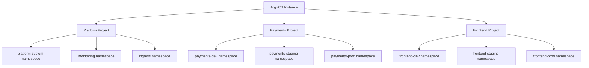

# How to Create ArgoCD Projects for Team Isolation

Author: [nawazdhandala](https://github.com/nawazdhandala)

Tags: ArgoCD, GitOps, Kubernetes, Multi-Tenancy, RBAC

Description: Learn how to create and configure ArgoCD AppProjects to isolate teams, restrict access to repositories and clusters, and enforce security boundaries in multi-tenant Kubernetes environments.

---

When multiple teams share a single ArgoCD instance, you need a way to keep them from stepping on each other's toes. ArgoCD Projects (AppProjects) provide the isolation boundary - they control which Git repositories a team can deploy from, which clusters and namespaces they can deploy to, and which Kubernetes resource types they are allowed to create.

This guide walks through creating ArgoCD Projects from scratch, focusing on the practical patterns you need for real team isolation.

## What is an ArgoCD Project

An ArgoCD Project is a logical grouping of applications that shares a common set of access controls. Think of it as a security boundary that answers these questions:

- Where can this team's applications pull source code from?
- Where can this team's applications deploy to?
- What types of Kubernetes resources can this team create?
- Who has access to manage applications in this project?

Every ArgoCD application belongs to exactly one project. The built-in `default` project has no restrictions, which makes it convenient for getting started but dangerous in production.

## Why You Need Projects

Without projects, any ArgoCD user can:

- Deploy from any Git repository
- Deploy to any cluster and namespace
- Create any type of Kubernetes resource, including ClusterRoles and PersistentVolumes
- Accidentally overwrite another team's resources

Projects prevent all of these by defining explicit allow lists for sources, destinations, and resource kinds.

## Creating Your First Project

### Using the CLI

```bash
# Create a project for the payments team
argocd proj create payments \
  --description "Payments team applications" \
  --src "https://github.com/my-org/payments-*" \
  --dest "https://kubernetes.default.svc,payments-*"
```

### Using Declarative YAML

The recommended approach is to manage projects as Kubernetes resources:

```yaml
# payments-project.yaml
apiVersion: argoproj.io/v1alpha1
kind: AppProject
metadata:
  name: payments
  namespace: argocd
  # Finalizer prevents accidental deletion
  finalizers:
    - resources-finalizer.argocd.argoproj.io
spec:
  description: "Payments team applications"

  # Allowed source repositories
  sourceRepos:
    - "https://github.com/my-org/payments-service.git"
    - "https://github.com/my-org/payments-config.git"
    - "https://github.com/my-org/shared-helm-charts.git"

  # Allowed deployment destinations
  destinations:
    - server: "https://kubernetes.default.svc"
      namespace: "payments-dev"
    - server: "https://kubernetes.default.svc"
      namespace: "payments-staging"
    - server: "https://kubernetes.default.svc"
      namespace: "payments-prod"

  # Allowed namespace-scoped resource kinds
  namespaceResourceWhitelist:
    - group: ""
      kind: "ConfigMap"
    - group: ""
      kind: "Secret"
    - group: ""
      kind: "Service"
    - group: "apps"
      kind: "Deployment"
    - group: "apps"
      kind: "StatefulSet"
    - group: "networking.k8s.io"
      kind: "Ingress"
    - group: "autoscaling"
      kind: "HorizontalPodAutoscaler"

  # Deny all cluster-scoped resources by default
  clusterResourceWhitelist: []
```

```bash
kubectl apply -f payments-project.yaml
```

## Project Structure for Multiple Teams

Here is a practical structure for a company with three teams:



### Platform Team Project

The platform team needs broader permissions because they manage cluster-wide infrastructure:

```yaml
apiVersion: argoproj.io/v1alpha1
kind: AppProject
metadata:
  name: platform
  namespace: argocd
  finalizers:
    - resources-finalizer.argocd.argoproj.io
spec:
  description: "Platform team - cluster infrastructure"

  sourceRepos:
    - "https://github.com/my-org/platform-*"
    - "https://github.com/my-org/infrastructure.git"

  destinations:
    - server: "https://kubernetes.default.svc"
      namespace: "platform-system"
    - server: "https://kubernetes.default.svc"
      namespace: "monitoring"
    - server: "https://kubernetes.default.svc"
      namespace: "ingress-nginx"
    - server: "https://kubernetes.default.svc"
      namespace: "cert-manager"

  # Platform team can create cluster-scoped resources
  clusterResourceWhitelist:
    - group: ""
      kind: "Namespace"
    - group: "rbac.authorization.k8s.io"
      kind: "ClusterRole"
    - group: "rbac.authorization.k8s.io"
      kind: "ClusterRoleBinding"
    - group: "apiextensions.k8s.io"
      kind: "CustomResourceDefinition"
    - group: "networking.k8s.io"
      kind: "IngressClass"

  # Allow all namespace-scoped resources
  namespaceResourceWhitelist:
    - group: "*"
      kind: "*"
```

### Application Team Project

Application teams get restricted access:

```yaml
apiVersion: argoproj.io/v1alpha1
kind: AppProject
metadata:
  name: frontend
  namespace: argocd
  finalizers:
    - resources-finalizer.argocd.argoproj.io
spec:
  description: "Frontend team applications"

  sourceRepos:
    - "https://github.com/my-org/frontend-*.git"
    - "https://github.com/my-org/shared-helm-charts.git"

  destinations:
    - server: "https://kubernetes.default.svc"
      namespace: "frontend-dev"
    - server: "https://kubernetes.default.svc"
      namespace: "frontend-staging"
    - server: "https://kubernetes.default.svc"
      namespace: "frontend-prod"

  # No cluster-scoped resources
  clusterResourceWhitelist: []

  # Restricted namespace resources
  namespaceResourceWhitelist:
    - group: ""
      kind: "ConfigMap"
    - group: ""
      kind: "Secret"
    - group: ""
      kind: "Service"
    - group: ""
      kind: "ServiceAccount"
    - group: "apps"
      kind: "Deployment"
    - group: "networking.k8s.io"
      kind: "Ingress"
    - group: "autoscaling"
      kind: "HorizontalPodAutoscaler"
    - group: "policy"
      kind: "PodDisruptionBudget"
```

## Using Wildcards in Projects

ArgoCD supports glob-style wildcards in project configurations:

```yaml
# Source repos - wildcard matching
sourceRepos:
  - "https://github.com/my-org/*"              # Any repo in the org
  - "https://github.com/my-org/payments-*"      # Repos starting with payments-

# Destinations - wildcard namespaces
destinations:
  - server: "https://kubernetes.default.svc"
    namespace: "payments-*"                      # Any namespace starting with payments-
  - server: "*"
    namespace: "payments-prod"                   # payments-prod on any cluster
```

Be careful with wildcards. An overly broad wildcard in `sourceRepos` could let a team deploy from repositories they should not access.

## Assigning Applications to Projects

Every ArgoCD application must reference a project in its spec:

```yaml
apiVersion: argoproj.io/v1alpha1
kind: Application
metadata:
  name: payments-api
  namespace: argocd
spec:
  # This application belongs to the payments project
  project: payments

  source:
    repoURL: "https://github.com/my-org/payments-service.git"
    targetRevision: main
    path: k8s/overlays/production
  destination:
    server: "https://kubernetes.default.svc"
    namespace: payments-prod
```

If the application's source repo or destination does not match the project's allowed sources and destinations, ArgoCD will reject the sync.

## Verifying Project Isolation

After creating projects, verify the isolation works:

```bash
# List all projects
argocd proj list

# Get project details
argocd proj get payments

# Try to create an application that violates project constraints
# This should fail:
argocd app create test-violation \
  --project payments \
  --repo https://github.com/other-org/unrelated.git \
  --path . \
  --dest-server https://kubernetes.default.svc \
  --dest-namespace payments-prod
# Expected error: application spec for test-violation is invalid:
# InvalidSpecError: application repo is not permitted in project
```

## Managing Projects as Code

Store your project definitions alongside your ArgoCD configuration in Git and manage them through ArgoCD itself using the App of Apps pattern:

```yaml
# projects/kustomization.yaml
apiVersion: kustomize.config.k8s.io/v1beta1
kind: Kustomization

resources:
  - platform-project.yaml
  - payments-project.yaml
  - frontend-project.yaml
  - data-team-project.yaml
```

Then create an ArgoCD application that manages projects:

```yaml
apiVersion: argoproj.io/v1alpha1
kind: Application
metadata:
  name: argocd-projects
  namespace: argocd
spec:
  project: platform
  source:
    repoURL: "https://github.com/my-org/argocd-config.git"
    targetRevision: main
    path: projects
  destination:
    server: "https://kubernetes.default.svc"
    namespace: argocd
  syncPolicy:
    automated:
      prune: true
      selfHeal: true
```

This way, all project changes go through your standard Git review process, and ArgoCD keeps the actual project state in sync with what is in Git.

## Summary

ArgoCD Projects are the foundation of multi-tenant isolation. Every production ArgoCD setup should move applications out of the `default` project into team-specific projects with explicit source repository, destination, and resource kind restrictions. Manage projects declaratively through Git, and use the principle of least privilege when configuring allowed sources, destinations, and resource types.

For more on configuring RBAC policies that complement project isolation, see our guide on [ArgoCD RBAC Policies](https://oneuptime.com/blog/post/2026-01-25-rbac-policies-argocd/view).
