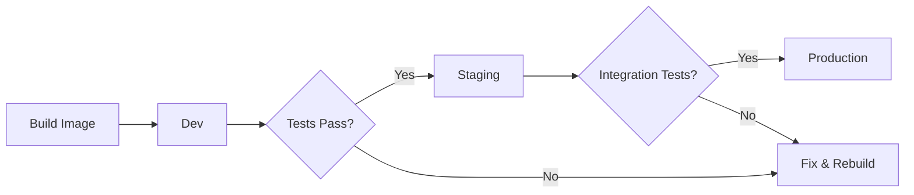

# How to Implement Promotion Workflows with ArgoCD

Author: [nawazdhandala](https://github.com/nawazdhandala)

Tags: ArgoCD, GitOps, Kubernetes, CI/CD, Environment Promotion

Description: Learn how to implement promotion workflows from dev to staging to production with ArgoCD using Git-based promotion strategies, automated gates, and rollback patterns.

---

Promotion workflows move your application through environments - dev, staging, production - in a controlled manner. With ArgoCD and GitOps, promotions happen through Git commits rather than pipeline commands. This guide covers the patterns and tools for building reliable promotion workflows.

## Promotion Strategies Overview

There are several ways to implement promotions in a GitOps workflow:

1. **Separate directories** - Each environment has its own directory in the manifest repo
2. **Separate branches** - Each environment has its own branch
3. **Separate repos** - Each environment has its own Git repository
4. **Image tag promotion** - Same manifests, different image tags per environment



## Pattern 1: Directory-Based Promotion

The most common approach uses Kustomize overlays with a directory per environment.

### Repository Structure

```text
k8s-manifests/
  base/
    deployment.yaml
    service.yaml
    kustomization.yaml
  overlays/
    dev/
      kustomization.yaml
    staging/
      kustomization.yaml
    production/
      kustomization.yaml
```

### Base Manifests

```yaml
# base/deployment.yaml
apiVersion: apps/v1
kind: Deployment
metadata:
  name: myapp
spec:
  replicas: 1
  selector:
    matchLabels:
      app: myapp
  template:
    metadata:
      labels:
        app: myapp
    spec:
      containers:
        - name: myapp
          image: myregistry.com/myapp:latest
          ports:
            - containerPort: 8080
```

### Environment Overlays

```yaml
# overlays/dev/kustomization.yaml
apiVersion: kustomize.config.k8s.io/v1beta1
kind: Kustomization
namespace: dev
resources:
  - ../../base
images:
  - name: myregistry.com/myapp
    newTag: "abc1234"  # Latest build

# overlays/staging/kustomization.yaml
apiVersion: kustomize.config.k8s.io/v1beta1
kind: Kustomization
namespace: staging
resources:
  - ../../base
images:
  - name: myregistry.com/myapp
    newTag: "abc1234"  # Promoted from dev
patchesStrategicMerge:
  - replica-patch.yaml

# overlays/production/kustomization.yaml
apiVersion: kustomize.config.k8s.io/v1beta1
kind: Kustomization
namespace: production
resources:
  - ../../base
images:
  - name: myregistry.com/myapp
    newTag: "def5678"  # Promoted from staging
patchesStrategicMerge:
  - replica-patch.yaml
  - resources-patch.yaml
```

### ArgoCD Applications per Environment

```yaml
# argocd-apps.yaml
apiVersion: argoproj.io/v1alpha1
kind: Application
metadata:
  name: myapp-dev
  namespace: argocd
spec:
  project: default
  source:
    repoURL: https://github.com/my-org/k8s-manifests.git
    targetRevision: main
    path: overlays/dev
  destination:
    server: https://kubernetes.default.svc
    namespace: dev
  syncPolicy:
    automated:
      prune: true
      selfHeal: true
---
apiVersion: argoproj.io/v1alpha1
kind: Application
metadata:
  name: myapp-staging
  namespace: argocd
spec:
  project: default
  source:
    repoURL: https://github.com/my-org/k8s-manifests.git
    targetRevision: main
    path: overlays/staging
  destination:
    server: https://kubernetes.default.svc
    namespace: staging
  syncPolicy:
    automated:
      prune: true
      selfHeal: true
---
apiVersion: argoproj.io/v1alpha1
kind: Application
metadata:
  name: myapp-production
  namespace: argocd
spec:
  project: default
  source:
    repoURL: https://github.com/my-org/k8s-manifests.git
    targetRevision: main
    path: overlays/production
  destination:
    server: https://kubernetes.default.svc
    namespace: production
  # No auto-sync for production
```

## The Promotion Script

Create a script that copies the image tag from one environment to the next:

```bash
#!/bin/bash
# promote.sh - Promote an image tag from one environment to another
set -e

SOURCE_ENV="${1:?Usage: $0 <source-env> <target-env>}"
TARGET_ENV="${2:?Usage: $0 <source-env> <target-env>}"
MANIFEST_REPO="https://$GITHUB_TOKEN@github.com/my-org/k8s-manifests.git"

echo "Promoting from $SOURCE_ENV to $TARGET_ENV"

# Clone the manifest repo
rm -rf /tmp/k8s-manifests
git clone "$MANIFEST_REPO" /tmp/k8s-manifests
cd /tmp/k8s-manifests

# Get the current image tag from the source environment
SOURCE_TAG=$(grep "newTag:" "overlays/$SOURCE_ENV/kustomization.yaml" | awk '{print $2}' | tr -d '"')
echo "Source image tag: $SOURCE_TAG"

# Get the current image tag from the target environment
TARGET_TAG=$(grep "newTag:" "overlays/$TARGET_ENV/kustomization.yaml" | awk '{print $2}' | tr -d '"')
echo "Current target image tag: $TARGET_TAG"

if [ "$SOURCE_TAG" = "$TARGET_TAG" ]; then
  echo "Source and target already have the same image tag. Nothing to promote."
  exit 0
fi

# Update the target environment
cd "overlays/$TARGET_ENV"
kustomize edit set image "myregistry.com/myapp=myregistry.com/myapp:$SOURCE_TAG"

# Commit and push
cd /tmp/k8s-manifests
git config user.email "ci@example.com"
git config user.name "Promotion Bot"
git add .
git commit -m "promote: $SOURCE_ENV to $TARGET_ENV (image: $SOURCE_TAG)"
git push origin main

echo "Successfully promoted $SOURCE_TAG from $SOURCE_ENV to $TARGET_ENV"
```

## Automated Promotion Pipeline

Here is a complete GitHub Actions workflow that automates promotion with testing gates:

```yaml
# .github/workflows/promote.yml
name: Promotion Pipeline
on:
  push:
    branches: [main]
    paths:
      - 'overlays/dev/**'

jobs:
  test-dev:
    runs-on: ubuntu-latest
    steps:
      - name: Wait for dev deployment
        env:
          ARGOCD_AUTH_TOKEN: ${{ secrets.ARGOCD_TOKEN }}
          ARGOCD_SERVER: ${{ secrets.ARGOCD_SERVER }}
        run: |
          curl -sSL -o /usr/local/bin/argocd \
            https://github.com/argoproj/argo-cd/releases/latest/download/argocd-linux-amd64
          chmod +x /usr/local/bin/argocd
          argocd app wait myapp-dev --grpc-web --health --timeout 300

      - name: Run smoke tests on dev
        run: |
          curl -sf https://dev.myapp.example.com/health || exit 1
          echo "Dev smoke tests passed"

  promote-to-staging:
    needs: test-dev
    runs-on: ubuntu-latest
    steps:
      - uses: actions/checkout@v4
      - name: Promote dev to staging
        env:
          GITHUB_TOKEN: ${{ secrets.GH_TOKEN }}
        run: |
          chmod +x ./scripts/promote.sh
          ./scripts/promote.sh dev staging

  test-staging:
    needs: promote-to-staging
    runs-on: ubuntu-latest
    steps:
      - name: Wait for staging deployment
        env:
          ARGOCD_AUTH_TOKEN: ${{ secrets.ARGOCD_TOKEN }}
          ARGOCD_SERVER: ${{ secrets.ARGOCD_SERVER }}
        run: |
          curl -sSL -o /usr/local/bin/argocd \
            https://github.com/argoproj/argo-cd/releases/latest/download/argocd-linux-amd64
          chmod +x /usr/local/bin/argocd
          argocd app wait myapp-staging --grpc-web --health --timeout 300

      - uses: actions/checkout@v4
      - name: Run integration tests on staging
        run: |
          ./scripts/integration-tests.sh https://staging.myapp.example.com

  promote-to-production:
    needs: test-staging
    runs-on: ubuntu-latest
    # Require manual approval via environment protection rules
    environment: production
    steps:
      - uses: actions/checkout@v4
      - name: Promote staging to production
        env:
          GITHUB_TOKEN: ${{ secrets.GH_TOKEN }}
        run: |
          chmod +x ./scripts/promote.sh
          ./scripts/promote.sh staging production

      - name: Sync production
        env:
          ARGOCD_AUTH_TOKEN: ${{ secrets.ARGOCD_TOKEN }}
          ARGOCD_SERVER: ${{ secrets.ARGOCD_SERVER }}
        run: |
          curl -sSL -o /usr/local/bin/argocd \
            https://github.com/argoproj/argo-cd/releases/latest/download/argocd-linux-amd64
          chmod +x /usr/local/bin/argocd
          argocd app sync myapp-production --grpc-web
          argocd app wait myapp-production --grpc-web --health --timeout 300
```

## Pull Request Based Promotion

For an extra layer of control, use pull requests for promotions instead of direct commits:

```bash
#!/bin/bash
# promote-via-pr.sh - Create a PR for the promotion
set -e

SOURCE_ENV="$1"
TARGET_ENV="$2"

# Create a new branch for the promotion
BRANCH="promote/${SOURCE_ENV}-to-${TARGET_ENV}-$(date +%s)"
git checkout -b "$BRANCH"

# Make the promotion change
cd "overlays/$TARGET_ENV"
SOURCE_TAG=$(grep "newTag:" "../$SOURCE_ENV/kustomization.yaml" | awk '{print $2}' | tr -d '"')
kustomize edit set image "myregistry.com/myapp=myregistry.com/myapp:$SOURCE_TAG"

git add .
git commit -m "promote: $SOURCE_ENV to $TARGET_ENV (image: $SOURCE_TAG)"
git push origin "$BRANCH"

# Create a PR using the GitHub CLI
gh pr create \
  --title "Promote $SOURCE_ENV to $TARGET_ENV ($SOURCE_TAG)" \
  --body "Automated promotion of image tag $SOURCE_TAG from $SOURCE_ENV to $TARGET_ENV" \
  --base main \
  --head "$BRANCH" \
  --label promotion
```

## Rollback Workflow

When a production deployment goes wrong, roll back by promoting the previous known-good tag:

```bash
#!/bin/bash
# rollback.sh - Roll back to the previous production image tag
set -e

ENV="${1:-production}"

cd /tmp/k8s-manifests

# Get the previous image tag from Git history
PREVIOUS_TAG=$(git log --oneline -2 "overlays/$ENV/kustomization.yaml" | \
  tail -1 | awk '{print $1}' | \
  xargs git show -- "overlays/$ENV/kustomization.yaml" | \
  grep "newTag:" | awk '{print $2}' | tr -d '"')

echo "Rolling back $ENV to $PREVIOUS_TAG"

cd "overlays/$ENV"
kustomize edit set image "myregistry.com/myapp=myregistry.com/myapp:$PREVIOUS_TAG"

git add .
git commit -m "rollback: $ENV to $PREVIOUS_TAG"
git push origin main
```

## Monitoring Promotions

Track promotion events using [ArgoCD notifications](https://oneuptime.com/blog/post/2026-01-25-notifications-argocd/view). Configure notifications for each environment to alert different channels - dev changes go to a dev Slack channel, production changes go to an ops channel.

## Best Practices

1. **Never skip environments** - Always promote through dev to staging to production, in order.
2. **Automate lower environments** - Dev and staging should auto-sync. Production should require an explicit trigger.
3. **Gate on tests** - Each promotion should be conditional on passing tests in the current environment.
4. **Use Git history for audit** - Every promotion creates a Git commit, providing a full audit trail.
5. **Implement rollback procedures** - Have a documented and tested rollback process ready before you need it.

Promotion workflows with ArgoCD keep your deployments predictable, auditable, and safe. By encoding the promotion logic in Git, you get full traceability of what was deployed, when, and why.
