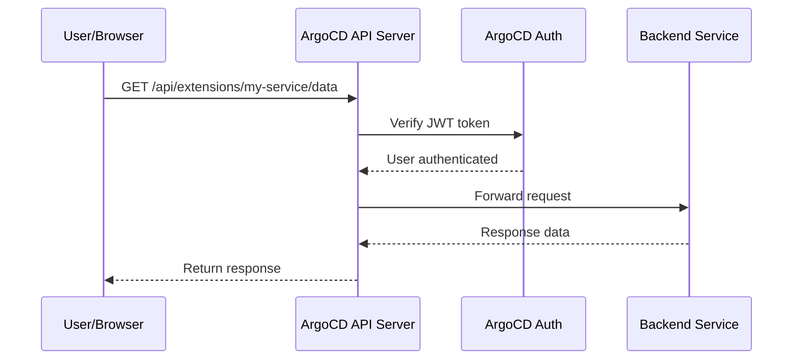

# How to Use Proxy Extensions in ArgoCD

Author: [nawazdhandala](https://github.com/nawazdhandala)

Tags: ArgoCD, GitOps, Kubernetes, Extension, API Proxy

Description: Learn how to configure and use ArgoCD proxy extensions to securely expose backend services through the ArgoCD API server for custom integrations.

---

ArgoCD proxy extensions allow you to route API requests through the ArgoCD server to backend services running in your cluster. Instead of building separate ingress rules or exposing additional services, you can leverage ArgoCD's existing authentication and authorization to proxy requests to custom backends. This is especially useful when building UI extensions that need data from other services.

This guide explains how proxy extensions work, how to configure them, and practical use cases where they shine.

## What Are Proxy Extensions?

Proxy extensions let the ArgoCD API server act as a reverse proxy for other services. When a UI extension (or any client) makes a request to a specific path on the ArgoCD server, the server forwards that request to a configured backend service.

The key benefit is that all requests go through ArgoCD's authentication layer. Your backend services do not need their own authentication - they can trust that requests coming through the ArgoCD proxy are from authenticated users.



## Configuring Proxy Extensions

Proxy extensions are configured in the ArgoCD ConfigMap (`argocd-cm`). Each extension maps a URL path prefix to a backend service.

### Basic Configuration

```yaml
# argocd-cm ConfigMap
apiVersion: v1
kind: ConfigMap
metadata:
  name: argocd-cm
  namespace: argocd
data:
  extension.config: |
    extensions:
      - name: metrics
        backend:
          services:
            - url: http://metrics-service.monitoring.svc.cluster.local:8080
              cluster:
                name: in-cluster
```

With this configuration, any request to `/api/extensions/metrics/*` on the ArgoCD server will be proxied to the metrics service.

### Multi-Service Configuration

You can configure multiple backend services under different extension names.

```yaml
data:
  extension.config: |
    extensions:
      - name: metrics
        backend:
          services:
            - url: http://metrics-service.monitoring.svc.cluster.local:8080
      - name: cost
        backend:
          services:
            - url: http://kubecost-cost-analyzer.kubecost.svc.cluster.local:9090
      - name: security
        backend:
          services:
            - url: http://trivy-operator.trivy-system.svc.cluster.local:8080
```

This gives you three proxy endpoints:
- `/api/extensions/metrics/*` - Routes to your metrics service
- `/api/extensions/cost/*` - Routes to Kubecost
- `/api/extensions/security/*` - Routes to Trivy

### Cluster-Specific Routing

If you manage multiple clusters, you can route requests to the appropriate cluster's service based on the target cluster.

```yaml
data:
  extension.config: |
    extensions:
      - name: metrics
        backend:
          services:
            - url: http://metrics-service.monitoring.svc.cluster.local:8080
              cluster:
                name: in-cluster
            - url: https://metrics.production-cluster.example.com
              cluster:
                name: production
              headers:
                - name: Authorization
                  value: "Bearer $ext.metrics.production.token"
```

## Building a Backend Service for Proxy Extensions

Let us build a simple backend service that provides application cost data and gets proxied through ArgoCD.

### Backend Service in Go

```go
// main.go
package main

import (
    "encoding/json"
    "fmt"
    "log"
    "net/http"
)

type CostData struct {
    Application string  `json:"application"`
    Namespace   string  `json:"namespace"`
    MonthlyCost float64 `json:"monthlyCost"`
    CPUCost     float64 `json:"cpuCost"`
    MemoryCost  float64 `json:"memoryCost"`
    StorageCost float64 `json:"storageCost"`
}

func costHandler(w http.ResponseWriter, r *http.Request) {
    // The ArgoCD proxy passes the original path
    // For /api/extensions/cost/apps/my-app, you receive /apps/my-app

    // Extract application name from path
    appName := r.URL.Query().Get("application")
    namespace := r.URL.Query().Get("namespace")

    // In real implementation, query Kubecost or your cost database
    data := CostData{
        Application: appName,
        Namespace:   namespace,
        MonthlyCost: 45.67,
        CPUCost:     20.30,
        MemoryCost:  15.20,
        StorageCost: 10.17,
    }

    w.Header().Set("Content-Type", "application/json")
    json.NewEncoder(w).Encode(data)
}

func healthHandler(w http.ResponseWriter, r *http.Request) {
    fmt.Fprintf(w, "OK")
}

func main() {
    http.HandleFunc("/api/cost", costHandler)
    http.HandleFunc("/health", healthHandler)

    log.Println("Starting cost service on :8080")
    log.Fatal(http.ListenAndServe(":8080", nil))
}
```

### Deploy the Backend Service

```yaml
# cost-service.yaml
apiVersion: apps/v1
kind: Deployment
metadata:
  name: cost-service
  namespace: argocd
spec:
  replicas: 1
  selector:
    matchLabels:
      app: cost-service
  template:
    metadata:
      labels:
        app: cost-service
    spec:
      containers:
        - name: cost-service
          image: my-registry/cost-service:latest
          ports:
            - containerPort: 8080
          livenessProbe:
            httpGet:
              path: /health
              port: 8080
---
apiVersion: v1
kind: Service
metadata:
  name: cost-service
  namespace: argocd
spec:
  ports:
    - port: 8080
      targetPort: 8080
  selector:
    app: cost-service
```

### Configure the Proxy Extension

```yaml
# argocd-cm patch
data:
  extension.config: |
    extensions:
      - name: cost
        backend:
          services:
            - url: http://cost-service.argocd.svc.cluster.local:8080
```

### Call the Extension from the UI

From a UI extension or any authenticated client:

```typescript
// In your ArgoCD UI extension
const fetchCostData = async (appName: string, namespace: string) => {
  const response = await fetch(
    `/api/extensions/cost/api/cost?application=${appName}&namespace=${namespace}`,
    {
      // Cookies are automatically included for authenticated requests
      credentials: 'same-origin',
    }
  );
  return response.json();
};
```

## RBAC for Proxy Extensions

You can control who can access proxy extensions using ArgoCD's RBAC system.

```yaml
# argocd-rbac-cm ConfigMap
apiVersion: v1
kind: ConfigMap
metadata:
  name: argocd-rbac-cm
  namespace: argocd
data:
  policy.csv: |
    # Allow admins to access all extensions
    p, role:admin, extensions, invoke, *, allow

    # Allow developers to access only the metrics extension
    p, role:developer, extensions, invoke, metrics, allow

    # Deny access to the cost extension for developers
    p, role:developer, extensions, invoke, cost, deny
```

## Passing Headers to Backend Services

You can configure proxy extensions to pass custom headers to the backend service.

```yaml
data:
  extension.config: |
    extensions:
      - name: metrics
        backend:
          services:
            - url: http://metrics-service.monitoring.svc.cluster.local:8080
              headers:
                # Pass a static header
                - name: X-Custom-Header
                  value: "argocd-extension"
                # Pass user information
                - name: X-ArgoCD-Username
                  value: "$argocd.session.username"
```

## Practical Use Cases

### Proxying to Kubecost

Expose Kubecost data through ArgoCD without a separate ingress.

```yaml
extensions:
  - name: kubecost
    backend:
      services:
        - url: http://kubecost-cost-analyzer.kubecost.svc.cluster.local:9090
```

### Proxying to Grafana

Embed Grafana dashboard data in ArgoCD.

```yaml
extensions:
  - name: grafana
    backend:
      services:
        - url: http://grafana.monitoring.svc.cluster.local:3000
          headers:
            - name: X-WEBAUTH-USER
              value: "admin"
```

### Proxying to a Custom Approval Service

Route deployment approval requests through ArgoCD.

```yaml
extensions:
  - name: approvals
    backend:
      services:
        - url: http://approval-service.argocd.svc.cluster.local:8080
```

## Security Considerations

### Authentication

All proxy extension requests go through ArgoCD's authentication. The user must have a valid session (JWT token or SSO session) to make requests.

### Network Security

Backend services should only be accessible within the cluster. Never expose them externally - let ArgoCD handle the external access.

```yaml
# Network policy to restrict backend access
apiVersion: networking.k8s.io/v1
kind: NetworkPolicy
metadata:
  name: cost-service-policy
  namespace: argocd
spec:
  podSelector:
    matchLabels:
      app: cost-service
  ingress:
    - from:
        - podSelector:
            matchLabels:
              app.kubernetes.io/name: argocd-server
      ports:
        - port: 8080
```

### Input Validation

Even though requests are authenticated, always validate input in your backend services. ArgoCD proxies the request as-is, so your backend must handle malicious input.

## Troubleshooting

### Extension Not Loading

Check that the extension configuration is valid.

```bash
# Check ArgoCD server logs for extension errors
kubectl logs -n argocd deployment/argocd-server | grep -i extension
```

### Backend Connection Refused

Verify the backend service is running and reachable from the ArgoCD server pod.

```bash
# Test connectivity from ArgoCD server
kubectl exec -n argocd deployment/argocd-server -- \
  curl -s http://cost-service.argocd.svc.cluster.local:8080/health
```

### CORS Issues

If you get CORS errors in the browser, make sure you are calling the extension through the ArgoCD path (`/api/extensions/...`) and not directly.

## Conclusion

Proxy extensions are one of ArgoCD's most underused features. They let you build custom integrations that leverage ArgoCD's existing authentication and authorization, reducing the need for additional ingress rules and authentication mechanisms. Whether you are proxying to Kubecost, Grafana, a custom approval service, or any other backend, proxy extensions provide a secure and convenient way to extend ArgoCD's capabilities. Combined with UI extensions, they form a complete framework for customizing the ArgoCD experience for your team.
