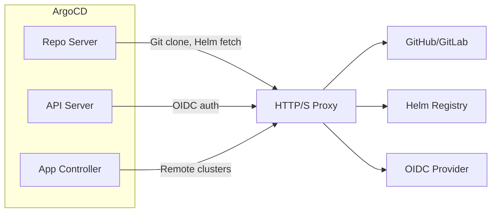

# How to Configure ArgoCD Proxy Settings

Author: [nawazdhandala](https://github.com/nawazdhandala)

Tags: ArgoCD, GitOps, Kubernetes, Proxy, Networking

Description: Learn how to configure HTTP and HTTPS proxy settings for ArgoCD to access Git repositories, Helm registries, and external services through corporate proxies.

---

Many enterprise environments route all outbound traffic through HTTP/HTTPS proxies for security, compliance, and auditing. ArgoCD needs to connect to external services like Git repositories, Helm registries, OIDC providers, and remote Kubernetes clusters. Configuring proxy settings correctly ensures ArgoCD functions properly behind corporate firewalls.

## Understanding Which ArgoCD Components Need Proxy Access

Not all ArgoCD components need proxy configuration. Here is a breakdown:

| Component | Needs Proxy | Why |
|-----------|-------------|-----|
| Repo Server | Yes | Clones Git repos, fetches Helm charts |
| API Server | Sometimes | OIDC authentication, webhook validation |
| App Controller | Sometimes | Connecting to remote cluster APIs |
| Dex | Sometimes | LDAP/OIDC backend connections |
| Redis | No | Internal communication only |



## Setting Proxy Environment Variables

The standard approach is to set `HTTP_PROXY`, `HTTPS_PROXY`, and `NO_PROXY` environment variables on the ArgoCD components that need external access.

### Repo Server Proxy Configuration

The repo server is the component that most commonly needs proxy access since it clones Git repositories and fetches Helm charts:

```yaml
# Patch the repo server deployment with proxy settings
apiVersion: apps/v1
kind: Deployment
metadata:
  name: argocd-repo-server
  namespace: argocd
spec:
  template:
    spec:
      containers:
        - name: argocd-repo-server
          env:
            # HTTP proxy for non-TLS connections
            - name: HTTP_PROXY
              value: "http://proxy.corp.example.com:3128"
            # HTTPS proxy for TLS connections
            - name: HTTPS_PROXY
              value: "http://proxy.corp.example.com:3128"
            # Bypass proxy for internal services
            - name: NO_PROXY
              value: "argocd-server,argocd-repo-server,argocd-application-controller,argocd-redis,argocd-dex-server,kubernetes.default.svc,.svc,.cluster.local,10.0.0.0/8,172.16.0.0/12,192.168.0.0/16,localhost,127.0.0.1"
            # Some tools use lowercase variants
            - name: http_proxy
              value: "http://proxy.corp.example.com:3128"
            - name: https_proxy
              value: "http://proxy.corp.example.com:3128"
            - name: no_proxy
              value: "argocd-server,argocd-repo-server,argocd-application-controller,argocd-redis,argocd-dex-server,kubernetes.default.svc,.svc,.cluster.local,10.0.0.0/8,172.16.0.0/12,192.168.0.0/16,localhost,127.0.0.1"
```

### API Server Proxy Configuration

The API server needs proxy access if it connects to external OIDC providers:

```yaml
# Patch the API server with proxy settings
apiVersion: apps/v1
kind: Deployment
metadata:
  name: argocd-server
  namespace: argocd
spec:
  template:
    spec:
      containers:
        - name: argocd-server
          env:
            - name: HTTPS_PROXY
              value: "http://proxy.corp.example.com:3128"
            - name: NO_PROXY
              value: "argocd-repo-server,argocd-application-controller,argocd-redis,argocd-dex-server,kubernetes.default.svc,.svc,.cluster.local,10.0.0.0/8,172.16.0.0/12,192.168.0.0/16,localhost,127.0.0.1"
```

### Application Controller Proxy Configuration

The application controller needs proxy settings when managing remote clusters through a proxy:

```yaml
# Patch the application controller with proxy settings
apiVersion: apps/v1
kind: Deployment
metadata:
  name: argocd-application-controller
  namespace: argocd
spec:
  template:
    spec:
      containers:
        - name: argocd-application-controller
          env:
            - name: HTTPS_PROXY
              value: "http://proxy.corp.example.com:3128"
            - name: NO_PROXY
              value: "argocd-server,argocd-repo-server,argocd-redis,argocd-dex-server,kubernetes.default.svc,.svc,.cluster.local,10.0.0.0/8,172.16.0.0/12,192.168.0.0/16,localhost,127.0.0.1"
```

## Configuring Proxy via Helm Values

If you deploy ArgoCD with Helm, configure proxy settings in your values file:

```yaml
# values.yaml - proxy configuration for all components
server:
  env:
    - name: HTTPS_PROXY
      value: "http://proxy.corp.example.com:3128"
    - name: NO_PROXY
      value: "argocd-repo-server,argocd-application-controller,argocd-redis,argocd-dex-server,kubernetes.default.svc,.svc,.cluster.local,10.0.0.0/8,172.16.0.0/12,192.168.0.0/16,localhost,127.0.0.1"

repoServer:
  env:
    - name: HTTP_PROXY
      value: "http://proxy.corp.example.com:3128"
    - name: HTTPS_PROXY
      value: "http://proxy.corp.example.com:3128"
    - name: NO_PROXY
      value: "argocd-server,argocd-application-controller,argocd-redis,argocd-dex-server,kubernetes.default.svc,.svc,.cluster.local,10.0.0.0/8,172.16.0.0/12,192.168.0.0/16,localhost,127.0.0.1"

controller:
  env:
    - name: HTTPS_PROXY
      value: "http://proxy.corp.example.com:3128"
    - name: NO_PROXY
      value: "argocd-server,argocd-repo-server,argocd-redis,argocd-dex-server,kubernetes.default.svc,.svc,.cluster.local,10.0.0.0/8,172.16.0.0/12,192.168.0.0/16,localhost,127.0.0.1"

dex:
  env:
    - name: HTTPS_PROXY
      value: "http://proxy.corp.example.com:3128"
    - name: NO_PROXY
      value: "argocd-server,kubernetes.default.svc,.svc,.cluster.local,10.0.0.0/8,172.16.0.0/12,192.168.0.0/16,localhost,127.0.0.1"
```

## Handling Custom CA Certificates for Proxy

Corporate proxies often use custom CA certificates for TLS inspection. ArgoCD needs to trust these certificates:

```yaml
# Create a ConfigMap with the proxy CA certificate
apiVersion: v1
kind: ConfigMap
metadata:
  name: proxy-ca-cert
  namespace: argocd
data:
  proxy-ca.crt: |
    -----BEGIN CERTIFICATE-----
    MIIDxTCCAq2gAwIBAgIQAqxcJmoLQ...
    -----END CERTIFICATE-----
```

Mount the certificate in the ArgoCD components and configure them to trust it:

```yaml
# Repo server with custom CA certificate
apiVersion: apps/v1
kind: Deployment
metadata:
  name: argocd-repo-server
  namespace: argocd
spec:
  template:
    spec:
      containers:
        - name: argocd-repo-server
          env:
            - name: HTTPS_PROXY
              value: "http://proxy.corp.example.com:3128"
            # Tell Git to use the custom CA bundle
            - name: GIT_SSL_CAINFO
              value: "/etc/ssl/proxy/proxy-ca.crt"
          volumeMounts:
            - name: proxy-ca
              mountPath: /etc/ssl/proxy
              readOnly: true
      volumes:
        - name: proxy-ca
          configMap:
            name: proxy-ca-cert
```

Alternatively, use ArgoCD's built-in TLS certificate management:

```bash
# Add the proxy CA certificate to ArgoCD's trust store
kubectl create configmap argocd-tls-certs-cm \
  --from-file=proxy-ca.crt=proxy-ca.crt \
  -n argocd \
  --dry-run=client -o yaml | kubectl apply -f -
```

## Configuring Git to Use the Proxy

ArgoCD's repo server uses Git commands internally. You can configure Git-specific proxy settings through the `argocd-cm` ConfigMap:

```yaml
# Configure Git proxy in ArgoCD ConfigMap
apiVersion: v1
kind: ConfigMap
metadata:
  name: argocd-cm
  namespace: argocd
data:
  # Use a custom Git config for proxy settings
  repositories: |
    - url: https://github.com/myorg
      proxy: http://proxy.corp.example.com:3128
```

For SSH-based Git access through a proxy, use the `GIT_SSH_COMMAND` environment variable:

```yaml
# Configure SSH proxy for Git
env:
  - name: GIT_SSH_COMMAND
    value: "ssh -o ProxyCommand='nc -X connect -x proxy.corp.example.com:3128 %h %p'"
```

## NO_PROXY Best Practices

The `NO_PROXY` variable is critical to get right. If you accidentally proxy internal traffic, ArgoCD components will not be able to communicate with each other.

Always include these in `NO_PROXY`:

- All ArgoCD service names
- `kubernetes.default.svc` - the local Kubernetes API
- `.svc` and `.cluster.local` - all in-cluster services
- Private IP ranges: `10.0.0.0/8`, `172.16.0.0/12`, `192.168.0.0/16`
- `localhost` and `127.0.0.1`
- Pod and service CIDR ranges specific to your cluster

```bash
# Find your cluster's pod and service CIDRs
kubectl cluster-info dump | grep -m 1 "service-cluster-ip-range"
kubectl cluster-info dump | grep -m 1 "cluster-cidr"
```

## Verifying Proxy Configuration

Test that the proxy is working correctly from within ArgoCD pods:

```bash
# Test HTTPS through proxy from repo server
kubectl exec -n argocd deploy/argocd-repo-server -- \
  curl -sS -x http://proxy.corp.example.com:3128 \
  https://github.com -o /dev/null -w "%{http_code}"

# Test Git clone through proxy
kubectl exec -n argocd deploy/argocd-repo-server -- \
  git ls-remote https://github.com/argoproj/argocd-example-apps.git

# Verify NO_PROXY is working - internal calls should not go through proxy
kubectl exec -n argocd deploy/argocd-server -- \
  curl -sS http://argocd-repo-server:8081 -o /dev/null -w "%{http_code}"
```

## Summary

Configuring proxy settings for ArgoCD is primarily about setting the right environment variables on the right components. The repo server needs proxy access for Git and Helm, the API server may need it for OIDC, and the controller may need it for remote clusters. Always configure `NO_PROXY` carefully to prevent internal traffic from being routed through the proxy. For corporate proxies with TLS inspection, mount the proxy's CA certificate and configure both ArgoCD and Git to trust it. For related networking configuration, see our guides on [firewall rules for ArgoCD](https://oneuptime.com/blog/post/2026-02-26-argocd-firewall-rules/view) and [configuring ArgoCD with HTTP/2](https://oneuptime.com/blog/post/2026-02-26-argocd-http2-configuration/view).
