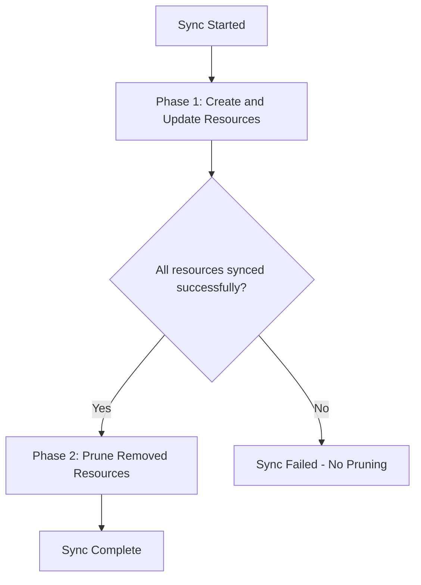

# How to Use the 'PruneLast' Sync Option in ArgoCD

Author: [nawazdhandala](https://github.com/nawazdhandala)

Tags: ArgoCD, GitOps, Kubernetes, Sync Operations

Description: Learn how to use the ArgoCD PruneLast sync option to defer resource deletion until after all other resources are synced, reducing downtime and deployment risks.

---

When ArgoCD syncs an application with pruning enabled, it deletes resources that no longer exist in Git. By default, pruning happens alongside other sync operations - resources are deleted at the same time new resources are being created or updated. This can cause problems if a resource being deleted is still needed by other resources during the sync. The PruneLast sync option solves this by deferring all prune (deletion) operations until after everything else has been synced successfully.

## The Problem PruneLast Solves

Consider this scenario: you are refactoring a Deployment. The old Deployment is replaced by a new one with a different name:

```yaml
# Before (in Git):
apiVersion: apps/v1
kind: Deployment
metadata:
  name: web-legacy

# After (in Git):
apiVersion: apps/v1
kind: Deployment
metadata:
  name: web-v2
```

Without PruneLast, ArgoCD might delete `web-legacy` and create `web-v2` at the same time. If `web-v2` takes time to become healthy (pulling images, running init containers), you have a window where no pods are serving traffic.

With PruneLast, ArgoCD:
1. First creates `web-v2` and waits for it to be healthy
2. Then deletes `web-legacy`

This ensures zero downtime during the transition.

## How PruneLast Works



The key behavior:
- All create and update operations happen first
- Only after all non-prune operations succeed do deletions begin
- If any create or update fails, pruning is skipped entirely

This two-phase approach means your new resources are running before old ones are removed.

## Enabling PruneLast

### In the Application Spec

```yaml
apiVersion: argoproj.io/v1alpha1
kind: Application
metadata:
  name: my-app
  namespace: argocd
spec:
  project: default
  source:
    repoURL: https://github.com/myorg/manifests.git
    targetRevision: main
    path: apps/my-app
  destination:
    server: https://kubernetes.default.svc
    namespace: my-app
  syncPolicy:
    automated:
      prune: true        # Enable pruning
      selfHeal: true
    syncOptions:
      - PruneLast=true   # Defer prune to after sync
```

### Per-Resource Annotation

You can also enable PruneLast on specific resources:

```yaml
apiVersion: apps/v1
kind: Deployment
metadata:
  name: web-legacy
  annotations:
    argocd.argoproj.io/sync-options: PruneLast=true
spec:
  # ...
```

This is useful when you only want certain resources to be pruned last, while others can be pruned normally.

### Via CLI

```bash
# Add PruneLast to an existing application
argocd app set my-app --sync-option PruneLast=true
```

## Real-World Scenarios

### Scenario 1: Service Migration

You are migrating from one Service to another (perhaps changing the service name or type):

```yaml
# Old service (being removed from Git)
apiVersion: v1
kind: Service
metadata:
  name: api-service-old
  annotations:
    argocd.argoproj.io/sync-options: PruneLast=true
spec:
  selector:
    app: api
  ports:
    - port: 80

# New service (added to Git)
apiVersion: v1
kind: Service
metadata:
  name: api-service
spec:
  selector:
    app: api
  ports:
    - port: 80
```

With PruneLast, the new service is created and functional before the old one is deleted. Any clients using the old service name have time to switch over.

### Scenario 2: ConfigMap Replacement

When replacing a ConfigMap (different name for a new version):

```yaml
# New ConfigMap (created first)
apiVersion: v1
kind: ConfigMap
metadata:
  name: app-config-v2
data:
  config.yaml: |
    new: configuration

# Old ConfigMap (pruned last)
# (this was removed from Git, so it will be pruned)
```

The Deployment referencing the new ConfigMap gets updated first, then the old ConfigMap is cleaned up.

### Scenario 3: CRD Updates

When updating Custom Resource Definitions along with their instances:

```yaml
# Updated CRD (synced first)
apiVersion: apiextensions.k8s.io/v1
kind: CustomResourceDefinition
metadata:
  name: myresources.example.com
  annotations:
    argocd.argoproj.io/sync-wave: "0"
spec:
  # ...

# New CR instances (synced second)
apiVersion: example.com/v1
kind: MyResource
metadata:
  name: my-instance
  annotations:
    argocd.argoproj.io/sync-wave: "1"
spec:
  # ...

# Old CR instances (pruned last with PruneLast)
```

## PruneLast with Sync Waves

PruneLast interacts with sync waves. When both are configured:

1. Resources are synced in wave order (wave -1, wave 0, wave 1, etc.)
2. Within each wave, creates and updates happen first
3. After ALL waves complete their non-prune operations, pruning begins
4. Pruning also follows wave order (reverse order for deletions)

```yaml
# Wave 0: Infrastructure (synced first)
apiVersion: v1
kind: ConfigMap
metadata:
  name: new-config
  annotations:
    argocd.argoproj.io/sync-wave: "0"

# Wave 1: Application (synced second)
apiVersion: apps/v1
kind: Deployment
metadata:
  name: web-v2
  annotations:
    argocd.argoproj.io/sync-wave: "1"

# Pruned last: Old resources
# (removed from Git, pruned after waves 0 and 1 complete)
```

## PruneLast vs Sync Waves for Ordering

You might wonder when to use PruneLast vs sync waves. They serve different purposes:

**Use PruneLast when:**
- You want to ensure old resources are not removed until new ones are ready
- The ordering is specifically about deletion timing
- You want a simple "delete after everything else" behavior

**Use sync waves when:**
- You need to control the creation order of resources
- You have dependencies between resources being created
- You need fine-grained control over which resources are created in which order

**Use both when:**
- You need ordered creation (sync waves) AND deferred deletion (PruneLast)

## PruneLast with PrunePropagationPolicy

PruneLast controls when pruning happens. `PrunePropagationPolicy` controls how resources are deleted:

```yaml
syncPolicy:
  syncOptions:
    - PruneLast=true
    # Plus one of:
    - PrunePropagationPolicy=foreground   # Wait for dependents
    - PrunePropagationPolicy=background   # Delete owner, GC handles rest
    - PrunePropagationPolicy=orphan       # Delete owner, leave dependents
```

A common production configuration:

```yaml
syncPolicy:
  automated:
    prune: true
    selfHeal: true
  syncOptions:
    - PruneLast=true
    - PrunePropagationPolicy=foreground
```

This ensures:
1. New resources are created and become healthy
2. Then old resources are deleted
3. Deletion waits for all dependent resources (pods, replicasets) to be fully terminated

## Troubleshooting

### Prune Is Not Happening

If resources that should be pruned are not being deleted:

1. **Check that pruning is enabled** - PruneLast only affects timing, not whether pruning happens. You still need `prune: true` in the automated sync policy or the `--prune` flag for manual syncs.

2. **Check if the sync failed** - PruneLast skips pruning if any non-prune operation fails. Check the sync status and error messages.

3. **Check if the resource is protected** - Resources with the `argocd.argoproj.io/compare-options: IgnoreExtraneous` annotation will not be pruned.

### Sync Takes Longer

PruneLast inherently makes syncs take longer because it is a two-phase process. The sync does not complete until both phases are done. This is expected behavior - the trade-off is safer deletions at the cost of slightly longer sync times.

### Resources Pruned When They Should Not Be

If resources are being pruned that should stay:
- Verify they are still in your Git manifests
- Check for path or filename changes that might make ArgoCD think they were removed
- Verify the Application source path has not changed

PruneLast is one of those sync options that should be considered for any production application with pruning enabled. The minimal cost (slightly longer sync times) is far outweighed by the safety benefit of ensuring new resources are running before old ones are removed. Combined with PrunePropagationPolicy and sync waves, it gives you precise control over every aspect of resource lifecycle management in ArgoCD.
