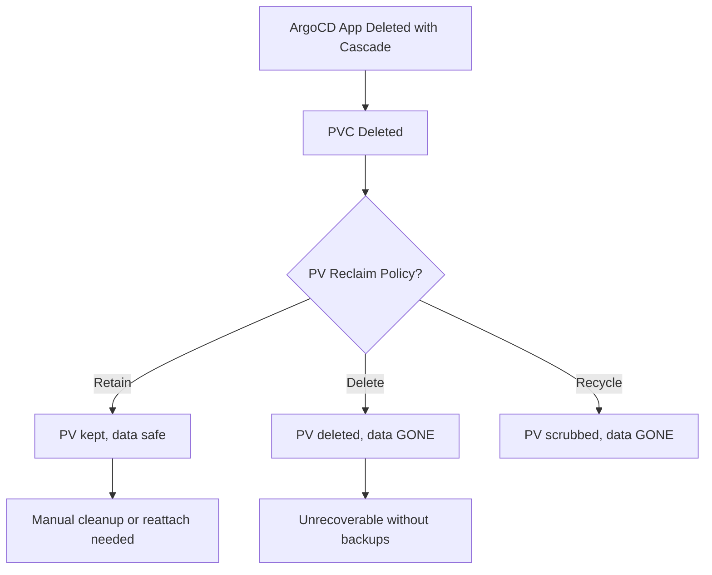

# How to Handle PVC Retention After ArgoCD Application Deletion

Author: [nawazdhandala](https://github.com/nawazdhandala)

Tags: ArgoCD, GitOps, Kubernetes, Persistent Storage, Data Management

Description: Learn how to manage PersistentVolumeClaim retention when deleting ArgoCD applications, including strategies to preserve data, configure reclaim policies, and handle StatefulSet volumes.

---

When you delete an ArgoCD application that manages stateful workloads, your persistent data is at risk. PersistentVolumeClaims can be deleted along with the application, and depending on the PersistentVolume reclaim policy, the underlying storage might be wiped permanently.

Getting PVC retention right is critical for databases, message queues, file storage, and any workload where data loss means a real incident. This guide covers every angle of PVC retention during ArgoCD application deletion.

## How ArgoCD handles PVCs during deletion

ArgoCD treats PVCs the same as any other Kubernetes resource. If a PVC is part of your application manifests and tracked by ArgoCD, it will be deleted during a cascade delete unless you specifically protect it.

There are three categories of PVCs to consider:

1. **PVCs defined in application manifests** - Directly tracked by ArgoCD
2. **PVCs created by StatefulSets** - Created dynamically, may or may not be tracked
3. **PVCs created by other controllers** - PVCs from operators or volume expansion

```bash
# Check which PVCs are tracked by your ArgoCD application
argocd app resources my-app | grep PersistentVolumeClaim

# Example output:
# PersistentVolumeClaim  my-app  production  data-postgres-0  Synced  Healthy
# PersistentVolumeClaim  my-app  production  data-postgres-1  Synced  Healthy
```

## Understanding PV reclaim policies

Even after a PVC is deleted, the PersistentVolume's reclaim policy determines what happens to the actual storage:

```bash
# Check reclaim policies for your PVs
kubectl get pv -o custom-columns=\
NAME:.metadata.name,\
RECLAIM:.spec.persistentVolumeReclaimPolicy,\
STATUS:.status.phase,\
CLAIM:.spec.claimRef.name,\
STORAGECLASS:.spec.storageClassName
```

The three reclaim policies:

- **Retain** - PV and data survive PVC deletion. You must manually clean up or reattach.
- **Delete** - PV and underlying storage are deleted when PVC is deleted. Data is gone.
- **Recycle** - (Deprecated) Basic scrub and reuse.



## Strategy 1: Exclude PVCs from ArgoCD pruning

The simplest approach is to prevent ArgoCD from ever deleting PVCs:

```yaml
# Add sync option directly to PVC manifest
apiVersion: v1
kind: PersistentVolumeClaim
metadata:
  name: data-postgres-0
  namespace: production
  annotations:
    argocd.argoproj.io/sync-options: Prune=false,Delete=false
spec:
  accessModes:
    - ReadWriteOnce
  resources:
    requests:
      storage: 50Gi
  storageClassName: gp3
```

Or apply at the application level to protect all PVCs:

```yaml
apiVersion: argoproj.io/v1alpha1
kind: Application
metadata:
  name: postgres-cluster
  namespace: argocd
spec:
  project: default
  source:
    repoURL: https://github.com/myorg/postgres.git
    targetRevision: main
    path: manifests
  destination:
    server: https://kubernetes.default.svc
    namespace: production
  ignoreDifferences:
    - group: ""
      kind: PersistentVolumeClaim
      jsonPointers:
        - /spec/resources/requests/storage  # Ignore storage resize diffs
  syncPolicy:
    syncOptions:
      - Prune=false  # Never prune any resources
```

## Strategy 2: Use Retain reclaim policy on StorageClass

Configure your StorageClass to retain volumes by default:

```yaml
apiVersion: storage.k8s.io/v1
kind: StorageClass
metadata:
  name: gp3-retain
provisioner: ebs.csi.aws.com
parameters:
  type: gp3
  fsType: ext4
reclaimPolicy: Retain  # PVs created by this class will be retained
volumeBindingMode: WaitForFirstConsumer
allowVolumeExpansion: true
```

Use this StorageClass in your StatefulSet:

```yaml
apiVersion: apps/v1
kind: StatefulSet
metadata:
  name: postgres
spec:
  serviceName: postgres
  replicas: 3
  selector:
    matchLabels:
      app: postgres
  template:
    metadata:
      labels:
        app: postgres
    spec:
      containers:
        - name: postgres
          image: postgres:16
          volumeMounts:
            - name: data
              mountPath: /var/lib/postgresql/data
  volumeClaimTemplates:
    - metadata:
        name: data
      spec:
        accessModes: ["ReadWriteOnce"]
        storageClassName: gp3-retain  # Uses Retain reclaim policy
        resources:
          requests:
            storage: 100Gi
```

## Strategy 3: Remove PVCs from ArgoCD tracking before deletion

Before deleting the application, remove PVCs from ArgoCD management:

```bash
# Option 1: Remove PVC manifests from Git before deleting the app
# This makes PVCs "orphaned" from ArgoCD's perspective
git rm manifests/pvc-data.yaml
git commit -m "Remove PVCs from ArgoCD management before app deletion"
git push

# Sync without pruning to keep existing PVCs
argocd app sync my-app --prune=false

# Now delete the application - PVCs are not tracked, so they survive
argocd app delete my-app -y
```

```bash
# Option 2: Use non-cascade delete to preserve everything
argocd app delete my-app --cascade=false -y

# Then manually clean up resources you DO want deleted (not PVCs)
kubectl delete deployment,service,configmap,ingress --all -n production
# PVCs remain untouched
```

## Strategy 4: Patch PV reclaim policy before deletion

If you realize you need to protect data right before deletion:

```bash
# Find PVs used by your application
kubectl get pvc -n production -o jsonpath='{range .items[*]}{.spec.volumeName}{"\n"}{end}'

# Patch each PV to Retain before deleting the app
for pv in $(kubectl get pvc -n production -o jsonpath='{range .items[*]}{.spec.volumeName}{" "}{end}'); do
  echo "Patching PV $pv to Retain"
  kubectl patch pv $pv -p '{"spec":{"persistentVolumeReclaimPolicy":"Retain"}}'
done

# Verify
kubectl get pv -o custom-columns=NAME:.metadata.name,RECLAIM:.spec.persistentVolumeReclaimPolicy
```

Now even if PVCs are deleted during cascade delete, the PVs and their data remain.

## Strategy 5: StatefulSet PVC handling

StatefulSets create PVCs dynamically through `volumeClaimTemplates`. These PVCs have a special relationship:

```bash
# StatefulSet PVCs follow the naming pattern: <volume-name>-<statefulset-name>-<ordinal>
# Example: data-postgres-0, data-postgres-1, data-postgres-2

# Kubernetes does NOT automatically delete StatefulSet PVCs when the StatefulSet is deleted
# This is by design - it prevents data loss

# However, ArgoCD tracks these PVCs and WILL delete them during cascade delete
# Check tracking:
argocd app resources my-db-app | grep PersistentVolumeClaim
```

To prevent ArgoCD from deleting StatefulSet PVCs, use the ignore differences approach:

```yaml
apiVersion: argoproj.io/v1alpha1
kind: Application
metadata:
  name: database
  namespace: argocd
spec:
  source:
    repoURL: https://github.com/myorg/database.git
    targetRevision: main
    path: manifests
  destination:
    server: https://kubernetes.default.svc
    namespace: database
  # Exclude PVCs from sync/prune operations
  ignoreDifferences:
    - group: ""
      kind: PersistentVolumeClaim
      jsonPointers:
        - /spec/resources
```

## Recovering data from retained PVs

If PVCs were deleted but PVs were set to Retain, here is how to reattach:

```bash
# List retained PVs (they will be in Released state)
kubectl get pv | grep Released

# Remove the claimRef to make the PV Available again
kubectl patch pv pv-data-postgres-0 \
  --type json \
  -p '[{"op":"remove","path":"/spec/claimRef"}]'

# Create a new PVC that binds to the specific PV
kubectl apply -f - <<EOF
apiVersion: v1
kind: PersistentVolumeClaim
metadata:
  name: data-postgres-0
  namespace: production
spec:
  accessModes:
    - ReadWriteOnce
  resources:
    requests:
      storage: 100Gi
  storageClassName: gp3-retain
  volumeName: pv-data-postgres-0  # Bind to the specific retained PV
EOF

# Verify binding
kubectl get pvc data-postgres-0 -n production
```

## Pre-deletion data backup workflow

Before deleting any stateful ArgoCD application, follow this backup workflow:

```bash
#!/bin/bash
APP_NAME=$1
NAMESPACE=${2:-$APP_NAME}

echo "=== Pre-Deletion Data Backup for $APP_NAME ==="

# List all PVCs
echo "PVCs in namespace $NAMESPACE:"
kubectl get pvc -n $NAMESPACE -o custom-columns=\
NAME:.metadata.name,\
STATUS:.status.phase,\
VOLUME:.spec.volumeName,\
SIZE:.spec.resources.requests.storage

# Backup each PVC
for pvc in $(kubectl get pvc -n $NAMESPACE -o jsonpath='{range .items[*]}{.metadata.name}{"\n"}{end}'); do
  echo ""
  echo "Backing up PVC: $pvc"

  # Create a backup job
  kubectl apply -f - <<EOF
apiVersion: batch/v1
kind: Job
metadata:
  name: backup-$pvc
  namespace: $NAMESPACE
spec:
  template:
    spec:
      containers:
        - name: backup
          image: amazon/aws-cli:latest
          command:
            - /bin/sh
            - -c
            - |
              tar czf /tmp/backup.tar.gz /data
              aws s3 cp /tmp/backup.tar.gz s3://my-backups/$APP_NAME/$pvc-$(date +%Y%m%d).tar.gz
          volumeMounts:
            - name: data
              mountPath: /data
              readOnly: true
      volumes:
        - name: data
          persistentVolumeClaim:
            claimName: $pvc
      restartPolicy: Never
EOF

  # Wait for backup completion
  kubectl wait --for=condition=complete job/backup-$pvc -n $NAMESPACE --timeout=600s
  echo "Backup of $pvc completed"
done

echo ""
echo "=== All PVC backups completed ==="
echo "Safe to proceed with application deletion"
```

## Summary

PVC retention during ArgoCD application deletion requires proactive planning. The safest approaches are: annotating PVCs with `Prune=false` to prevent ArgoCD from deleting them, using StorageClasses with `Retain` reclaim policy, backing up data before any deletion, and using non-cascade delete when in doubt. For StatefulSet workloads, remember that while Kubernetes preserves PVCs by default when a StatefulSet is deleted, ArgoCD's cascade delete overrides this behavior and will remove tracked PVCs. Always verify your reclaim policies and PVC tracking before deleting any stateful application.
