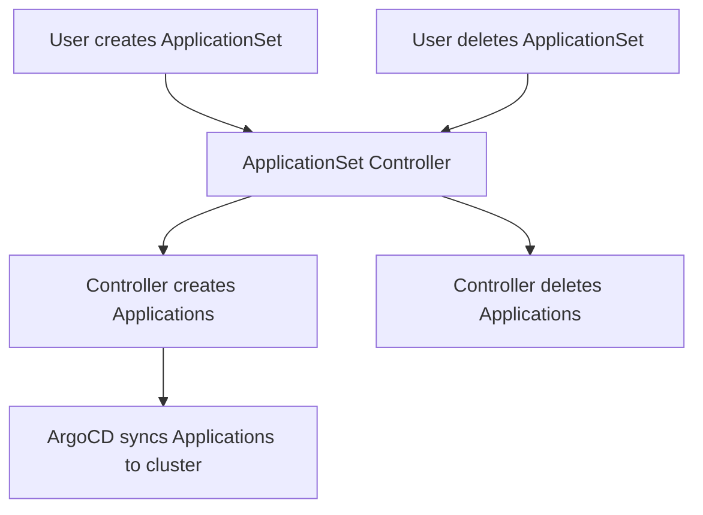

# How to Configure RBAC for ApplicationSets in ArgoCD

Author: [nawazdhandala](https://github.com/nawazdhandala)

Tags: ArgoCD, GitOps, Kubernetes, RBAC, ApplicationSets

Description: Learn how to configure RBAC policies for ArgoCD ApplicationSets, controlling who can create, modify, and delete ApplicationSets and the applications they generate.

---

ApplicationSets are one of the most powerful features in ArgoCD. A single ApplicationSet can generate hundreds of applications across multiple clusters and environments. But with that power comes risk - a misconfigured ApplicationSet can create or delete dozens of applications in seconds. Proper RBAC for ApplicationSets is essential.

This guide covers how to control access to ApplicationSets through RBAC policies, including the nuances of how ApplicationSet permissions interact with regular application permissions.

## How ApplicationSet RBAC Works

ApplicationSets have their own resource type in ArgoCD RBAC: `applicationsets`. This is separate from the `applications` resource. You need to configure permissions for both:

1. **applicationsets** - Controls who can create, read, update, and delete ApplicationSet resources
2. **applications** - Controls who can interact with the applications generated by ApplicationSets

```yaml
policy.csv: |
  # Permission to manage the ApplicationSet itself
  p, role:appset-manager, applicationsets, get, */*, allow
  p, role:appset-manager, applicationsets, create, */*, allow
  p, role:appset-manager, applicationsets, update, */*, allow
  p, role:appset-manager, applicationsets, delete, */*, allow

  # Permission to interact with generated applications
  p, role:appset-manager, applications, get, */*, allow
  p, role:appset-manager, applications, sync, */*, allow
```

Without the `applicationsets` resource permissions, users cannot manage ApplicationSets even if they have full `applications` access.

## ApplicationSet Actions

The available actions for the `applicationsets` resource are:

| Action | Description |
|--------|-------------|
| `get` | View ApplicationSets |
| `create` | Create new ApplicationSets |
| `update` | Modify existing ApplicationSets |
| `delete` | Delete ApplicationSets |

The object format follows the same `<project>/<name>` pattern as applications:

```yaml
# Allow managing ApplicationSets in the frontend project
p, role:manager, applicationsets, get, frontend/*, allow
p, role:manager, applicationsets, create, frontend/*, allow
p, role:manager, applicationsets, update, frontend/*, allow
```

## Viewer Access to ApplicationSets

For users who need to see ApplicationSets but not modify them:

```yaml
policy.csv: |
  # Can view ApplicationSets and their generated applications
  p, role:appset-viewer, applicationsets, get, */*, allow
  p, role:appset-viewer, applications, get, */*, allow
  p, role:appset-viewer, logs, get, */*, allow

  g, developers, role:appset-viewer
```

## Project-Scoped ApplicationSet Management

Restrict ApplicationSet management to specific projects:

```yaml
policy.csv: |
  # Frontend team manages their own ApplicationSets
  p, role:frontend-appset-manager, applicationsets, get, frontend/*, allow
  p, role:frontend-appset-manager, applicationsets, create, frontend/*, allow
  p, role:frontend-appset-manager, applicationsets, update, frontend/*, allow
  p, role:frontend-appset-manager, applicationsets, delete, frontend/*, allow
  p, role:frontend-appset-manager, applications, get, frontend/*, allow
  p, role:frontend-appset-manager, applications, sync, frontend/*, allow

  # Backend team manages their own ApplicationSets
  p, role:backend-appset-manager, applicationsets, get, backend/*, allow
  p, role:backend-appset-manager, applicationsets, create, backend/*, allow
  p, role:backend-appset-manager, applicationsets, update, backend/*, allow
  p, role:backend-appset-manager, applicationsets, delete, backend/*, allow
  p, role:backend-appset-manager, applications, get, backend/*, allow
  p, role:backend-appset-manager, applications, sync, backend/*, allow

  g, team-frontend, role:frontend-appset-manager
  g, team-backend, role:backend-appset-manager
```

## The ApplicationSet Controller and Permissions

The ApplicationSet controller creates, updates, and deletes applications on behalf of the ApplicationSet resource. Understanding this is important for RBAC:



The ApplicationSet controller runs with its own service account inside the ArgoCD namespace. It has internal permissions to create and delete applications. User RBAC controls whether the user can interact with the ApplicationSet itself, not whether the controller can act.

This means:
- A user with `applicationsets create` permission can trigger the creation of many applications
- A user with `applicationsets delete` permission can trigger the deletion of many applications
- The controller handles the actual application lifecycle

## Restricting ApplicationSet Deletion

Deleting an ApplicationSet can cascade-delete all generated applications. This is extremely dangerous:

```yaml
policy.csv: |
  # Allow creating and viewing ApplicationSets
  p, role:appset-deployer, applicationsets, get, */*, allow
  p, role:appset-deployer, applicationsets, create, */*, allow
  p, role:appset-deployer, applicationsets, update, */*, allow
  # Note: delete is NOT included

  # Only admins can delete ApplicationSets
  # (admin role inherently has all permissions)

  g, developers, role:appset-deployer
  g, platform-admins, role:admin
```

Additionally, configure the ApplicationSet itself to preserve generated applications on deletion:

```yaml
apiVersion: argoproj.io/v1alpha1
kind: ApplicationSet
metadata:
  name: my-apps
  namespace: argocd
spec:
  generators:
    - list:
        elements:
          - cluster: staging
            url: https://staging.k8s.local
  template:
    metadata:
      name: 'app-{{cluster}}'
    spec:
      project: default
      source:
        repoURL: https://github.com/myorg/app
        targetRevision: main
        path: deploy/{{cluster}}
      destination:
        server: '{{url}}'
        namespace: app
  # Preserve applications when ApplicationSet is deleted
  syncPolicy:
    preserveResourcesOnDeletion: true
```

## ApplicationSet with Cluster Generator

When using the cluster generator, ApplicationSets create applications across multiple clusters. RBAC needs to account for this:

```yaml
policy.csv: |
  # Allow managing the ApplicationSet
  p, role:multi-cluster-deployer, applicationsets, get, infra/*, allow
  p, role:multi-cluster-deployer, applicationsets, create, infra/*, allow
  p, role:multi-cluster-deployer, applicationsets, update, infra/*, allow

  # Allow viewing and syncing generated apps across all clusters
  p, role:multi-cluster-deployer, applications, get, infra/*, allow
  p, role:multi-cluster-deployer, applications, sync, infra/*, allow

  # Cluster access for viewing cluster details
  p, role:multi-cluster-deployer, clusters, get, *, allow
```

## ApplicationSet with Git Generator

Git generators create applications based on directory structure or file contents. A single change to the generator configuration can affect many applications:

```yaml
# Example ApplicationSet with git generator
apiVersion: argoproj.io/v1alpha1
kind: ApplicationSet
metadata:
  name: team-apps
  namespace: argocd
spec:
  generators:
    - git:
        repoURL: https://github.com/myorg/app-configs
        revision: main
        directories:
          - path: apps/*
  template:
    metadata:
      name: '{{path.basename}}'
    spec:
      project: frontend
      source:
        repoURL: https://github.com/myorg/app-configs
        targetRevision: main
        path: '{{path}}'
      destination:
        server: https://kubernetes.default.svc
        namespace: '{{path.basename}}'
```

For this type of ApplicationSet, consider restricting `update` access since updating the generator config can dramatically change which applications exist:

```yaml
policy.csv: |
  # View and sync generated apps
  p, role:frontend-dev, applicationsets, get, frontend/*, allow
  p, role:frontend-dev, applications, get, frontend/*, allow
  p, role:frontend-dev, applications, sync, frontend/*, allow

  # Only leads can modify the ApplicationSet generator config
  p, role:frontend-lead, applicationsets, get, frontend/*, allow
  p, role:frontend-lead, applicationsets, update, frontend/*, allow
  p, role:frontend-lead, applications, get, frontend/*, allow
  p, role:frontend-lead, applications, sync, frontend/*, allow
```

## CI/CD Access for ApplicationSets

CI pipelines typically should not create or modify ApplicationSets directly. Instead, they should push changes to Git and let ArgoCD sync:

```yaml
policy.csv: |
  # CI can only sync applications generated by ApplicationSets
  p, role:ci-syncer, applications, get, */*, allow
  p, role:ci-syncer, applications, sync, */*, allow

  # CI cannot touch ApplicationSets at all
  # (no applicationsets permissions)

  g, ci-pipeline, role:ci-syncer
```

If your CI pipeline does need to interact with ApplicationSets (for example, to trigger a refresh), grant minimal access:

```yaml
policy.csv: |
  # CI can view ApplicationSets and sync generated apps
  p, role:ci-appset, applicationsets, get, */*, allow
  p, role:ci-appset, applications, get, */*, allow
  p, role:ci-appset, applications, sync, */*, allow

  g, ci-pipeline, role:ci-appset
```

## Testing ApplicationSet RBAC

Test your policies to ensure correct permissions:

```bash
# Can developer view ApplicationSets?
argocd admin settings rbac can role:frontend-dev get applicationsets 'frontend/team-apps' \
  --policy-file policy.csv --default-role ''
# Expected: Yes

# Can developer create an ApplicationSet?
argocd admin settings rbac can role:frontend-dev create applicationsets 'frontend/new-appset' \
  --policy-file policy.csv --default-role ''
# Expected: depends on policy

# Can developer delete an ApplicationSet?
argocd admin settings rbac can role:frontend-dev delete applicationsets 'frontend/team-apps' \
  --policy-file policy.csv --default-role ''
# Expected: No (should be restricted)

# Can developer sync generated applications?
argocd admin settings rbac can role:frontend-dev sync applications 'frontend/web-app' \
  --policy-file policy.csv --default-role ''
# Expected: Yes
```

## Complete Production Example

```yaml
apiVersion: v1
kind: ConfigMap
metadata:
  name: argocd-rbac-cm
  namespace: argocd
data:
  policy.csv: |
    # Platform admins - full access
    g, platform-engineering, role:admin

    # Team ApplicationSet managers - can create and update, NOT delete
    p, role:appset-manager, applicationsets, get, */*, allow
    p, role:appset-manager, applicationsets, create, */*, allow
    p, role:appset-manager, applicationsets, update, */*, allow
    p, role:appset-manager, applications, get, */*, allow
    p, role:appset-manager, applications, sync, */*, allow
    p, role:appset-manager, applications, action, */*, allow
    p, role:appset-manager, logs, get, */*, allow

    # Developers - can view and sync, cannot manage ApplicationSets
    p, role:developer, applicationsets, get, */*, allow
    p, role:developer, applications, get, */*, allow
    p, role:developer, applications, sync, */*, allow
    p, role:developer, logs, get, */*, allow

    g, tech-leads, role:appset-manager
    g, all-developers, role:developer

  policy.default: ""
  scopes: '[groups]'
```

## Summary

ApplicationSet RBAC in ArgoCD requires managing both the `applicationsets` resource and the `applications` resource. Control who can create, update, and especially delete ApplicationSets, since these operations can affect many applications at once. Use the `preserveResourcesOnDeletion` setting for safety, restrict `delete` access to admins only, and give developers view and sync access to generated applications without the ability to modify the ApplicationSet generators themselves.
