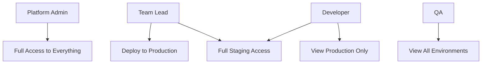

# How to Configure RBAC for Multi-Team Environments in ArgoCD

Author: [nawazdhandala](https://github.com/nawazdhandala)

Tags: ArgoCD, GitOps, Kubernetes, RBAC, Multi-Tenancy

Description: Learn how to design and implement RBAC policies in ArgoCD for organizations with multiple teams, projects, and environments sharing a single ArgoCD instance.

---

When multiple teams share a single ArgoCD instance, RBAC configuration becomes critical. Without proper isolation, the frontend team can accidentally sync the payment service, an intern can delete production applications, and nobody knows who changed what. This guide shows you how to design RBAC policies that give each team exactly the access they need while keeping everything else locked down.

## The Multi-Team Challenge

Consider a typical organization with these teams:

- **Platform Engineering** - Manages ArgoCD itself, clusters, and infrastructure
- **Frontend Team** - Deploys web applications and CDN configurations
- **Backend Team** - Deploys APIs, workers, and microservices
- **Data Engineering** - Deploys data pipelines and ML models
- **QA Team** - Needs visibility into all environments for testing
- **Security Team** - Audits deployments and reviews configurations

Each team needs different levels of access across different projects and environments. Let's build this step by step.

## Step 1: Design the Project Structure

First, create ArgoCD projects that align with your team structure and environments:

```yaml
# Frontend project
apiVersion: argoproj.io/v1alpha1
kind: AppProject
metadata:
  name: frontend
  namespace: argocd
spec:
  description: Frontend team applications
  sourceRepos:
    - 'https://github.com/myorg/frontend-*'
  destinations:
    - namespace: 'frontend-*'
      server: https://kubernetes.default.svc
  clusterResourceWhitelist: []
  namespaceResourceWhitelist:
    - group: '*'
      kind: '*'
---
# Backend project
apiVersion: argoproj.io/v1alpha1
kind: AppProject
metadata:
  name: backend
  namespace: argocd
spec:
  description: Backend team applications
  sourceRepos:
    - 'https://github.com/myorg/backend-*'
  destinations:
    - namespace: 'backend-*'
      server: https://kubernetes.default.svc
---
# Data project
apiVersion: argoproj.io/v1alpha1
kind: AppProject
metadata:
  name: data
  namespace: argocd
spec:
  description: Data engineering applications
  sourceRepos:
    - 'https://github.com/myorg/data-*'
  destinations:
    - namespace: 'data-*'
      server: https://kubernetes.default.svc
---
# Infrastructure project (platform team only)
apiVersion: argoproj.io/v1alpha1
kind: AppProject
metadata:
  name: infrastructure
  namespace: argocd
spec:
  description: Infrastructure and platform components
  sourceRepos:
    - 'https://github.com/myorg/infra-*'
  destinations:
    - namespace: '*'
      server: https://kubernetes.default.svc
  clusterResourceWhitelist:
    - group: '*'
      kind: '*'
```

## Step 2: Define Role Templates

Create a set of reusable role patterns for each access level:

```yaml
apiVersion: v1
kind: ConfigMap
metadata:
  name: argocd-rbac-cm
  namespace: argocd
data:
  policy.csv: |
    # ========================================
    # Role Definitions
    # ========================================

    # --- Platform Admin Role ---
    # Full access to everything including clusters and repos
    g, platform-engineering, role:admin

    # --- Team Deployer Roles ---
    # Each team can view all apps but only deploy to their project

    # Frontend deployer
    p, role:frontend-deployer, applications, get, */*, allow
    p, role:frontend-deployer, applications, create, frontend/*, allow
    p, role:frontend-deployer, applications, update, frontend/*, allow
    p, role:frontend-deployer, applications, sync, frontend/*, allow
    p, role:frontend-deployer, applications, action, frontend/*, allow
    p, role:frontend-deployer, applications, override, frontend/*, allow
    p, role:frontend-deployer, logs, get, frontend/*, allow
    p, role:frontend-deployer, exec, create, frontend/*, allow
    p, role:frontend-deployer, repositories, get, *, allow

    # Backend deployer
    p, role:backend-deployer, applications, get, */*, allow
    p, role:backend-deployer, applications, create, backend/*, allow
    p, role:backend-deployer, applications, update, backend/*, allow
    p, role:backend-deployer, applications, sync, backend/*, allow
    p, role:backend-deployer, applications, action, backend/*, allow
    p, role:backend-deployer, applications, override, backend/*, allow
    p, role:backend-deployer, logs, get, backend/*, allow
    p, role:backend-deployer, exec, create, backend/*, allow
    p, role:backend-deployer, repositories, get, *, allow

    # Data deployer
    p, role:data-deployer, applications, get, */*, allow
    p, role:data-deployer, applications, create, data/*, allow
    p, role:data-deployer, applications, update, data/*, allow
    p, role:data-deployer, applications, sync, data/*, allow
    p, role:data-deployer, applications, action, data/*, allow
    p, role:data-deployer, applications, override, data/*, allow
    p, role:data-deployer, logs, get, data/*, allow
    p, role:data-deployer, exec, create, data/*, allow
    p, role:data-deployer, repositories, get, *, allow

    # --- QA Viewer Role ---
    # Can view everything across all projects, view logs, no sync
    p, role:qa-viewer, applications, get, */*, allow
    p, role:qa-viewer, logs, get, */*, allow
    p, role:qa-viewer, repositories, get, *, allow
    p, role:qa-viewer, clusters, get, *, allow

    # --- Security Auditor Role ---
    # Full visibility including cluster and repo details
    p, role:security-auditor, applications, get, */*, allow
    p, role:security-auditor, logs, get, */*, allow
    p, role:security-auditor, repositories, get, *, allow
    p, role:security-auditor, clusters, get, *, allow
    p, role:security-auditor, certificates, get, *, allow
    p, role:security-auditor, accounts, get, *, allow
    p, role:security-auditor, gpgkeys, get, *, allow

    # ========================================
    # Group Assignments
    # ========================================
    g, team-frontend, role:frontend-deployer
    g, team-backend, role:backend-deployer
    g, team-data, role:data-deployer
    g, team-qa, role:qa-viewer
    g, team-security, role:security-auditor

  # No default permissions
  policy.default: ""
  scopes: '[groups]'
```

## Step 3: Handle Environment-Specific Access

Most teams have staging and production environments with different access levels:

```yaml
policy.csv: |
  # --- Staging Access (broader permissions) ---
  p, role:frontend-staging, applications, *, frontend-staging/*, allow
  p, role:frontend-staging, logs, get, frontend-staging/*, allow

  # --- Production Access (restricted) ---
  p, role:frontend-production, applications, get, frontend-production/*, allow
  p, role:frontend-production, applications, sync, frontend-production/*, allow
  p, role:frontend-production, logs, get, frontend-production/*, allow
  # Deny delete on production
  p, role:frontend-production, applications, delete, frontend-production/*, deny

  # Frontend devs get full staging access but restricted production
  g, team-frontend, role:frontend-staging
  g, team-frontend-leads, role:frontend-production
```

This creates a tiered access model:



## Step 4: CI/CD Pipeline Access

Each team typically has its own CI/CD pipeline that needs deploy access:

```yaml
policy.csv: |
  # CI/CD service account roles
  p, role:frontend-ci, applications, get, frontend/*, allow
  p, role:frontend-ci, applications, sync, frontend/*, allow

  p, role:backend-ci, applications, get, backend/*, allow
  p, role:backend-ci, applications, sync, backend/*, allow

  p, role:data-ci, applications, get, data/*, allow
  p, role:data-ci, applications, sync, data/*, allow

  # Assign CI accounts
  g, frontend-ci-bot, role:frontend-ci
  g, backend-ci-bot, role:backend-ci
  g, data-ci-bot, role:data-ci
```

Create the CI accounts:

```bash
# Create service accounts
kubectl patch configmap argocd-cm -n argocd --type merge -p '{
  "data": {
    "accounts.frontend-ci-bot": "apiKey",
    "accounts.backend-ci-bot": "apiKey",
    "accounts.data-ci-bot": "apiKey"
  }
}'

# Generate tokens
argocd account generate-token --account frontend-ci-bot
argocd account generate-token --account backend-ci-bot
argocd account generate-token --account data-ci-bot
```

## Step 5: Cross-Team Collaboration Access

Sometimes teams need temporary access to another team's applications. Handle this with additional role assignments:

```yaml
policy.csv: |
  # Backend team needs to view frontend apps during API integration work
  p, role:frontend-viewer, applications, get, frontend/*, allow
  p, role:frontend-viewer, logs, get, frontend/*, allow
  g, team-backend, role:frontend-viewer

  # Incident responders need broad sync access during outages
  p, role:incident-responder, applications, get, */*, allow
  p, role:incident-responder, applications, sync, */*, allow
  p, role:incident-responder, applications, action, */*, allow
  p, role:incident-responder, logs, get, */*, allow
  g, on-call-team, role:incident-responder
```

## Step 6: Validation and Testing

Before applying your multi-team RBAC policy, test every role:

```bash
# Test frontend deployer
argocd admin settings rbac can role:frontend-deployer sync applications 'frontend/web-app' \
  --policy-file policy.csv --default-role ''
# Expected: Yes

argocd admin settings rbac can role:frontend-deployer sync applications 'backend/api' \
  --policy-file policy.csv --default-role ''
# Expected: No

argocd admin settings rbac can role:frontend-deployer delete applications 'frontend/web-app' \
  --policy-file policy.csv --default-role ''
# Expected: No (if delete is not granted)

# Test QA viewer
argocd admin settings rbac can role:qa-viewer get applications 'backend/api' \
  --policy-file policy.csv --default-role ''
# Expected: Yes

argocd admin settings rbac can role:qa-viewer sync applications 'backend/api' \
  --policy-file policy.csv --default-role ''
# Expected: No
```

## Ongoing Management Tips

1. **Document your RBAC policy** - Add comments to every role explaining what it does and who it is for
2. **Review quarterly** - Teams change, projects get added, people move between teams
3. **Use version control** - Store your RBAC ConfigMap in Git and deploy it with ArgoCD itself
4. **Monitor access patterns** - Use ArgoCD audit logs to see who is accessing what
5. **Start restrictive** - It is easier to add permissions than to remove them

## Summary

Multi-team RBAC in ArgoCD requires careful planning. Structure your projects around teams and environments, create reusable role patterns for each access level, map SSO groups to those roles, add dedicated CI/CD service accounts, and test everything before deploying. The result is a shared ArgoCD instance where each team has exactly the access they need and nothing more.
